- #pkm #Logseq
	- Pages or daily journal organization. An example of when to use which.
	  collapsed:: true
		- 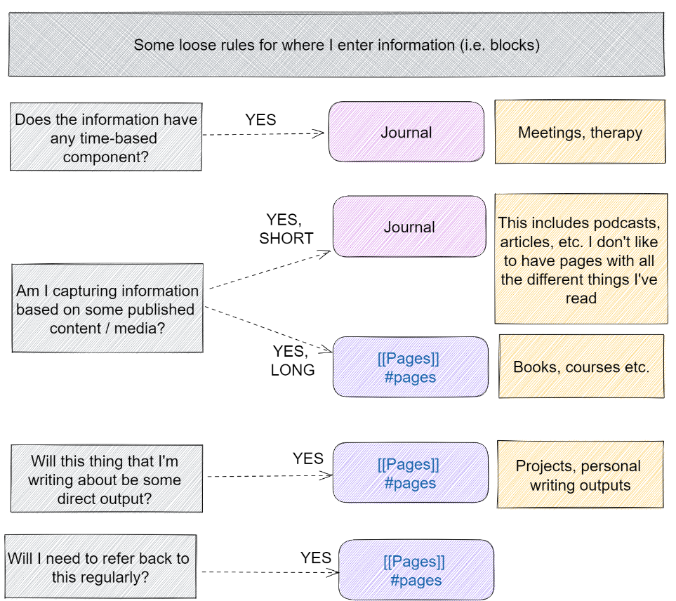{:height 568, :width 555}
		- 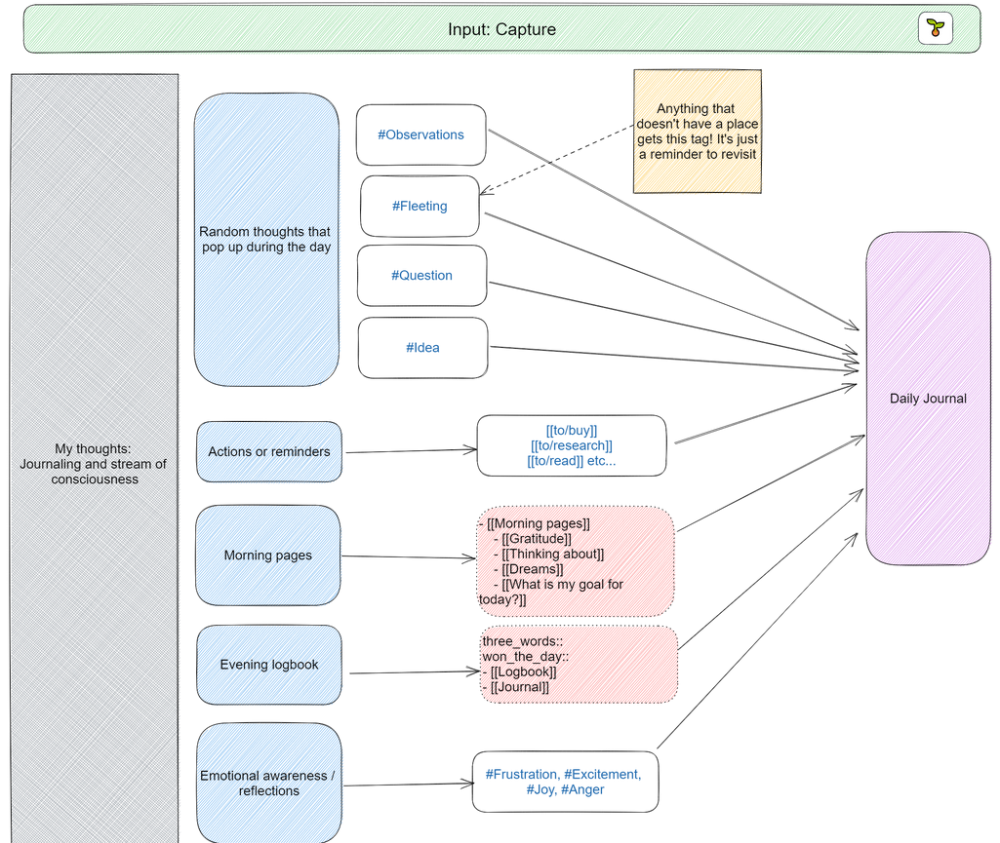{:height 715, :width 827}
		- 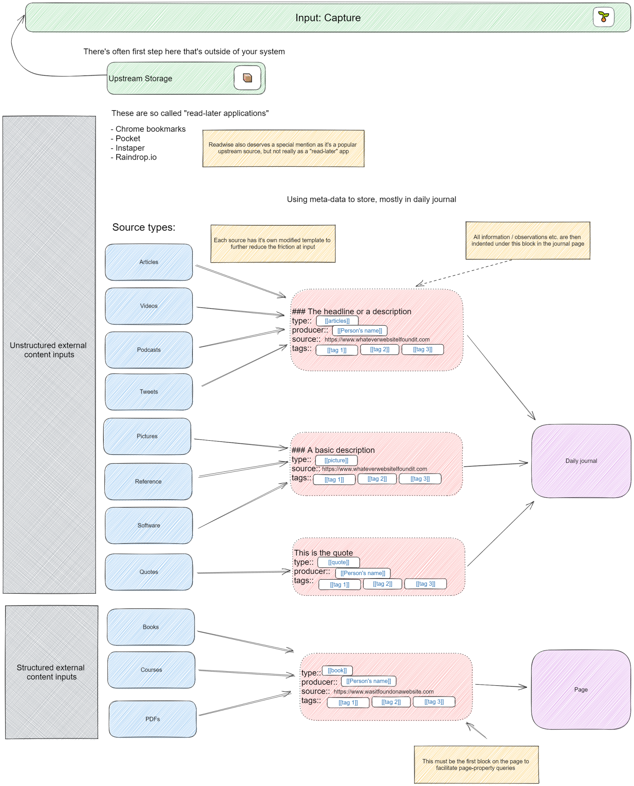
		-
	- Using declarative statements in your notes -> Pages
	  collapsed:: true
		- Declarative statements capture a belief or viewpoint of the world. It's a helpful technique to clarify your position on things. This is the well-known style of Andy Matuschak ([https://andymatuschak.org/](https://andymatuschak.org/)). By using pages, you **can easily link together related concepts inline.**
	- Extensibility with other programs -> Pages
	  collapsed:: true
		- If extensibility is something that you're concerned about (you want to use your notes in other applications), it's a good idea to default to page references. Most text-based note-taking applications use the conventional double square brackets to indicate links.
		- There is scope for plugins that read block references in the future, but this is not currently possible. Remember, block references create a unique address for your block, but each software will have different implementations.
	- Build retrieval "catch-alls"
	  collapsed:: true
		- **Use links to a few pages to help you aggregate your thoughts later** (but not too many so that you'll forget what they are). My go-to placeholders are `#Fleeting`, `#Observations`, and `#Reflections`, and they have saved me many times. If I quickly capture a note and add `#Fleeting`, I know I'll be able to retrieve that note easily in the future.
	- Focus on the atomicity of information
	  collapsed:: true
		- Break down your backlinkstr
			- **Use single word backlinks for keywords**. This allows you to combine keywords in your searches later. If you combine them upfront, it may be more difficult to find at a later stage (or you have to search more terms)
				- `#Reflection` + `#Management`
					- `#Journal` + `#Frustration`
	- Retrieving your information
	  collapsed:: true
		- 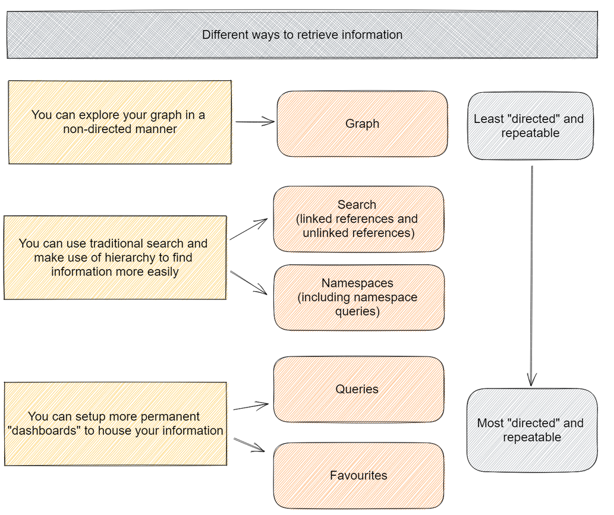
	- Querying
		- Overview
		  collapsed:: true
			- 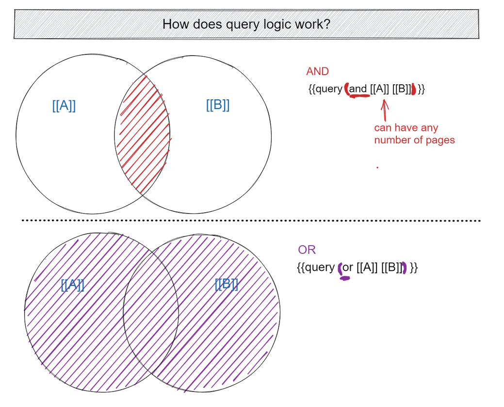
			- 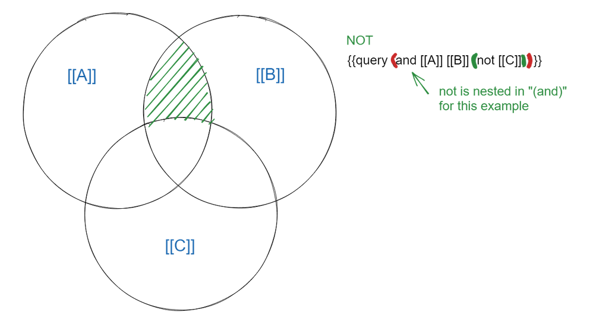{:height 526, :width 948}
			- 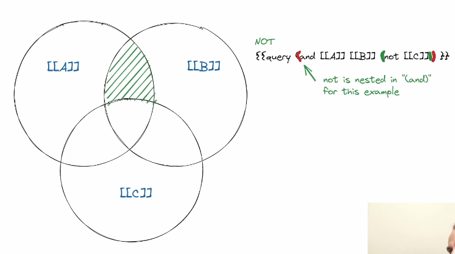
		- Property
		  collapsed:: true
			- 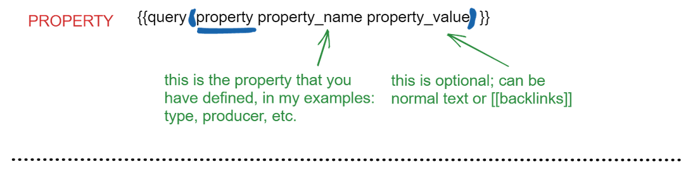
		- Task or To-Do
		  collapsed:: true
			- 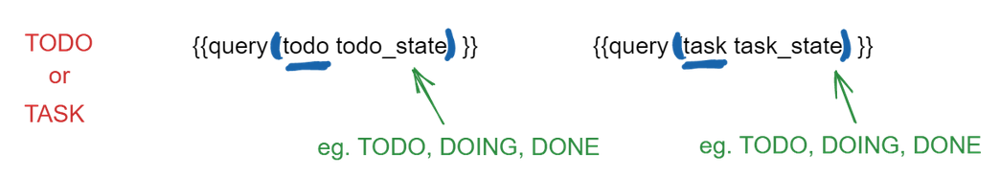
		- Between (time)
		  collapsed:: true
			- 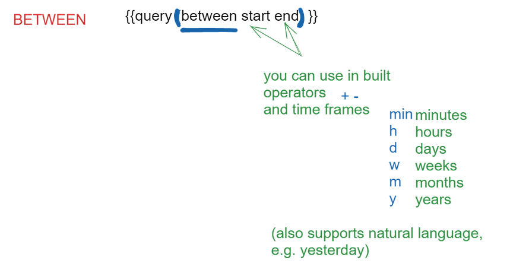
		- Page properties - limits results only for pages and not blocks
			- 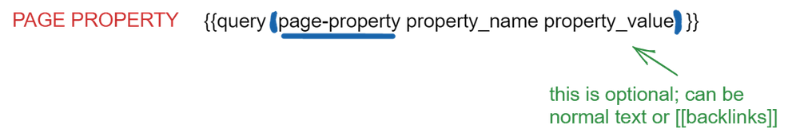