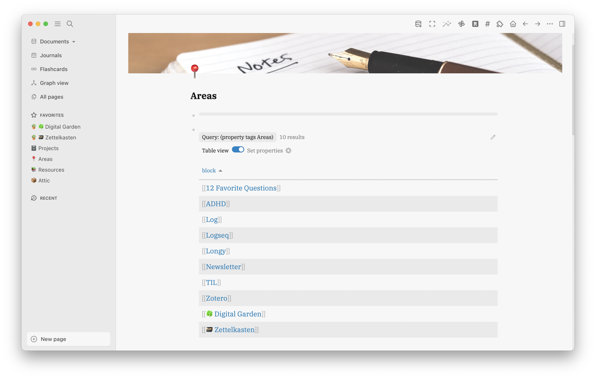
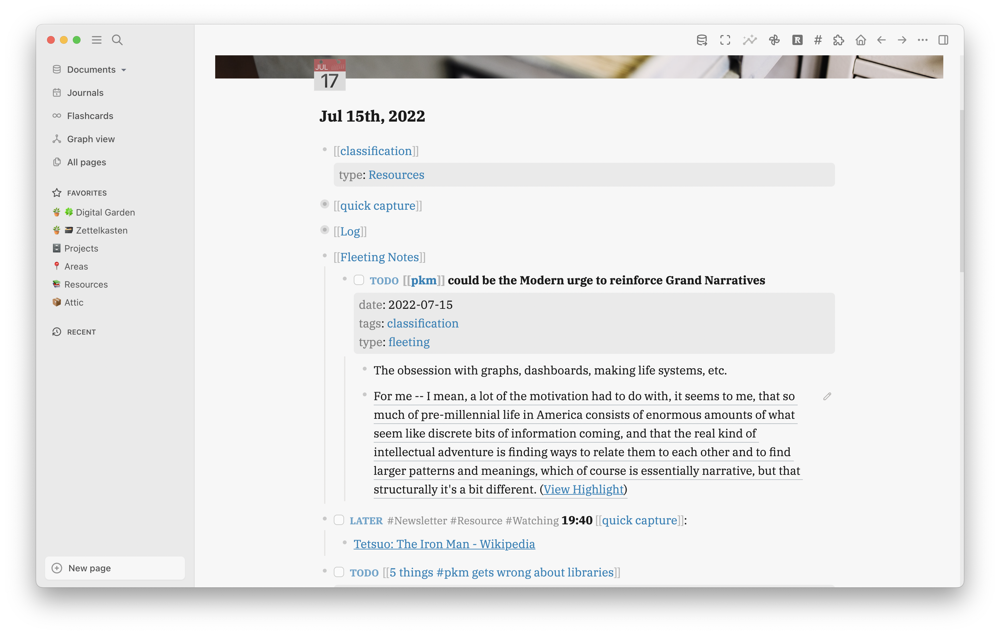
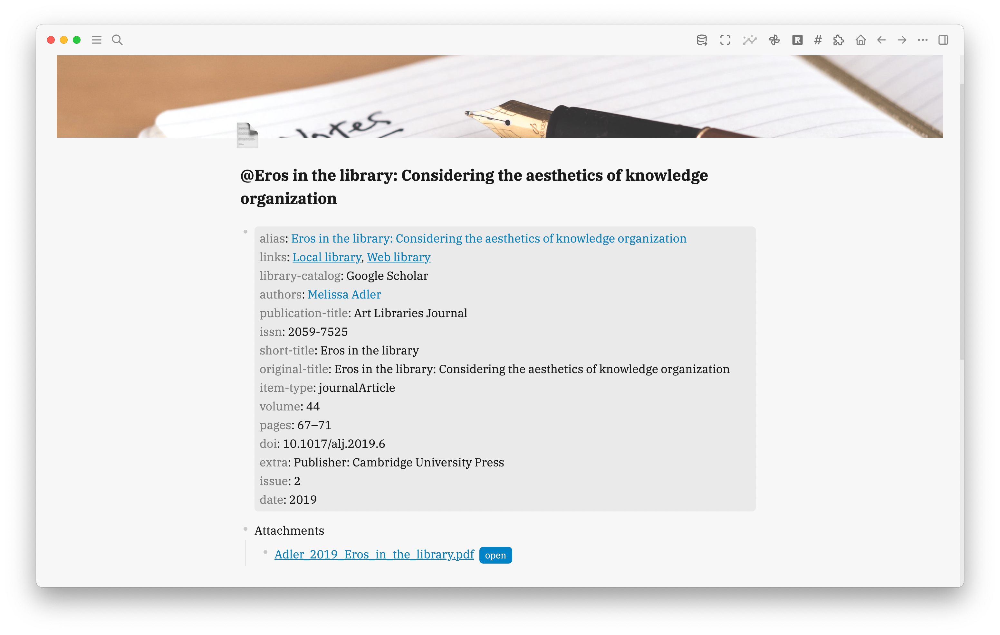
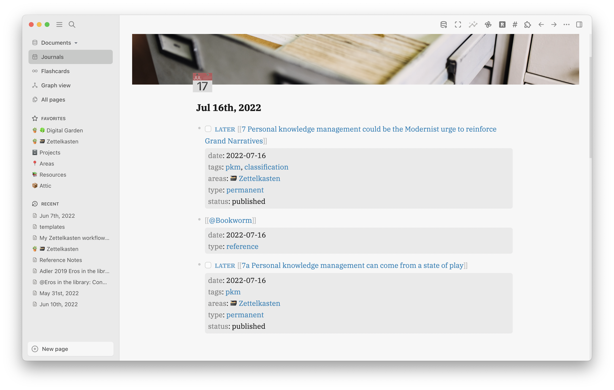
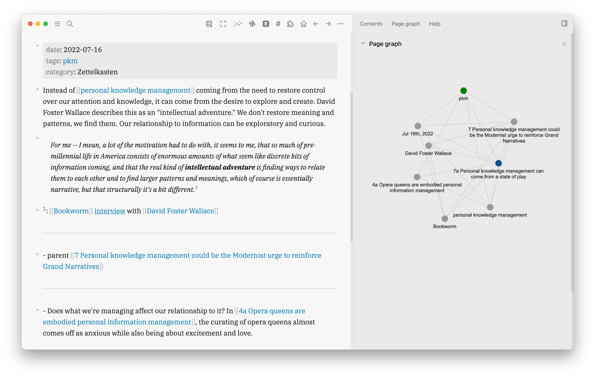

- [[My Zettelkasten workflow from start to finish (highlights)]]
  collapsed:: true
	- How to incorporate PARA and specifically areas in Zettelkasten. The digital garden are found in the Areas section of PARA.
	  collapsed:: true
		- {:height 425, :width 630}
	- Fleeting notes are created in the journal page and have block properties for querying
	  collapsed:: true
		- 
	- Resources are created as pages within the daily journal that can be referenced in your fleeting notes and other types of notes within the block.
		- 
		- If the resources are lengthy like articles and books, you can place your notes in the page.
	- Permanent notes are created in the daily journal page
	  collapsed:: true
		- 
			- You’ll see two Zettels there: `7 Personal knowledge management could be the Modernist urge to reinforce Grand Narratives` and `7a Personal knowledge management can come from a state of play`.
			   The 7 doesn’t mean any particular thing except that it wasn’t directly 
			  related to the previous 6 topics. 7a means it’s a follow-up to 7.
		- The permanent notes title is written as a declarative statement and the status is set as draft until finished. The title of the permanent note itself is the page where the actual zettel is written. This is where a lot of the backlinking happens.
			- {:height 291, :width 445}
		-
- [[A resource for learning about queries for logseq]]
  date:: [[2023-06-22]] 
  tags:: #logseq
  type:: [[reference]]