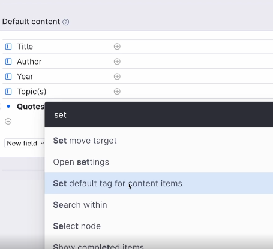

- [[Mastering Tana Core]]
	- Automatic tagging
	  collapsed:: true
		-
		- Select "Set the default content items" and select the instance of the tag
		- 
	- Supertags and classes
	  collapsed:: true
		- You can create a sub-class of a tag for example a book is a type of source by extending the sub-tag through the advanced options. The sub-tag will inherit all the fields from the parent tag while adding or extending the fields with specific tags relevant to the sub-tag.
		- When you apply multiple tags to a node it will inherit and combine all the field properties of the combined tags.
		- Name your tags or classes in the singular form for consistency
		- Subclasses will show up as results for searches of its parent tag
- TODO **Think through the concept of needs and wants when negotiating in meetings**
  date:: [[2023-06-29]] 
  tags:: #[[Meeting Management]], #Negotiation 
  type:: [[fleeting]]