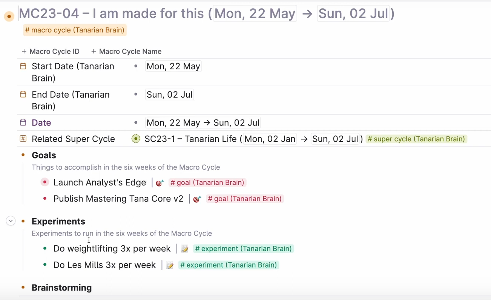

- [[Tanarian Brain]]
	- Supercycles are six months each with 4 six-week macrocycles. There is a two week break within each supercycle.
		- Resource: {{video https://www.youtube.com/watch?v=_CVj0brtzNc}}
		- The supercycle is the high level goal you want to achieve within that half a year and the macrcocycles, in general, are the activities that bring you closer to achieving your supercycle.
		- The macrocycles contain or reference your goals. It also contains the experiments you want to run within that time frame.
		- The macrocycle can overlap across different areas of your life
		- 