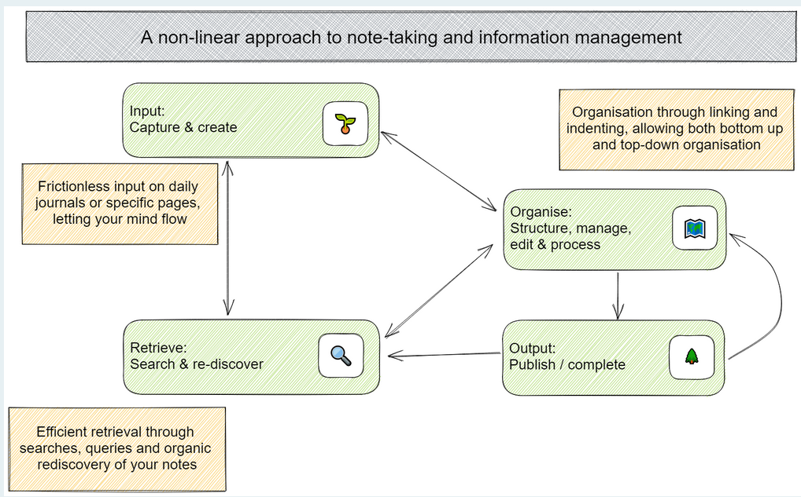
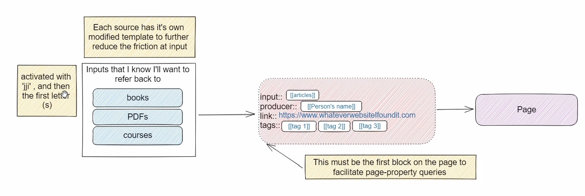
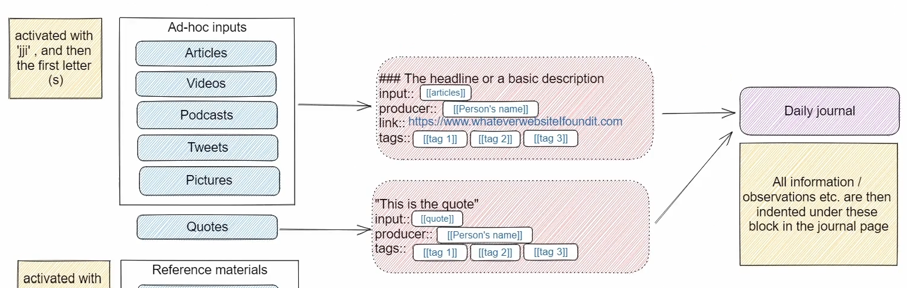
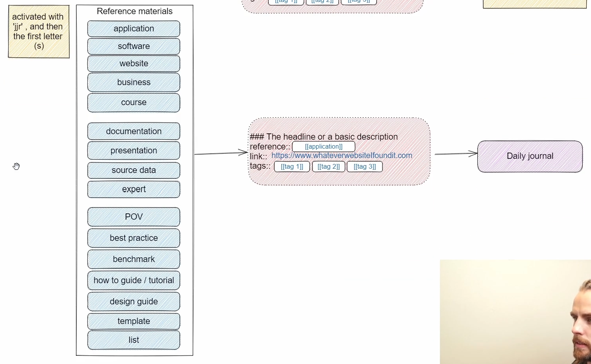

- [[Logseq Mastery]]
	- Tools
	  collapsed:: true
		- You can use VSCode to manually edit the markdown. VSCode allows find and replace all, and allows batch edits
	- Introduction to Workflows and Systems
	  collapsed:: true
		- 
		- Inputs and Outputs
			- 
				- Books, PDFs, courses are placed into a separate page
			- 
				- Other inputs like articles, videos, and podcasts are referenced in the daily journal
			- 
				- Other reference material are also referenced in the daily journal