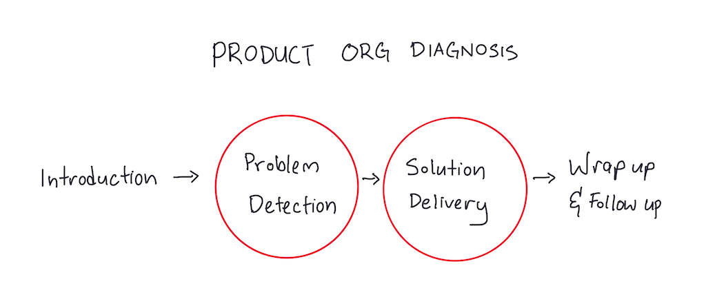

author:: John Cutler
link:: https://www.instapaper.com/read/1464641864
status:: reading

- #[[Literature Notes]]
- #[[Reference Notes]]
	- Product leaders assume that their best practices scale universally; they don’t realise that different teams in different industries in different cultures around the world have vastly different product practices, all of which might work for them, depending on a host of factors. Cutler doesn’t make such mistakes — or at least he doesn’t make as much of them any more; he’s seen too many possible product org configurations to count.
	- A Quick Recap of ACTA
	  collapsed:: true
		- ACTA is a protocol of three interview methods and a presentation format, designed to help a practitioner extract information about the cognitive demands and skills required for a task. The three interview methods are:
		- You first create a task diagram. This is a broad overview of the task in question, and identifies the difficult cognitive elements.
		- You do a knowledge audit — which identifies all the ways in which expertise is used in a domain. You also extract examples based on actual experience.
		- You do a simulation interview — you give the expert a simulation of a single incident, and then probe the expert’s cognitive processes over the course of that simulation.
		- Finally, you present the extracted information in a cognitive demands table.
	- Product Org Expertise from Joh Cutler - An extract
		- **Introduction** — John opens up the call and gets some pleasantries out of the way. Usually these teams come to him with some problem in mind, so he lets them start off with their issues.
		- **Problem Detection** — John pattern matches by asking questions, letting his intuition guide where to go and what to dive deep into. Sometimes he uses humour to open up the conversation. In many cases John will do a first pass of **anti-patterns — that is, problems that are really common** — and then let the conversation develop from there. This part takes anywhere between 8-20 minutes. If by the 20 minute mark he isn’t able to map out a few problems, this is likely a rare edge case — a unique organisation that he can't help.
		- **Solution Delivery** — Based on the problems unearthed in Step 2, John will suggest a prioritised list of experiments to try.
		- **Wrap up and follow up** — There may or may not be a follow-up, depending on the nature of the engagement.
		- 
			- Problem Detection and Solution Delivery was identified as the highest cognitive load activitie.
				- In problem detection, a novice would not be able to discern signal from noise—what information to dig for and what dat to ignore. An expert would be able to get at the heart of the problem much more efficiently
				- A novice would be able to provide recommendations for easy organization problems but less effectively to prioritize and recommend options for complex problems
			- During Problem Detection John's first pass will be to uncover anti-patterns. “Bad product orgs all kinda look the same, good orgs can succeed for very different reasons.” Then, work backwards from the anti-patterns to figure out how the org got here.
				- First detect if there is high Work In Progress
					- These manifest in "low morale", "no learning", or "no growth mindset". If high WIP exists then work backwards to how the company got there.
					-