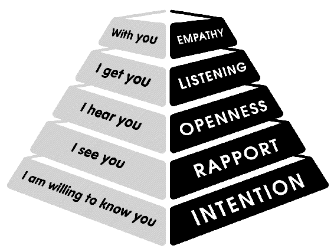

tags:: questions, conversations, books, # [[Q - How to run a meeting]] 
author:: [[Will Wise]]

- #[[Literature Notes]]
- #[[Reference Notes]]
	- Introduction
	  collapsed:: true
		- People want to be heard and understood. It may be the highest calling of our humanity.
			- People what to know that you hear them (openness), get them (listening), and can feel what they are feeling (empathy).
		- Asking Question Pyramid
			- 
	- Chapter 1 - The Power of Clear Intention
		- You can only unlock the true potential of your questions by first being clear about your intentions you're setting both for yourself and in sharing with others.
			- How might your intent be influencing what you see around as possible?
		- Intention is key to connecting and asking powerful questions, for it brings clarity to other about "where" you are coming from. Sharing your intentions allows for full transparency rather than opaqueness that leaves others guessing.
			- How can we apply intention as a process? Meeting invite templates and email templates?
		- ^^Clarity of intention is about examining the story you are telling yourself and how you are communicating the that story to others.^^Sharing your honest intention means a shared understanding of the following:
			- what you are aiming for
			- what your purpose is
			- what you plan to achieve
			- **Tool: Be clear about your intention and share it**
				- Be meticulous in expressing your intent, reflect upon what it is that you are truly aiming for.
				- We can also ask others to examine their intent, so alternative and possibly more productive options may arise from clearer intention during problem solving.
				- Being clear means digging deeper and not accepting the first answer you get.
		- When you are in a difficult conversation restating your intention will bring back focus and may clear up misunderstandings.
		- The most successful leaders and facilitators are generous with their knowledge, are open, and allow others to know what motivates them. Successful leaders do not hoard information, thinking that having unique information is leverage.
		  collapsed:: true
			- The act of asking powerful questions is supported by understanding our intention. Working on intention firsts allows us to focus on who we are rather than what we do.
			- The clearer we are about our intentions, the easier it is to accomplish our goals.
				- We can't ask powerful questions of people and expect great and fresh answers if they are mired down by trying to guess your ulterior motives.
			- We can focus on relationship building if we were more fully transparent with each other instead of wasting time trying to read each other's mind and eventually guessing at each other's intentions.
		- Intention can be focused on three things
		  collapsed:: true
			- future-focused: How do I want the world to exist?
			- outcome-focused: What result am I expecting from this meeting that would be useful for everyone involved?
			- commitment-focused: What promise have I made that I want to live fully in this moment?
		- Use clear intention when things are tough, ugly, or sensitive.
		  collapsed:: true
			- When things are tough it's easy for emotional wounds to forma nd for people to assume what the other's intent is.
			- Intentions based on fear (e.g., looking bad or fear from criticism) is harmful to you and to others
			- In order to meaningful connections ask ask powerful questions, your desire must be to thrive rather than survive. Create an intention that is uplifting and inspiring to others around you.
			- Use inclusive language, like "we", so everyone can feel invested and gain a sense of ownership of the proposed options.
				- What is it we are trying to understand that we're unable to grasp?
				- What are we trying to create?
				- What will it look like if we achieve our purpose?
		- Avoid manipulative intent
		  collapsed:: true
			- Manipulation is making someone do something without ever telling them what it is you want them to do. You ask questions with a secretly expected outcome that only you are aware of. The intent is to get something from that person without directly telling them what you want.
			- A hidden agenda will only only create more space between you and others. On some level, they will know you're holding back.
		- How Intention Can Be Applied to Groups
		  collapsed:: true
			- In larger groups, people may not understand your intentions or think you have ulterior motives. It can be helpful to restate your intentions in multiple ways.
			- It is also useful to state your intent before you ask the group to do something.
			- It's important that your intentions and actions align.
		- Stay in the moment. Greet each person as if they matter, because they do.
		- These small details will show people that you are willing to know them and allow them into your intention.
		- Meeting Intentions
		- We can ask ourselves a few questions to help us get to a productive meeting: # [[Q - How to run a meeting]] 
		  1. What are we aiming to achieve and what about that is important for everyone?
		  2. What is the overall picture that needs to be clear for us to fully leverage our time in this meeting?
		  3. How can I be accountable for the whole?
	- Chapter 2 - Rapport
		- The endeavor of asking meaningful questions starts with intention and connection. Connecting to people is fundamental to asking a powerful question because our connections happen even before we start asking questions.
			- If we create a genuine connection with others their responses are more honest and free.
		- Building rapport means creating a relationship on trust or moving towards trust.
			- Most barriers to human connection are based in fear.
				- Common fears are fears of being unloved and fear of looking stupid
		- The antidote for fear based blocks to rapport is to follow our curiosity.
			- We can develop genuine curiosity through:
			  collapsed:: true
				- Being present
					- Slow down the desire to rush
					- Engage with what "is"
				- Paying attention to what is happening right now.
					- Notice color, shape, texture. Notice your present environment.
					- Let go of what you would like it (or she/or he) to be or even what could be or should be.
					- As best you can, suspend judgment or your idea of how it is.
				- Listening with your heart and your mind to what you are drawn toward.
					- Let yourself be drawn toward it or them. Release the thoughts that pull you away.
				- Engaging with whatever thing or person you are curious about and discovering if there is more to be curious about.
		- Commonality as a basis of connection is a trap. Connections don't mean common things we have together. There are many ways we can become connected and have very little in common.
			- There can be connections around a topic, idea, or thought, and people may stand on opposing sides.
			- Rely on your genuine curiosity about that person to build a connection rather than using commonalities as a crutch. Don't use an invisible mental checklist to ask a question about. Be really genuine and curious. If you're not interested about a topic don't ask, but attempt to ask yourself what you are really curious about.
		- Some questions to spark curiosity:
			- What is this moment teaching me?
			- What is happening here that I am curious about?
			- How does this person see the world from their perspective.