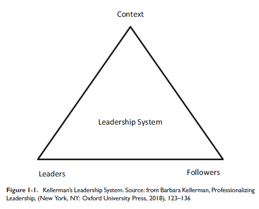
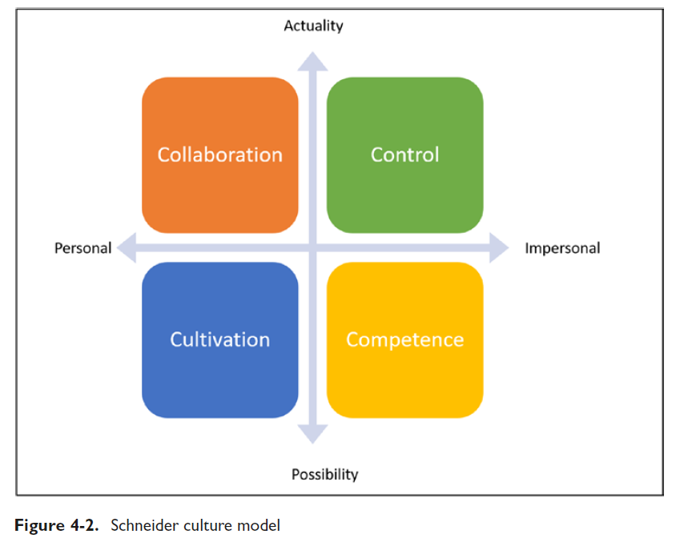
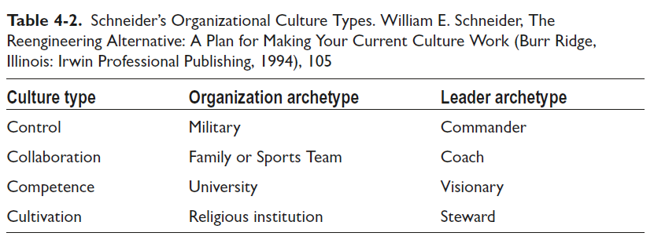
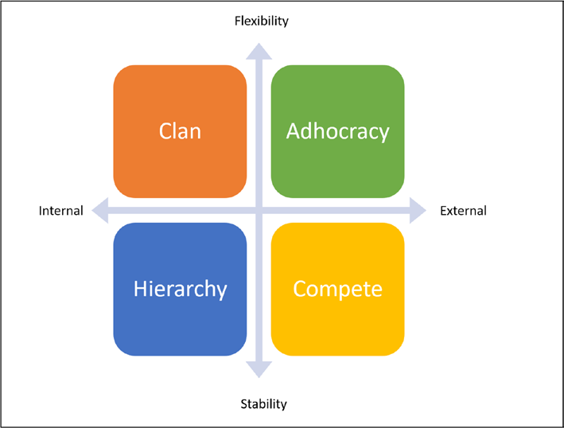
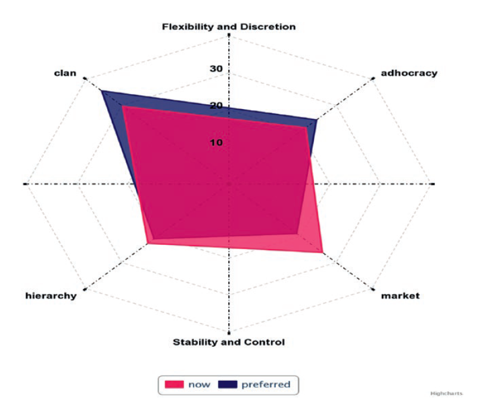

tags:: books, [[product management]], leadership

- #[[Literature Notes]]
- #[[Reference Notes]]
	- Chapter 1 - Leadership
	  collapsed:: true
		- What is a leader?
			- It is a complex phenomenon occurring in complex settings
			- Simplified definitions or conceptualizations can created missed opportunities to appreciate the various context where leadership activities occur
		- 4 Limiting Assumptions about leadership
			- Conflating leadership with hierarchal supervision
			- Portraying leadership as one directional influence—leadership should involve bi-directional influence
			- Depicting leadership as a personal attribute. This creates a negative message to those who don't see themselves as leaders not to act out leadership activities
			- Treating the environment as exogenous to the leadership process. Leaders can both adapt to and change their environment
		- Defining leadership
		  collapsed:: true
			- Many scholars are moving away from depicting leadership solely as a set of skills, traits, or behaviors and instead expanding the framework to include the relational process in which people engage in multi-directional influence.
			- Leadership is a complex adaptive process
			- Leadership can be seen as the process of producing direction, alignment, and commitment
				- "Leadership occurs as a group agrees on what they intend to achieve, aligns on how they will work together, and commits to working with each other as they strive to meet goals
		- Direction
		  collapsed:: true
			- In leadership, direction means a shared understanding of where the group wants to go
			- Direction answers the question of where we want to be in the future
			- Leadership often means challenging the status quo and moving forward as a group
				- The collective needs to understand the desired direction
				- Each team member needs to understand the goal and know that the other team members know the goal
		- Working Together
		  collapsed:: true
			- Effective leadership produces alignment and coherence
				- Alignment occurs through cooperation, coordination, and collaboration
					- Cooperation is the approach taken when there are independent goals and we have to make sure we aren't inhibiting each other
					- Coordination occurs when we share the same goal but have independent
					- Collaboration is the approach when we share the same goal and have interdependent tasks
				- Coherence happens when all aspects of the work required to achieve a goal comes together holistically
		- Collective Over the Individual
		  collapsed:: true
			- Leadership happens when individuals place group goals above personal goals because they are committed to the group and what the group can achieve. We can foster this environment through:
				- Removing demotivators in the work environment
				- Creating an environment where individuals thrive. Have the work and the workplace be the source of inspiration and commitment for your teams.
			- Leaders often resort to charisma and charm to foster commitment and they often inspire employees to tackle lofty organizational goals found in startups and organizations facing an existential dilemma
				- Charismatic leaders can also use their charm and charisma to manipulate employees to do their bidding
		- Leadership through direction, alignment, and commitment
		  collapsed:: true
			- When we define leadership through these outcomes we invite everyone to help achieve these goals and avoid relying on a few people to own these results
		- Leadership as a System
		  collapsed:: true
			- 
			- Effective leadership understands the importance of context and followers
				- To nurture direction, alignment, and commitment requires understanding the leader role, the follower role, and surrounding context in which leadership happens
			- Understanding the Context
			  collapsed:: true
				- Leadership does not happen in isolation - there is always context
					- ex: leadership in a church vs in a business
					- Leadership in a crisis vs leadership in times of stability
				- We have to apply different leadership styles to match the context
					- Leadership in a product-oriented work will be different compared a problem-solving environment
						- product-oriented work with quotas to meet
						- problem-solving environment tackles problems by developing novel solutions
					- ^^People with needs rarely know how to satisfy their needs^^
				- The importance of followers
					- It is not enough for you to focus on your competencies and think that this will be enough for the organization
					- You must provide an environment for your team where they can do their best
						- Exemplary team members exhibit good judgement, work ethic, competence, honesty, courage, discretion, loyalty and manage their egos.
						- Help followers understand that effective leadership depends on them.
							- It is common for team members to believe that they have no part in the leadership system because of their role.
							- Followers are part of the leadership system and play a pivotal role in creating direction, alignment, and commitment.
			- The role of leaders
			  collapsed:: true
				- Leaders have the primary responsibility of fostering conditions that lead to direction, alignment, and commitment.
				- They are stewards of the leadership system of the organization.
				- Types of leaders—emergent and assigned
					- Assigned leaders are not guaranteed that they are seen as leaders or that they are effective leaders
					- Do we really need assigned leaders?
						- Yes, it is hard to find any examples of successful organizations without assigned business leaders.
						- The need for leadership is the basis of the Law of Organizational Entropy, it states that when no one has the specific responsibility of making sure direction, alignment, and commitment exist within a group, the group descends into disorder and fails to deliver the results for which the group exists in the first place.
						- Having leadership does not guarantee success but rarely do groups demonstrate sustained excellence success without assigned leaders.
				- Destructive Leadership
				  collapsed:: true
					- Leadership in and of itself is value-neutral.
					- Good leadership deliver results and delivers results ethically
					- A leadership with bad leaders, bad influence tactics such as coercion, bad followers, or a bad goal is not a good leadership system; it is a destructive leadership system.
					- When leaders (knowingly or unknowingly) make work difficult for their team members.
						- They rely on coercive tactics or hoard power. They have little to no interest in the well-being of the followers that make up the the leadership systems, except when they know a lack of attention will negatively impact their image. These leaders are only concerned about their personal interests.
						- *Bad leadership cannot solely be blamed on the leaders. Those who remain quite, look the other way, or claim that they are following instructions are complicit.*
		- Management
		  collapsed:: true
			- Focusing on the day to day activities required to ensure the organization functions properly and achieves its goals.
			- Leadership and management are two distinct activities.
				- As a leader you have to facilitate the leadership system and process while simultaneous ensure the organization continues to achieve its operational goals. Leaders have a dual responsibility of leading people and managing the work and work environment.
		- The Authority, Power, and Influence Cocktail
		  collapsed:: true
			- While there is a push for an organization with less hierarchy, it remains true the best organization results come from having them. Hierarchy exists to ensure the proper functioning of the organization.
			- Hierarchy requires that leaders manage the trio of power, authority (formal and informal), and influence as they interact with followers.
				- Power
				  collapsed:: true
					- Power is the capacity of getting people to do what they had no intention or desire to do before.
					- Forms of Power
						- Coercive, reward, and legitimate power are formal powers because they come from one's assigned position
							- Coercive is when you use fear and threats to get people to follow your instructions
							- Rewards are promising workers a bonus if they work more
							- Legitimate power is power from the office you hold
						- Referent power are the results in team members doing what you ask because they like, respect, and admire you.
							- Leaders with referent power have excellent interpersonal skills and healthy relationships with others
						- Possessing an in-depth knowledge of a specific topic or subject area can also be a source of power if others consider you an expert.
						- Information power is having the information in order to progress an action.
					- Personal power is more impactful than formal powers because personal power remains with you even when you change positions or leave an organization.
					- Sharing Your Power
					  collapsed:: true
						- People can either lord their power over others and force them to do things that they don't want to do.
						- Someone with power can also seek to share their powers with others. The goal of sharing power is so that everyone can maximize their contribution to the organizational process.
							- Sharing your power with employees encourages them in participating and contributing to the organization.
					- Formal Authority
						- When leaders do not exercise their formal authority to address wrongdoing, the individuals in their charge question the leader's ability to lead.
							- Employees are left to wonder if the leader is paying attention to what is happening around them.
						- The proper use of formal authority is of critical importance
							- Use formal authority to establish and maintain organizational rules
						- Formal authority is not enough to lead organizations, effective leaders must have informal authority as well
					- Informal Authority
					  collapsed:: true
						- Informal authority comes from the trust and respect that followers give you
						- Factors that enhance your informal authority include developing good relationships with team members and exhibiting behavior that people in the organization appreciate
						-
				- Influence
					- Effective leadership requires that leaders know how to influence others in the leadership system.
					- If you do not develop your influencing skills, you ultimately resort to coercive methods.
					- Influencing others relies on being able to communicate your desires (develop your communication skills). Unclear messages inhibit your ability to influence others
					- Influence allows us to establish direction, maintain alignment, and foster commitment within the organization while minimizing resistance.
					- Tools for influence
						- rational persuasion
							- using logic and facts to explain why individuals need to participate in attaining the goals
						- consultation
							- Engage team members in an activity that requires their support
							- Leaders are sometimes surprised when their team members are resistant to the plan that they fully baked in isolation
								- You can reduce resistance by involving people in creating the plan. It helps the employee feel like they have a voice on their future.
						- inspiration appeals
							- An inspirational appeal means addressing the people's core values, principals, and ideals. You need to know what matters most to the individuals you lead and you need to help them see how their inspiration come to the life through the activities you are asking them to support.
						- collaboration
							- Knowing they have your support is critical when team members must take on a difficult challenge, which they may not feel fully qualified to take on.
						- (emotional appeal)
							- [[Books: Never Split the Difference]]
						- Using these tools of influence requires a significant amount of effort, time, and patience.
					-
		-
	- Chapter 2 - The Agile Game #agile
		- Agile doesn't have a shared definition. It has come to mean whatever anyone want it to mean because of its popularity
		- The agile approach are for people who are highly motivated with a continuous improvement mindset, i.e., people with passion for identifying better ways of developing software.
		- The Agile approach also made it clear that uncertainty was a friend and not a foe.
			- Unlike traditional approaches that focus on achieving high certainty levels (especially at the beginning of the product development process)
			- Agile embraces uncertainty.
		- Agile is not a panacea
		  collapsed:: true
			- Large scale product development endeavors also challenge many of the underlying Agile assumptions. Large-scale product development requires the coordination of many teams working together on a shared goal. The number of teams and the software's complexity makes it difficult for everyone working together to communicate to face-to-face. Comprehensive documentation becomes essential in these scenarios.
			- Leaders responsible for large-scale product development efforts will need to augment the Agile approach with other tried-and-true techniques.
			- Agile is not the goal. Agile relies on some assumptions about your product development context, and there are times when these assumptions do not hold true. You must adopt approaches necessary for your team and organization to achieve its desired objectives.
		- Practicing Agile? Easier Said Than Done
		  collapsed:: true
			- In practicing agile we can become hyper focused on managing the product development and little focus on good product management and software engineering practice.
			- Agile does not guarantee success.
			- Agile failure shows that a lack of leader support, organizational culture mismatch, and a misunderstanding of Agile values and principles routinely contribute to Agile adoption failures. Leaders impact each of these causes because they influence organizational context and culture.
		- If You Choose Agile, Lead the Way
			- Leader support for Agile is necessary if organizations and teams are to succeed with it. Your leadership approach will have to foster an environment where Agile can thrive.
			- Agile won't guarantee success without solid understanding of how to lead teams practicing Agile. Agile will not overcome poor business strategy, poor product management, poor marketing, or poor customer service.
			- Agile can play an essential role in an organization that wants to adapt quickly to changing business circumstances. For this to work leaders need to be effective to lead an organization where continuous adaptation to change is a necessity.
			- There is no product development panacea. Businesses dependent on high-performing product development requires effective leaders to foster the conditions for excellence.
	- Chapter 3 - Making Sense of Cultural Plurality
	  collapsed:: true
		- Agile presumes a low power distance—meaning that leaders are expected to share their power or the organizational hierarchy is flat. Agile promotes consensus-based decision-making using the information produced from working software.
		- Leaders are not supposed to use their power to primarily control or command their teams; instead, power is for support.
		- Individualism
		  collapsed:: true
			- In high individualism environments consider how the rewards structure promotes certain individualistic behavior versus a more collective approach. While the organization is promoting team work, the reward structure may promote the individual like salesperson of the year, calling out specific people and team members.
		- Masculinity versus femininity
		  collapsed:: true
			- Masculine environments are expressed as individuals, teams and departments compete for ideas, promotions, and recognition. People feel the need to prove they are right during conversations. Not having answers to questions is often seen as incompetence or lack of knowledge, and saving face is commonly practiced.
			- Feminine environments concern themselves with others' well-being. They tend to promote fairness, justice, and equality more than their masculine counterparts.
			- In an Agile environment leaders need to promote cooperation, coordination, and collaboration and discourage competition between team members.
		- Uncertainty Avoidance
		  collapsed:: true
			- Some cultures embrace change and try to make the best of the fact that many aspects of the future are unknowable. Other communities work hard to protect themselves from the surprises that the future will bring.
			- Uncertainty avoidance can either amplify or dampen your teas' willingness to try new methods of working.
			- Agile methods encourage experimentation and embracing uncertainty as part of the product development process
		- Long-Term Versus Short-Term Orientation
		  collapsed:: true
			- Longer-term orientation is the fostering of the virtues of perseverance and thrift. These virtues have a focus on future rewards.
			- Short-term orientation value respect for tradition, saving face, and fulfilling social obligations. Societies with short-term orientation focus on the past and what is happening in the present. They optimize for immediate feedback, while long-term communities optimize for delayed feedback.
			- Leaders who are long-term oriented focus on future results (and not just immediate results).
			- ^^Product development organization need a balance of short-term and long-term orientation. The goal is to deliver value regularly and frequently from a short-term perspective.^^
				- Agile planning practices focus more on the short-term horizon and this aligns with embracing uncertainty and focusing on what is in view.
				- Your goal is to help your organization have the right balance between short and long term orientation and to identify what moments are appropriate for each orientation.
			- Indulgence Versus Restraint
				- Indulgence dimension measures the degree to which members of society control their desires and impulses.
					- Do people in society delay gratification or do they need to get what they want immediately?
				- People in low indulgent cultures are less likely to try new ideas that challenge the current way of thinking or working, and so introducing new methods for getting work done may face some resistance.
				- High indulgent cultures are more compatible with Agile so promote an environment were work and play can coexist. You have to ensure that the work is done at a sustainable pace.
			-
		-
	- Chapter 4 - Organizational Culture - Friend or Foe? #culture
	  collapsed:: true
		- When talking about organizations and culture we have to be specific about the organization we are observing. Are we talking about the organization as a whole, a department or a team within a department?
		- Organizational Climate vs Culture
		  collapsed:: true
			- Organizational climate refers to how individuals feel about their work environment at any given time. When people ask about the culture, they're really asking about the climate.
			- Culture is the accumulated shared learning of that group as it solves its problems of external adaptation and integral integration; which has worked enough to be considered valid and, therefore to be taught to new members as the correct way to perceive, think, feel and behave in relation to those problems.
				- Culture reflects how a social group responds to environmental demands based on their previous experiences.
			- The organization is a culture. Organizational culture is not a standalone property that leaders create and then manipulate; instead, culture emerges from social interactions within the organization.
		- Integration View—A Single Organizational Culture
		  collapsed:: true
			- The integration view promotes organization-wide consensus, consistency, and clarity with the exclusion of ambiguity within the entire organization.
			- People take their cultural cues from the behaviors you model in the organization.
			- Developing a shared set of core value and then engaging in dialogue on behaviors that reflect these values is crucial and is work that you need to make sure happens.
		- Differentiation View—Multiple Subcultures
		  collapsed:: true
			- Differences are due to the presence of subcultures that differ from the proposed unitary culture.
			- The differentiation view shows that there is little agreement on what organizational culture elements lead to organization effectiveness.  Unlike the integration view, which points that a single organizational culture enhances organizational effectiveness, the differentiation view posits that a single organizational culture results from one group dominating other groups.
			- Unlike the integration view that places the locus of organizational change with the leader, the differentiation perspective views culture change through how a subculture changes in response to environmental stimuli.
			- The differential perspective is beneficial because it enables you to acknowledge multiple subcultures within a single organization. Recognizing that subcultures have different shared views is crucial when those same cultures have shared tasks.
			- As a leader it is crucial to take time to appreciate the values that matter to a subculture you work with if you want to influence across organizational boundaries. Once you know what matters to other groups, you can adopt an approach that considers their values.
			- It is also important to detect inconsistencies in an organization's culture that might hamper organizational effectiveness.
				- If your organization espouses treating employees with fairness and respect, then you as a leader must look for inconsistencies that go against those values. Do not be a leader that protects individuals
		- Fragmentation View—Conflict and Confusion
		  collapsed:: true
			- The fragmentation perspective on culture focuses the ambiguity, complexity of relationships between the various cultural expressions of the organization, and the diverse interpretations of culture that prevent consensus.
			- Fragmentation is evident when people provide varied and contradictory responses to questions about cultural norms or values.
			- The absence of defined rules for every situation can provide people with the freedom and flexibility needed to try new ideas. (This assumes that employees are proactive, motivated and skilled enough to do this.)
		- Uncovering Hidden Perspectives
		  collapsed:: true
			- You need to care and discover hidden perspectives because they provide a holistic understanding of the organization's culture.
			- Within the hidden perspectives often lies cultural realities that amplify or dampen organizational effectiveness.
			- Continually assess your organization culture through the cultural lens of integration, differentiation, and fragmentation so that you influence culture in the appropriate places.
				- Also invest time in learning other groups' subcultures because doing so will you understand their shared assumptions and values.
		- Organizational Culture Typologies
		  collapsed:: true
			- To help leaders make sense of organizational cultures, researchers have developed different organizational culture typologies.
				- Organizational typologies describe cultures based on specific dimensions, such as their leadership and management approach.
			- Schneider Model
			  collapsed:: true
				- Identified four core organizational culture types—control, collaboration, competence, and cultivation—of successful organizations.
				- 
				- 
				- The **control culture** archetype is the military. It focuses on ensuring certainty in all aspects of organizational life. What matters most is that organization achieves its goals, i.e., getting stuff done.
					- Leaders institute processes and practices to ensure that everything runs like a machine. These types of organizations will procedures for all operational functions.
					- Often team members assume that the manager knows best and can address all system issues.
					- The best approach to succeed in this type of organization is to release impactful software frequently as they value certainty—releasing small software increments to meet  scheduled and expected milestones.
					- The environment for frequent releases must be supported such as automated tests and bandwidth for UATs/demos.
				- Collaboration Culture—Leader as Coach
					- These types of cultures focus more on affiliation and belonging. They operate like a family or athletic team. They place effort into creating synergies inside and outside the organization.
					- Leaders focus on coaching in these organizations and creating an exceptional experience for everyone involved with the organization. Establishing psychological safety is a crucial concern in these organizations.
					- The collaboration culture is a good match for Agile methods because of their focus of collaboration and addressing customer needs which this culture supports. An agile principle encourages the daily interaction between everyone involved in the product  development process.
					- Foster a workplace where everyone can meaningfully participate int he product development process.
				- Competence Culture—Leader as a Visionary
				  collapsed:: true
					- This type of culture focus on setting themselves  apart from others in their industry—they focus on what might be possible. Achieving what other firms have not achieved is the primary driver of this culture.
					- Leaders in these cultures demand excellence from their workforce, focus on output, and expect a  lot of work to get done.
					- Regular delivery of high-quality software-based solutions is essential and mastery of product development technical practices (for example product discovery and software development design principles) is critical for success.
					- The competence culture produces top-notch solutions.
					- The impersonal and competitive approach can run counter against Agile principles.
						- Technical competence is not the sole predictor of team success. Team members' ability to work together goes a  long way to determine a team's level of achieving success.
						- Organizations may rely on a brilliant individual at the expense of team performance.
				- Cultivation Culture—Leader as Steward
					- This culture focuses on people development and to provide an environment where the pursuit of noble goals and ideals transcending the organization is the primary objective.
					- Cultivation culture's archetype is religious systems.
					- They measure themselves by looking at the difference they make in society, not just by profit and loss statements say. They also pay attention to whether employees are achieving their dreams and desires.
					- Autonomy and employee commitment are crucial in cultivation cultures.
				-
			- Competitive Value Framework
			  collapsed:: true
				- 
				- Attempts to categorize organizational culture based on how organizations use an internal focus-external focus and stability-flexibility approach to achieve organizational effectiveness.
					- The internal-external dimension indicates where the organization focuses, i.e., does this organization focus on its inner workings, or does the organization focus on its cutomer interactions?
					- The stability-flexibility dimension represents whether an organization takes steps to foster stability and increased certainty versus flexibility and uncertainty.
				- Even though organizations have aspects of all four cultures, like Schneider's model, CVF posits that an organization will have a dominant culture at any given time.
				- The Organizational Culture Assessment Instrument enables you to assess the present and preferred organizational cultures perceived by individuals in your organization.
				  collapsed:: true
					- 
					- Clan Score—We function Like a Family
						- These team members receive highest score in the assessment, reflecting the team members felt they belonged to a culture focused on collaboration and team building. Team members express high levels of trust in each other, felt psychologically safe. They also appreciate their managers' leadership and management style and described their managers as friends, mentors, and coaches because managers did not micromanage . The preferred results show that team members till desire a predominant culture type.
					- Adhocracy Score—We Do Not Innovate Enough
						- Team members did not consider their work highly innovative, creative, or necessarily exciting because they mostly enhanced existing products with small features.
					- Market Score—We Have to Hit Our Numbers
						- After the clan culture, most team members considered the values of market culture most dominant.
						- This culture type is least desirable as is it opposes to and competes with clan culture. There will always be tension between these two culture types.
					- Hierarchy Score—It Does Not Feel Like a Hiearchy
						- Aligns with the results from the clan culture as team members perceived the organization not highly formal or bureaucratic.
			- Why Does Organizational Culture Matter
			  collapsed:: true
				- Organizational culture is how an organization goes about doing its business.
				  Doing its business includes how it achieves its goals and desires. It also includes
				  how the organization treats people and how people feel about the organization.
				  It reflects what matters to the people with the most power and authority in
				  the organization i.e., the norms, values, and behaviors these individuals care
				  about and want others to model and encourage. Organizational culture is
				  essential, and yet it is messy and difficult to influence. It is your responsibility
				  to determine what organizational culture you want to support your
				  organizational goals.
				- Understanding organizational culture is critical from an adaptation perspective. Meaningful organizational change often requires a shift in core values and attitudes.
		- Takeaways
			- Do not use organization (or corporate) culture as an unactionable abstraction. Address specific elements of the culture.
	- Chapter 5 - Leading with a Heart of Service
	  collapsed:: true
		- Many leaders assert that people that people are the most crucial part of the organization. Sadly, their actions often indicate otherwise.
		- Servant leadership is a leadership theory and practice with attending to people's needs as its core focus.
			- Servant leadership has a distinct moral focus, they lead out of their desire to see those they lead develop, become more independent, and eventually serve others.
			- It means that you support team members by helping them perform their jobs to the best of their abilities.
		- Researchers found that servant leadership lead to improved organizational performance because the leadership style encouraged organizational learning.
			- Servant leadership leads to an engaged and dedicated workforce.
		- Servant leadership generates a positive experience for employees and potentially benefits an organization's bottom line.
		- Strategic Servant Leadership
			- Composed of two parts—strategic and operational
				- **Strategic** aspect of servant leadership is future-focused and concerns itself with ensuring the organization continues to move in its desired direction.
					- Establishing Direction
						- Functions of strategic leadership are:
							- Set, translate, and execute a higher purpose vision (shared direction)
							  collapsed:: true
								- You can articulate a shared direction through a vision, mission, purpose, objective, priorities or a goal depending on your situation.
									- Involve the team in identifying how the team will achieve its goals.
									- Team members need to see your support through your commitment to team goals.
								- Team members must also understand where they are going
								  collapsed:: true
									- Clear communication is critical to make this happen.
										- Continually develop your communication skills to make sure you can communicate with clarity within your organization.
								- Start with yourself that you know and understand the organizational direction.
							- To become a role model and ambassador
							  collapsed:: true
								- You must lead the way and model the behavior you want from others
								  collapsed:: true
									- If you want to increase diverse opinions from your colleagues, include diverse opinions in your meetings
					- Strategic Servant Leadership also requirements commitment to personal development. A motive for developing your leadership capabilities is so you can improve how you serve those you lead. Leaders with a heart of service ask themselves the question, "what do I need to improve about myself so I can more effectively serve the people in my care?"
		- Operational Servant Leadership
			- The **operational** aspect focuses on supporting team members and employees and ensuring that team members have what they need to excel at their tasks through:
				- Aligning, caring, growing talent
				- Continuously monitoring work progress and improving how teams perform their work
				- Caring for Team Members
					- It is challenging to serve your team members if you do not care for them. If you cannot find it in your heart to care for someone you directly support, you or that individual needs to change groups. Love is at the heart of servant leadership.
					- Serving your team members means offering them positions where they are most likely to succeed.
						- Equip teams so that they have what they need to accomplish their goals. Ensure people have the authority, resources, information, and accountability required by the task.
					- Provide teams with development opportunities