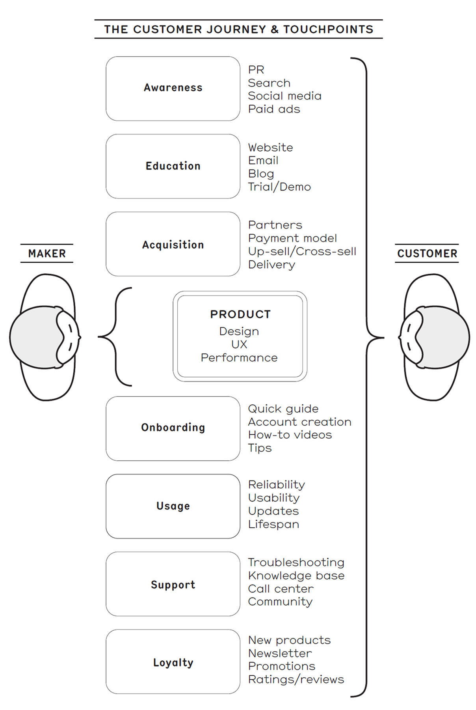
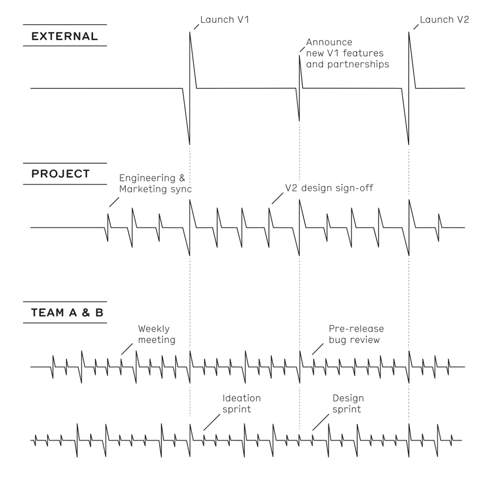
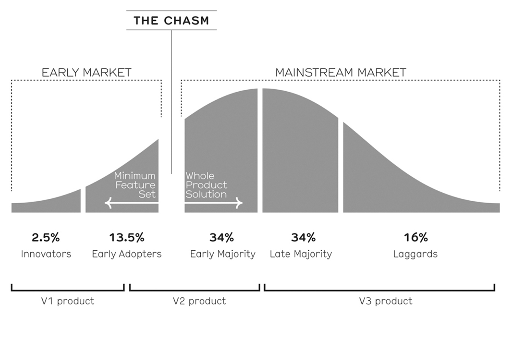
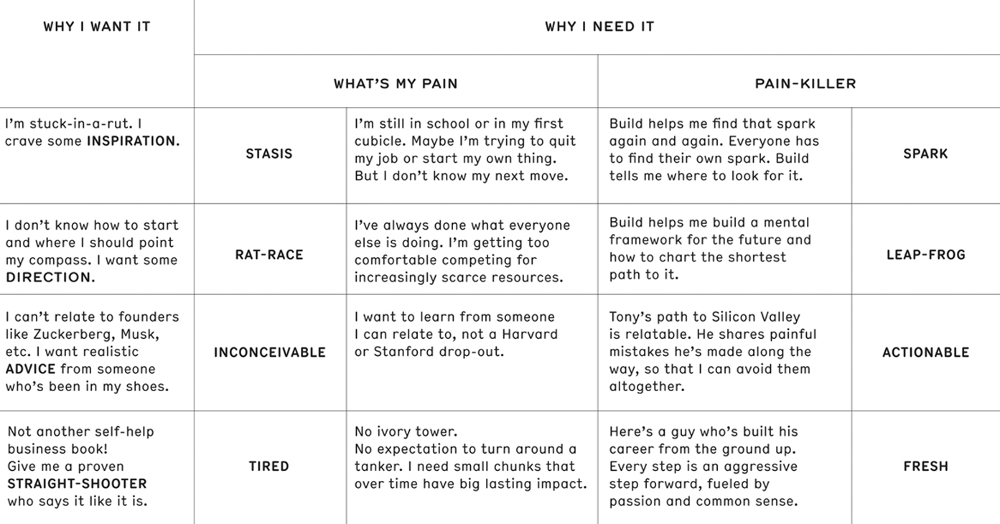

- #[[Literature Notes]]
	- To create value at work, create and build something useful to someone
- #[[Reference Notes]]
	- #[[Q - How to learn]]
	  collapsed:: true
		- Traditional schooling trains people to think incorrectly about failure. You’re taught a subject, you take a test, and if you fail, that’s it. You’re done. But once you’re out of school, there is no book, no test, no grade. **And if you fail, you learn. In fact, in most cases, it’s the only way to learn—especially if you’re creating something the world has never seen before.**
		  collapsed:: true
			- **I needed to learn. And the best way to do that was to surround myself with people who knew exactly how hard it was to make something great—who had the scars to prove it. And if it turned out to be the wrong move, well, making a mistake is the best way to not make that mistake again. Do, fail, learn**
			- **Early adulthood is about watching your dreams go up in flames and learning as much as you can from the ashes. Do, fail, learn. The rest will follow**
		- So when you’re looking at the array of potential careers before you, the correct place to start is this: “What do I want to learn?” Not “How much money do I want to make?” Not “What title do I want to have?” Not “What company has enough name recognition that my mom can brutally crush the other moms when they boast about their kids?” The best way to find a job you’ll love and a career that will eventually make you successful is to follow what you’re naturally interested in, then take risks when choosing where to work. Follow your curiosity rather than a business school playbook about how to make money. Assume that for much of your twenties your choices will not work out and the companies you join or start will likely fail.
			- **The critical thing is to have a goal. To strive for something big and hard and important to you. Then every step you take toward that goal, even if it’s a stumble, moves you forward.**
		- And you can’t skip a step—you can’t just have the answers handed to you and detour around the hard stuff. **Humans learn through productive struggle, by trying it themselves and screwing up and doing it differently next time.** In early adulthood you have to learn to embrace that—to know that the risks might not pan out but to take them anyway. You can get guidance and advice, you can choose a path by following someone else’s example, but you won’t really learn until you start walking down that path yourself and seeing where it takes you
		- You should never kill yourself for your job, and no job should ever expect that of you. **But if you want to prove yourself, to learn as much as you can and do as much as you can, you need to put in the time.** Stay late. Come in early. Work over the weekend and holidays sometimes. Don’t expect a vacation every couple of months. Let the scales tip a little on your work/life balance—let your passion for what you’re building drive you
		- To do great things, to really learn, you can’t shout suggestions from the rooftop then move on while someone else does the work. You have to get your hands dirty. You have to care about every step, lovingly craft every detail. You have to be there when it falls apart so you can put it back together. You have to actually do the job. You have to love the job
	- #[[Q - How do we create value at work?]]
	  collapsed:: true
		- If you’re not solving a real problem, you can’t start a revolution
		- “I can’t make you the smartest or the brightest, but it’s doable to be the most knowledgeable. It’s possible to gather more information than somebody else.
		- **Your job isn’t just doing your job. It’s also to think like your manager or CEO. You need to understand the ultimate goal, even if it’s so far away that you’re not really sure what it’ll look like when you get there.** That’s helpful in your day-to-day—knowing your destination lets you self-prioritize and make decisions about what you’re doing and how you’re doing it. But it’s also bigger than that. You want to make sure the direction you’re headed in still feels right—that you still believe in it. And you can’t ignore the other teams who are working by your side.
			- When you look up and around, you can see if your medium- and long-term goals still make sense, and understand the needs and concerns of the teams around you. Talk to your internal customers, whoever you’re a customer of, and the people who are closest to the actual customer—marketing and support. That’s how you’ll know if you’re on track or if things are going seriously sideways
			- New perspectives are everywhere. You don’t have to drag a bunch of people off the street to stare at your product and tell you what they think. Start with your internal customers. Everyone in a company has customers, even if they’re not building anything. You’re always making something for someone—the creative team is making stuff for marketing, marketing is making stuff for the app designers, the app designers are making stuff for the engineers—every single person in the company is doing something for someone, even if it’s just a coworker on another team #[[Q - How to be innovative]]
			- **Come curious. And come genuinely interested.** When you’re looking up and around, you’re not on a self-serving mission to understand if your company will fail and how quickly you should cut and run. You’re trying to understand how to do your job better. You’re getting ideas of how to help your project and your company’s mission succeed. You’re starting to think like your manager or leader, which is the first step to becoming a manager or leader. #[[Curiosity]]
	- Career Choices
	  collapsed:: true
		- If you’re going to throw your time, energy, and youth at a company, try to join one that’s not just making a better mousetrap. Find a business that’s starting a revolution. A company that’s likely to make a substantial change in the status quo has the following characteristics:
			- It’s creating a product or service that’s wholly new or combines existing technology in a novel way that the competition can’t make or even understand.
			- This product solves a problem—a real pain point—that a lot of customers experience daily. There should be an existing large market.
			- The novel technology can deliver on the company vision—not just within the product but also the infrastructure, platforms, and systems that support it.
			- Leadership is not dogmatic about what the solution looks like and is willing to adapt to their customers’ needs.
			- It’s thinking about a problem or a customer need in a way you’ve never heard before, but which makes perfect sense once you hear it.
		- **What you do matters. Where you work matters. Most importantly, who you work with and learn from matters. Too many people see work as a means to an end, as a way to make enough money to stop working. But getting a job is your opportunity to make a dent in the world. To put your focus and energy and your precious, precious time toward something meaningful.**
			- You don’t have to be an executive right away, you don’t have to get a job at the most amazing, world-changing company right out of college, but you should have a goal. You should know where you want to go, who you want to work with, what you want to learn, who you want to become. And from there, hopefully you’ll start to understand how to build what you want to build.
		- The job of an individual contributor (IC)—a person who doesn’t manage others—is usually to craft something that needs to be completed that day or in the next week or two. Their responsibility is to sweat the details, so most individual contributors depend on their managers and executive team to set a destination and lay out a path for them so they can keep their focus on the work. However, if an IC is constantly looking down, their eyes exclusively on their own tight deadlines and the minutiae of their job, they may walk directly into a brick wall.
			- As an IC, you need to occasionally do two things:
				- 1. Look up: Look beyond the next deadline or project and forward to all the milestones coming up in the next few months. Then look all the way down to your ultimate goal: the mission. Ideally it should be the reason you joined the project in the first place. As your project progresses, be sure the mission still makes sense to you and that the path to reach it seems achievable.
				  2. Look around: Get out of your comfort zone and away from the immediate team you’re on. Talk to the other functions in your company to understand their perspectives, needs, and concerns. This internal networking is always useful and it can give you an early warning if your project is not headed in the right direction.
	- Management #Leadership
		- If you’re thinking of becoming a manager, there are six things you should know:
			- 1. You do not have to be a manager to be successful. Many people assume that the only path to more money and stature is managing a team. However, there are alternatives that will enable you to get a similar paycheck, have similar amounts of influence, and possibly be happier overall. Of course if you want to be a manager because you think you’ll love it, then absolutely pursue it. But even then, remember that you don’t have to be a manager forever. I’ve seen plenty of people go back to being individual contributors, then turn around and be managers again in their next job.
			  2. Remember that once you become a manager, you’ll stop doing the thing that made you successful in the first place. You’ll no longer be doing the things you do really well—instead you’ll be digging into how others do them, helping them improve. Your job will now be communication, communication, communication, recruiting, hiring and firing, setting budgets, reviews, one-on-one meetings (1:1s), meetings with your team and other teams and leadership, representing your team in those meetings, setting goals and keeping people on track, conflict resolution, helping to find creative solutions to intractable problems, blocking and tackling political BS, mentoring your team, and asking “how can I help you?” all the time.
			  3. Becoming a manager is a discipline. Management is a learned skill, not a talent. You’re not born with it. You’ll need to learn a whole slew of new communication skills and educate yourself with websites, podcasts, books, classes, or help from mentors and other experienced managers.
			  4. Being exacting and expecting great work is not micromanagement. Your job is to make sure the team produces high-quality work. It only turns into micromanagement when you dictate the step-by-step process by which they create that work rather than focusing on the output.
			  5. Honesty is more important than style. Everyone has a style—loud, quiet, emotional, analytical, excited, reserved. You can be successful with any style as long as you never shy away from respectfully telling the team the uncomfortable, hard truth that needs to be said.6. Don’t worry that your team will outshine you. In fact, it’s your goal. You should always be training someone on your team to do your job. The better they are, the easier it is for you to move up and even start managing managers
	- Chapter 3.1
	  collapsed:: true
		- 
	- Chapter 3.5
	  collapsed:: true
		- 
			- Each team has its own rhythm, based on its style, the work it performs, and the needs of the project. Different teams will come together at milestones driven by the project heartbeat, which is primarily driven by the external heartbeat. The best external heartbeats aren’t set by the company but by outside forces—like the holidays or a big conference. A steady project heartbeat is required to make sure the team doesn’t miss any of those critical external deadlines.
	- Chapter 3.6
	  collapsed:: true
		- 
		-
	- 5.4 A method to the Marketing
		- 
		-