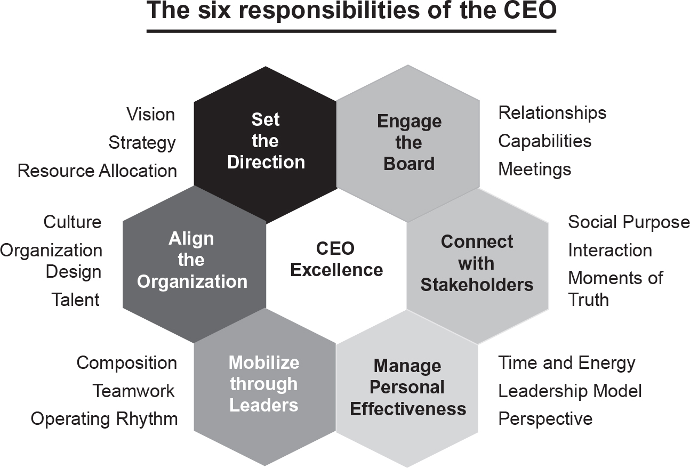

author:: [[Carolyn Dewar]]

- #[[Literature Notes]]
- #[[Reference Notes]]
	- Introduction
		- Six responsibilities of CEOs
		  collapsed:: true
			- {:height 507, :width 736}
			- Despite every CEO's different approaches, every CEO tended  to all six responsibilities and the best CEOs kept all six plate spinning at all times, even if the external and internal environment meant that some needed to be spun faster or slower than others.
			- The CEO role is the intersection of all [[contradictions]].
				- Balancing delivery of short-term results versus investing in long-term performance. Taking time to gather facts and do analyses versus moving fast to capture opportunities.
	- # Direction-Setting Mindset
	  collapsed:: true
		- The best CEOs shape the future of their organization, looking out for opportunities to seize rather than guarding themselves from failure. They embrace uncertainty instead of minimizing uncertainty.
		  collapsed:: true
			- Because minimizing uncertainty is less likely to net success, successful CEOs tend to take bold approaches.
		- ## Chapter 1 - Vision Practice
		  collapsed:: true
			- MasterCard CEO, Ajay Banga, redefined winning for his company not by fighting for the 15% of electronic purchases but by fighting for the 85% cash transactions. He sought for MasterCard to convert those cash transactions to credit and debit purchases.
			- Netflix had a bold vision in 2002, not to become the dominant player of DVDs but a distribution platform for film producers and studios. At that time Netflix was only in the business of renting out DVDs through the mail.
			- ### To find and define vision:
				- _Find and amplify intersections_
				  collapsed:: true
					- The best CEOs build their vision by looking for where various aspects of their business and the market intersect.
						- > Huber Joly, former CEO of Best Buy, explains that setting the right course is, "at the intersection of four circles: what the world needs, what you are good at, what you are passionate about, and how you can make money"
							- Best Buy's vision was to provided price matching against Amazon prices and build a store within a store for companies like Apple, LG, Sony and Nest.
				- _Make it about more than money_
				  collapsed:: true
					- Don't make your decisions and actions center solely on money, promotions, and raises. Create a mission that builds value for others and your mission will steer you to success—if someone finds your creation or contribution valuable.
					- Profits and success are outcomes of achieving a clearly defined and strategic vision.
					- Find key meaningful metrics that propels and amplifies the vision.
						- For Medtronics it was looking at how many seconds between each person was helped by a Medtronics device, CEO Bill George helped to trim down that metric from 100 seconds down to 7 seconds.
				- _Not being afraid to look back to look forward_
				  collapsed:: true
					- We can look back at history to see what initiatives and vision in the past led to success. We can also glean success from others in the past and learning from their successes, challenges, and most importantly failures.
					- > Smith's advice (CEO of Intuit) is to create a vision so clear a leader doesn't have to do anything but get out of the way. That's the most inspiring vision of all.
				- Involve a broad group of leaders in the process
					- Great CEOs create vision for their companies but rarely dictate their views.
						- **It turns out people support what they help create.** #influence
							- The underly psychology relates to our desire for control.
							- People are at least five times more supportive that those who aren't involved.
						- The vast majority of excellent CEOs found ways to include their employees when setting their vision.
		- ## Chapter 2 - Strategy Practice - Make Big Moves Early and Often
		  collapsed:: true
			- Improve productivity
				- The most successful companies reduce administrative, sales, and labor costs more deeply than others.
			- Differentiate
				- The best CEOs improve their business models and create pricing advantages in ways that are big enough to change a company's trajectory.
			- CEOs who make too few moonshot size moves—or make them too late in their tenure—are not as successful as one CEOs who do. CEOs, who make these moves earlier, outperform those who move later, and those who do so multiple times in their tenure avoid decline in performance over time.
			- We can identify challenges and reframe them as opportunities for future success. Success doesn't come from playing it safe and minimizing uncertainty, but through critical thinking, curiosity, and comprehensive research to support a bold solution. Opportunities are lost if we run away from solving key problems.
			- ### Be an Exception Futurist
				- A good CEO knows the importance of having a clear point of view where the world is going. They keep track of shifts in technology, changes in customer preferences, new competitors, and threats on the horizon.
				- To help you understand where the future is going, read a lot of varied and unrelated subject domains so you can combine the unrelated things into somethin new—not only in technical innovation but also in business.
					- You can foster this mindset through creating relationships with people who work in different sectors and traveling.
			- ### Keep an eye on the downside
				- Being a futurist doesn't mean recklessness. Excellent CEOs fully understand the risk and reward trade-off of potential big moves.
					- Only take risks when you fully understand the trade-offs and it makes sense to committing in doing so.
					- However, don't let analysis paralysis, make you miss acting on an identified opportunity. More often you have to decide when you don't have the full information.
				- When you make  a decision you need to understand and explore not only the primary affects and outcomes, but also the secondary, tertiary and so on. Use a decision tree to uncover what are the possibilities that could result from your decisions.
				- Make the decisions as if you owned the company 100%. As an owner, you have to consider the both the short term and long term outcomes of your decisions.
				- CEOs think hard about what tempo to set for the big changes they're making because no one likes change, so you need to create a rhythm of change.
				- Each big move should have a start and finish and builds from the move before and creates the foundation and capacity for the next move.
				- > While there's no guarantee of success, the fact remains that without making big moves early and often, there's little chance for a company to become a top performer.
		- ## Chapter 3 - Resource Allocation Practice: Act Like an Outsider
		  collapsed:: true
			- Ensure that your resources are allocated correctly and strategically. Are your process improvement initiatives solving the problems that need to be solved.
			- When allocation decisions don't line up with the company's vision and strategy, the latter become hollow words in corporate presentations that quickly lose potency and credibility.
			- Don't be afraid to reallocate resources away from existing products into future facing ones. (e.g., Intel exited the memory chips market in the 1980's to invest in microprocessor chips)
			- Invest in sectors you know you have a strong business plan, don't be afraid to pull out of markets where you don't have a strategy for success.
			  collapsed:: true
				- Use zero-based approach for allocation of resources. This means relying on strong strategic planning instead of using historical numbers and past allocations to determine allocation or resources
					- This relies on the anchoring bias, where an arbitrary number may influence the numbers for allocation of resources.
			- Solve for the Whole
				- Capital reallocation isn't just about managing new investments and halting others from making them; it's also about who owns what budgets and with what expectations.
			- Manage by Milestones (not annual budgets)
			  collapsed:: true
				- The best CEOs use performance milestones. They release additional funding when there is strong evidence that a project is performing strongly. Every big program is safe guarded with metrics.
					- Closely monitoring investments on a milestone-driven basis doesn't mean that budgets should move around constantly. The best CEOs stay the course as long as the big moves makes sense and actions that are taken are delivering results.
			- Kill as much as you create
				- Allocation comprises of four fundamental activities:
					- seeding - is entering new business areas, whether through an acquisition or an organic start-up
					- nurturing - involves building up an existing business through investments
					- pruning - taking existing resources away from an existing business either by giving some of its annual capital allocation to others or by putting part of the business for sale
					- harvesting - selling or spinning off a whole business that no longer fits a portfolio
				- The best CEOs pruned and nurtured their businesses nearly three times more often than the  rest. Seeding and harvesting was a not differentiator between excellent CEOs and the rest of the field.
	- # Organization Alignment Mindset - Treat the Soft Stuff as the Hard Stuff
		- "Culture eats strategy for breakfast" - Peter Drucker
		- The best CEOs expects the same quality from their "soft" part of the business as their "hard" stuff.
		  collapsed:: true
			- You have to fix both sides of the business as CEO. The easy part is technical; the difficult part is people.
		- ## Chapter 4 - Culture Practice - Find the One Thing