- **tags:** #[[Business Analysis]]
- **author:** [[James Robertson]]
- **status:** #[[📥inbox]]
- **link:**
- #[[Literature Notes]]
- #[[Reference Notes]]
	- Chapter 1:
	  collapsed:: true
		- Build models that are faithful reproduction of the current business
			- Define the boundaries
			- Develop a context diagram
		- Analyzing the stored data of a system helps you get a better understanding of the system. That's why early in the Project, you'll build a data model.
		- After the data model, you'll need to begin the data dictionary, and then expand your context diagram by building lower-level physical models.
		- After building the models we can then start looking at the essential requirements.
	- Chapter 2:
		- 2.1 Analysis Models
		  collapsed:: true
			- Also called a working model of a system.
			- How do you understand systems?
				- 
				- Understanding a large and complex system is difficult. This can only be done by controlling the amount of information you take in at a time.
					- Start with the large components first and then start breaking down or subdividing the large components to smaller pieces
					- The tactic of breaking large systems into progressively smaller components sounds wise, but we must ensure that we produce useful components.
						- When we divide a system, the resulting components must have some relationship to how the system works.
						- A component is functional if it can be easily and informatively named
						- If a component can be named using a verb and an object it is a function.
							- Example: __Select ambush locations__ is a component, while __processes beginning with "m"__
								- Functional components need less data than do nonfunctional ones. The data for Select Ambush Locations are reasonable while a modern system with any process called Processes beginning with "M" would have an absurdly large number of data flows, and as result , be meaningless to users. While functional -+
					- The best partitioning is the one that makes a system's interfaces as narrow as possible
					- We can also tell a lot about the functionality of a process by inspecting its interfaces—the data flows that enter and leave it. These flows should carry as little data as possible, and thereby make narrow interfaces.
					- The natural joints in the system are along the narrowest interfaces, or where you find a narrow flow of data with two processes. If you try to divide the system by pulling apart functions, you'll get messy interfaces. By partitioning where you find the data interface at its narrowest you'll deliver a model with functional components that are easy for the users to recognize.
		- 2.2 Data Flow Diagrams
		  collapsed:: true
			- When we are describing systems we need to consider they are multidimensional, meaning there are many components functioning simultaneously and independently acting out different behaviors. This means we can't describe this system in a one-dimensional medium, such as words, the nature of the tool would impose a serial order on the process of the system.
			- A multidimensional or graphic tool, such as a picture, provides a way of representing parts of the system without imposing an artificial order.
			- The data flow diagram is more than just a passive map of the system. It is also a working model because all of its components work int he same manner as the real system. In other words, the data flow in the model imitate the movement of data in the real system, and the model's processes use the same input as the real life system to produce the same output data.
			- 
				- __A data flow diagram is a working model of a system. In this system of the Nelson Buzzcott Employment Agency, the arrows represent the flow of data into and out of the processes (shown as bubbles). The data stores (indicated by parallel lines) hold data for later reference.__ Applicants here is considered a terminator.
				- This is a working model of an employment agency system. For it to work correctly, each processing component in the system must be able to produce its outputs from its inputs. So each of the processes must receive enough data by way of the incoming data flows and data stores to construct the outgoing data flows. This convention is known as the Rule of Data Conservation.
				- Once you have proved that every bubble can produce its output from its inputs, then you can be sure that the data flow diagram is a working model of the system being studied.
			- Terminator - Terminators provide the data for the system to process. They also receive data when the system has finished with the data. A terminator is a person, department, system, company, machine, and so on that exists outside the system being studied.
				- A terminator is outside the system. It interacts with the system by giving data to, or receiving data from, the system. Applicants from the figure above is an example of a terminator. Think of it as another system to which your system has a data connection.
			- Data flow is a roadway for data. 
			  collapsed:: true
				- 
			- Data dictionary is where you define the data items that make up the data flow.
			  collapsed:: true
				- _Applicant Registration = Applicant Name + Applicant Address + Date OfBirth + Skills + Employment History_
			- A process transforms the incoming data flows into the outgoing flows.
			- Data stores are show in the data flow diagram by a pair of parallel lines with the store's name's between them.
			- Sometimes, the process is too large and complicated to write a mini specification. In that case, think of the process as a lower-level mini system. Instead of writing a specification, you draw another data flow diagram showing the details of the process. If the processes of the lower-level diagram are still too complex, each of them in turn becomes the subject of yet a lower-level diagram. This decomposition process continues until each piece is small enough to be specified in a one-page mini specification. This technique is known as leveling.
			- Context Diagram
			  collapsed:: true
				- The context diagram defines the boundaries of the system being studied by showing how it connects to the outside world. It is largely built before you begin to break the system into its functional pieces.
				- The context diagram shows how the system under study connects to the systems around it. It is these connections, or boundary data flows, that tell you the precise scope of your study. You use the context diagram to demonstrate the scope of the systems analysis to your users.
					- Without an agreed context, there is no way of telling if the correct system is being analyzed. There is no real place to start the analysis, and no real place to stop.
				- {:height 413, :width 621}
					- **__Figure 2.2.12:__** __The context diagram for the Nelson Buzzcott Employment Agency system. Here you declare that you do not intend to study how CLIENTS react to a REQUEST FOR INTERVIEW. Similarly, the processes of the APPLICANTS are not the concern of the analysis study. The context diagram states that the study will begin and end with the flows to and from the terminators.__
					- The context diagram is a data flow diagram, but it differs in that all the system's processes are all collected into one bubble. The context diagram must include the anticipated automated system and the surrounding manual tasks.
					-
			- Exercise: FastBuck
			  collapsed:: true
				- The FastBuck Book Company was formed a few years ago as a partnership between a failed bookmaker, a snake oil seller, and the nephew of a mob chief. Despite police attention, the company has managed to remain in business for a number of years.
				- Here’s how the company does business: Orders are sent in on coupons that customers clip from magazines such as __Slug Lovers’ Monthly__and __The Gravel Journal.__ (The company tends to advertise in magazines with a readership profile showing high gullibility.) Naturally, this is a cash-only business. Any orders received without payment are discarded.
				- The company doesn’t actually publish books. It simply has a supply of different covers. The appropriate cover for each order is glued to the generic book, which is sent to the hapless customer. Long-standing customers may receive several copies of the generic book with different covers. This is regarded by FastBuck as a hazard of being a customer.
				- The generic book was written in 1908 by a prominent bore. It rambles over such a wide range of topics that it is almost impossible for customers to complain of irrelevance. The book is also so stunningly soporific that it is doubtful anyone has ever read it. Complaints are few at FastBuck, and those that do arrive are ignored.
				- Repeat customers are in for a special treat at FastBuck. Those who attempt to deal with the company on more than one occasion are thought to be naive enough to fall for anything. An invoice for the previously ordered book is generated and sent in the hope that the customer will pay the invoice, even though cash arrived with the original order.
				- Benedict Shady is an analyst who had an unfortunate relationship with the daughter of one of the partners—unfortunate because the daughter is now in a delicate condition, and doubly unfortunate because her father is the one with mob connections. In return for not being thrown off the Brooklyn Bridge, Benedict has agreed to do an analysis of the business.
				- Benedict is presumably a better lover than analyst. His model is shown in [Figure 2.2.15](javascript:void%280%29). Write down all the errors that you can find in Benedict’s model, then compare your list with the one in [Chapter 4.2](javascript:void%280%29).
				- 
					- You were asked to list the errors you found in the model of the FastBuck Book Company ([Figure 2.2.15](javascript:void%280%29)).
					- Process 1 PROCESS ORDER doesn’t appear to do anything. This is a very poor name for a bubble, and its vagueness suggests that the analyst is rather unsure about just exactly what is happening. The solution to this problem is to write a coherent description of the bubble. If you cannot, then you should de-bubble it.
					- There is no rejection flow from this bubble, but recall we were told that it rejects orders without payment.
					- Process 2 GENERATE BOOK has no output. All functions must produce something. In this case, a BOOK would be the most likely output.
					- Both the data stores being accessed by this function are read-only. There is no source of input. This suggests an everlasting fountain of data, which needs no maintenance and has no data added to it. Read-only or write-only data stores must be investigated further (as should the dealings of the FastBuck Book Company, but that’s a job for someone else).
					- SEND PHONY INVOICE TO REPEAT CUSTOMER has no way of knowing that the incoming order is to a repeat customer. To know this, the system needs access to a data store of previous orders.
				- Corrected Process Flow 
					- In this model, note that we have added an ORDERS FILE so that the process CHECK ORDER can tell whether an incoming order is a repeat order from a customer. The process also stores all orders.
					- Both the data stores in the previous model were read-only. Process 5 puts material into the SUPPLY OF COVERS store. We are guessing that the book covers come from a printer. Since we are even less sure where the generic books come from and since the people who run this company are very tight-lipped on this one, we have left it as a question mark.
					- The last paragraph was a joke, but the point of it is that when you are unsure of something, the best approach is always to put down your best guess. Put a large question mark beside it to indicate that you are guessing, and to remind yourself to ask the users.
					- The question mark beside process 6 is there because we don’t know if the company wants us to study this part of the operation. It also looks suspicious because the way we have drawn it, the company appears only to advertise “books” it has in stock. We think this company is not above advertising books that it does not have.
			- Exercise: The government Research Paper Clearing House
			  collapsed:: true
				- The federal government maintains the Government Research Paper Clearing House for unclassified research and development papers. The Clearing House sends scientific research papers to any citizen who asks for them. So that citizens know what is available, indexes of recently published papers are sent out each month.
				- Citizens may request to be added to the subscribers list for no charge and, upon being added, will be sent all the indexes currently on file.
				- For a fee, a citizen can request to have the full paper sent to him. This request must first be checked to see that the citizen is a subscriber and the index is correct, then the paper is sent. The invoicing for this service is handled by the Accounting Office.
				- The procedure for mailing has been in place for some years. When a paper is requested, the clearing house generates an address label with a tear-off strip identifying the paper to be sent. Each weekday evening, an order for the required papers is sent to the Papers Store. The store sends the papers the following morning, and the Clearing House workers match the papers to the labels and ship them. The tear-off portion of the label is discarded before shipping.
				- The indexes are maintained and shipped by the Index Department. This department is run by two women who use personal computers to maintain their list of subscribers. They are also responsible for shipping the indexes to subscribers. The women do their jobs very well. In fact, they have won awards several times for their efficiency.
				- Draw a context diagram for the activities of the Government Research Paper Clearing House. Remember that a context diagram has only one bubble to represent all of the system you intend to study. Remember also that the data flows around the boundary of the system are the most important element of your diagram.
				- There is no right answer to this exercise, for there can be no right context diagram until you talk to the users and all the other people who have an interest in the system. We cannot transport you to the Clearing House, but we can give you some alternatives, and some observations.
					- 
						- First, some technical observations: All of the data flows in your diagram should be named, and the names recognizable to the system users. The name of each terminator should reflect its role. From a mechanical point of view, context diagrams are reasonably simple. However, before proceeding, take time to ensure that all the notation on your diagram is correct.
						- The ADVICE OF NEW R&D flow was not specifically mentioned, but the Clearing House must have some way of knowing what papers are available for requests. The other flows in the diagram are referenced in the problem statement.
						- You were given details of the processing done by the Clearing House, but for the moment you hide these details inside the context bubble. Later you can break them out; the task here is to define the scope of the problem.
						- You may well have come up with a different solution to that given in [Figure 4.2.2]. For example, you were told that the Accounting Office handles the invoicing. Although you may feel it wise to study the way that the office produces the invoices, doing so implies that the Clearing House also must look after the receipt of payments, as well as the dunning of customers who fail to pay on time. In this case, you’ll have to add data flows such as PAYMENT and DUNNING LETTER to the context diagram. Alternatively, the Accounting Office may have no desire for you to study this part of its activities, in which case you must show the ACCOUNTING OFFICE as a terminator. As all the accounting activity will take place inside this terminator, there can be no INVOICE flow from the context to the CITIZENS terminator, but there must be a flow to advise the ACCOUNTING OFFICE of the charges. [Figure 4.2.3] shows this arrangement.
					- 
						- **__Figure 4.2.3:__** __An alternative context diagram. The Accounting Office and Index Department are now outside the scope of the study, along with the Papers Store.__
						- The Index Department may also be outside the scope of your study. The two women who run it are adamant that you are not to study their activities, and that their efficiency awards mean that the job is being done as well as possible, and that there is no reason to try to improve it. This decision does mean that the subscribers’ list is maintained in two places; the Clearing House has to keep an up-to-date list and advise the Index Department of new subscribers to update its list. Now you can remove the indexes from your diagram, because the Index Department sends the index packet directly to the citizen. Note that it is incorrect to show a data flow between terminators.
						- As we said, there is no one right answer, but either of these diagrams gives you a starting point to raise questions with the users. Take a moment to reconcile the data flows in our diagram with yours.
						- When you are satisfied with your grasp of the drawing conventions, and with your answer versus the alternatives presented here, it’s time for some more work.
		- 2.3 A variety of viewpoints
		  collapsed:: true
			- [[Systems analysis]] is the craft of understanding systems by building models of them. Viewpoints are the way that systems analysts can conquer the complexity and size of today's systems.
			- Viewpoints necessarily distorted views of the reality being represented.
				- Viewpoints allows the analysts to build models that include only as much information as they need to see. This doesn't mean that models are a false representation of the system. It does mean the models are more usable because they show the analyst needs at the time, and such models don't burden analysts with details that can be delayed or show in another model.
			- A well-known example of justified distortion are subway maps
			  collapsed:: true
				- 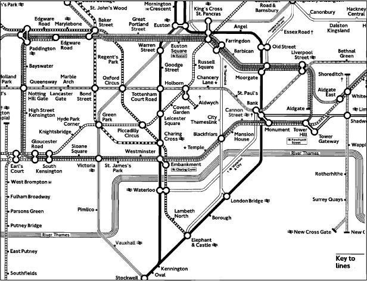
				-
			- Filter Information
				- A challenge for systems analysts is dealing with signal and noise from complex systems and users' expectations. A solution may be to build a filtering mechanism as a defense against the barrage of information
				- Analysts need to pay attention and draw out only the viewpoints of greatest interest or most relevance. This applies when we are building process models.
				- Analysts also need to filter out what is not needed at the moment.
			- Current Physical Viewpoint
				- 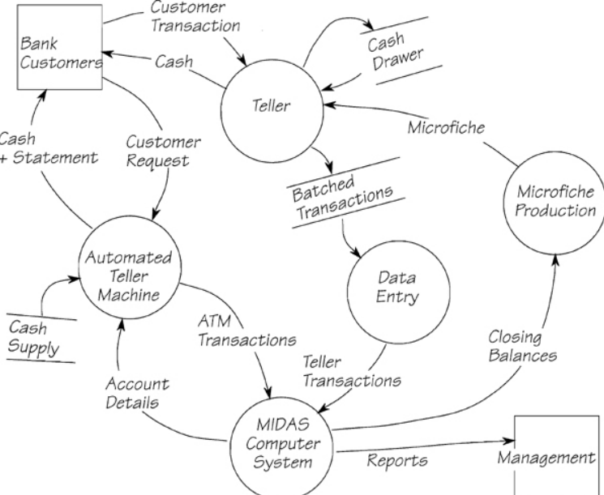
					- The current physical viewpoint focuses on a system's current implementation. It shows the systems requirements and the processors that do the work. The view usually shows departments, people's jobs, existing computer systems, and so on.
				- Provides context of the study and recognizable models. Users are more comfortable if they see models that show the people and machines currently performing the tasks.
			- Essential viewpoint
				- 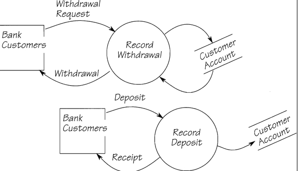
				- Considered the "perfect" view of the system. It shows only the requirements and intentionally excludes anything that exists because of the system is designed and or implmented.
				- It filters out the current technology if you are to select the best possible future implementation.
				- The essential viewpoint is necessary for any project, is the most useful and most used.
			- Data Viewpoint
				- 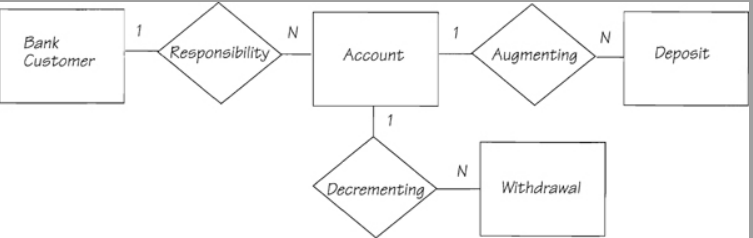
				- The data viewpoint focuses on the system's information and ignores the process part of the system in favor on modeling information that is essential to the system.
			- New Physical Viewpoint
				- The new physical viewpoint and its associated model is to illustrate, negotiate, and define the implementation of the new system by computers, humans, and machines.
			- Using the viewpoints
				- You cannot expect to get all the information you need when you need, so expect to have multiple models showing various viewpoints in different stages of completion. The the models are incomplete it will enable us to continue gathering the requirements.
		- 2.4 Adventures in Data Modeling
		  collapsed:: true
			- Try to find opportunities to reuse models previously successfully deployed
			- Learning what a system does by what it remembers
				- When you model the data you can reveal policy or the reason for storing the data, this can help us further understand the system.
					- The memory of any system reveals almost everything about it.
				- Why analyze the Stored Data?
					- The data model gives global view of the system. The system's memory is shared by most of the processes in the system and is not owned by any single process. By building a data model, you understand the policy in a broad, system-wide context, not just in isolated fragments.
					- The data model is an abstraction. It looks at the information without regard to how the data are kept and without regard to whether or not the data are intended to be part of any future computer system. This means that your view of the business is in no way limited by technological constraints
					- The data model specifies the requirements for stored data, but they are independent from the technology that uses the data.
						- The device-independent specification allows us to design files that insulate the users' application from the storage medium resulting  in a system that is more adaptable to the future.
					- The data model represents the real purpose, or business policy of the system.
						- By building the model you ensure you are asking the right questions about the policy and ensures you have a consistent view of the policy.
					- Don't reverse engineer or work backwards from a report to model the data. You must understand the underlying reason for keeping the data in the system. The reason for storing or retrieving the data is as important as the data itself.
		- 2.5 Data Models
		  collapsed:: true
			- Role of Data Models
				- Entities
				  collapsed:: true
					- An entity is a rational collection of data elements. It describes something in the real world that is important to the business. It is like a container in which you put data elements that are all about the same subject. Each container must have at least one data element. These elements, or attributes describes one entity and no other.
					- A relationship connects entities and, through the connection, expresses the business policy of the data model. It describes a business association between entities.
					- Some relationships can have attributes that can keep the time and date of the relationship creation.
					- To make the model more informative, you must give each relationship a unique name to describe the reason for the relationship's existence. Use the verb form of the word.
						- 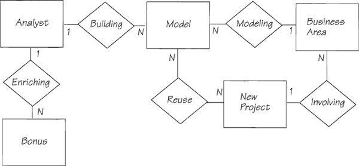
					- No foreign keys
						- A foreign key is one or more attributes that are included in one entity for the purpose of identifying one another. For example a SPONSOR has an attribute NAME to identify it.
						- Foreign keys break the rule about each each entity containing only data that describe that entity and no other.
						- Showing relationships can be addressed a later time when designing the implementation. But at this phase no foreign entities should be part of the entity.
					- Cardinality
						- Cardinality tells you how many entities of each type participate in a relationship. For example, a sponsor may choose to sponsor several ducks.
							- 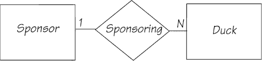
			- Building a Data Model
				- Keep in mind data modeling and process modeling are not exclusive, nor are they serial activities. Each model helps you to build the other by giving you different views of the same system, and thereby to build a complete and accurate model.
				- Finding entities
					- Definitions:
					  collapsed:: true
						- • An entity has a defined business purpose. If you can’t say what it means, you don’t need to remember it.
						- • An entity holds at least one, and preferably more than one, attribute.
						- • An entity has more than one instance. If there is only one instance, it is probably a piece of constant information that is part of the policy of a process.
						- • Each entity must be uniquely identifiable. The identifier may be made up of one or a number of attributes, or it may be a specially generated code. For example, a person’s name can be a satisfactory identifier, or in the case of the ducks, the landlord generated a number to tell them apart.
						- • An entity doesn’t have a value. For example, a telephone number is not an entity, but is an attribute of an entity.
						- •  A terminator from the context diagram may be an entity. If the system sends data to a terminator, it must at least remember the terminator’s address.
						- • A report is rarely an entity.
						- • Column headings and names in reports often are entities. So are rows and columns in spreadsheets. But remember that entities are not calculated or derived.
						- • Nouns in business descriptions are often entities.
						- • Products (toasters, tomatoes, services, and so on) often are entities, providing there is more than one such product.
						- • Roles (such as the sponsor in the duck race) are usually entities.
						- • A repeating group in a data flow or data store is usually an entity or a collection of entities.
					- Context Diagram - Attribution
						- 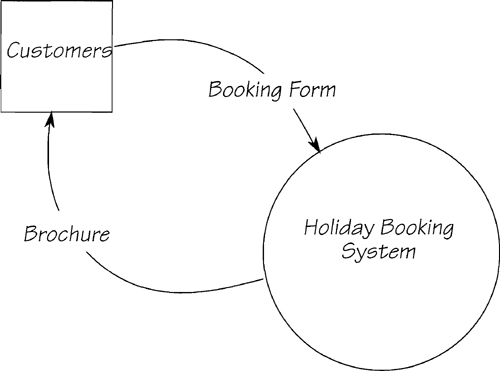
							- Context Diagram
						- All data that enter and leave the system should be show in the context diagram. Analyze the boundaries of the data flows and you'll discover all the attributes that the system must store. Determine which entity that attribute belongs to and you'll find the entity.
					- Business Documents
						- Business documents are often good sources of entities and attributes such as reports.
				- Finding relationships
				  collapsed:: true
					- The rule of thumb for finding the relationship between entities says that a relationship exists when a verb is used in a description of a business.
					- Not every verb you hear is a suitable candidate to become a relationship. A verb must describe some action that needs to be remembered, and it must describe some activity that includes two entities that form the subject and the object of the verb. Because both the subject and the object are involved in the action (“The prizes are awarded to the sponsors”), there must be a business reason to remember the link between them. The name of the relationship should reflect why the connection exists.
					- The following rules of thumb can be useful when considering relationships:
						- • A relationship is an interaction between two (or more) entities that the system needs to remember.
						- • A verb often indicates a relationship.
						- • For a relationship to exist, there must be some business policy stating the circumstances under which it is established and used.
						- • A relationship’s name reflects the reason for the association.
						- • A relationship may contain attributes, but it doesn’t have to.
						- • If a data element describes an action, it may be an attribute of a relationship. For example, SPONSORING DATE cannot be attributed to either the DUCK or the SPONSOR. Therefore, it is an attribute of the relationship between them.
						- • A relationship may be needed if there are two adjacent attributes in a form or in a file, and if the attributes belong to different entities.
						- • Consider only those relationships that are necessary for the business within your context. Ignore those that are outside the scope of your system.
						- • A relationship is the requirement for a connection between entities; it is not the implementation of the connection.
						- • Relationships are usually of the one-to-many type. If you have a one-to-one relationship, there may be no need for the second entity. If you have a many-to-many relationship, you may have missed an entity.
						- • Relationships should not be directional. The noun form of the verb (or gerund) often works.
					- Subtypes and Supertypes
					  collapsed:: true
						- There are sometimes the need to show differences and similarities between entities. This can be done through super and sub types.
							- 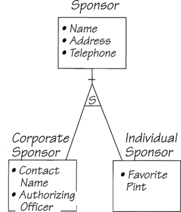
								- Figure 2.5.12: The supertype SPONSOR relates to DUCK as before. The two subtypes, CORPORATE SPONSOR and INDIVIDUAL SPONSOR, carry attributes that are unique to their specialized roles. The “S” in the triangle indicates the supertype-subtype relationship in the model.
					- Example
					  collapsed:: true
						- 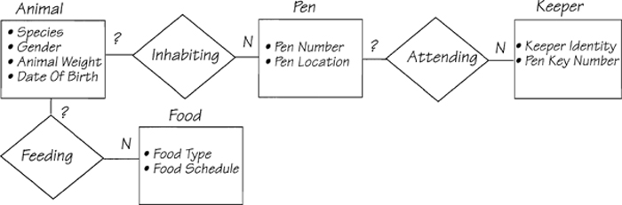
						- 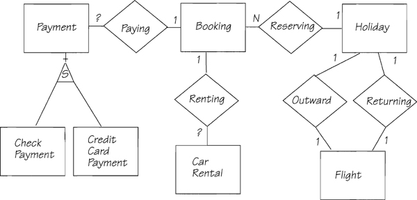
			- Exercise 1.3 - What About the Business Data?
				- A data model looks at a system from the point of view of the data stored within the context.
				- You start first with a context diagram and then a data model. You don't need to finish the context in order to start the data model.
					- The context diagram helps you focus on the scope of the system by identifying the flows of data around the boundaries and by answering the questions, "What data enter my system, and what data does my system produce?"
					- A context diagram is rarely accurate on the first attempt, but the context diagram can still aid in creating the data model.
				- The first-cut data model is not intended to be definitive and there will be opportunities to confirm and correct it. This model is a statement of what you about the business policy within context. It should contain all the entities and relationship that you believe necessary for the system to remember—the data entity must have a business purpose and needed for future reference.
		- 2.6 More on Data Flow Diagrams
		  collapsed:: true
			- The data flow diagram helps you understand the system as it serves as a model. It can become the system specifications after gaining an identical understanding of the system.
			- The Rule of Data Conservation
			  collapsed:: true
				- 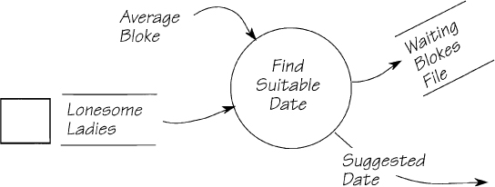
				- Each process must receive data that are both sufficient and necessary to construct its output.
			- Triggering Processes
			  collapsed:: true
				- A process can be active only when it has data to work with so it must wait for the data flow to deliver the necessary data. So the data flow triggers the process.
					- 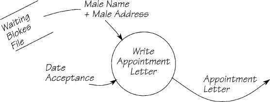
			- > The data flow diagram is a model of the system that contains only the data and functional requirements. It excludes all forms of control mechanism
				- You do not know if the control mechanism are appropriate for any future implementation of the system.
			- Composite Data Flow
				- Use composite data flows to minimize complexity, and further expand on another location such as a data dictionary.
			- Data Flows and Data Stores
				- A data flow represents data moving from one place to another.  Data flows are deposited in the store for later retrieval.
				- A data store is a static container of data.
				- 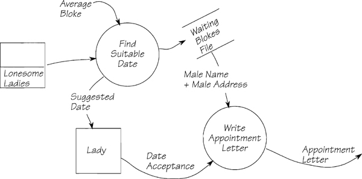
					- The system remembers the data in the store WAITING BLOKES FILE and the system uses the data when it is time to produce an APPOINTMENT LETTER.
				- A data store is valid if, between storage and retrieval, there is a delay related to the policy and the order of storage and retrieval is determined by the policy.
				- Do not confuse data stores with databases.  Records are normally stored in the database in a particular order, but that is because of a technological requirement of the particular database management system, not because of the business policy.
			- A common error
				- A data model without a process to store or retrieve data is incorrect. The storage and retrieve within the context of the system must be controlled by processes, not terminators, within context; there must be a process that says, "I'm going to remember this data" and performs the actual storage.
		- 2.7 Leveled Data Flow Diagrams
		  collapsed:: true
			- A leveled diagram allows us to control how much information is in a diagram to model a complex and large data model. Different data maps represents levels of detail that helps us navigate unwieldy models.
			- Start with creating the context diagram and then start break the system into its major components.
			- After declaring the major components and interfaces, you investigate each of them in turn. You do this through partitioning each component into its major components and declaring the interfaces between them.
			- 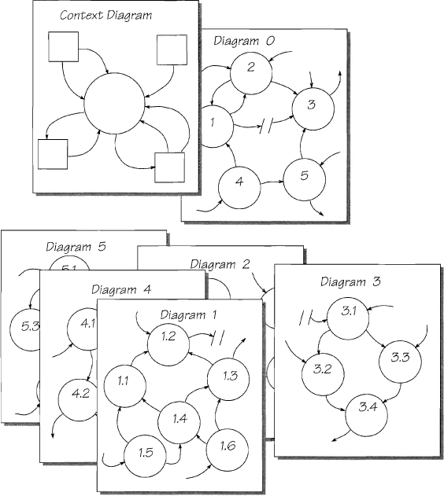
				- The top levels of the set. The context diagram declares the whole system, and Diagram 0 gives a manageable breakdown. The lower level diagrams give a breakdown of each parent bubble at the higher level. This is called a top-down level.
				- You can limit the level of detail and diagrams up to 7 plus/minus two.
				-
		- 2.8 Current Physical Viewpoint
		  collapsed:: true
			- A current physical model is a replica of the users' existing operation. It documents the existing reality.
			  collapsed:: true
				- Example: 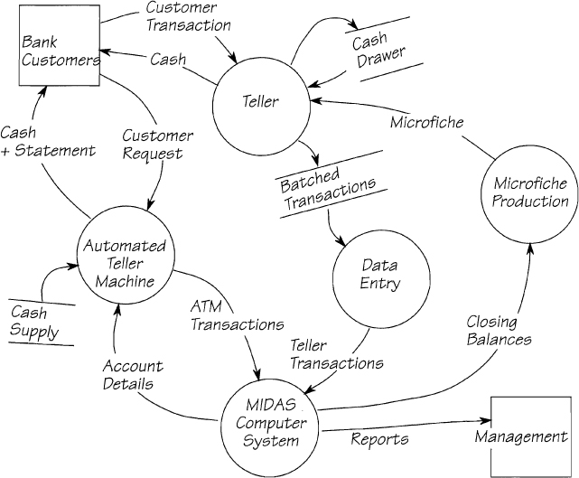
					- The current physical model for part of a bank’s operations. This model depicts the system as you would see it if you visited the bank.
			- Why Build The Current Viewpoint
			  collapsed:: true
				- > The current system may be far from perfect, but you can learn a lot from it
				- The current physical model is not the specification of the system. It is merely a way to start the analysis. When you capture the system in its current form, you collect many of the new system's requirements.
					- You gain understanding of the underlying business policy that will mostly likely remain unchanged in the future state
					- Defining the scope and boundaries of the project can arise from modeling the current process.
				- Be careful of initiating [[process improvement]] without first understanding the environment the improvement will live in
			- Gaining the User's Confidence
			  collapsed:: true
				- Users give positive feedback when we take interest in their work. It provides opportunity for the users to understand your models and verify correctness of your analysis.
				- At some point you will start to offer recommendations to your users, and they will be more confident in your recommendations if you understand the current workflow and systems.
			- Defining the Context of the Analysis
			  collapsed:: true
				- 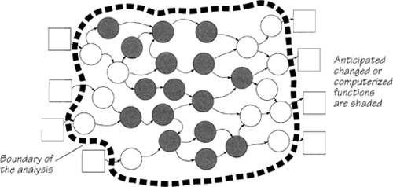
					- _The context of the system. Note how the analysis covers a much larger area than the target of change. By doing this, you ensure that the changed functionality, probably a computer system, fits exactly into the users’ business._
				- The context diagram defines the boundaries and shows how the system fits into the outside world.
				- Building the current physical model allows you to negotiate and verify the scope of the system you are about to study.
				- It is important that everyone in the team has a shared understanding of where the project starts and ends.
				- The boundaries also define the system's stored data. It is important to gain early agreement so we analyze the correct part of the business.
				- Be aware of the two types of functions:
				  collapsed:: true
					- Changed functions - existing automated functions maybe changed
					- Computerized functions - some manual processes maybe computerized/automated
				-
					-
			- Level of Detail of the Current Model
				- The current model should contain only as much detail as you need to gain a clear understanding of the system to be able to build the essential requirements model.
		- 2.9 Data Dictionary
			- Working Models
				- The best way to specify a system is to build a working model. A working model demonstrates each process in a data flow diagram is capable of manufacturing its outputs from its inputs. It also shows that each entity and relationship in the data model can supply or store the data needed by all the processes.
				- Example of data definition:
					- 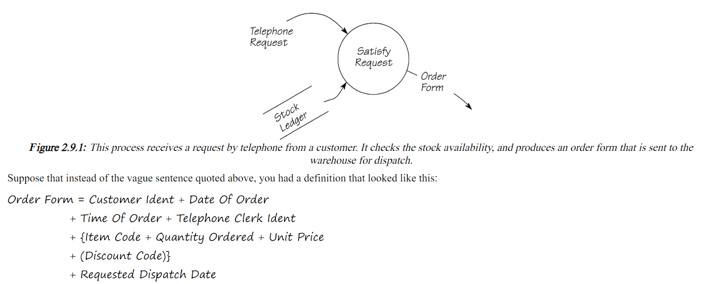
			- Defining Data Stores, Entities, and Relationships
				- Data dictionary should contain definitions of the data stores, data model's entities, and relationships
					- 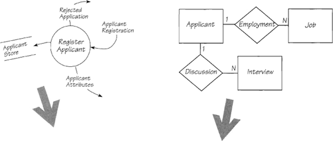
						- To complete the data dictionary that supports your data flow models, define all the stores and the flows. Similarly, to complete your data model, define all the entities and relationships.
						- Applicant = Applicant Name + Applicant Date Of Birth + Applicant Address + Date Registered + Salary Required
						  
						  Applicant Attributes = Applicant Registration
						  
						  Applicant Registration = Applicant Name + Applicant Address + Applicant Date Of Birth + Current Job + Salary Required + {Previous Job}
						  
						  Applicant Store = {Applicant Name + Applicant Date Of Birth + Applicant Address + Date Registered + Salary Required + Current Job + {Previous Job} + Interview Comments}
						  
						  Discussion = * Relationship. Cardinality: for each Applicant, there are many
						  Interviews; for each Interview, there is one Applicant. *
						  
						  Employment = * Relationship. Cardinality: for each Applicant, there are many
						  Jobs; for each Job, there is one Applicant. *
						  
						  Interview = Interview Session Number + Interview Comments
						  
						  Interview Comments = * Free text comments on the applicant and his/her
						  attitudes and aspirations *
						  
						  Job = Type Of Work + Employer Name + Date Started + Date Ended
						  
						  Rejected Application = Applicant Name + Applicant Address + Reasons For Rejection
						- Definition of data stores are enclosed by braces {} because the data in a store repeat
						- If an occurrence by the store, entity, or relationship has to be identified, it unique identifiers are underlined and placed first in the list of attributes.