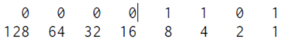

- #[[Literature Notes]]
- #[[Reference Notes]]
	- Chapter 1 - Values, Type, and Operators
	  collapsed:: true
		- Bits are any kind of two-valued things, usually described as zeros and ones.
		  Inside the computer, they take forms such as a high or low electrical charge,
		  a strong or weak signal, or a shiny or dull spot on the surface of a CD. Any
		  piece of discrete information can be reduced to a sequence of zeros and ones
		  and thus represented in bits.
		  
		  For example, we can express the number 13 in bits. It works the same way
		  as a decimal number, but instead of 10 different digits, you have only 2, and
		  the weight of each increases by a factor of 2 from right to left. Here are the
		  bits that make up the number 13, with the weights of the digits shown below
		  them:
		  
		   
		  
		  So that’s the binary number 00001101. Its non-zero digits stand for 8, 4, and
		  1, and add up to 13.
		- # Values
		  Are numbers, strings, functions...
			- ## Numbers
				- JavaScript is limited to storing numbers into 64 bits
				- Numbers also represent NaN and Infinity.
					- NaN stands for not a number
			- ## Strings
				- Strings are data types used to represent text. The text are enclosed in quotes
				- You can use single quotes, double quotes or backticks to mark strings.
				- You can include quotes  as strings using the backslash (e.g., "Bob\'s")
				- Strings can't be divided, multiplied, or subtracted but the + operator can concatenate them
				- You can embed other values using template literals
					- ```JS
					  'half of 100 is ${100/2}' //half of 100 is 50
					  ```
			- ## Unary Operators
				- Not all operators are symbols, they can also be written as words
				- ```JS
				  console.log(typeof 4.5) //number
				  ```
				- Operators that work on two values are called binary operators, while operators that work on one is called a unary operator
			- ## Boolean Values
				- Two values of true or false
				- You can produce boolean values through comparison
					- ```JS
					  console.log(3 > 2)
					  // → true
					  console.log(3 < 2)
					  // → false
					  
					  console.log("Aardvark" < "Zoroaster") //Strings can also be compared
					  // → true
					  
					  console.log("Itchy" != "Scratchy")
					  // → true
					  console.log("Apple" == "Orange")
					  // → false
					  ```
					- NaN does not equal itself
						- ```JS
						  console.log(NaN == NaN)
						  // → false
						  ```\
						- You can check using
							- ```JS
							  Number.isNaN(0);
							  ```
			- ## Logical Operators
				- and, or, not
				- ? - ternary or conditional operator
					- ```js
					  console.log(true ? 1 : 2);
					  // → 1
					  console.log(false ? 1 : 2);
					  // → 2
					  ```
					- Given a set of conditions separated by the colon it will pick the right if the condition is left or the right if the condition is false
	- Chapter 2 - Program Structure
		- Calling a function is called invoking, calling, or applying it
-
-