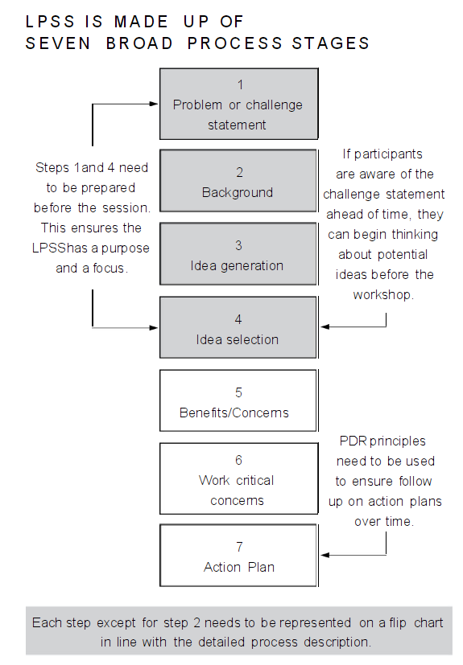
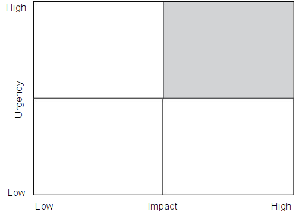
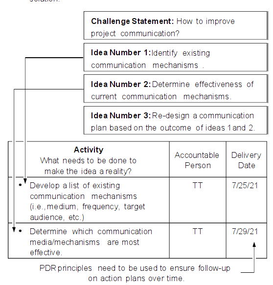
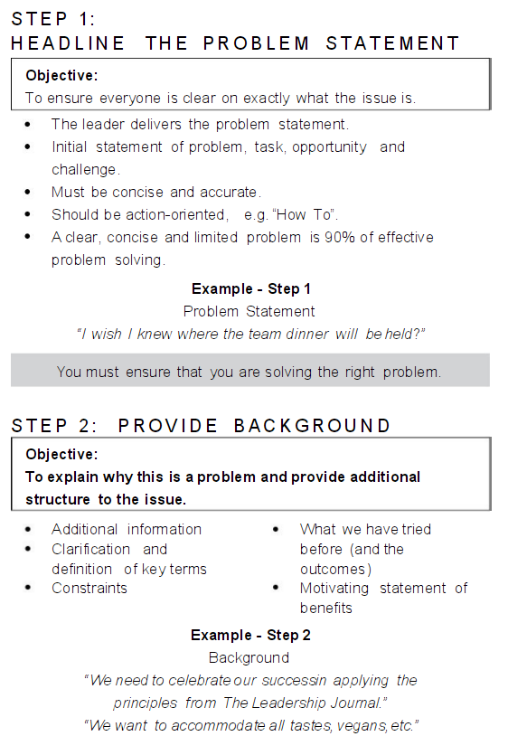
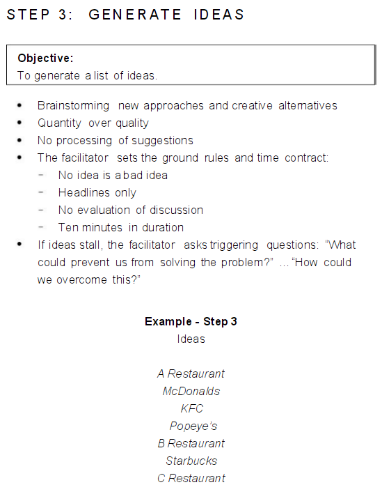
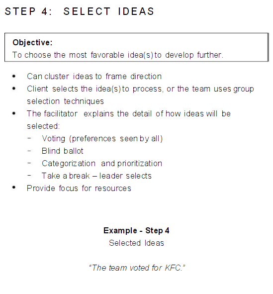
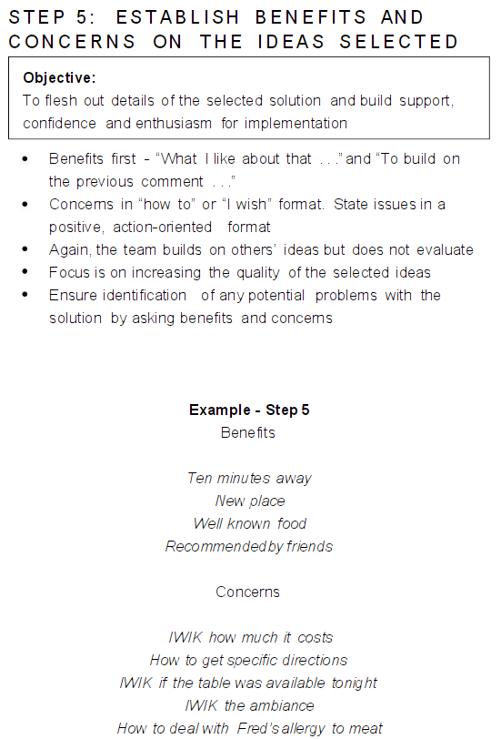
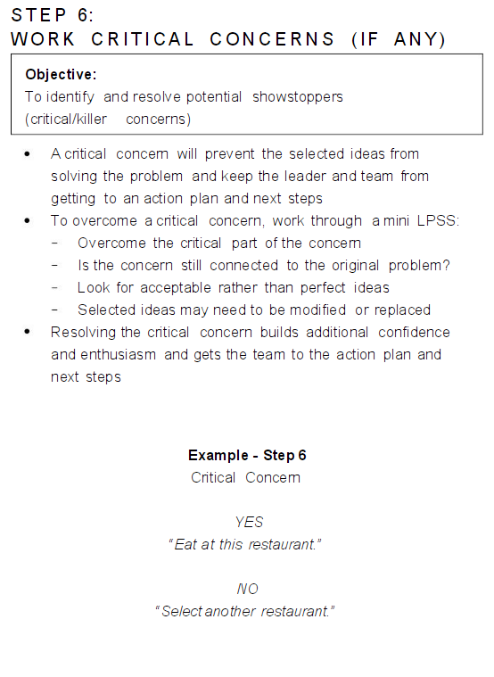
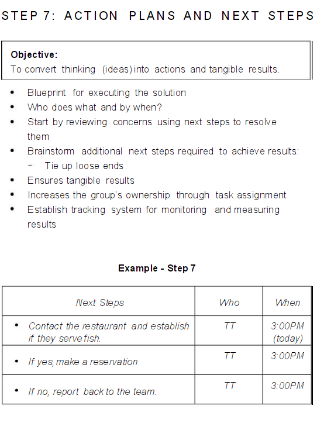
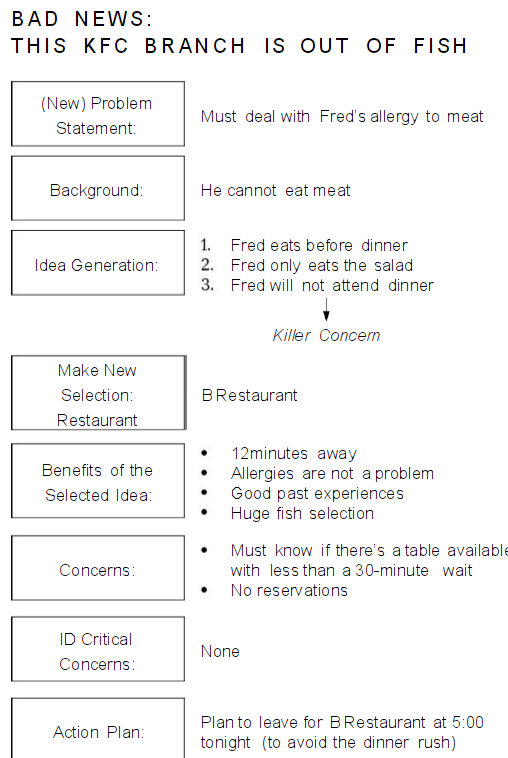

- **tags:** #Leadership #[[Q - How to run a meeting]] #[[Q - How do I run a workshop?]]
- **author:** [[Kris Safarova]]
- **status:** #reading
- **link:** [Amazon](https://www.amazon.com/Leadership-Journal-management-consulting-McKinsey-ebook/dp/B09MR6MD7D/ref=sr_1_1?crid=3JTQOJES0WTCS&keywords=the+leadership+kris+safarova&qid=1646795152&sprefix=the+leadership+kris+safarova%2Caps%2C152&sr=8-1)
- #[[Literature Notes]]
- #[[Reference Notes]]
	- Client Case Study
		- Not living a full and true life is a draining process.
			- Comment: Living a life that is fulfilling someone else's desire like your parents wanting their child to be a lawyer or doctor.
			- Ignoring your own needs is an enormous drain of energy and living for others can place you in an environment that you don't want to be in and make choices that you don't want to make.
	- Plan Do Review #[[Q - How to run a meeting]]
		- 
		  collapsed:: true
			- Highlight:
				- Prioritize your problems
				- Pay attention to problems that Leadership maybe interested in
				- Communicate up, down, and across
		- 
			- Highlight:
				- Report completed actions
				- Report root cause information
				- Constantly review business projects or key issues
				- Follow-up
		- 
		- 
		- 
		- 
		- The review of performance is an integral part of the PDR Cycle and is key to making it work
			- The PDR meetings must adhere to a structured agenda
			- The PDR meetings are held regularly at the earliest practical time after the period under review
				- The frequency of meetings is governed by the speed with which adverse variances require a response in order to meet the KPI targets of the business
			- The PDR meetings are fact-based (i.e., numerical actuals vs targets) but forward looking (i.e., What can we do about it? Whare are we doing about it?).
			- Participants in a PDR meeting must be thoroughly prepared, understand the numbers and consider the actions they will take to resolve variances
			- The outputs of the PDR meetings are agreed action plans or next steps to address variances and, from time to time, new agreed targets.
		- Meeting Agenda Example
			- 
		- Specific Roles and Responsibilities for PDR team members
			- PDR Owner
				- Set agenda/objectives
				- Solicit reports from participants
					- Probe for more information as needed
				- Guide group through problem-solving
				- Assign/ensure ownership of next steps
				- Follow up on completion of next steps
					- From previous meetings
					- In between meetings
				- Role model effective behaviors during a meeting
					- Leadership problem-solving attitude
					- Recognize good performance
					- Ensure accountability
			- PDR Participants
				- Come prepared
					- Results against measurements
					- Understanding of variances
					- Recommended next steps
					- Help needed
					- Hypothesis
				- Accept/document/own next steps
				- Role model effective behaviors
				- Participate in problem solving
			- PDR Facilitator
				- facilitates initial PDR sessions to ensure PDR/meeting process is followed.
					- preparation
					- actual meeting
					- review and follow up
				- follow up with participants to support completion of next steps
				- continually assess PDR process against  "what good looks like."
					- feedback in meeting when appropriate
					- review session with managers afterward
					- provide off-line  feedback to participants as appropriate
				- coordinate with other PDR coaches
					- integration of KPIs as needed
					- sharing lessons learned/help needed
				- role model effective behaviors
		- Good Meeting Manners are Essential for PDR Meetings
			- Headline all ideas. Leave out the details.
			- Look for solutions rather than blame.
			- Be positive
			- Listen to what others have to say.
			- Take a "how to do it" vs. "we can't do it" attitude.
			- Observe time contract.
			- Build on others' ideas.
			- Use the "how to" (H2) and "I wish I knew" (IWIK) action phrases
			- Stay focused
			- Set up win/win situations
			- Remember that no idea is a bad idea—keep an open mind
		- Establish PDR Ground Rules
			- Examples of ground rules:
				- Openness and honesty
				- Practice what you preach
				- Structured meetings - follow the agenda
				- Supportive team work - support during bad times
				- Shout when support is needed
				- Commitment to next steps - finished by given date
				- Punactuality
				- Keep to deadlines
				- Be creative - use imagination and resources
				- Support creativity - don't shoot ideas down without reason
				- Good manners and respect for each other
				- Think about consequent results
				- Adhere to good meeting behaviour
			- Establish your team's own ground rules
		- How to obtain the best from PDR Meetings
			- hold regular meetings
			- adhere to a structured agenda
			- team members must be thoroughly prepared for the meeting (do your homework)
			- focus on deviations and seek solutions
			- bring information in; take actions out
			- PDRs should be action oriented, with assigned responsibilities and deadlines
			- Don't try to resolve complex problems in PDRs. Instead assign someone to resolve problems outside of the meeting using LPSS.
		- Expected benefits from a PDR process are focused on key issues and shared team commitments
			- Improved:
				- accountability
				- speed of corrective action
				- performance in relation to company goals
				- motivation
				- quality of forecasts and targets
				- teamwork and capability building
			- results in
				- Increased personal satisfaction
				- Increased customer satisfaction (internal and external)
				- Improved market performance
				- Improved financial performance
	- Tool No. 1 Expectations Exchange and Ground Rules
	  collapsed:: true
		- Process 1: Expectations Exchange
			- An exercise provides an interactive process for a team to express their needs, and it's a critical success criteria or a pending workshop or a group sessions.
			- This allows the team to put criteria that will indicate a successful workshop, or session, on the table.
			- These are not usually used for routine meetings, but they can be used effectively
		- Process 2: Ground Rules
			- Establishes the team practices, attitudes, and values, etc., that are typically necessary to guide interaction of participants during the session or workshop
		- Participants do not need to know anything about the workshop for them to have expectations about its outcome.
	- Tool No 2: Benefits, Opportunities, Parking Lots and Next Steps
	  collapsed:: true
		- Benefits
			- What benefits did participants receive from the meeting/workshop?
			- Use after completing any activity/workshop that needs to be reviewed and documented
		- Concerns
		  collapsed:: true
			- What were the participant's concerns from the meeting/workshop?
			- Use after completing any activity/workshop that needs to be reviewed and documented
		- Learnings
		  collapsed:: true
			- What did participants learn from the process that could be used for future reference?
			- Use after completing any activity/workshop that needs to be reviewed and documented
		- Next Steps
		  collapsed:: true
			- What action steps emerged out of the meeting/workshop, who should be involved in completing the next step, and when should the step be completed?
			- Use this tool after completing a meeting/workshop to
			  ensure that all items "still to be actioned" or "points of
			  action already  agreed" are documented with accountabilities
			  and delivery time frames.
			- Use this tool when parking lot issues are converted to next
			  steps.
			- Use this tools when next steps can be used:
				- Formal meetings
				- Meetings between two people
				- Group presentations
				- Installation for a piece of machinery/equipment
				- Problem-solving sessions
		- Parking Lot
		  collapsed:: true
			- What issues came up during the meeting/workshop that cannot be resolved during the session but need to be discussed at another more appropriate forum.
			- Use when during a meeting/workshop to record issues so they can be represented at a more appropriate time and forum
		- Objectives of these tools:
		  collapsed:: true
			- Systemize feedback about that has happened during the activity or workshop with the intent to do something about the concerns that have emerged
			- Provide a process of establishing the activity/workshop successes and identifying the areas of learning as well as opportunities, or areas of improvement on completion of the activity/workshop
			- Ensure work activities are reviewed and both the positive and negative aspects of the interaction are noted, people celebrate their successes and take responsibility for their opportunities
		- Steps of running a workshop or meeting
			- Step One The Meeting/Workshop Structure
			  collapsed:: true
				- At the beginning of every meeting or workshop, review the previous meeting's next steps.
				- At the end of every meeting or workshop allocate time to identify benefits, learning items, concerns and next steps from the current meeting
				- The meeting or workshop ends when the next steps are captured from the concerns, assigned to a person and given a delivery timeline.
			- Step Two - Detail the Benefits
			  collapsed:: true
				- At the end of the meeting  review the benefits. Ask questions like "What benefits came out of the interaction, meeting or workshop? What worked well for us today?"
			- Step Three - Detail the Learning Steps
			  collapsed:: true
				- Learning items refer to things we learned throughout the meeting process that we would like to capture to access for future use. We want to ensure we don't make the same mistakes, and we want to be more efficient and effective
				- After completion of benefits move on to learning items. Ask "What did we learn from the meeting process or interaction?" or "What didn't work well that we should be aware of next time?"
				- Follow the same process as the benefits
			- Step Four - Detail the Concerns
			  collapsed:: true
				- Ask "What are your concerns regarding the meeting/workshop or interaction ?"
				- Concerns are always viewed as opportunities to do something or to action something as a remedy.
			- Step Five - Details the Next Steps
			  collapsed:: true
				- Do this at end to address the concerns listed in the previous step
				- When concerns are raised try to circle back with the ones who raised them to see if they had ideas to address them in the first place.
					- Assign the next steps once agreement on a path forward is reached and give a delivery date
			- Step Six - Parking Lot
			  collapsed:: true
				- Close out the parking lot items as Next Steps
			-
	- Tool No 3: Check-In and Check-Out
	  collapsed:: true
		- Definition of check In:
			- Useful way to orient and sensitize participants to what each person brings to a particular interactive work sessions. We invite participants to talk briefly about their most recent experiences.
			- This tool should be used sparingly—regular and repetitive use will diminish its effect. Check-ins are best used at major milestones.
		- When to use check-ins: start of meeting series and workshops. Use them at the end of long workshops.
		- Uses of check-ins:
			- To surface the feelings, thoughts, and attitudes that participants hold and bring into the session
			- Identify the issues which need to be worked during the event
			- To surface potential areas of conflict and sources of anxiety among participants
	- Tool 4: Leadership Problem-Solving Session #[[Decision Making]]
		- Offers a structured framework and systematically involves all present in generating ideas on how to address the issue at hand
		- When to use:
			- When problems can't be solved or no decisions made quickly
			- Multivariable and complex
			- Disagreement between parties
			- 
				- The Problem or Challenge Statement
				  collapsed:: true
					- The facilitator and meeting owner must agree on the following before hand:
						- The problem or challenge statement:
							- The problem statement is a statement of the task, opportunity, or challenge that the meeting owner faces and wants resolved.
							- The problem statement or challenge needs to be expressed with an action orientation - (e.g., "How to improve the synthetic)
							- It must be concise and accurate
						- The decision criteria:
							- The criteria to be used (during step 4) will determine which of the ideas generated in step 3 are acceptable and which are not. What works well is to prioritize ideas (examples of possible prioritize)
						- The agenda, time contract and participants:
							- The meeting owner will also set the context in which the problem statement was derived.
						-
				- The Background of the Problem / Challenge Should Consist Of:
				  collapsed:: true
					- Historical and contextual information (i.e., "When did the issue first manifest?" ... "What is it connected to?" ... "What are the patterns of interdependence at play to date?" etc)
					- Clarification and definitions of key terms
					- Identification of the key constraints
					- An outline of what has been tried before and what the outcomes were (i.e., success vs failures; what have the learning items been? etc.)
					- An outline of what the quantified and non-quantifiable benefits would be in solving the problem - challenge (i.e., this acts as a motivator.)
				- How to Generate Ideas
					- Encourage:
						- No idea is a bad idea
						- Think outside the box
						- Don't be bound by logic
					- The facilitator needs to help group to think beyond the obvious, the comfortable and the safe. The more alternative ideas about what to do in order to address the challenge statement, the better.
					- Emphasis must be made on idea generation and not discussion of their relative merits. For the ideation phase, emphasize quantity over quality to encourage to participants raise ideas they may not support or believe in.
					- The objective is to move participants out of their fixed views and approach the problem and challenge in a multi-faceted point of view.
				- Idea Selection
					- Prioritize
					  collapsed:: true
						- Establish which prioritization matrix works best for the challenge statement under review
						- Place each of the ideas into prioritization matrix
						- The following can be used in combination to represent dichotomies in a two-by-two prioritization matrix (i.e., high vs low)
							- Urgency (timing)
							- Criticality (importance)
							- Level of operationality
							- Level of strategic focus
							- Impact (quick win or needs more work)
						- Focus on the ideas in the top right quadrant
							- 
						- Some ideas can be categorized into themes
					- Success Criteria (agreed to before the meeting)
					  collapsed:: true
						- Example criterias:
							- Cost-effectiveness
							- Availability of or necessary to use local labor
							- How visible the activity will be to the rest of the organization
							- The ease of implementation, etc
						- Each idea in the "star" quadrant may need to be judged against the above criteria in order to select or prioritize the top ideas or categories
						- > The objective of this phase is to provide focus for the team members
				- Benefits and Concerns
					- An analysis of the ideas that pass the prioritization and success criteria test must be conducted. (i.e., what are the benefits and concerns with respect to those ideas which have passed through the preliminary filters?)
					- The member(s) who raised the idea in question need to talk about the potential benefits and concerns related through the preliminary filters?)
						- Benefits include: What seems to be positive? What are the advantages? etc
						- Concerns include: What is the problematic, typically framed as as "How to" or "I wish I knew" statement
					- Critical concerns are highlighted
					- > The objective of this phase is to encourage an interrogation of the possible flaws in ideas that, on the face of things, seem appropriate.
				- Work the Critical Concerns
					- Participants identify those critical concerns which, if not resolved, would necessitate modifying or discarding the idea or solution
					- The facilitator encourages discussion, around the constraints in achieving the desired solution
						- This can be handled as a mini-LPSS
					- If a critical problem cannot be overcome, it might be necessary to shelve the idea and select another as a way forward
					- Ideas are finally evaluated (bearing the benefits and concerns listed above)
				- Action Plan
					- Ideas that pass through the stages need to be converted into action plants—the blue prints for executing the selected solution
					- 
					- Example:
						- 
						- 
						- 
						- 
						- 
						- 
						- 
						-