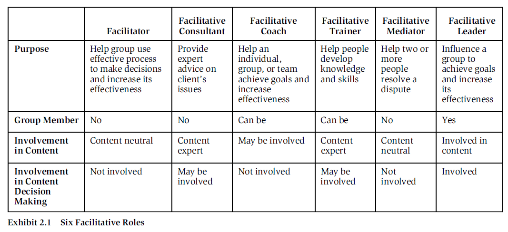
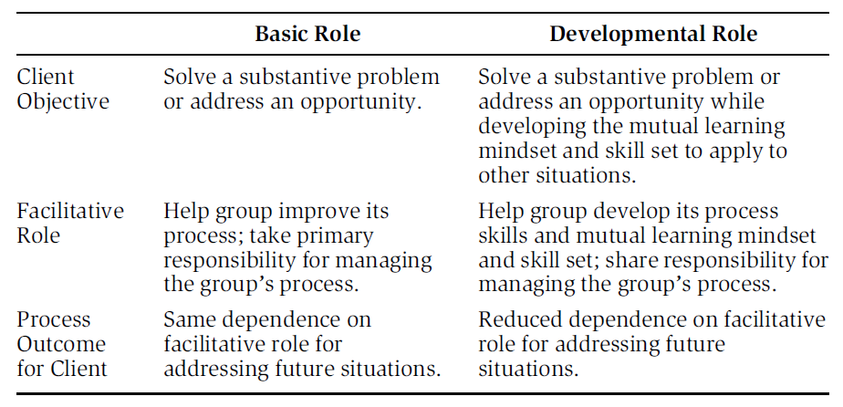

author:: [[Roger Schwarz]]
tags:: Reading #[[Q - How to run a meeting]]

- #[[Literature Notes]]
- #[[Reference Notes]]
	- Chapter 2 - The Facilitator and other facilitative roles
		- 
		- Defining the facilitator role:
			- A group facilitator is a person who is—
				- Not a member of the group
					- You can't be both the facilitator for a group you're a member of because you can't be completely neutral about issues in your group. To be considered as a facilitator, the group members must consider you to be a third party
				- Is content neutral
					- Facilitate discussion so group members cannot infer your view on the group's topics
					- Does not influence the group's decisions, directly or indirectly.
					- To remain neutral requires listening to members' views and remaining curious about how their reasoning differs from others (and from your private views) so you can engage in productive conversation.
					- The facilitator is actively participating on group facilitation content
				- Has no decision-making authority or input
				- Is acceptable to all the members of the group and
				- Diagnoses and intervenes in a group
					- A facilitator works with the entire group. You watch the group in action, diagnose what is happening, and intervene to help the group become more effective in problem-solving and decision making processes
				- Help it improve the processes by which it identifies and solves problems and make decisions, in order to increase the group's effectiveness
					- The facilitator is a content neutral but also process expert and advocate. As a process expert you know what kinds of mindset (values and assumptions), behavior, process, and underlying structure are more or less likely to contribute to high-quality  problem solving and decision making, and contribute to the three results of effective groups: performance, working relationships, and individual well-being.
					- You advocate that the group adopt a mindset and behaviors that improve its effectiveness. For all of these decisions about the facilitation process you are a partner with the group
					- You show transparency what you believe makes effective group processes. You tell your clients that you will be modeling the mutual learning mindset and behaviors  and ask them if they believe you're acting incongruently with them.
		- Don't choose to be the facilitator role unless it's absolutely necessary
			- It is difficult or impossible to be neutral
		- The facilitative leader role
		  collapsed:: true
			- You can be a facilitative leader whether you are the formal leader of the group, a group member, or an individual contributor.
			- It is a difficult role because it requires balancing between being an active participant of the content and also acting as the process expert of facilitation. It can become difficult to remain curious of others' opinions and perspectives of the content.
		- Basic and Developmental type of roles
			- Basic type is you're giving a person a fish while developmental type is you're teaching  a person to fish.
			- 
			-