- tags::  agile, user stories
- **author:** [[Jeff Patton]]
- **status:** #[[📥inbox]]
- **link:** [User Story Mapping: Discover the Whole Story, Build the Right Product 1, Patton, Jeff, Economy, Peter, Economy, Peter, eBook - Amazon.com](https://www.amazon.com/User-Story-Mapping-Discover-Product-ebook/dp/B00NF07FHS/ref=sr_1_1?crid=33IMFE007DJD5&dchild=1&keywords=user+story+mapping&qid=1632446148&sprefix=user+stor%2Caps%2C162&sr=8-1)
- #[[Literature Notes]]
- #[[Reference Notes]]
	- Intro
	  collapsed:: true
		- Stories aren't requirements; they're discussions about solving problems for our organization, our customers, and our users that lead to agreements on what to build.
		- > Shared documents aren't shared understanding.
			- Build Shared Understanding
				- Get together, talk, and ask each other questions. Give each other time to explain our thoughts with words and pictures, we build shared understanding.
			- > The real goal of using stories is shared understanding.
				- Employing user stories in lieu of documenting is ineffective. It takes talking, sketching, writing, and working with sticky notes or index cards to get the full picture.
			- > To help remember, photograph and shoot short videos of the results of your conversations.
		- Software isn't the point
			- We care too much about the output because it is measurable. While output is necessary to track for keeping in schedule, we also need to pay attention to our outcomes. Outcome is what happens when things come out, and it is difficult to measure and quantify. Our goal isn't just to produce a new product, but to improve someone's life. That positive change and impact is an outcome measurement.
		- Build Less
			- > There's always more to build than we have time or resources to build—always.
			- > Minimize output, and maximize outcome and impact.
			- We are often tempted to go faster and increase output because we have so many user stories to develop, but it may be a better idea to build less and instead increase our impact.
				- Pay attention to the needs of the users and what functionality is the most impactful (best outcome)
	- Chapter 1 - The Big Picture
		- #Takeaways
			- User story mapping helps everyone participating understand the big picture.
				- End users get to know the end to end process and what role they play in the larger context of their workflow in a visual manner
					- (How can we replicate this in a virtual environment that's easy for users to understand)
				- End users and stakeholders need to understand the interdependencies of their workflow.
			- First think in the big picture and make sure you understand the breadth of the problems space—like must haves, end users, and stakeholders.
		- _In 2001 I left the team I was on and started doing things differently (in the past each story was atomic and sprint specific that lost its context from the big picture). I and my team, tried an approach to writing stories on the big picture. We worked to understand the product we were building and to make tradeoffs together. We used that bunch of index cards with story titles to organize our thoughts and break down that big picture into the small parts we could build next._
			- Story mapping is a pattern that helps people think of the product or function as a whole and understand the context.
		- Think. Write. Explain. Place
			- **When working with a team to build a story map or having a discussions about anything, create a simple visualization to support your discussion.**
			- Get in the habit of writing down a little about your idea before explaining it so it doesn't vaporize after the meeting or discussion.
				- Write down a few words about your idea immediately after thinking it.
				- Explain your idea to others. Use big gestures. Use more pictures. Tell stories.
				- Place your idea into a shared workspace where everyone can comment and see.
		- > Story maps are for breaking down big stories as you tell them.
		- > Mapping your story helps you find holes in your thinking.
		- > Focus on the breadth of the story before diving into the depth.
			- 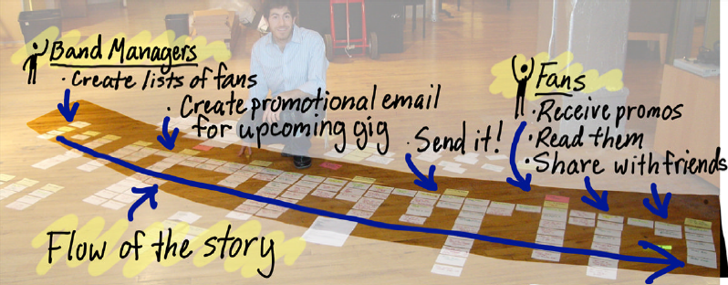
			- 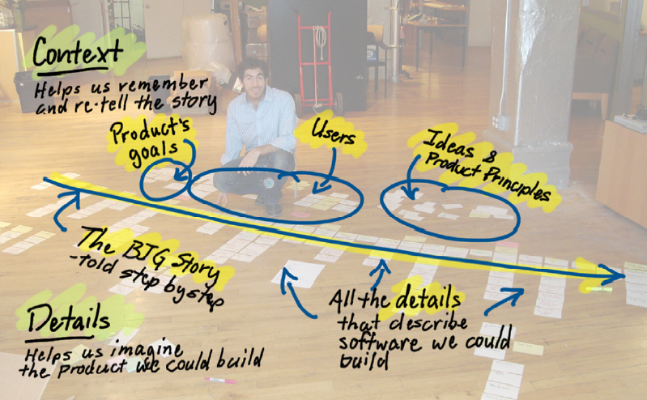
			- **The vision is always bigger than all the resources we have in place. So our aim shouldn't be to build it all but to minimize the amount we build.**
				- To do this pick a user that would benefit everyon5e the most or a functionality that will create the most value.
		- Frame your idea
			- Ask questions like (to find the outcomes)
				- Why are you building his?
				- What are the benefits for you and for the people who will use this?
				- What problems does it solve for the users?
		- Describe Your Customers and Users
			- List the possible different types of users who will use your software
			- What are the benefits for each user and why they would use it the product and what we think they'd do with it.
		- Explore Details and Options
			- After we’ve got the breadth of the story map in place, it starts thickening up. The cards we put at the top of each of the columns in the map become big things, and then the details break down below them. We stop at each step in the user’s story and ask:
				- 
				- What are the specific things they’d do here?
				- What are alternative things they could do?
				- What would make it really cool?
				- What about when things go wrong?
	- Chapter 2 - Plan to Build Less
		- Map for a product release across multiple teams to visualize dependencies.
		- Anatomy of a Big map
			- 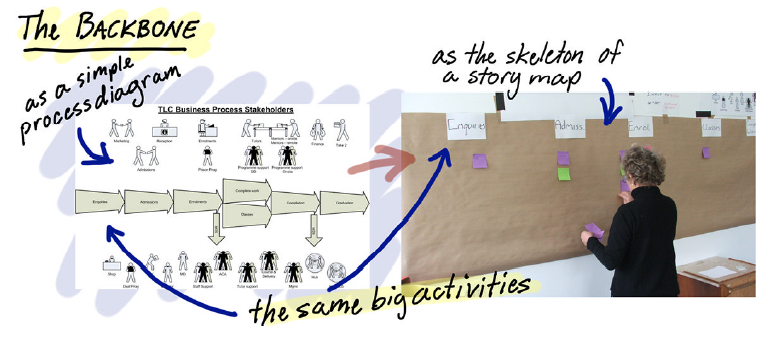
			- 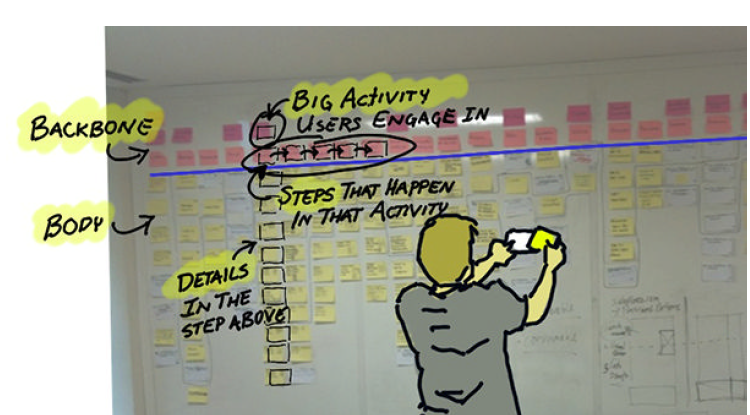
			- 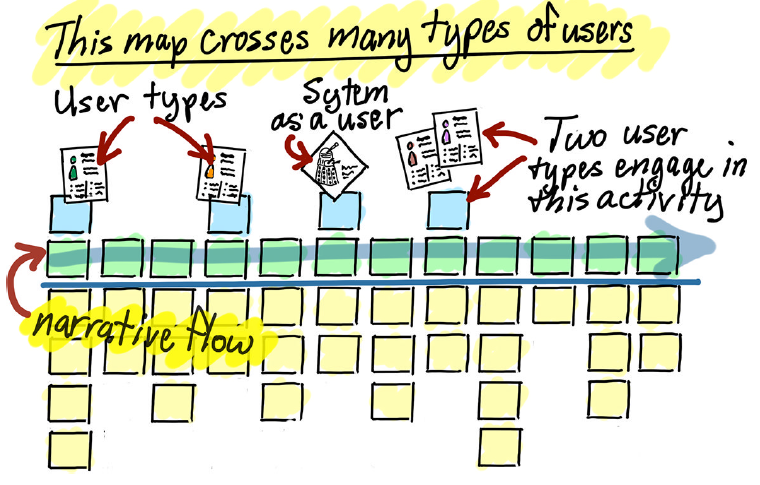
			- The backbone sits at the top of the map, which can contain several levels.
				- The level may start with the basic flow of the story, but you can go up a level to summarize things further.
				- When you read the backbone from left to right, it should tell a story about all the people who are part of the workflow and what they do
					- Systems are also treated as users of the system (It's OK to anthropomorphize your system)
		- Mapping helps you spot holes in your story
			- After building out the map of your solution. The group should start to ask "What if" and "What about" questions.
			- Scope doesn't creep, but our understanding of the workflow and requirements of the systems grows.
		- **Focus on what you hope will happen outside the system to make decision what's in the system.**
			- What are the big mission drivers that drives the need for the system?
		- Slice out a minimum viable product release
			- 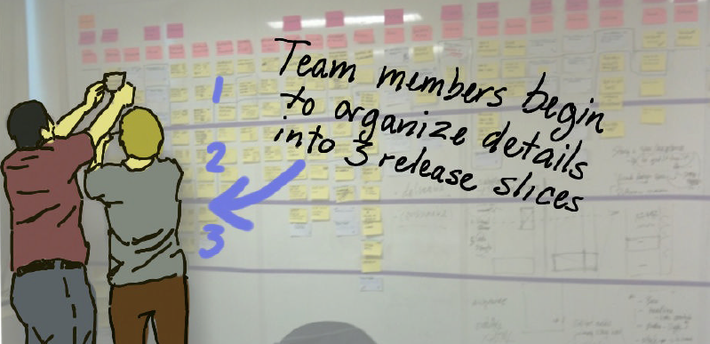
			- **Focus on the outcomes—what users need to do and see when the system comes out—and slide out releases that will get you those outcomes.**
				- 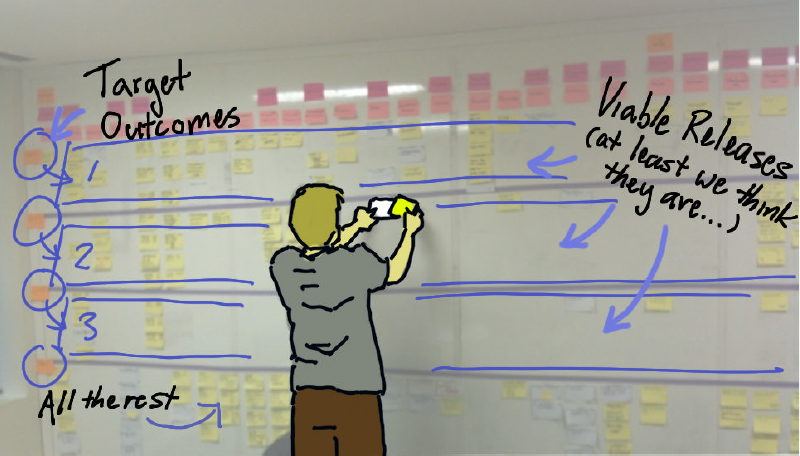
				- Create a release roadmap that has specific targeted outcomes for each release cycle.
		- Don't prioritize features—prioritize outcomes
			- Break down big outcomes into smaller, specific, and focused outcomes
		- Defining the word MVP
			- Bad definition: Minimum viable product is not the crappiest product you could possibly release
				- Only usable if the users had a high threshold for pain.
			- Good definition: _The minimum viable product is the smallest product release that successfully achieves its desired outcomes._
				- Minimum is subjective, so be specific about who your customers and users are, and what they need to accomplish.  What's minimum to them? It's not about you.
				- **Revised definition: _The minimum viable solution is the smallest solution release that successfully achieves its desired outcomes._**
					- However, we are just guessing what that solution is. The problem with outcomes is that we can't observe them until the solution comes out. We're only guessing what that outcome will look like before hand.
			- **Good definition 2: _A minimal viable product is also the smallest thing you could create or do to prove or disprove an assumption._**
				- The smaller our assumptions we can test, the less impact we'll have to incur because the failure is small.
	- Chapter 3 - Plan to Learn Faster
	  collapsed:: true
		- Product owners not only come up with ideas to improve the solution, they also will champion and execute other people's ideas to create more value and success. 
		  collapsed:: true
			- **The best product owners help the entire team take ownership of the product.**
		- Start by Discussing the opportunity
		  collapsed:: true
			- Build a shared understanding with others in the organization before taking ownership of the opportunity. The opportunity could be the initial product or an additional functionality planned for later release.
			- Your first story discussion is for framing the opportunity
		- Validate the problem
		  collapsed:: true
			- Spend time talking to your customers and get to know them so you can find out if the problem really is a problem and if they will consider using the solution proposed. **Validate if the problem you're solving really exist and is creating value.**
			- Examine if there are other problems that needs to be solve first.
		- Prototype to learn
		  collapsed:: true
			- Use wireframe and higher fidelity models to ensure your solution is valuable and usable.
			- Watch out for what people say they want
				- Learn to test what your end users say they want as those wants can change quickly and they're guessing too. Users might ask for something that they end up not wanting and in fact need something they haven't asked for.
		- Build to learn
			- Build something less than minimal—just enough that potential users could do something useful with it.
			- Be careful of polite users that say they like the product but don't actually use it or the opposite spectrum where they give you so many bugs and complaints but use it anyway.
				- Use metrics to measure the value of your solution.
			- Iterate until Viable
			  collapsed:: true
				- Because you've built something less than minimal at this stage ensure that you are iterating until it reaches usability and creates value
				- 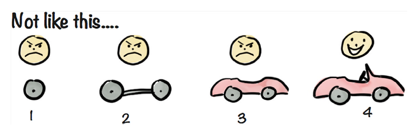
					- This is a simple visualization made by my friend Henrik Kniberg. It beautifully illustrates a broken release strategy where at every release I get something I can’t use, until the last release when I get something I can.
				- 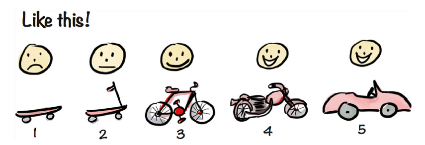
					- If I plan my releases this way, in each release I deliver something people can actually use. Now, in this silly transportation example, if my goal is to travel a long distance and carry some stuff with me, and you gave me a skateboard, I might feel a bit frustrated. I’d let you know how difficult it was to travel long distances with that thing—although it was fun to goof around with it in the driveway. If your goal was to leave me delighted, you might feel bad about that. But your real goal was to learn, which you did. So that’s good. You learned I wanted to travel farther, and if you picked up on it, you also learned I valued having fun.
				- Treat every release as an experiment and be mindful of what you want to learn. For every release know what questions and assumptions you have validated and answered.
				-
				-
		- Validated Learning Loop
			- 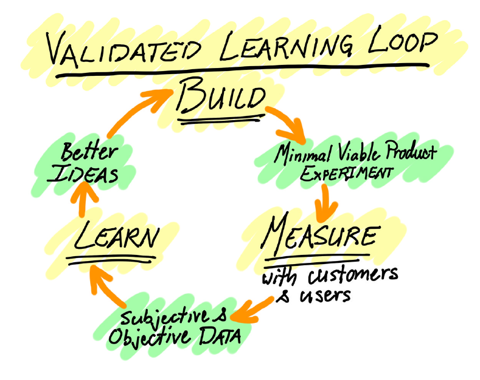
			- Each release we should intentionally learn something from our sprint experiment that brings us closer to the minimum viable product. Our goal isn't to get something built, but to find out if we're building the right thing.
		- Minimize your Experiments
			- Minimize what we build so we can focus on what we need to learn. This means we maybe building things not production ready. If it is production ready, then we've done too much.
	- Chapter 4 - Plan to Finish on Time
	  collapsed:: true
		- Map only what you need to support your conversation
		  collapsed:: true
			- Make sure you build a shared understanding with your team so they can point out problems,  provide opportunities for improvements and resource estimation.
			- 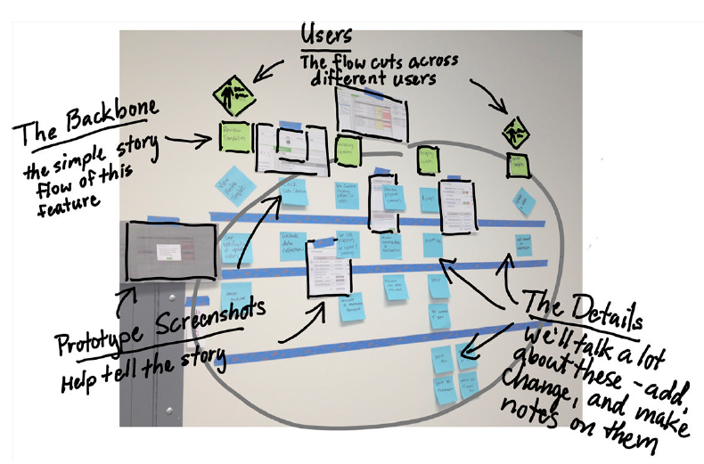
			-
		- The best estimates come from developers who really understand what they're doing—so ensure that everyone on the team has the same understanding of what you're trying to do.
		- Expose risk in your story map by exposing them in the story map 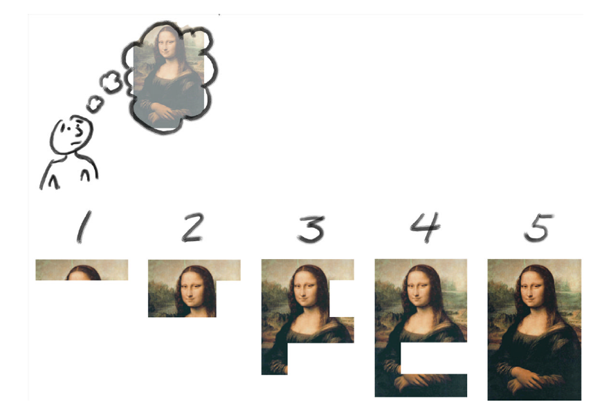
			- You might start with what you believe is a clear vision of the painting in your mind. Then you break up the painting into its parts. Let’s say you had five days to paint this painting. Every day you’d paint more parts. At the end of day five, huzzah!—you’re done! What could be simpler?
			- Only, it doesn’t work like that—at least not for artists. This way of creating things assumes our vision is correct and accurate. It also assumes something about the skill of the creator and her ability to precisely define parts without seeing them in context. If you do this in software development, it’s called an incremental strategy. It’s the way a bricklayer might build a wall. And it works if each piece is as regularly sized and well defined as a brick.
		- 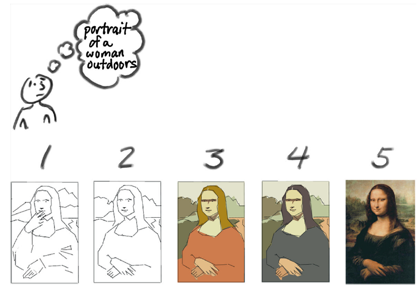
			- Even da Vinci would probably acknowledge that his vision wasn’t perfect, and that he’d learn something as he was creating the painting. On day one, I imagine he first sketched the composition, or maybe did a light underpainting. I can imagine him at this point making changes to the composition. "Hey, I think the smile is going to be an important part. I’ll move her hand away from her mouth. And those mountains in the background…too much."
			- An artist or author works this way. In fact, the people who put together the morning paper or evening news work this way. The people who create live theater work this way. Anyone who must deliver on a deadline, and learn as he goes, recognizes this strategy.
		- Use iterative thinking to evaluate and make changes to what you've already made. Use incremental thinking to make additions.
		- Opening, Mid, and Endgame Strategy
			- Opening
				- Focus on the essential features or user steps that cross through the entire product. **Focus on things that are technically challenging or risky.** Skip the optional things users might do. Skip the sophisticated business rules you know you'll need before you can release. Build just enough to see the product working end-to-end.
			- Midgame
				- Find the gaps of the iteration and round out features. Start developing the optional requests from users from the opening stage. Start implementing the tough business rules.  If the opening strategy was completed correctly at this midgame stage we can test for performance, scalability, and usability. Those are all quality concerns that we need to be aware of and constantly test.
			- End game
				- Refine the release. Make it easier and more efficient to use.
			-
		-
	- Chapter 5 - You Already Know How
	  collapsed:: true
		- Write your story a step at a time
			- The most important part of building a good story map are the user tasks—the activities the users take in using our software to reach a goal.
			- Keep in mind that users have different tasks as part of their story and may use the software in a different context.
			- Use the goal-level concept to help you aggregate small tasks or decompose large tasks.
				- 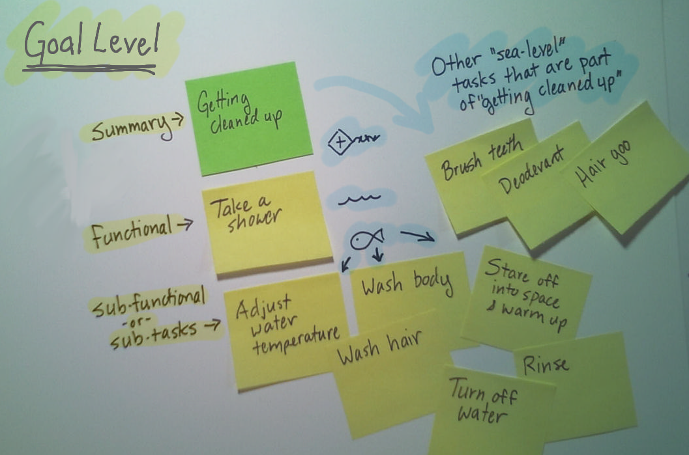
					- Functional tasks are activities you would complete before intentionally stopping to do something else. For example you wouldn't stop your shower halfway through to make coffee.
					- Sub-tasks or sub-functional tasks are smaller decomposed tasks from functional tasks. Like adjust the water temperature is a subtask of taking a shower
					- Summary tasks are the higher category that may roll up several functional tasks. For example brushing your teeth and showering may be summarized into the summary task of "getting cleaned up."
		- Organize your Story
		  collapsed:: true
			- 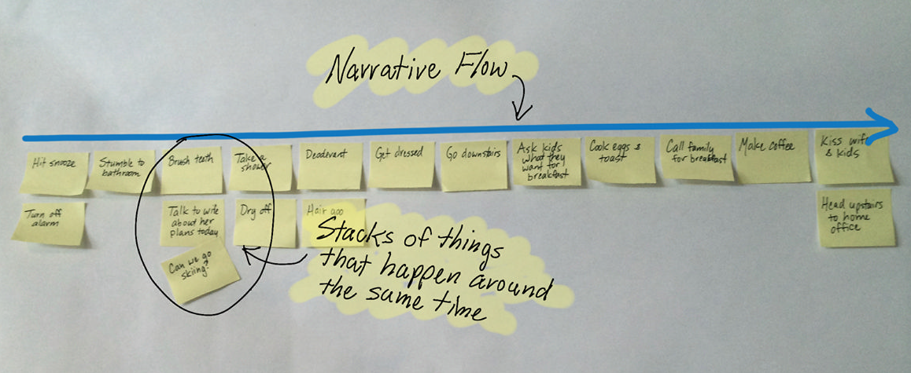
			- Organize your story from left to right flow, with what you did first on the left and what you did later on the right using a narrative flow.
		- Explore the Alternative Stories
		  collapsed:: true
			- 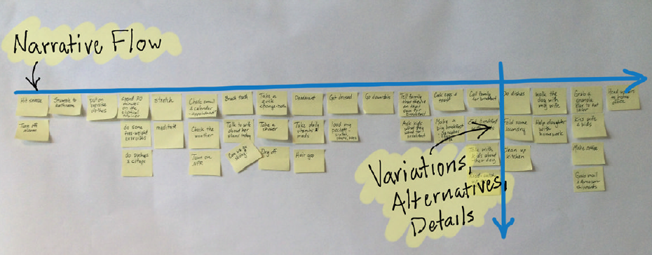
			- Think of the stories where things go wrong or there are exceptions to the usual way of doing things.
			- Details, alternatives, variations, and exceptions fill in the body of the map.
		- Distill your map to make a backbone
		  collapsed:: true
			- 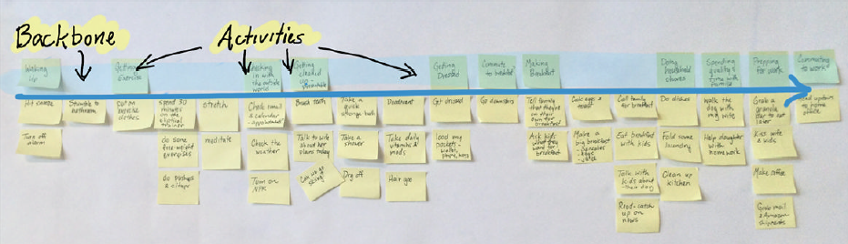
			- Create activities to distill all the tasks below it. The activities have a higher goal level attached to it.  Activities organize a bunch of task done by similar people at similar times in order to reach a particular goal.
		- Slice out tasks that help you reach a specific outcome
		  collapsed:: true
			- Each slide should be have an outcome that you want. To create a slice leave only the tasks that would help you achieve that outcome and move everything else down if it is extra.
			- 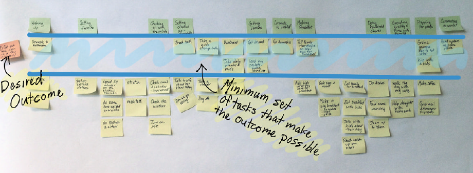
		- 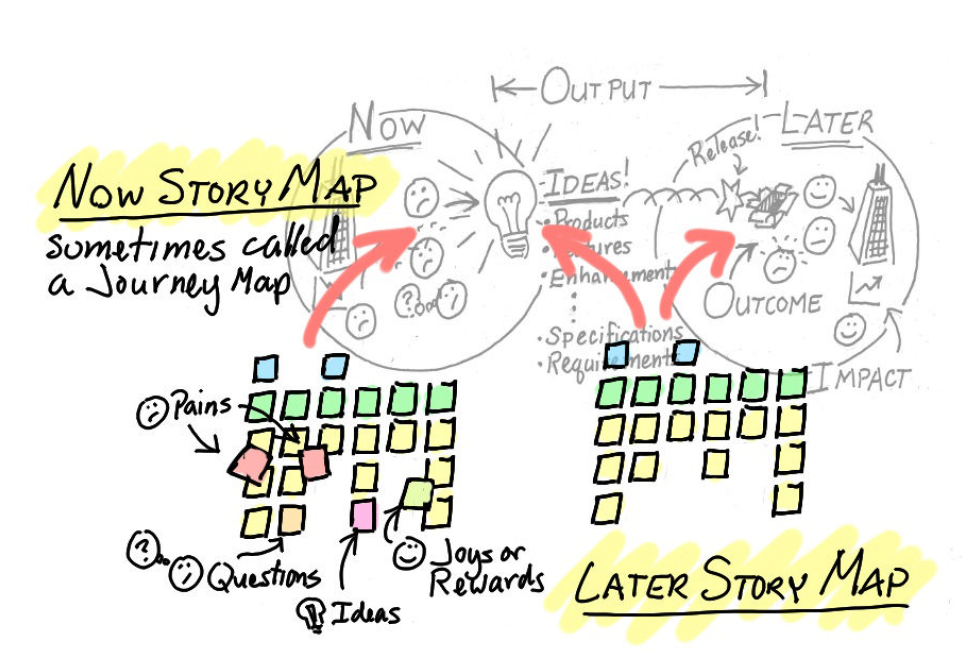
		  collapsed:: true
			- We can create a [[Journey Map]] that maps out the current process or a Later Story Map
				- In a journey map you can add the:
					- pains: Things that don't work well, parts people hate
					- joys or rewards: The fun things that make it worth doing
					- questions: Why do people do this? What's going on when they do?
					-
			-
		- Six Simple Steps to Story Mapping
		  collapsed:: true
			- **Frame the Problem** Who is it for, and why are we building it?
			- **Map the big picture.** Focus on the breadth, not depth. Go a mile wide and an inch deep. If you don't have a clear solution in mind, or even if you do, try mapping the world as it is including pains and joys your users have.
			- **Explore.** Go deep and talk about other types of users and people, how else they might do things, and the kinds of things that can and likely will go wrong.
				- Sketch, prototype, test, and refine solution ideas—changing and refining the map as you go.
			- Slice out a release strategy.
				- Remember there's always too much to build. Focus on what you're trying to achieve and on the people your product will serve. Slice away what's not needed to reveal minimum solutions that create value and help users reach their goals.
			- Slice out a learning strategy.
				- Remember that your release strategy and what you think is the minimum viable solution is only a hypothesis until you proven true.
				- Use the map and discussion to help you find the biggest risks.
				- Slice the map into even smaller minimum viable products experiments that you can place in front of a subset of users to learn what's really valuable to them.
			- Slice out a development strategy
				- Slice only the tasks needed to deliver an outcome leave out the rest for another release. Focus on building things early that help you learn to spot technical issues and development risks sooner.
		- The Map is Only the Beggining
			- Two things important about stories and how they work
				- Use storytelling with words and pictures to build shared understanding
				- Don't just talk about what to build: talk about who will use it and why so you can minimize output and maximize outcome
		-
	- Chapter 6 - The Real Story about Stories
	  collapsed:: true
		- Ensure your requirements are written so there is very little room for multiple different interpretation. We van all read the same document but have different understanding of it.
		- Another problem with requirements is that they can lead us to time and resource wasted building what the document describes, only to find out later what actually solves the intended problem is something very different.
			- **The documents can accurately describe the wrong thing. Documents usually describe what users need, but not why we need it. Without talking about it, we would never know it.**
		- The solution to these problems was to stop trying to achieve the perfect requirements but instead tell stories. We shouldn't then concentrate on the stories we write but rather how the stories are being told and elicited.
		- > If you're not getting together to have rich discussion about your stories, then you're not really using stories.
		- 3Cs
			- 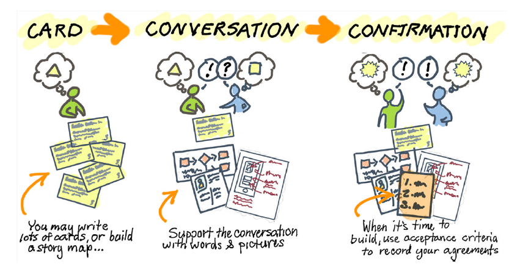
			- **Cards**
				- Imagine you’re responsible for working with a team to get some software built. Imagine that software as best you can. Then, for each thing users want to do with the product, write a card. You’ll end up with a bunch of them. Kent’s original idea was to write them on index cards because it’s easy to organize a bunch of cards on a tabletop. It’s easier to prioritize them, or organize them into a structure that helps you see the big picture—a structure like a story map, of course.
				- The bunch of cards that describes the whole product, or all the changes we’d like to make to a product we have, is called a product backlog. That term originated with the Agile process Scrum. Someone I know once said, "I hate that term backlog. We haven’t even started to build software, and it already sounds like we’re behind!" I’m not sure I have a better name for that bunch of stories, but if you can think of a good one, please use it, and let me know what it is.
			- **Conversation**
				- The conversation should allow back and forth storytelling so everyone in the room can come to a share understanding. The conversation should allow for back and forth questions.
				- In a traditional software process, the goal for the person who had the requirements is to get them written down correctly; and for the person who’s going to build the software, it’s to understand them correctly. Because this is a story-driven process, you each have a different shared goal. Your goal is to work together to understand the problem being solved by building software, and solve it as best you can. Eventually, you’ll need to agree on what you should build that you both believe will help the users of the product.
			- **Confirmation**
				- Use acceptance criteria to check to see if we're done building what the story needed. Your acceptance criteria represent your agreements.
				- Use demos and take measurements to confirm that you're product is usable and valuable.
		- The Path to Agreement
			- Cards and conversations alone won't get you to agreement. Use pictures, workflow diagrams, and UI sketches to get to shared understanding. Good stories have lots of words and pictures.
	- Chapter 7 - Telling Better Stories
	  collapsed:: true
		- User story template:
			- As a [type of user]
			- I want to [do something]
			- So that I can [get some benefit]
		- The cards with user stories as written following the template isn't enough to ensure of achieving the goal of a shared understanding. We use the cards to foster a deeper and longer conversation and storytelling.
			- The project manager, project owner, business analyst, technical architect should discuss the user stories first to make it more tight and understandable to one interpretation before bringing to a larger meeting to cut down on extra unnecessary discussions there.
			- Make sure that each card has had its proper time investment of exploration and analysis through storytelling and discussion. Don't risk building the wrong thing by letting only one perspective write the story.
		- However, a story doesn't have to be written in the template style to be considered a story.
			- The story template is a learning tool to help you get to shared understanding but can be abandoned once you can get to your goal without it.  **We can instead write using who, what, and why.**
				- Who:
					- Don't only talk about the "user." Be specific. Talk about which user you mean.
					- Talk about different types of users and the different types of functionality that the users are expecting from your offered options.
					- Talk about customers. For enterprise products, we'll need to talk about the people who make buying decisions, their organization as a whole and how they benefit.
					- Talk about stakeholders. Talk about the people sponsoring the softwires' purchase. Talk about the others who might collaborate with users.
					- There's rarely just one user who matters.
				- What:
					- Really talk about what
						- Start with user tasks—the things people want to do with the software. Also talk about the behind the scenes services and the different systems that call them. Its OK talk about the specific UI components and how the screen behaves. Just don't lose sight of who cares and why.
					- Talk about what is going on outside the software
						- Talk about where people using your product are when they use it. Talk about when they’d use the product, and how often. Talk about who else is there when they do. All those things give clues about what a good solution might be.
					- Talk about what goes wrong
						- Talk about what will happen when things go wrong. What will users do when the system breaks down.
					- Talk about questions and assumptions
						- Identify your questions and discuss how important they are to get answered before you build software.
						- Take time to question your assumptions. Do you really understand your users? Is this really what they want? Do they really have these problems? Will they really use this solution?
					- Question your technical assumptions. What underlying systems do we rely on? Do they really work the way we think? Are there technical risks we need to consider?
					- Talk about better solutions
						- Ensure to talk about the proposed solution and try to break it, your assumptions to find an even better solution. Go back to the problem your users are trying to solve and design a solution together.
						- 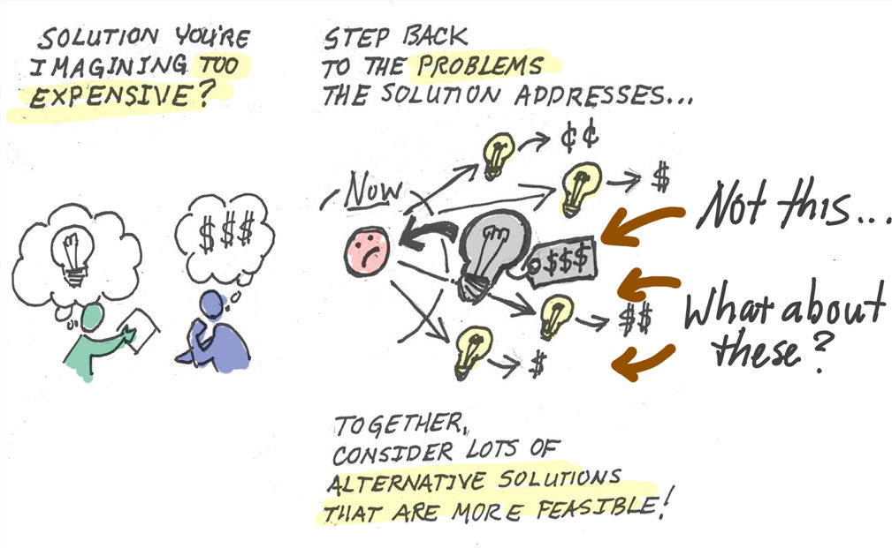
					- Talk about the how
						- When sitting in a story conversation, I often hear someone anxiously say, "We should be talking about the what, not the how!" By that they mean we should be talking about what users need to do, not how the code should be written. And I feel the same anxiousness when we talk about the "what" without talking about the "why." But the truth is, we’re trying to optimize for all three in a good story conversation. What goes wrong is when either party assumes that a particular solution or the way it’s implemented is a "requirement." Without explicitly talking about how (and if you’re a developer, I know you’re thinking about it), it’s difficult to think about the cost of the solution. Because, if a solution is too expensive, then it may not be a good option. Be respectful of the expertise of others in the conversation. Don’t tell a highly trained technical person how to do her work. Don’t tell someone intimately familiar with users and their work that he doesn’t understand. Ask questions, and genuinely try to learn from each other.
	- Chapter 8 - It's Not All on the Card
	  collapsed:: true
		- 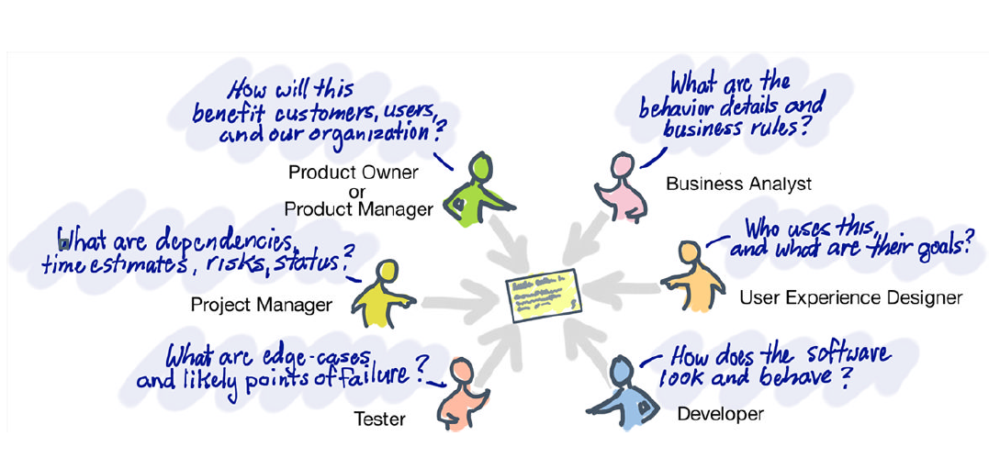
		- Different team members will have different conversations about the same card. because they all have different motivating goals.
	- Chapter 9 - The Card is Just the Beginning
	  collapsed:: true
		- 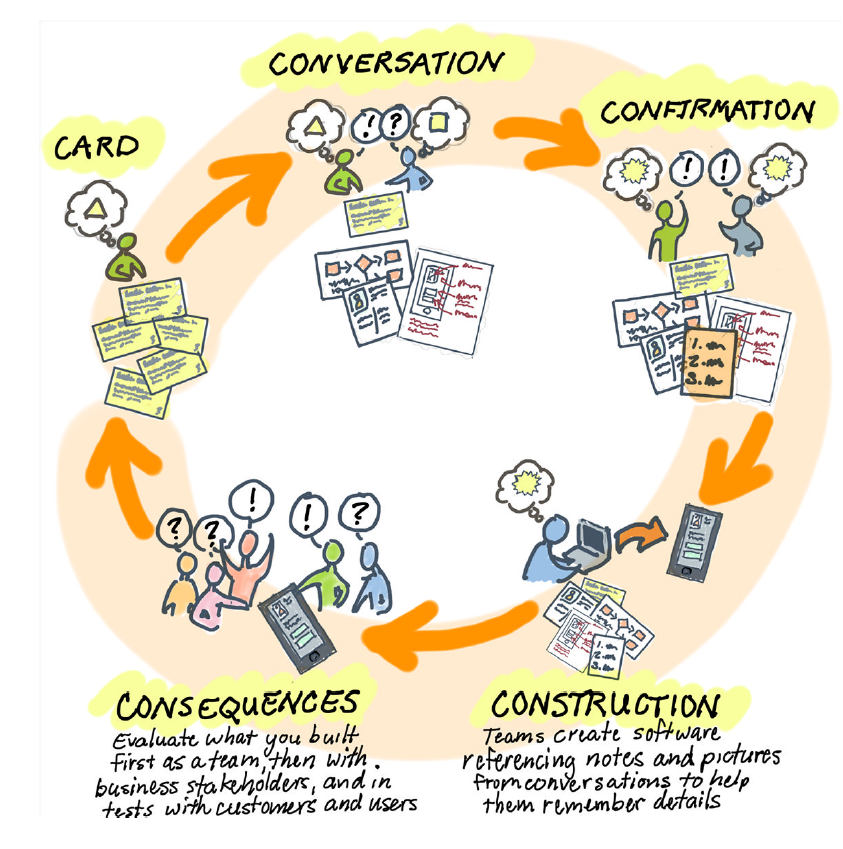{:height 620, :width 607}
		- It's important that the conversations created by and around the cards lead everyone in the team to have the same understanding and the same mental picture of the thing they're building.
			- Handing off all the details about the story to someone else to build doesn't work. Don't do that. Our brains are very good at filling in information and that information we often forget to communicate during hand-off.
			- Instead of handing of retell the story instead using the cards, words, and pictures. Let the listener ask questions and make changes to the pictures that help them remember and get to the same mental image of the solution as everyone else.
				- 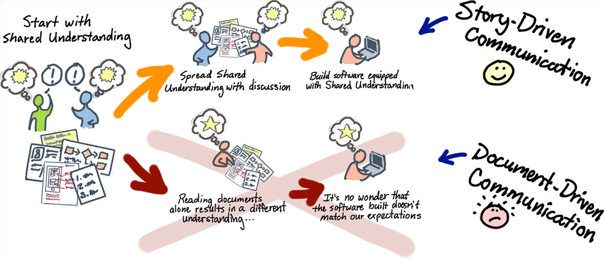
			- Effective discussion and decision making goes best with small groups of two to five. It's dinner conversation sized. Let small groups work together to make decisions, and then use continued conversations to share the results with everyone else.
		- Inspect your work through various lenses after the end of sprints
			- User Experience Quality
				- Review the work from the perspective of its target user. Is it straightforward to use? Is it fun to use? Is it easily understood? Does it look good? Is it consistent to the brand?
			- Functional Quality
				- Does the software do what you agreed it would without bugs or errors?
			- Code Quality
				- Is the software we wrote high quality? Consistent with our stand
		- If there are changes, create another user story card.
		- Keep in mind whoever you talked to about the user stories and card, may not be the same person who will end up using it.
			- You'll need to test the software with the people who'll actually use the solution. Not everyone on team has to be there but testing with the team will help you build rapport.
			- It's OK for scope creep. The purpose of Agile is knowing that you didn't get it right the first time.
		-
			-
				-
				-
	- Chapter 10 - Bake Stories Like a Cake
	  collapsed:: true
		- 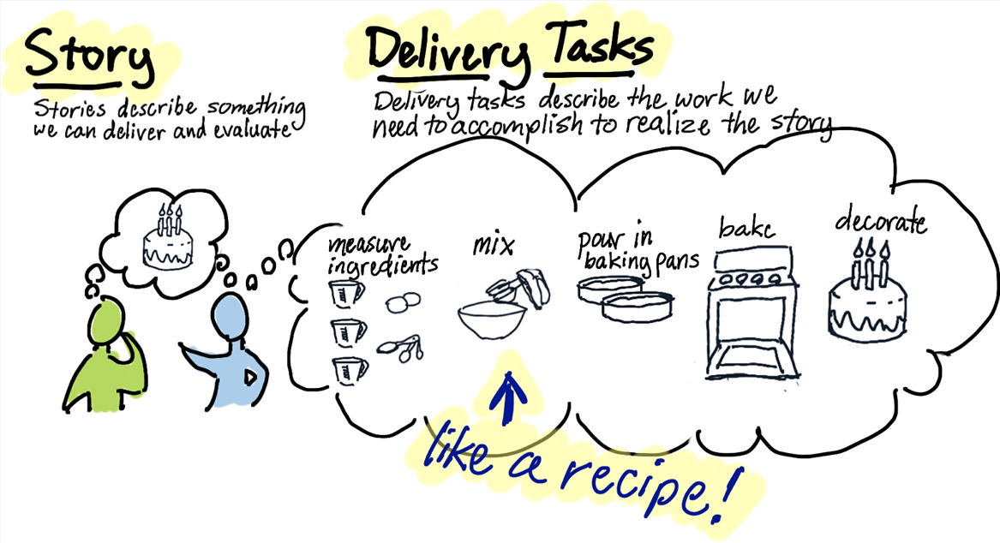
		- Create a recipe. The stories surrounding software development describes something we can deliver and evaluate.
		- If the story describes a solution that's too expensive, consider a different solution that helps you reach the same goal.
		- If the story describes a solution that's affordable but big, break it into smaller parts that allow you to evaluate and see progress sooner.
		- Don't break down big things into big plans. Break big things into small things with small plans.
			- The approach to breaking down big software is to break it down into small cupcakes and not cakes. The cupcakes will be its own delivery but have similar recipes. When you build the cupcake you get to taste it before you invest in making either a large cake or making a lot of cupcakes.
			-
	- Chapter 11 - Rock Breaking
	  collapsed:: true
		- 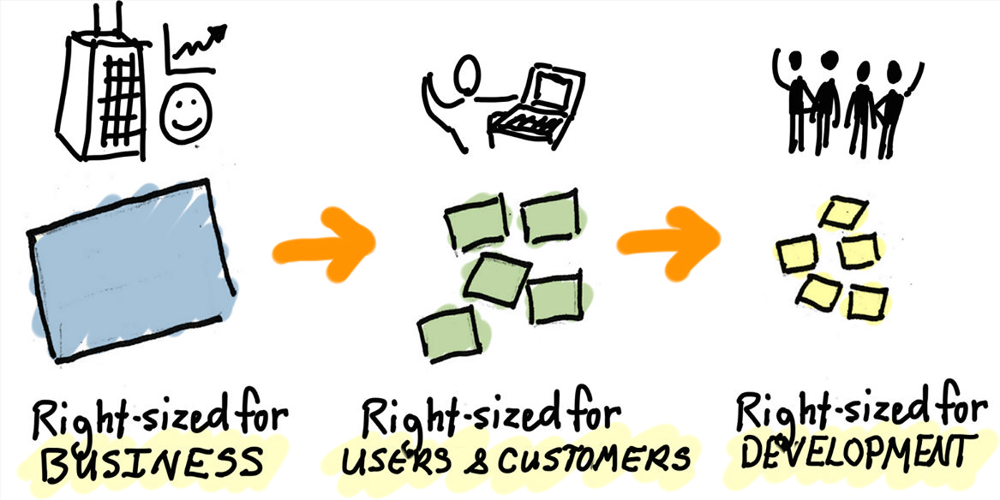
		- A right-sized story from a user's perspective is one that fulfills a need.
		- A right-sized story from a develop team's perspective is one that takes just a few days to build.
		- A right-sized story from a business perspective is one that helps a business achieve a business outcome.
		- Stories are like rocks. We can break down a rock and it would still be a rock.
		  collapsed:: true
			- 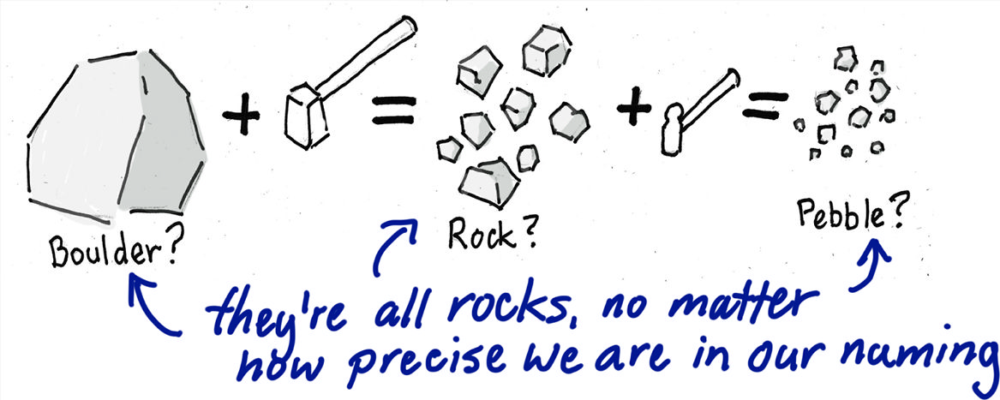
			- Stories can be broken down into smaller stories, and those further down into smaller stories.
		- 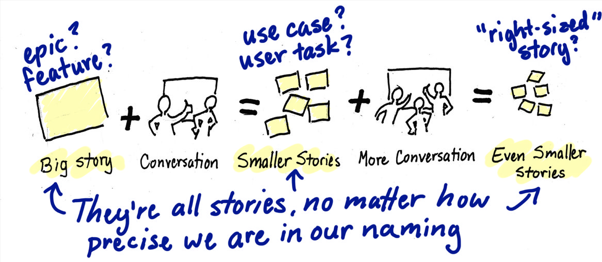
		  collapsed:: true
			- 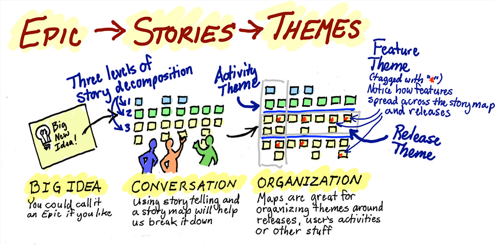
			- Epics are used to describe big user stories.
			- Use themes to organize a group of stories.
		-
		-
		- Start with Opportunities
		  collapsed:: true
			- 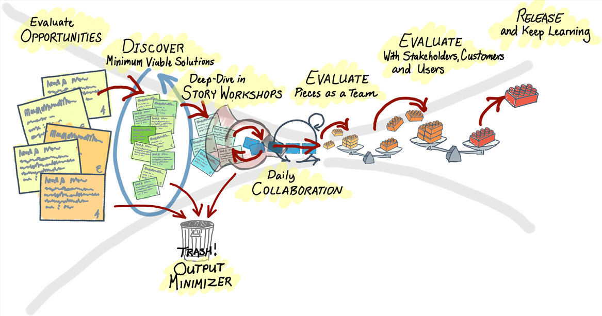
			- 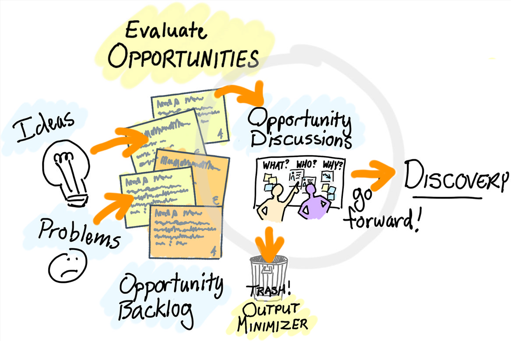
			- Stories starts as an idea coming from a new feature or even as a whole new product. Or it could be a problem we need to solve.
			- Use opportunity discussions to agree the problem is worth solving—to make a go-forward or trash decision.
			-
		- Discover a Minimum Viable Solution
			- 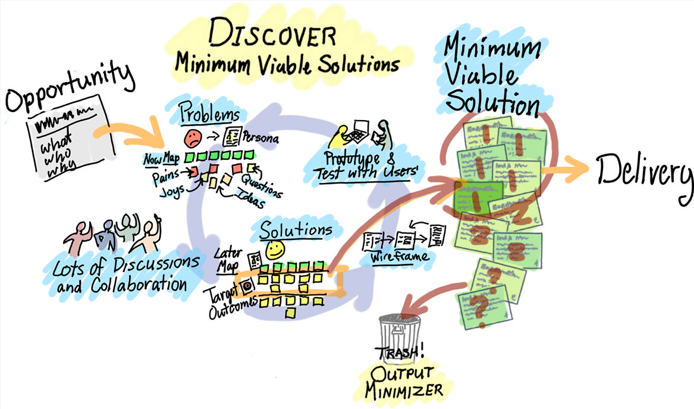
			- Seek to make it as small and valuable as you can.
			  collapsed:: true
				- Story mapping can help you understand how your users work today, and then map your ideas about how things will change for them after your created solution.
				- Discovery is where it's critical to look hard at our assumptions and to do work to validate them.
					- Spending more time with customers to understand deeper analysis of business rules or outside regulations
					- Involves building prototypes of solutions and validating them with the target audience to find gaps and uncover technical risks.
					- Look for parts of the solution you can safe trash or push into the backlog.
		- Dive into the details of each story during delivery
			- 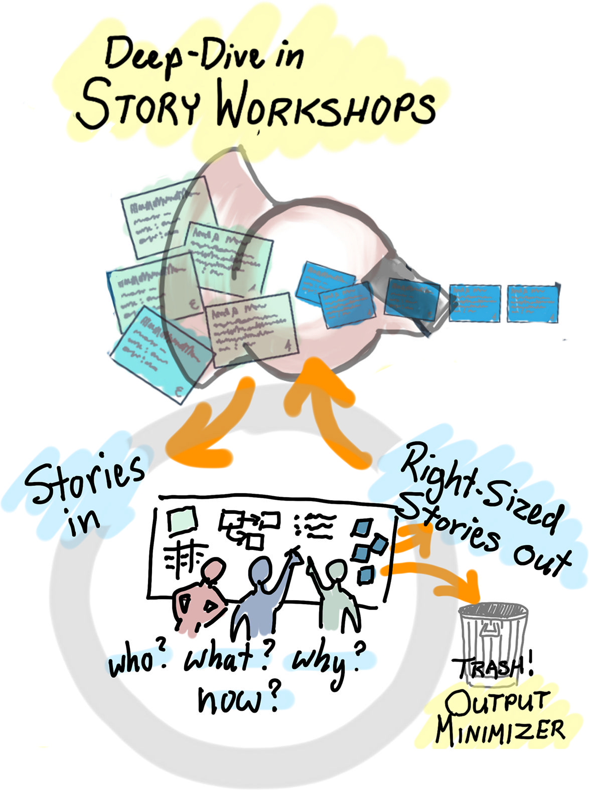
			- Delivery will move the fastest if we can break down our largest and biggest stories to more manageable smaller user stories—keeping in mind that every part still needs to be something we can build and learn from.
			- Use deep-dive story workshops to discuss the details, break down the stories, and really agree on specifically what we'll build.
			- Keep talking as you build. No matter how hard you try your last conversations won't have predicted everything you'll learn once you start to build.
			- Evaluate each piece
				- Look at the built pieces as a team.
				- Reflect how effectively you planned.
				- Did you really finish what you expected? Shorter or longer?
				- Evaluate with users and customers.
					- Make sure what they have to test is enough to get honest and useful feedback. Usually enough means a whole screen or flow of screens that allow users to complete a task or reach a meaningful goal.
			- Evaluate with business stakeholders.
				- Use a review to show them the products so far. Use the review to talk about where you are in relationship to your bigger plan. Keep your progress and quality visible to stakeholders inside your organization (of the larger picture, they may not be interested in the smaller details)
				- Use metrics to learn if and how people use your product. Use face to face conversations to understand your users and to interview them.
			-
		-
			-
	- Chapter 12 - Rock Breakers
	  collapsed:: true
		- Ask the whole team to help write down user stories. A single product owner to write all of the stories and be present for all story conversations doesn't work.
		- It is the role of the product manager to help identify what is valuable, feasible, and usable.  The solution we want is the intersection of these three criteria.
		- 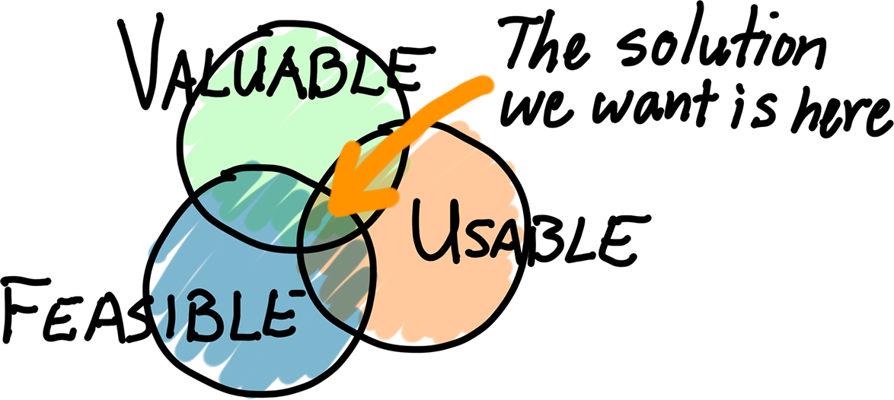
			- It's rare that a single role or individual can identify the solution in the center of the 3 domains. Instead of one solitary role, it most often will take a collaboration between people who understand the business, customers, users and the technology in use. The team will also need to take ownership and responsibility for the success of a solution.  The most effective organizations uses small cross-functional discovery teams that work together to find the right solution.
			- An effective discovery coordinates collaboration with not only the development team, but also business stakeholders, subject matter experts, customers, and end users. It’s tough work that requires topnotch communication and facilitation skills, in addition to the specific expertise each team member brings in.
		- Straight up requirements gathering instead of using stories to get at those at those requirements often is a harmful antipattern. We should let our requirements discovery phase be more of a patent and doctor relationship instead of a waiter diner relationship. 
		  id:: 626ecd3a-802c-4c53-a145-8c67de590124
			- Sometimes this means that you're role in the product management side is to tell your business stakeholders things that they may not want to hear. It's our function to take the vision of the business stakeholders and them make it a success.
			-
	- Chapter 13 - Start With Opportunities
	  collapsed:: true
		- Opportunities are ideas that we believe will solve a problem (usually referred to an epic in Agile/Scrum). The goal of our conversations around opportunities is to decide if we should move forward with them or trash them. For each opportunity we can discuss:
		  collapsed:: true
			- Whom they're for:
				- We need to clearly define who the target audience is—users, customers or a different target market.
			- What problem we're solving
				- Talk about how problem(s) are faced by your users. Talk about how they solve they're problems today using manual tools, other systems, or our own products that maybe be causing them pain points
			- What we're imagining
				- We may have ideas and assumptions about what the product or feature should be. We should discuss those ideas
			- Why
				- Discuss why these opportunities are beneficial to the organization. Solving user's problems are not enough we also need to consider the ultimate return of the software development and whether the investment is aligned with our current business strategy.
			- Size
				- To help decide whether we should move forward with the opportunity use the size to give a rough estimate to how long it will take to develop
		- Opportunities don't need to be decided on now if you can't come up with a decision. It's okay to put it back in the backlog and procrastinate.
			- 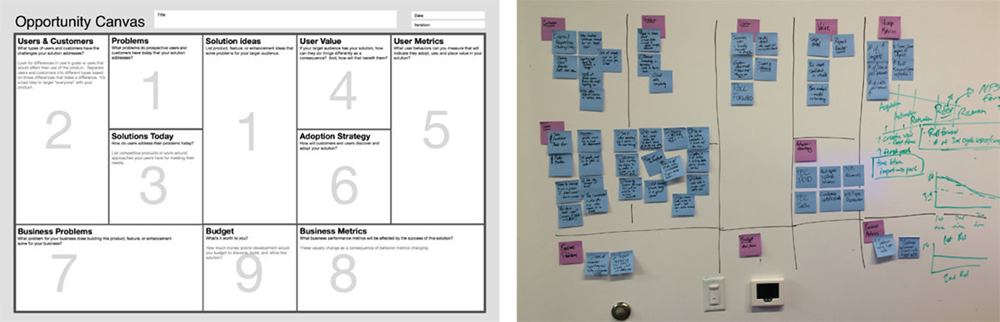
			- Opportunity Canvas
			  collapsed:: true
				- Problems or Solutions
					- Ideally, we should start with a clear problem we’re trying to solve. However, the world is rarely ideal. We’re often given a feature or enhancement idea and then need to work backward to understand the problem. Start with what you have.
					- Solution ideas
						- List product, feature, or enhancement ideas that solve problems for your target audience
					- Problems
						- What problems do prospective users and customers have today that your solution addresses?
				- Users and Customers
					- What types of users and customers have the challenges your solution addresses? Look for differences in users' goals or uses that would affect their use of the product. Separate users and customers into types based on those differences. It’s a bad idea to target "everyone" with your product.
				- Solutions Today
					- How do users address their problems today? List competitive products or workarounds your users have for meeting their needs.
				- User Value
					- If your target audience has your solution, how can they do things
					  differently as a consequence? And how will that benefit them?
				- User Metrics
					- What user behaviors can you measure that will indicate that they
					  adopt, use, and place value in your solution?
				- Adoption Strategies
					- How will customers and users discover and adopt your solution?
				- Business Problem
					- What problem for your business does building this product, feature,
					  or enhancement solve for your business?
				- Business Metrics
					- What business performance metrics will be affected by the success of this solution? These metrics are often a consequence of users changing their behavior.
				- Budget
					- How much money and/or development would you budget to discover, build, and refine this solution?
			- Story maps vs journey maps for managing opportunities
				- Don't use story maps to manage opportunities as they are too big and high level
				- Use a journey map of the product used today to find opportunities or consider opportunities in the context of your current solution
				- 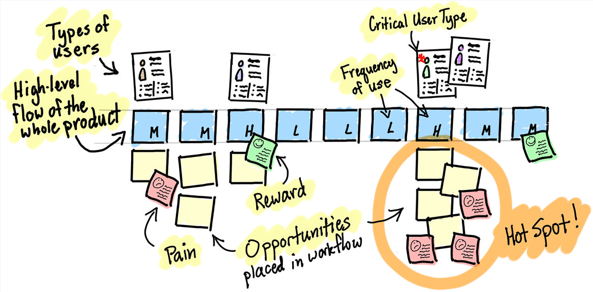
				- **Given that we offer over 10 different products, we have to make sure that we design, build, and improve upon those products in ways that match how our customers use them together, not one by one.**
				- Be picky with opportunities. You're not helping anyone if you agree to take on everything. Aggressively trash opportunities that don't offer much hope of creating outcomes you hope for.
			-
				-
				-
	- Chapter 14 - Using Discovery to Build Shared UnderstandingUs
	  collapsed:: true
		- Discovery work is about learning not building shippable software. It's about asking and answering questions like:
			- What problems are we solving?
			- What solutions could be valuable to our organization and to customers buying or adopting the product
			- What does a usable solution look like?
			- What's feasible to build given the time and tools that we have?
		- We use these questions to break down opportunities to smaller stories and lots of models for improving our understanding
		  collapsed:: true
			- 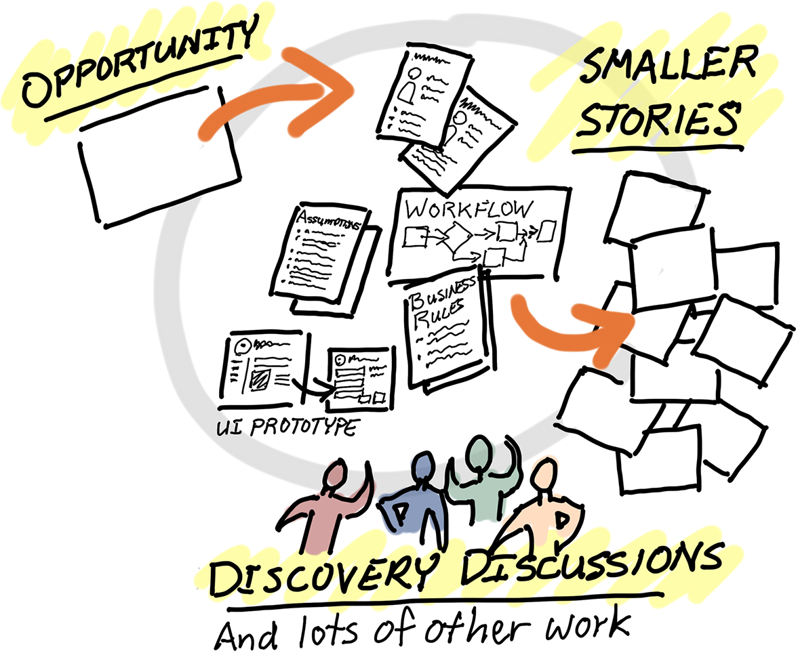
		- Four Essentials Steps to Discovery
			- Frame the Idea
			  collapsed:: true
				- Frame the idea to set bounds for the work you're doing. It's better to be clear on why you're building something and who its for so the team doesn't waste time discussing solutions that doesn't solve the problem(s) that we need solved.
			- Understand the Customers and Users
			  collapsed:: true
				- Create simple personas to build shared understanding of the users. A persona is an example of your target user assembled from the facts and sometimes the assumptions you have about your users.
				  collapsed:: true
					- Personas help us look at the option and solutions from the perspective of our users.
					- Talk to people to help you build the right persona. Identify the details most relevant to the opportunity you're building and put those into the personas
					- 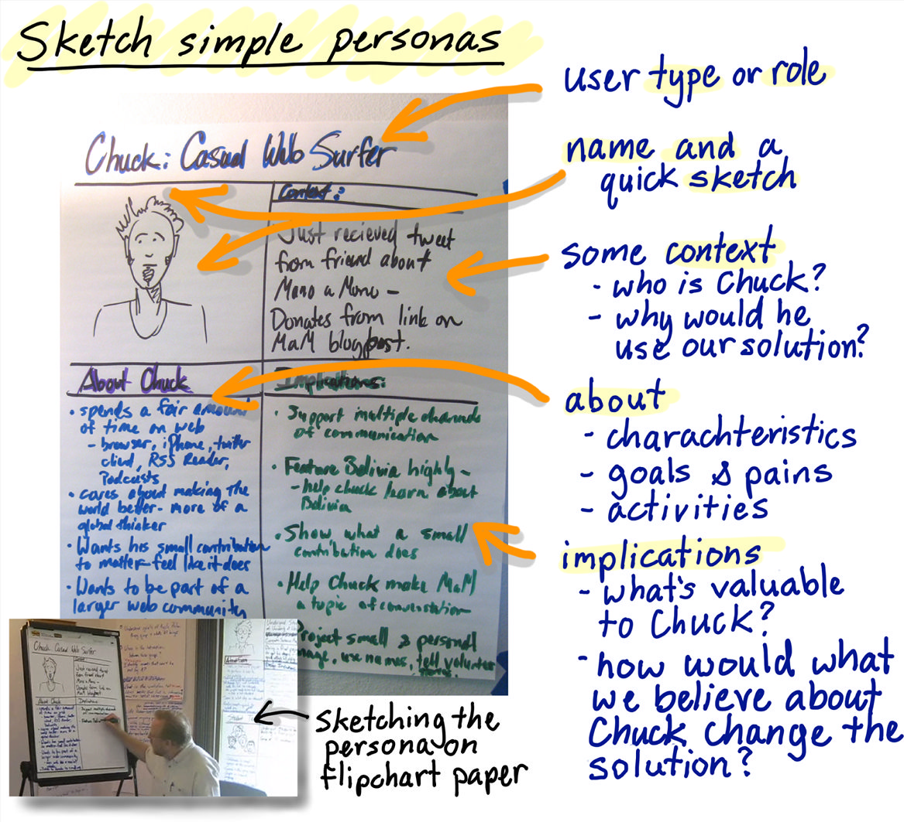
					-
				- Map how users work today
			- Envision your Solution
			  collapsed:: true
				- Map your solution
					- Use the story map to imagine the life of your users with the solution you're building in place.
				- Visualize your interface to build shared understanding of the solution.
				- Validate completeness
				  collapsed:: true
					- Pay attention to the small and mundane details that maybe left out due to attention hogging features or user stories. Make sure you go over all the steps and flows especially the things that happen in between steps
				- Validate engineering engineering concerns
				  collapsed:: true
					- Discuss your story maps with engineers and architects before getting too far along.
				- Play "What about"
				  collapsed:: true
					- Talk about what's going on underneath the software. Talk about rules, regulations, and the business rules driving the workflow processes. Talk about other systems that you need to integrate with and other dependencies to consider.
			- Minimize and Plan
			  collapsed:: true
				- The usual problem with software development is when we focus on making everyone happy, and at the same time fail to focus on small, specific target outcomes. The result is a solution that's much bigger than it needs to be.
				- **If you're not cutting away more ideas than you keep, you're probably not doing discovery work right**
				- There's always too much to build.
					- Uncover the minimum viable product. Viable mean successful for a specific business strategy, target customers, and users.
				- Prioritize by business value.
					- Clearly define and discover the specific "business value" you are targeting. Specific business outcomes drive focus on specific users, their goals, and activities they'll engage in with your product. Focus on those activities drives focus on the specific features and functionality users will need to be successful.
					- **Prioritize specific business goals, customers, and users, and then their goals, before prioritizing features**
				-
		- Discovery Activities, Discussions, and Artifacts
			- 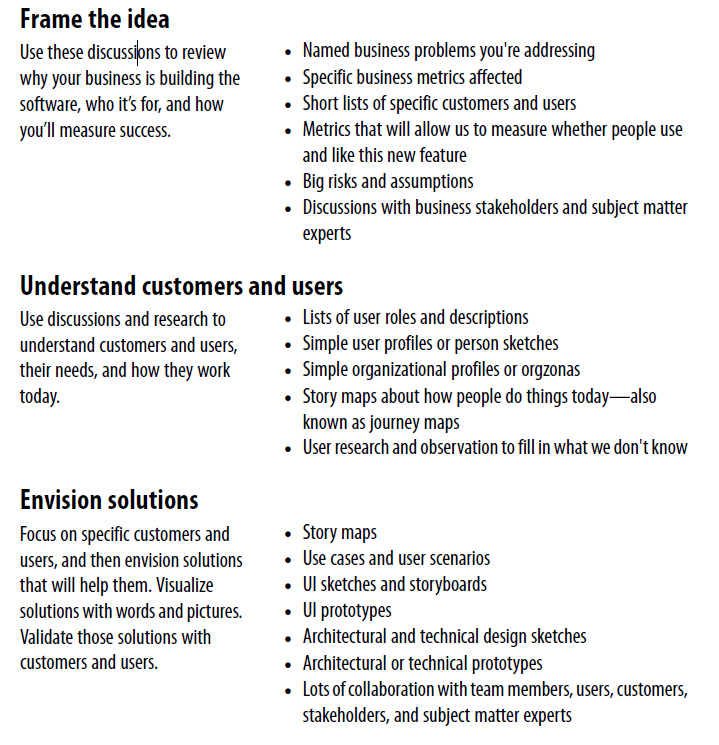
			- 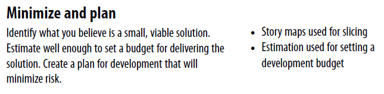
			-
		-
	- Chapter 15 - Using Discovery for Validated Learning
	  collapsed:: true
		- Use the discovery phase to validate our assumptions and hypothesis. Optimize your value creation. Some features that we develop may not be often used as frequently as to warrant the invested resources and time.
			- 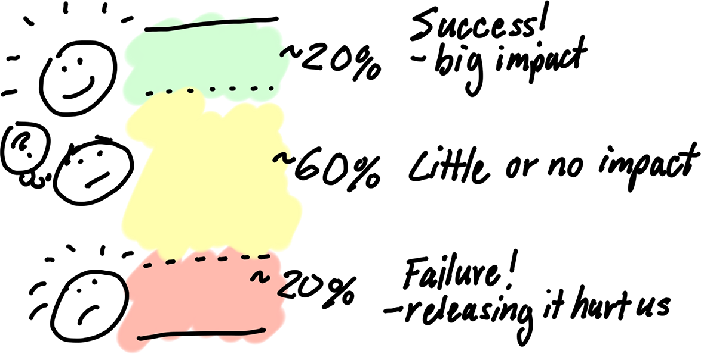
				- Consider the 80/20 rule
				- It's usually the 60% of work that we do that has little or no impact. Try to minimize this and ensure we are building the top 20%
		- Empathize, Focus, Ideate, Prototype, Test
			- Use Design Thinking
				- 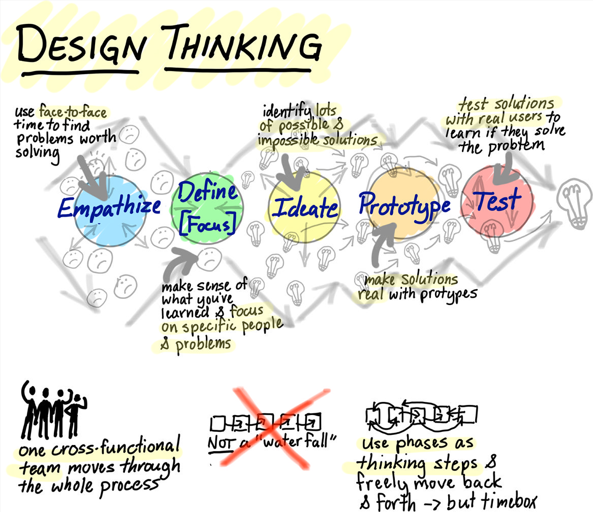
				- **The first step of design thinking is to empathize.**
				  collapsed:: true
					- Try to be as close to the work with the users—be where the users are, watch them work, and meet them. Try to do your best to understand what it's like to walk in their shoes.
				- **Define**
				  collapsed:: true
					- Use story maps to outline the way people do things. Focus on the pain points users have and the rewards they seek. Really focus on one or a few problems. State them specifically.
				- **Prototype**
				  collapsed:: true
					- Prototypes help us experience what we're trying to build early on to get a feel if we're heading in the right direction. It helps us filter ideas that just won't work. Simulation of the actual act of using a product helps you continue to ideate—to come up with ideas to make the solution even better.
					- Build simple prototypes to explore your best solutions. Advance prototypes to a level of fidelity that allows users and customers to evaluate whether the solution really solves their problem.
				- **Test**
				  collapsed:: true
					- Test the solution, not to look for bugs, but to validate the your solution solve someone's problem. Get your solution in front of the people who will buy or use your product. Don't expect them to be a success the first time. Iterate and improve.
				- How to mess up design thinking
				  collapsed:: true
					- 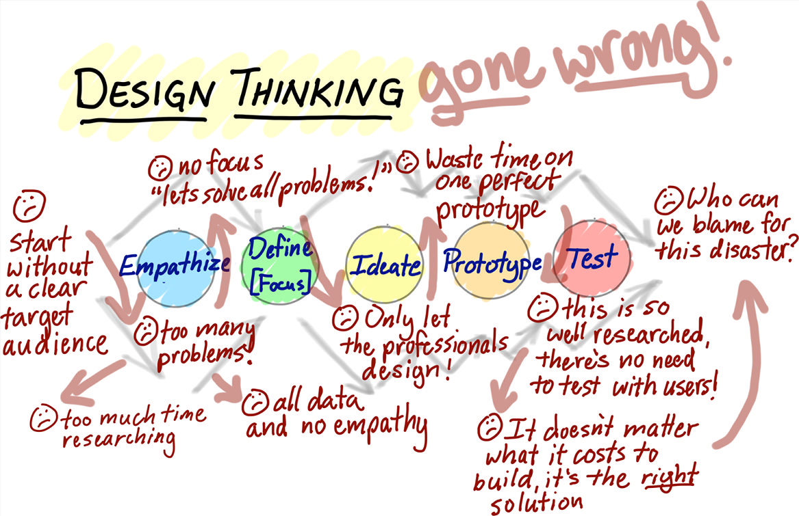
					- Start without framing the business needs and target customer well. This’ll make it hard to prioritize who to focus on, and hard to tell if you’re finding a good solution.
					- Spend a lot of time doing thorough research and making sense of what you’ve learned. You’ll never run out of things to learn—so why stop? **Time-boxing might have been a good idea.**
					- Don’t spend any time at all talking to people and learning from them. After all, we’ve got a lot of data, and really, our solution ideas are great. We just need to get going on designing them.
					- Fail to focus on specific problem, and instead try to solve lots of problems for lots of people. The more problems you solve the better, right? Except that big problems often result in big solutions. And trying to solve a problem for people with conflicting needs can result in a solution neither person likes.
					- Consider multiple solutions, but only ask real designers to contribute solution ideas, because they’re the only ones trained to have good ideas.
					- Don’t waste time considering multiple solutions, because the idea we have is so good.
					- Beautifully craft a prototype that really looks real, but doesn’t work well enough for customers and users to really use it. After all, when they see it, they tell us it "looks really lovely."
					- Convince yourself and then others that this well-researched, professionally designed solution will work. After all, you’ve followed a rigorous design process. What could go wrong?
					- Don’t worry about how much it’ll cost to build. It’s the right solution, and any cost to build it is justified.
					- When you deliver the solution to customers and users, and don’t see the outcomes you expect, find the breakdown in the process that’s at fault. Or better yet, find a person or group you can blame.
				- Lean Startup Thinking
					- 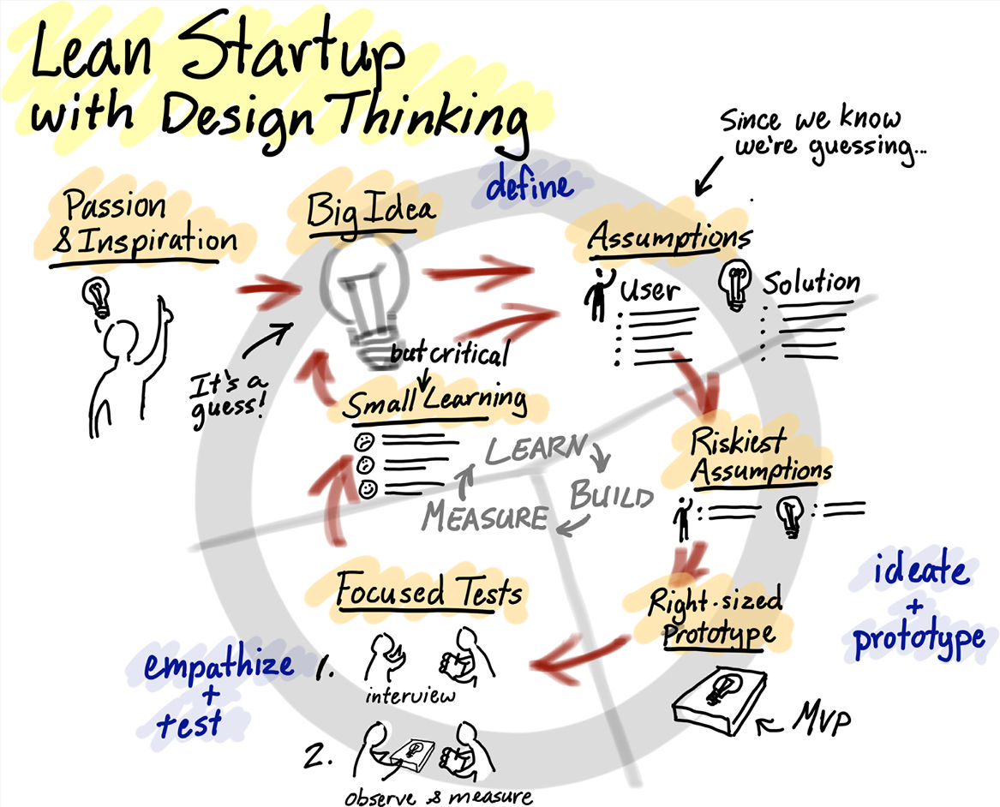
					- Start by Guessing
						- Try to define and understand who your users really are.
					- Name your risky assumptions
						- Write the things that you believe are true, if we find they aren't, then we'll need to rethink everything.
						- Write what you believe your users will react and respond to your solutions. Form hypothesis on the behaviors of the users. Discuss the technical risks—things that would threaten the feasibility of our solutions.
					- Rethink your solution and your assumptions
						- In a Lean Startup approach, failing to learn is frequently the biggest failure.
					- Stories in the discovery phase
						- We're talking with developers, testers, and lots of others about the software we intend to build and put into production. If you're not talking to a lot of people you are at risk of misunderstandings of the final product.
				-
				-
			-
			-
	- Chapter 16 - Refine, Define, and build
		- Crowds don't collaborate. Try to keep your workshops to a small amount of people, the larger the crowd the harder it is to have conversations.
	- Chapter 17 - Stories are actually like Asteroids
	  collapsed:: true
		- Don't break down all the large stories into smaller stories at one time. Instead, break down stories progressively, and just in time.
			- At each story discussion and splitting stage consider the following:
				- For opportunities discuss who they're for, what problems they solve, and if they're well aligned with the business strategy and goals. It may make sense to split bloated opportunities at this point
				- During discovery discuss the specifics of who uses the product, why, and how.  It is your team's role to envision a valuable, usable, and feasible build.
				- When planning a development strategy, discuss where the risks are—consider the risks from both functional and technical domains.
				- When planning for the next development cycle, break down the next set of large opportunities and stories.
		- If you have too many stories you can reassemble them by creating a top level card or story.  Bundle small stories to clean up your backlog.
		- Map only what you need to tell a story about your feature.