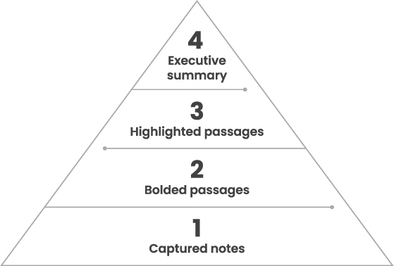
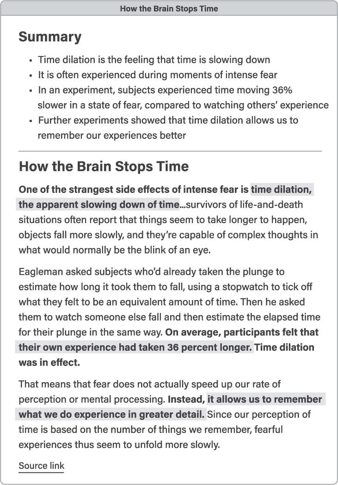
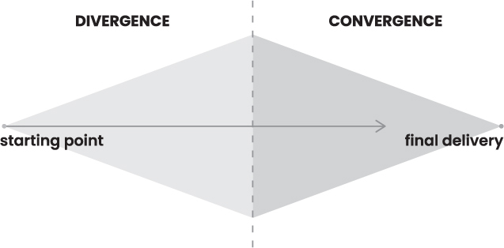

tags:: #📥inbox, #books
author:: Tiago Forte
Projects:: # [[Create thinking tools]] 
Areas:: #[[Professional Development]]
Resources:: #[[q - how can we make better decisions]]
napkin.one:: todo

- Takeaways
	- We should place more effort is distillation and eventual creation of the content we consume through our own analysis, writing, and rethinking (remix). ((62ce2de3-3984-471c-ba74-690da41a9cb2))
- Reference Notes
	- Chapter 1
		- Write everything down and take notes
		- You can create value by sharing your notes with others
		- Organizing and collecting information for future recall, retrieval, and analysis is valuable #[[Q - How do we create value at work?]]
	- Chapter 2 - What is a Second Brain?
		- Consider instead of consuming ever-greater amounts of content, we could be more patient and take on an approach bent on rereading, reformulating, and working through the implications of ideas over time.
	- Chapter 3 - How a Second Brain Works
		- Functions of a Second Brain
			- Making our ideas concrete
				- Only when we declutter our brain of complex ideas can we think clearly and start to work with those ideas effectively
			- Revealining new associations between ideas
				- Creative people are better at recognizing relationships, making associates and connections - [[Nancy C. Andreasen]]
				- By keeping diverse kinds of material in one place, we facilitate creation of connections and increase the likelihood of discovering novel associations.
			- Incubating our ideas over time
				- A Second Brain allows us to mitigate recency bias and use the full potential of past experiences and previously stored knowledge
			- Sharpening our unique perspectives
				- The ultimate purpose of the Second Brain is to allow your own thinking to shine.
		- CODE - Capture, Organize, Distill, and Express (How to work with you Second Brain)
			- Capture: Keep What Resonates
				- Capture only the ideas and insights we think are truly noteworthy
			- Organize: Save for Actionability
				- The best way to organize your notes is to organize for action, according to the active projects you are working on right now.
				- Consider new information of its utility, asking, "How is this going to help me move forward one my current projects?"
				- Organizing for action creates a clearly defined purpose for that information
			- Distill: Find the Essence
				- ^^Every time you take a note, ask "How can I make this as useful as possible for my future self?"^^
					- Annotate the words and phrases that explain why you saved a note, what you were thinking, and what exactly caught your attention.
			- Express: Show Your Work
				- All the previous steps of capturing, organizing, and distilling are geared toward one ultimate purpose: sharing your own ideas, your own story, and your own knowledge with others.
				- Don't endlessly consume information without applying it.
				- **Shift as much of your time away from consumption to creation.**
		- knowledge capture is about mining the richness of the reading you’re already doing and the life you’re already living
		- a knowledge asset can sometimes be mundane or sometimes grand. It is anything that can be used in the future to solve a problem, save time, illuminate a concept, or learn from past experience.
		- knowledge assets can come from external sources or from your inner thoughts
			- The meaning of a thought, insight, or memory isn’t often immediate clear. It isn’t until we write them down and revisit them with a different perspective in order to digest them that we can start drawing meaningful connections and novel associations.
			- we need an external medium in which to see our ideas from another vantage point and writing things down is the most effective and convenient
		- Feyman’s technique for knowledge capture
			- To help filter information and provide meaning and justification for their entry, Feynman would entertain about a dozen open ended question to see if the information in question would be useful to answer or help illuminate the question
			- Create open-ended questions that come from your passions that can drive your career and is long-lasting
		- Capture Criteria - How to avoid keeping too much (or too little).
			- **Extract only the most salient, relevant, rich material and save it as a succinct note instead of saving a whole lengthy article.**
			- Don’t save whole chapters of a book, save only select passages
			- The best curators are those that are picky and selective of what they save
			- **Capture criterias**
				- Does it Inspire Me?
				- Is it useful?
					- Consider if the material will be useful in the future? It may not be useful now, but it maybe critical for the future.
						- An example would be to keep a folder of images that can be used as graphics for a future presentation.
				- Is it personal?
					- This can be our own thoughts and musings. It can also be screenshots of our conversations with other people.
				- Is it surprising?
					- A Second Brain isn’t just another way of collecting information you already agree with or to further confirm your thinking or frame.
					- Save ideas that may contradict our current stance or views on a subject.
					- By playing with ideas, remixing and stretching them we can be more open minded and flexible in our thinking.
			- ^^The moment you first encounter an idea is the worst time to give it meaning.^^ **We need to first set it aside and gain some objectivity. Make sure you are calm, collected and thoughtful when engaging in new information. Use your Second Brain to help make you find new connections and associations to already existing information you previously collected.**
			- Writing enhances our thinking and thinking through writing with originality and not merely copying words helps us to gain deep understanding.
	- Chapter 5 - Organize, save for Actionability
		- Organize the information you want to save to the immediate projects or important questions you are working with in addition to categorizing them into subjects or topics with tags
		- When starting a project create a project file or folder where you can dump information in for later action or inspiration
			- Write a purpose or goal for each project to keep you working in the right direction as you progress. You can have multiple goals for one project.
		- Organize your project folder to help improve the level of your thinking.
			- [[Cathedral Effect]] is the powerful effect of a cathedral in our thinking. The high ceilings in a cathedral, affecting loftiness and invoking grandeur, can influence our thinking into a more abstract direction
				- The opposite environment with low ceilings like a small workshop can make our thinking more concrete, less abstract
		- [[PARA]]
			- Projects - Short-term efforts in your work or life that you're working on now
			- Areas - Long-term responsibilities you want to manage over time (e.g., Finances, Health, Professional Development)
				- While areas don't have any goals to reach, there is exists a standard you want to uphold.
			- Resources - Topics or interests that may be useful in the future (e.g., topics you're interested in, subjects you are researching, or hobbies)
			- Archives - Inactive items from the other three categories
	- Chapter 6 - Distill - Find the Essence
		- Distillation is when we turn the notes we captured into a retelling of our message and perspective.
			- An example of this is Coppolla's writing for the God Father. During his first pass of his reading of the source material (Godfather the book). Then on subsequent passes broke down the story into five categories of summary or synopsis of the scene, historical context, the imagery and tone for the "look and feel" of a scene, the core intention and any potential pitfalls to avoid.
			  id:: 62ce2de3-3984-471c-ba74-690da41a9cb2
		- The critical component of the notes we take now surviving the test of time to be recalled in the future is discoverability. Some actions we can take to enhance discoverability:
			- Highlighting the most important points
		- ^^The more important it is that your audience hear and take action on your message, the more distilled that message needs to be.^^
		- Progress Summarization
		  collapsed:: true
			- Highlight the main points of a note, then highlight the main points of those highlights, and so on, distilling the essence of a note in several layers. Each layer has a different format so you can tell them apart.
			  collapsed:: true
				- 
			- Example of summary, highlight, bold, and original excerpt (the full article can be referred to with the link)
			  collapsed:: true
				- 
		- Distillation only works if we have the proper level of detail and context to which we can strip away from. If we don't have enough context then the distillation may not contain the true essence of the original information.
		- Common Mistakes in Reviewing Material for Distillation
		  collapsed:: true
			- Over highlighting
			- Highlighting without a purpose
				- When you're reviewing a note, make sure you act on it so it will be more valuable for the future.
				- Assume that most notes don't have guaranteed future value to minimize summarization when you don't need to at time of consumption. It helps you be conservative with the time interacting with notes outside of working on them on projects.
					- Notes are only valuable when directly related tot he project you're working on.
			- Making Highlighting Difficult
				- Improve your skills of distillation—of stripping away the unnecessary information and still leaving the essence of your message
				- The ability to be succinct without missing key details is what leads to great presentations and communication
		- The effort we put into practicing distillation and progressive summarization helps our future self by making the information we collect easily understood and searchable.
	- Chapter 7 - Express - Show Your Work
	  collapsed:: true
		- Test the applied work from your notes often and early. The feedback you receive will help you iterate
		  collapsed:: true
			- **Make sure your chunks are shared with other so they can provide feedback. The way we work should with intermediate packets should be transformed, not merely smaller cut up activities of our past processes** (How can we make this happen) #task
				- Feedback is invaluable and we should thirst for it. It will only sharpen and refine your product.
		- Chunk your work down to [[intermediate packet]]s so you don't have to wait for uninterrupted work cycle
		  collapsed:: true
			- If you only have half an hour or an hour, chunk your planned project to a deliverable you can finish with the time you have yet the final outcome is still a useable building block to create something bigger
			- Interruptions become less impactful if you can chunk your work small enough to be interrupted in between every half hour or so given a task chunk of 30 minutes
			- Chunking allows us to iterate more often by testing and reviewing that iteration. We are less vulnerable in creating something not useful
			- We can reuse our intermediary packets to complete other projects much faster and much better quality when the intermediary packets are already excellent
		- How to Resurface and Reuse Your Past Work
		  collapsed:: true
			- Search, Browse (your files based on a folder structure), Tags, Serendipity
		- We understand more deeply the information we across as we apply it in our lives. We won't truly know something unless we make something out of it. It isn't enough to only read.
	- Chapter 8 - The Art of Creative Execution
	  collapsed:: true
		- Innovation and problem-solving depend on a continuous routine that systematically brings interesting ideas to the surface and not deciding on a time to come up with something brilliant. This rarely happens. All the pre-work should have already been done before you sit down to work on it.
		- The art of creation starts with divergence and ends with convergence
		  collapsed:: true
			- 
		- The first steps of CODE, Capture and Organize are categorized under divergence thinking and Distill and Express fall under Convergence Thinking.
		- When starting work you first need to decide what type of thinking you will be doing, divergent or convergent, capturing and organizing or distilling and expressing.
			- We can use this as part of the ultra working cycle template.
			- In divergent thinking you are open to exploring all possibilities and actively looking for the unknowns.
			- In convergent thinking you are seeking to complete the work you are doing. You are trying building your way to the final deliverable.
			  Convergent thinking is where most people struggle as they need to cut away options.
		- When starting a document, try not to start with a blank page and instead start off with a template so it is more inviting to work on. Have ideas already in place and you only need to trim them away to get to your deliverable.
			- When ending your work session reserve a few minutes worth of energy to capture:
				- Ideas for next steps
				- Write down the current status
					- Including your biggest challenge, most important question, future roadblock to expect
				- Write down details you have in mind that are likely to be forgotten once you step away
				- Write your intention for the next work session
			- The next time you continue your work session you’ll have a good jumping point to quickly get back to work.
			- You can also think about sharing the completed work in this work cycle for feedback and commentary
			- Dial down the scope - Ship something small and concrete
				- Release smaller deliverables (useful and usable) early and often instead of waiting for the whole deliverable to be complete.
		- Balance the activities of your brain to enhance your creativity
			- The more time your brain spends striving to achieve and overcome and solve problems, the less time you have left over for imagining, creating, and simply enjoying the life you're living.
			- The more varied subjects and experiences you have the richer connections your brain will make among them.
	- Chapter 11 - How to Create a Tagging System That Works
		- Create a personalized tagging system for your use cases
			- Avoid using general tagging convention instead create a taxonomy that is relevant to your life and work
				- Example: evidence, source, claim are relevant tags for working in academia
		- Use tags to track the progress of notes
			- Tag according to its role in a project - meeting notes, timeline, budget, decision, action, idea, objective
			- Tag according to the current stage of their workflow - planned, in process, waiting for approval, reviewed, approved, on hold, or finished
		- Tag notes retroactively and only as needed