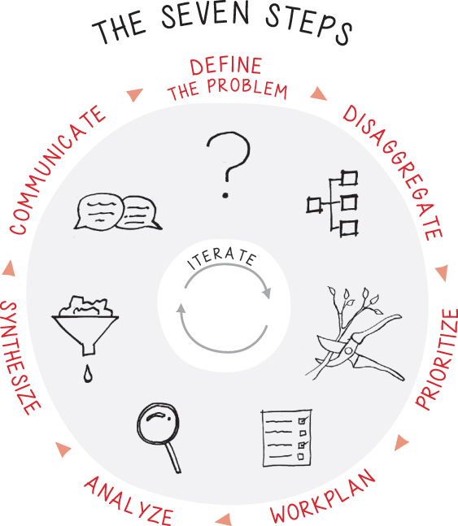
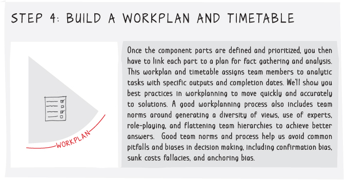
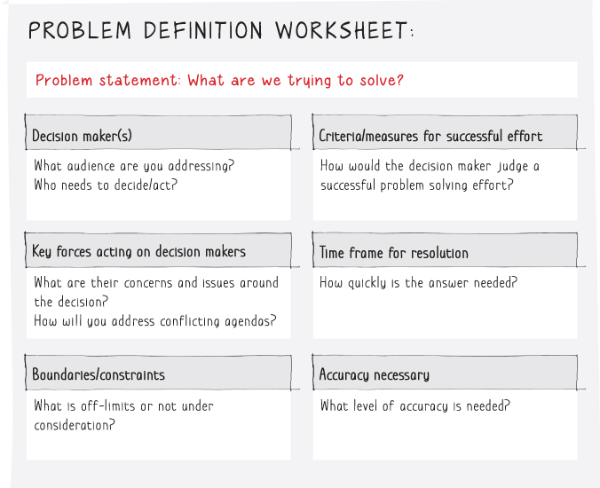
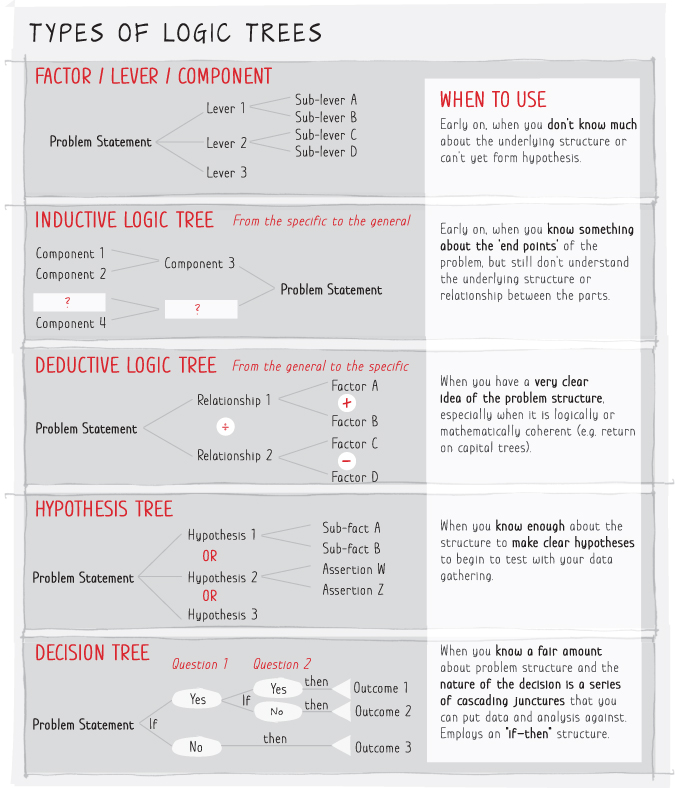
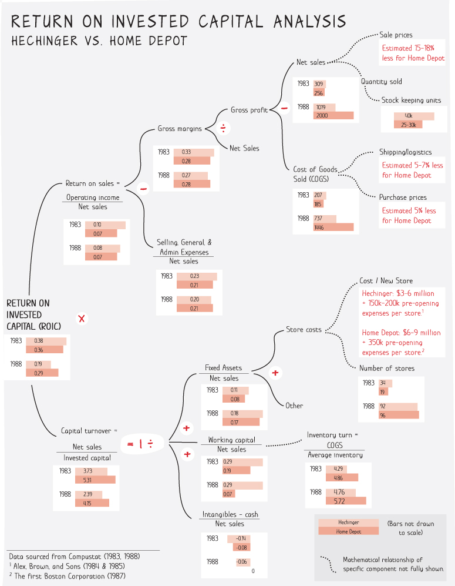
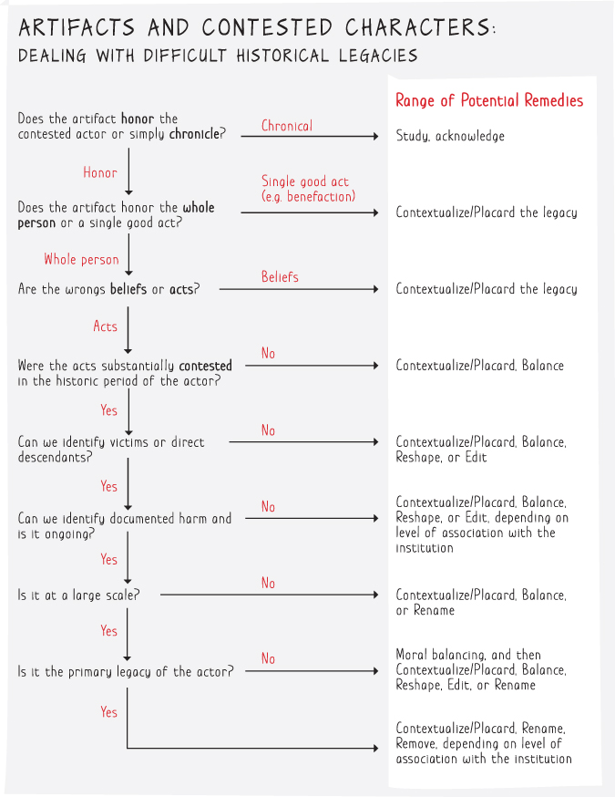
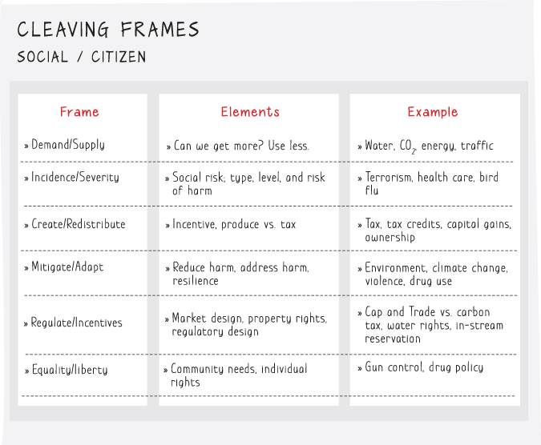
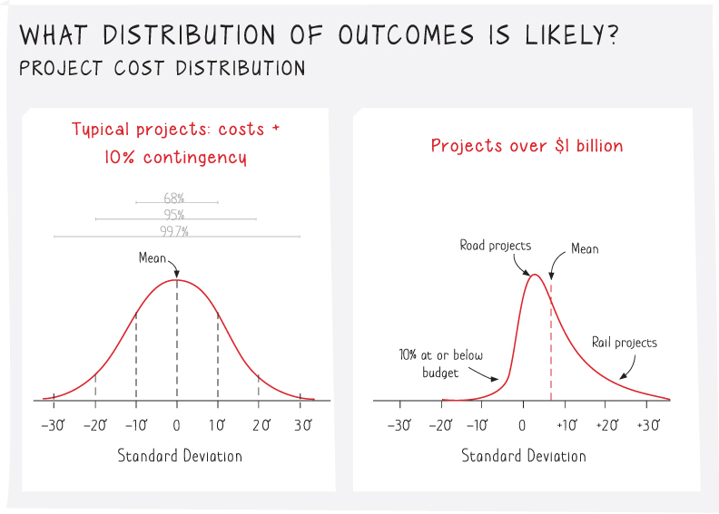

public:: true
tags:: books, reading, [[Problem Solving]], [[q - how can we make better decisions]]

- Reference Notes
	- Introduction
		- Problem solving is decision making when there is complexity and uncertainty that rules out obvious answers and where are consequences that make the work to get good answers worth it
		- ^^Ruthless focus on execution assumes you have strategic direction right and can adapt to new competition, frequently from outside your industry.^^
			- (Make sure you have a good strategy in place or you will execute perfectly a bad idea. Prioritize strategy and upfront thinking before optimizing your processes)
		- Managerial Skills Evolution
		  collapsed:: true
			- 
		- Seven Steps of Problem Solving
		  collapsed:: true
			- 
		- Common Mistakes in Problem Solving
		  collapsed:: true
			- Weak problem statements.
				- Too many problem statements lack specificity, clarity around decision‐maker criteria and constraints, an indication of action that will occur if the problem is solved, or a time frame or required level of accuracy for solving the problem. Rushing into analysis with a vague problem statement is a clear formula for long hours and frustrated clients.
			- Asserting the answer.
				- The assertion is often based on experience or analogy (“I've seen this before”), without testing to see if that solution is really a good fit for the problem at hand. Answers like this are corrupted by availability bias (drawing only on facts at hand), anchoring bias (selecting a numerical range you have seen already), or confirmation bias (seeing only data that aligns with your prejudices).
			- Failure to disaggregate the problem.
				- We see few problems that can ever be solved without disaggregation into component parts. A team looking at the burden of asthma in Sydney got the critical insight into the problem only when they broke it down along the lines of incidence and severity. In Western Sydney the incidence of asthma was only 10% higher than Northern Sydney, but deaths and hospitalization were 54–65% greater. The team was familiar with research that linked asthma with socioeconomic status and tree cover. It turns out that socioeconomic status is significantly lower in Western Sydney, tree cover is about half Northern Sydney, and daily maximum particulate matter (PM 2.5) is 50% higher. By finding the right cleaving point to disaggregate the problem, the team was able to focus on the crux of the issue. This led to them proposing an innovative approach to address respiratory health through natural solutions, such as increasing tree cover to absorb particulate matter.
			- Neglecting team structure and norms.
				- Our experiences in team problem solving in McKinsey and other organizations highlight the importance of a diversity of experience and divergent views in the group, having people who are open‐minded, a group dynamic that can be either competitive or collaborative, and training and team processes to reduce the impact of biases. This has been underscored by recent work on forecasting.8  Executives rank reducing decision bias as their number one aspiration for improving performance.9  For example, a food products company Rob was serving was trying to exit a loss‐making business. They could have drawn a line under the losses if they took an offer to exit when they had lost $125 million. But they would only accept offers to recover accounting book value (a measure of the original cost). Their loss aversion, a form of sunk‐cost bias, meant that several years later they finally exited with losses in excess of $500 million! Groupthink amongst a team of managers with similar backgrounds and traditional hierarchy made it hard for them see the real alternatives clearly; this is a common problem in business.
			- Incomplete analytic tool set.
				- Some issues can be resolved with back of the envelope calculations. Others demand time and sophisticated techniques. For example, sometimes no amount of regression analysis is a substitute for a well‐designed, real‐world experiment that allows variables to be controlled and a valid counterfactual examined. Other times analysis fails because teams don't have the right tools. We often see overbidding for assets where teams use past earnings multiples rather than the present value of future cash flows. We also see underbidding for assets where development options and abandonment options, concepts akin to financial options, are not explicitly valued. How BHP, an Australian resource company, addressed these issues is developed in Chapter 8.
			- Failing to link conclusions with a storyline for action.
				- Analytically oriented teams often say, “We're done” when the analysis is complete, but without thinking about how to synthesize and communicate complex concepts to diverse audiences. For example, ecologists have pointed to the aspects of nature and urban green spaces that promote human well‐being. The message has frequently been lost in the technical language of ecosystem services—that is, in describing the important role that bees play in pollination, that trees play in absorbing particulate matter, or water catchments play in providing drinking water. The story becomes so much more compelling when, in the case of air pollution, it has been linked to human respiratory health improvements in asthma and cardiovascular disease.10  In this case, by completing the circle and finding a way to develop a compelling storyline that links back to the “hook” of human health makes all the difference in capturing an audience and compelling action.
			- Treating the problem solving process as one‐off rather than an iterative one.
				- Rarely is a problem solved once and for all. Problems we will discuss often have a messiness about them that takes you back and forth between hypotheses, analysis, and conclusions, each time deepening your understanding. We provide examples to show it is okay and worthwhile to have second and third iterations of issue trees as your understanding of a problem changes.
- Chapter 1 - Learn the Bulletproof Problem Solving Approach
	- Problem Solving Steps
	  collapsed:: true
		- 
		  collapsed:: true
			- When a problem's context and boundaries aren't fully described, there is a lot of room for error. The first step in our process is to arrive at a problem definition that is agreed upon by those involved in making a decision.
			- We test the problem definition against several criteria:
				- It is specific
				- Not general, that we can clearly measure success,
				- The definition is bounded both in time frame and by the values of the decision maker
				- It involves definitive action being taken.
				  collapsed:: true
					- This step may appear constraining, but it leads to the clarity of purpose essential for good problem solving.
		- 
		  collapsed:: true
			- Once the problem is defined, it must be disaggregated (or broken down) Into component parts or issues.
				- We employ logic trees of various types to elegantly disassemble problems into parts for analysis, driving from alternative hypotheses of the answer.
				- There is both an art and science to cleaving problems-revealing their fault lines-that drives better solutions. This is the stage at which theoretical frameworks from economics and science provide useful guides to better understanding the drivers of your problem solution. We usually try several different cuts at disaggregation to see which yields the most insight.
		- 
			- ^^The next step is to identify which branches of the logic tree have the biggest impact on the problem, including which you can most affect, and focus your initial attention on these.^^ We employ a simple matrix of size of Impact of each lever and ability to move the lever as a way to prune our logic trees. Prioritizing analyses helps us find the critical path to the answer efficiently, making the best use of team time and resources.
		- 
			- Once the component parts are defined and prioritized, you then have to link each part to a plan for fact gathering and analysis. This workplan and timetable assigns team members to analytic tasks with specific outputs and completion dates. We'll show you best practices in workplan to move quickly and accurately to solutions. A good workplan process also includes team norms around generating a diversity of views, use of experts, role-playing, and flattening team hierarchies to achieve better answers. Good team norms and process help us avoid common pitfalls and biases in decision making, including confirmation bias, sunk costs fallacies, and anchoring bias.
		- 
			- Data gathering and analysis is often the longest step in the process. For speed and simplicity we start with simple heuristics- short cuts or rules of thumb-to get an order of magnitude understanding of each problem component, and to assess priorities quickly. This helps us understand where we need to do more work, and especially when and where to use more complex analytic techniques, including game theory, regression, Monte Carlo simulation, and machine learning. Don't worry! Complex techniques are rarely needed, and when they are, new online analytical tools make them much more accessible than you think. To keep the team on the critical path we make frequent use of one-day answers that summarize our best understanding in the form of situation, observations, and initial conclusions-and team review sessions to pressure-test these hypotheses.
		- 
			- Problem solving doesn't stop at the point of reaching conclusions from Individual analyses. Findings have to be assembled into a logical structure to test validity and then synthesized in a way that convinces others that you have a good solution. Great team processes are also important at this stage.
			-
		- {:height 337, :width 632}
			- The final step is to develop a storyline from the conclusions that links back to the problem statement and the issues that were defined. A powerful communication will use a governing thought or argument that derives from your refined situation- observation-conclusion logic from earlier stages. This will be supported with your synthesized findings and assembled into component arguments that may follow inductive or deductive logic. It will either lead with action steps, or pose a series of questions that motivate action, depending on audience receptivity.
	- Decision Trees or Issue Trees
		- ^^Provides a clear visual representation of the problem so that everyone can understand the component parts^^
		- Done correctly, they are holistic in the sense that everything relevant is capture in the tree
		- Lead to clear hypotheses that can be tested with data and analysis
	- Example Problems with Decision Trees
		- Does Sydney Airport Have Adequate Capacity?
			- {:height 457, :width 669}
		- Should Rob Install Solar Panels on His Roof Now?
			- 
		- Where to Live?
			- 
			- 
			- 
		- Making Pricing Decisions in a Start-up Company
			- 
				- Truckgear's problem is the costs of materials and manufacturing brings down the variable unit margin.
			- 
				- A price increase of 7% yields $350k in profit but is offset by only a loss of 650 units. How will the market respond to a price increase? Will the losses of sales neutralize the price increase?
			- These kinds of trees are helpful solving problems that involve monetary trade-offs of alternative strategies.
	- You need to ensure that the variables you are considering are truly impactful to the problem you're solving when creating branches for the decision tree.
	  collapsed:: true
		- Ex: Charles Support the Local School Levy?
			- 
- Chapter 2 - Define the Problem
  collapsed:: true
	- Getting a crystal-clear definition of the problem we are solving is the critical point for problem solving.
		- Don't take action without having a clear definition and well defined boundaries of the success criteria, time frame or level of accuracy required.
		- This even gates research and data gathering. A scattergun approach to data gathering an initial analysis leads to wasted effort.
	- Good [[problem statement]]s have these characteristics:
	  id:: 62aa5b7e-d37f-4bab-b482-88d613b2eb1c
		- {:height 309, :width 369}
		  id:: 62aa5f67-d7c0-44bb-b364-4f96a50095bb
		- Outcomes focused: A clear statement of the problem to be solved, expressed in outcomes, not activities or intermediate outputs
		- Specific and measureable wherever possible
		- Clearly time-bound
		- Designed to explicitly address decision-maker values and boundaries, including the accuracy needed and the scale of aspirations
	- Example Problem Worksheet
		- Initial Problem Worksheet
			- {:height 661, :width 601}
		- Iteration of the problem statement
			- 
	- Defining the Highest Level Problem
		- When possible give flexibility to the scope or width of the problem space to enable you to explore surrounding and maybe more crucial problems—possibly the real problem statement from what was originally proposed.
		- One of the fundamental principles in problem definition is to solve the problem at the highest level possible—the most granular and local solutions are often not optimal for the larger organization.
	- Refining and Sharpening the Problem Statement
		- The best problem statement may not come out the first try and may need widening, rescoping, and reframing. Don't commit to your initial problem statement, without exploring the problem space and iterating the statement.
		- Problem statements keep improving when facts are surfaced to sharpen the problem definition. Setting up dialogue with questions that have to be answered is key to getting the required sharpness definitions.
	- Design Thinking
	  collapsed:: true
		- 
			- Design thinking is a powerful model that can be used for problems tackling consumer needs and the user experience.
			- A user-centered approach is fundamental to problem solving requiring significant amounts of time empathizing and understanding the user and their pain points. this is done through patient, sustained interactions over time, including interviewing, observing, and researching.
			- Design thinking starts with understanding the potential user's needs. The first step is learning what the needs are with empathy, recognizing why the product or solution could be relevant, and how will it be used within their everyday life.
			- The cycle to empathize and then build‐test‐redefine, and build‐test‐redefine again, is based on an idea that you don't have to make decisions based on historical data and instinct. Rather, decisions can evolve, based on evidence from users' reactions to successful or failed prototypes.
- Chapter 3 - Problem Disaggregation and Prioritization
  collapsed:: true
	- Any problem of consequence is going to be too complicated to solve without breaking it down into logical parts that help us understand the drivers or causes of the situation.
	- Breaking down the problem into smaller pieces allows us to see potential pathways to solve it. At the same time we can discern which options not to work on—the parts that are either too difficult to change or those with minimal impact.
	- Logic Trees
		- Logic trees allows to structure a problem and see the elements of it in a clear way and allows us to keep track of different levels of the problem—the leaves, trunks, or branches of the logic tree.
		- Early in the problem solving process we usually employ component or factor trees, and often work inductively (learning from specific cases that illuminate general principles later), to help define the basic structure.
			- In the beginning when we can clearly state the problem clearly but don't yet have a detailed understanding of the problem to provide a vantage point of the solution, it makes sense to employ the simplest kind of tree, a component or factor tree.
			- 
			- Example component tree:
				- 
					- To get to this stage we read everything we could find about salmon and talked to a number of experts in salmon conservation. That involved days of work, not weeks—our experience is that you should only do enough initial research to generate a first‐cut tree, since the tree structure will act as a guide to make further research more efficient.
					- As you can see, this first‐cut tree is busy. It helps us see the big levers that affect salmon, but it doesn't have much insight coming through
					- Find the prioritization of impact of each lever so you choose which ones to act on. Additionally the component tree doesn't show the magnitude of impact of each lever, address regional factors or other government regulatory impacts.
		- After using component trees and after iterations with data and analysis to help us graduate to hypothesis trees, deductive logic trees, or decision trees, depending on the nature of the problem. Move from tress with general problem elements to trees that state clear hypotheses to test, vague labels do not drive analysis or action.
			- The goal of logic trees is to find the levers that help us crack our problems, starting with the components that can focus data gathering and eventually move us toward good hypotheses that can be tested.
			- 
		- Trees should have branches that are [[MECE]] :
			- Mutually Exclusive
				- The branches of the tree don't overlap, or contain partial elements of the same factor or component. This is a little hard to get your head around, but it means that the core concept of each trunk or branch of the problem is self‐contained, not spread across several branches.
			- Collective Exhaustive
				- Taken as a whole, your tree contains all of the elements of the problem, not just some of them. If you are missing parts, you may very well miss the solution to your problem.
			- 
			- Example of improved MECE tree:
				- 
	- Constant iteration is the key to making the seven steps of problem solving work.
	- Deductive Logic Trees
		- Referred to as Top-down reasoning because when we apply it we argue from general rules or principles to conclusions via more specific data and assertions. Example:
			- General Statement: All watchmakers need glasses.
			- Specific observation: Sally is a watchmaker.
			- Deductive conclusion: Sally needs glasses.
		- In deductive trees, the problem statement may sometimes be expressed in quantities and branches that are logically or mathematically complete so the components add up to the desired objective of the problem statement.
		- Deductive trees are used when we know a lot about the logical structure of the problem, and when the cleaving frame is inherently mathematical such as return of investments problems.
			- 
			- 
			- 
	- Inductive Logic Trees
		- Are the reverse of deductive logic trees, they work from the specific observations towards general principles. Example:
			- Observation: Sally is a watchmaker and wears glasses.
			- Observation: Shaun is watchmaker and wears glasses.
			- Observation: Steven is a watchmaker and wears glasses.
			- Inductive assertion: Watchmakers typically wears glasses.
		- Inductive logic trees are used when we do not know much about the general principles behind the problems we are interested in, but we do have some data or insights into specific cases.
		- Inductive trees show probabilistic relationships, not causal ones.
		- In many cases we will work on our problem inductively and deductively, working iteratively until we figure out which components are our biggest drivers of the problem space.
		- Example of working backwards from how people judge:
			- 
			- 
	- Prioritization—Pruning Your Logic Trees
		- Before investing significant time and effort into work planning, we need to prune our logic trees first.
		- We can use influence vs  impact matrix to help us prioritize the branches
			- 
		- Cleaving Frames to Take Apart Problems
			- We can use theoretical constructs or frameworks to quickly and powerfully disaggregate problems we're solving. They can help us visualize the same problem through different lenses.
			- 
			  collapsed:: true
				- Price and Volume:
					- One of the key elements of our return on capital tree is the revenue drivers branch that focuses on product pricing and volume.
					- This frame raises questions about the nature of the competitive game:
						- Are there differentiated products or commodities?
						- Are there competitive markets or oligopoly markets controlled by a few players?
						- Each has different dynamics and good business problem solvers build these into their disaggregation and research plans.
						- The kinds of elements here often include assumptions about market share, new product entry, rate of adoption, and price and income elasticities.
				- Principal and Agent:
					- These types of problems occur where certain activities are done by agents (think contractors or employees) on behalf of principals (investors or managers).
					- The core of this type of problem is the need to create incentive structures to align interest of the principal agent, when the principal has incomplete visibility  or control over the work of the agent.
						- The best structures provide good, checkable results for the investor and fair incomes for the contractor. It sounds easy but it isn't. This kind of problem appears not just in contracting situations, but also in any second‐hand asset sale and in any insurance problem.
				- Assets/Options:
					- Every asset a company controls, or could purchase, creates options for future strategic moves that may have substantial value.
				- Collaborate/Compete:
					- Any business strategy needs to take account of the potential reaction by rival firms. Each company needs to decide where it is willing to engage in intense competition (say based on pricing or large investments) and other cases where it is not, either because of the nature of the market or the nature of the other competitors. The tools and elements in this frame are those from game theory, and include concepts such as multi‐play games and reputation.
			- 
				- Regulate/Incent:
					- Policy makers often face the choice of adding legal regulation to address a problem, or using taxation, subsidies, or nudging policies that provide incentives for people or firms to adopt the desired behavior. This frame frequently comes into play around pollution and other externalities.
				- Equality and Liberty:
					- Many policy decisions to address social problems face the fundamental frame of encouraging more equality among citizens, versus allowing more individual freedom.
				- Mitigate and Adapt
					- This frame contrasts policy efforts to reduce harm from some causal factor, with efforts to adapt to the factor. This is often the axis in the climate.
				- Supply and Demand:
					- This frame addresses questions such as "Can we get more?" versus "How can we use less?" and is often the lens employed for problems like water supply, health care, and energy.
				- 
				-
			- 
			- The most powerful way to reach a useful disaggregation of ap problem is to start with a particular cleaving frame and then do some back of the envelop calculations (quick and rough) to confirm that it would provide insight.
			- Different frames yield different insights, so it makes sense to test several. And you can often try a social frame on a business problem and vice versa.
			- Team Processes in Problem Disaggregation and Prioritization
				- These problem solving steps benefit substantially from teamwork, and solo practitioners should consider enlisting family or friends to assist them.
				- Reliance on external views creates a risk of applying incorrect frames (while consulting literature for best practices). Pay careful attention to your own self-bias to be heavily invested in your own ideas in favor of more optimal options that aren't yours.
				- Don't be afraid to rely on the creativeness of your team and your own innovative thinking.
- Chapter 4 - Build a Great Workplan and Team Processes
  collapsed:: true
	- Pay careful attention to finding the critical path. It is the continuation of the prioritization process and it means high-grading the analysis you use to solve problems so that you are always working on the parts that have the highest probability of yielding insight.
		- Workplanning and the frequent iterations that follow the initial plan are the way you stay on that critical path.
	- Workplanning and Project Management
		- 
		- Don't do work that isn't supported by deep thinking like a clear and testable hypothesis.
		- Don't build a model without a very good idea bout what questions it answers.
		- Sharpen your thinking through dummying what the output might take (visualize what you want the output will be, dummying the chart). This helps you identify when you have the what you want since you visualized  it earlier.
		- 
		- Example of a workplan: Bay Area Nursing
			- 
		- Knock-out analysis involves making estimates of the importance of a variable and the influence you can have on it, an estimate of expected value, the first cut of which comes out of your prioritization matrix.
			- The results from a knock-out analysis means we can prune out lines of inquiry, they're not worth our time.
		- Chunky Workplans and Learn Project Plans
			- Lean towards lean project plans that clear, precise and focused as opposed to large workplans.
			- 
		- One-Day Answers
			- Use one-day answers to avoid paralysis analysis and start working once you have a clear understanding of your problem.
			- Structuring the one-day problem:
				- A short description of the situation that prevails at the outset of problem solving. This is the state of affairs that sets up the problem
				- A set of observations or complications around the situation that creates the tension or dynamic that captures the problem. This is typically what changed, or what went wrong that created the problem.
				- The best idea of the implication or resolution of the problem that you have right now. At the beginning this will be rough and speculative. Later it will be a more and more refined idea that answers the question, "What should we do?"
			- One day answers should be crisp and concise. No 40 bullet points.
				- 
			- Example for Hechinger vs Home Depot
				- Situation: Hechinger is a dominant player with a long and successful history in one region and seeks to expand.
				- Complication: A new competitor, Home Depot, has emerged with a warehouse superstore model that appears to be growing much faster, driven by substantially lower pricing. Their business model is different, and compensates for lower prices by sourcing economies, lower cost logistics, and higher asset productivity. They will soon have geographic overlap with Hechinger.
				- Resolution: To remain competitive, Hechinger needs to quickly reform its inventory management and logistics systems, and develop lower‐cost sourcing models, to allow lower pricing—or it will face a real threat even in its core markets.
	- Great Team Processes for Workplanning and Analysis
		- Good Teams Exhibit:
			- The best teams typically have relatively little hierarchy in the structure of brainstorming and ideation.
			- They are hypothesis drive and end-product oriented
				- They use strong hypotheses to guide workplanning and analyses. They are trying to disprove their hypothesis because a strong hypothesis are easier to challenge and pressure test.
				- Clearly define and scope y our outcome that it unambiguously resolves an issue or sub-issue.
			- They porpoise frequently between the hypothesis and data.
				- Good teams are flexible in the face of new data. They are ready to cease analysis where it has reached a dead end and start work on promising new lines of inquiry.
			- They look for breakthrough thinking rather than incremental improvements
				- They do this by asking about performance limits and reference points for best practice, and the distance they for those limits.
				- Example: A mining company using large, heavy vehicles was exploring whether they could do tire changes more quickly. They asked who did tire changes fastest and had the most experience in the world. The answer was Formula 1. The mining team then visited Formula 1 racing pits to learn about how they could improve their processes. That is creativity!
	- Team Behaviors to Avoid Bias and Error
		- 
			- ^^Confirmation bias^^ is falling in love with your one‐day answer. It is the failure to seriously consider the antithesis to your thesis, ignoring dissenting views—essentially picking low hanging mental fruit.
			- ^^Anchoring bias^^ is the mistaken mental attachment to an initial data range or data pattern that colors your subsequent understanding of the problem.
			- ^^Loss aversion^^, and its relatives, the sunk cost fallacy, book loss fear, and the endowment effect, are a failure to ignore costs already spent (sunk) or any asymmetric valuing of losses and gains.
			- ^^Availability bias^^ is use of an existing mental map because it is readily at hand, rather than developing a new model for a new problem, or just being influenced by more recent facts or events.
			- ^^Overoptimism^^ comes in several forms including overconfidence, illusion of control or simply failure to contemplate disaster outcomes.
		- Team Design to Avoid Bias
			- ^^Diversity in team members:^^ Building a team with different backgrounds, experience, and perspectives helps create an environment of openness to new ideas and approaches. [[Brainstorming]] with a diverse range of others, insiders, and outsiders can help if you are working solo. Though be careful ((62660380-0eb0-4cbd-a12d-07fa8b41799f))
			- ^^Always try multiple trees and cleaves:^^ Even when it seems the first frame you try perfectly fits the problem, still try multiple frames to see what different questions and insights emerge.
			- ^^Try adding question marks to your hypotheses:^^ Research suggests that active questioning moves our brains into discovery mode, away from questioning mode.
			- ^^Obligation to dissent:^^ It should be okay to give your dissent even in front of clients.
			- ^^Explicit downside scenario and pre-mortem analysis:^^
				- Improbable jumps or discontinuous events do occur, and long‐tailed distributions (irregular‐shaped statistical distributions with a long tail on one side, indicating small but measurable probability for even extreme events) mean we should take these into account in our problem solving and modeling. This means that we should explicitly model not just a narrow band (expected case, downside case) of values, but more extreme downside cases. A related idea is to do pre‐mortem analysis, where the team works through all the implications of even unlikely failure cases.
			- ^^Good analytics techniques:^^ use good analytic techniques, including problem/model design, net present value analysis, marginal analysis, and use of cash flows rather than accounting book values.
			- ^^Broaden your data sources:^^ use surveys, crowd sourcing alternative data, A|B testing, etc.
			- 
		-
	- Agile Team Processes
		- 
	- Traits of good problem solvers  [[Problem Solving]]
	- 
	-
- Chapter 5 - Conduct Analyses
  collapsed:: true
	- How you approach gathering facts and conducting analyses to test your hypotheses often discerns between good and bad problem solving, even when the earlier steps were followed carefully.
	- Good problem solvers have toolkits at their disposal to help them work efficiently, starting with heuristics and rules of thumb to understand the direction and magnitudes of relationships that allows them to **focus attention on the most important issues.**
	- Heuristics and Rules of Thumb
		- Heuristics are tools that help us take shortcuts in analysis through sizing the different elements of the problem to determine the efficient path in further analysis.
		- They can be dangerous when applied incorrectly.
		- 
			- Occam's Razor
				- Favor the simplest solution that fits the facts. Select the hypothesis that has the fewest assumptions and avoid complex, indirect, or inferential explanations, at least as a starting point.
				- However, don't get committed to a simple answer when the facts and evidence are pointing to a more nuanced or complex answer.
			- Order of magnitude
				- Used to prioritize team efforts by estimating the size of difference between levers.
			- Pareto Principle or 80/20 Thinking
				- Focus your analytical efforts on the most important factor.
			- Compound Growth - Rule of 72
				- Is key to understanding how wealth builds, how enterprises scale quickly, and how some populations grow.
				- The rule of 72 allows you to estimate how long it takes for an amount to double given it's growth rate.
					- Example: if the growth rate is 5% then 72/5 = 14.4 years to double.
			- S-Curve or Adoption Model
				- Useful for estimating the adoption rate for a new innovation. It shows a common pattern of sales with a new product or a new market. It is drawn with the percent of full adoption potential on the Y-axis and the years since adoption on the X-axis.
				- 
			- Expected Value
				- The value of an outcome multiplied by its probability of occurring. That is called a single point expected value, but it is usually more useful (depending on the shape of the distribution) to take the sum of all probabilities of possible outcomes multiplied by their values. Expected value is a powerful first‐cut analytic tool to set priorities and reach conclusions on whether to take a bet in an uncertain environment. As an example, in venture capital the goal could be expressed as the desire to create a unicorn—a billion‐dollar company. The probability of reaching unicorn status calculated for Silicon Valley in recent years turns out to be 1.28%.6 The single point expected value is $1 billion times 1.28% or $12.8 million. No wonder many 22 year olds enter risky entrepreneurial ventures against the odds when their next best alternative could be $50k a year working in a call center! But be careful: Single point expected value calculations are most useful when the underlying distribution is normal rather than skewed or long tailed. You check that by looking at the range, and whether the median and mean of the distribution are very different from each other.
			- Bayesian Thinking
				- Conditional probability, which is the probability of an event given another event took place. For example it is more likely to rain if the preceding event was a cloudy day instead of a sunny day.
			- Reasoning by Analogy
				- An analogy is when you have been seen a particular problem structure and solution before that you think may apply to your current problem. Analogies are powerful give you have the right reference class (correctly identified the correct structure type) and dangerous if you don't.
					- To check this we can line up all the assumptions that underpin a reference class and test the current case for fit with each.
					- Example: Our colleague Professor Dan Lovallo has looked at how you can use reference classes to predict movie revenues. He takes a genre like drama, the presence of well known or little‐known stars, and the budget, and then creates a model based on the reference class of movies to compare with the one to be made. This can be surprisingly accurate and produce results better than a more complex regression model.
				- There are limits to reasoning by analogy. For example:
					- When traditional business models in retailing, book publishing, and real estate were first challenged by disruptive Internet models, there weren't useful prior analogies to draw on, to explain how the competitive dynamics would play out.
					- In the liquor market in Australia, a beer company acquired a wine company, reasoning that they were in the alcoholic beverages market and had common customers and distribution requirements. The differences in product range, brand management, customer segments, and working capital requirements meant in practice they had few success factors in common.
					- Halo effects follow executives who have led turnarounds, assuming that their success will be replicated in new settings. “Chainsaw” Al Dunlap had such a reputation based on a turn‐around at Scott Paper, but was fired in his new role at Sunbeam less than two years into the role.
			- Break-even point
				- The level of sales where revenue covers cash costs. It's a simple bit of arithmetic to calculate, but requires knowledge of marginal and fixed costs, and particularly how these change with increased sales volume. The break‐even point in sales dollars or units equals fixed costs/unit price less unit variable costs. Typically, the unit price is known. The tricky part is how fixed costs will behave as you scale a business.
			- Marginal analysis
				- A related concept that is useful when you are thinking about the economics of producing more, consuming more or investing more in an environment with scare resources. Rather than just looking at the total costs and benefits, marginal analysis involves examining the cost or benefit of the next unit.
			- Distribution of outcomes
				- 
				- Many common errors relating to distribution of outcomes are:
					- Placing too  much emphasis on the mean outcome, typically base case
					- Insufficient weight on outcomes that are one or even two standard deviations from the mean in a normal distribution
	- Question-Based Problem Solving
		- The next step after a rough idea of scale and direction of your problem levers through heuristics is digging deeper through analysis.
		- Asking questions like who, what, where, when, how, and why is a powerful root-cause tool to quickly focus problem solving.
			- Example: How to classify heart attack patients
				- 
			- Example: How to decide whether to get knee-surgery
				- 
			- Smart analysis starts with heuristics and summary statistics to assess the magnitude and direction of key problem levers. We can turn to asking questions when we have a good sense of the underlying relationships. (Information gotten through research and analysis)
			- [[Root Cause Analysis]]
				- A problem solving tool that also uses questions, the [[The Five Whys]], to get to the bottom of a problem. We can use a fishbone diagram to illustrate this method.
				- 
				- Example: Root Cause of Market Share Loss
					- 
					-
				-
- Chapter 6 - Big Guns of Analysis
  collapsed:: true
	-