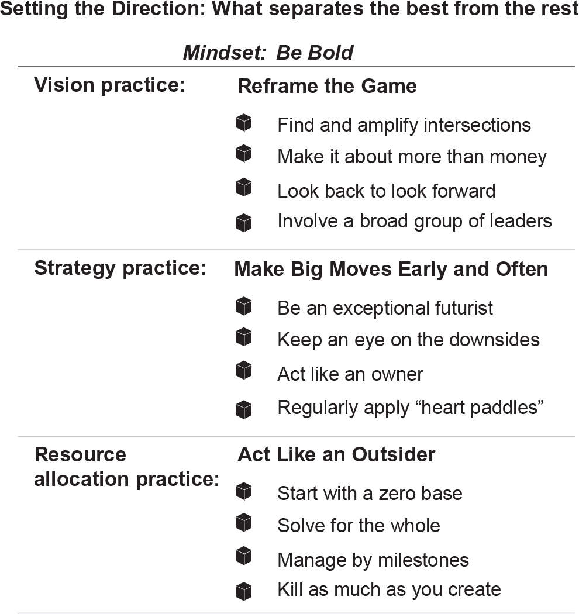

title:: CEO Excellence (highlights)
author:: [[Carolyn Dewar]]
full-title:: "CEO Excellence"
media:: #books
status:: #📥inbox 
Related Notes:: [[Books - CEO Excellence]]

- Highlights first synced by [[Readwise]] [[2023-05-24]]
	- From our interviews *six* key responsibilities emerged: setting the direction, aligning the organization, mobilizing through leaders, engaging the board, connecting with stakeholders, and managing personal effectiveness. And each of these responsibilities had a number of sub-elements. For example, setting the direction has sub-elements related to choosing the vision, deciding on the strategy, and allocating resources. Aligning the organization has facets related to culture, organization design, and talent management. And so on. As we kept interviewing CEOs, they time and again validated our conclusion that the six responsibilities and their sub-elements were all important to being successful in the role.
	  
	  {:height 465, :width 630}
	  
	  These six responsibilities aren’t unique to the best CEOs—they just describe fully what the job is. ([View Highlight](https://read.readwise.io/read/01h17hm1qesy5c5xeeh7se3p47))
	- What *is* unique to the best is the mindset with which they approach each of the six responsibilities, and the actions they take on each sub-element. These are what enable great CEOs to, in the words of Eaton’s former CEO Sandy Cutler, “**play big ball, not small ball. By that I mean spending time on things that no one else can in ways that magnify your effectiveness without getting mired in things that don’t make a difference**.” ([View Highlight](https://read.readwise.io/read/01h17j28q39fj7ggfxxpq43ydk))
	- After looking hard at the data, we concluded that there is no clear pattern. How the CEOs prioritize each of the six responsibilities depends on a complex interplay between the specific business situation and the CEO’s unique capabilities and preferences. The key takeaway was that despite their different approaches, every CEO at every stage of their tenure meaningfully tended to all six responsibilities. The best CEOs kept all six plates spinning at all times, even if the external and internal environment meant that some needed to be spun faster or slower than others. ([View Highlight](https://read.readwise.io/read/01h17j88gs82t4jx17ar6z2dbb))
	- we found the best CEOs exhibit no such pattern. They instead create significant value on a sustained basis year after year during their tenures. They do so by periodically redefining what it means to win and refreshing their strategies with new, bold actions. ([View Highlight](https://read.readwise.io/read/01h17jk7hbp81srm8t8ncxtgmp))
		- **Note**: The pattern among some CEOs was they performed well the first year and slumped their sophomore years and junior years and later recovered on their more senior years.
		- The best CEOs performed consistently through their tenure.
	- **“The CEO role is the intersection of all contradictions.”** Interview after interview brought to light the kinds of contradictions Aschenbroich was referring to. **Delivering short-term results versus investing in long-term performance. Taking time to gather facts and do analyses versus moving fast to capture opportunities. Respecting the past and creating continuity vs. disrupting the future. Maximizing value for shareholders versus delivering impact for other stakeholders. Having confidence to make tough calls versus having humility to ask for and receive feedback.** You might say that F. Scott Fitzgerald’s observation that “the test of a first-rate intelligence is the ability to hold two opposed ideas in the mind at the same time, and still retain the ability to function” applies fully to the role of the CEO. As we’ll see in the chapters to come, the best CEOs masterfully reconcile these apparent contradictions to create positive and mutually reinforcing outcomes. ([View Highlight](https://read.readwise.io/read/01h17jxfa0d4s2egbyate6nwm2))
	- **Keep in mind that we’re not suggesting that the best CEOs excel in *every* aspect of the role—in fact, we’ve yet to meet one who does. Rather, the best CEOs are excellent in a few areas, and do a solid if not exemplary job in the others.** ([View Highlight](https://read.readwise.io/read/01h17mbw8301g546w1p3c2ra6v))
	- In today’s complex world, many CEOs try to minimize uncertainty and guard against making mistakes. It sounds sensible. After all, the old adage that “discretion is the better part of valor” would seem to make sense for a job that has such a huge impact on a company’s stakeholders. Ultimately, however, such a cautious mindset has proven to deliver results that follow the dreaded “hockey stick” effect, consisting of a dip in next year’s budget followed by the promise of success, which never occurs. ([View Highlight](https://read.readwise.io/read/01h17me5rv1pfk6jhpd5k577ck))
		- **Note**: How is this mindset demonstrated in OBI and our self?
	- The best CEOs recognize this dynamic and, in turn, approach setting the direction of their company with a different mindset. **They embrace uncertainty with a view that fortune favors the bold. They’re less a “taker” of their fate and more a “shaper”—constantly looking for and acting on opportunities that bend the curve of history.** CEOs who embrace this mindset are well aware that only 10 percent of companies create 90 percent of the total economic profit (profit after subtracting the cost of capital) and that the top quintile performers deliver thirty times more economic profit than the companies in the next three quintiles combined. And here’s the kicker: The odds of moving from being an average performer to a top-quintile performer over a ten-year period are only one in twelve.[12](#ch00note-12) ([View Highlight](https://read.readwise.io/read/01h17mdk37e751rgtsdzxwvkjj))
	- Knowing just how low the odds of success are, the best CEOs apply boldness to each of the three dimensions of direction setting—vision, strategy, and resource allocation ([View Highlight](https://read.readwise.io/read/01h17mftxcsxw9fg43zn374eyp))
	- **As we spoke to the most successful CEOs, we were struck by how they similarly reframed what winning meant for their companies. They didn’t just raise aspiration levels; they changed the definition of success.** ([View Highlight](https://read.readwise.io/read/01h17mh9m55zm4dwqvcfamsdt4))
	- Mastercard’s former CEO Ajay Banga, for example, shares his game-changing vision and how it came about: “I was walking through the office and saw this slogan written in a staircase: ‘Mastercard, the heart of commerce.’ It made me think, ‘But commerce is mostly in cash, right?’ I realized that in the company nobody talked about cash. If anything, they talked about Visa and Amex and China UnionPay and local schemes.
	  
	  “That led me,” he continues, “to figure out the percentage of transactions in the world that were happening with cash. That number exceeded eighty-five percent just for consumer transactions. From then on I talked about our vision as being to ‘kill cash.’ Instead of fighting for a piece of the fifteen percent of transactions that were electronic, we fought for a piece of the eighty-five that weren’t (yet). We then converted the vision of killing cash into strategies for growing the core, diversifying our client base, and building new businesses.” ([View Highlight](https://read.readwise.io/read/01h17mjbmyrc94sfrp2p2s4973))
		- **Note**: This is an example of creating your own space where no one is competing. Instead for fighting for a piece of a pie, create your own. Reference the book Marketing Saves the World.
	- Table 1: What does winning look like for our company?
	  
	  CEO
	  
	  Company
	  
	  “Win the game” vision
	  
	  “Reframe the game” vision
	  
	  Doug Baker
	  
	  Ecolab
	  
	  Lead the industry in industrial cleaning and food safety
	  
	  Lead the world in protecting people and resources
	  
	  Ajay Banga
	  
	  Mastercard
	  
	  Win in payments
	  
	  Kill cash
	  
	  Mary Barra
	  
	  General Motors
	  
	  Win in the global auto industry
	  
	  Win by transforming transportation
	  
	  Sandy Cutler
	  
	  Eaton
	  
	  Top-quartile-performing vehicle component manufacturer
	  
	  Leading energy management company making power safe, reliable, and efficient ([View Highlight](https://read.readwise.io/read/01h17mxg17khe5ab68kf1tg2jz))
	- “You definitely want to define what your space of interest is, what you’ll go after and defend. But firms can get that definition wrong all the time.” ([View Highlight](https://read.readwise.io/read/01h17my7r2d1w9n40v2ed3m581))
	- how the best CEOs get it right—creating a game-changing vision for their organizations. They do so by…
	  
	  •   … finding and amplifying intersections
	  •   … making it about more than money
	  •   … not being afraid to look back to look forward
	  •   … involving a broad group of leaders in the process ([View Highlight](https://read.readwise.io/read/01h17myp37sjhfz04r6cjnz8fn))
	- The best CEOs build their vision by looking for where various aspects of their business and the market intersect. Hubert Joly, the former CEO of electronics retailer Best Buy, explains that setting the right course is, “at the intersection of four circles: what the world needs, what you are good at, what you are passionate about, and how you can make money.” ([View Highlight](https://read.readwise.io/read/01h17mz0ca3zrhby5jj4nxa4vr))
		- **Note**: To market yourself identify the needs of your workplace and what you can offer to create value.
- New highlights added [[2023-05-24]] at 5:01 PM
	- Looking back at the boldly framed visions in table 1, it’s striking that none of these successful companies focused on achieving financial outcomes—profits were an outcome of achieving their vision. Oliver Bäte, CEO of the world’s largest insurance company, Allianz, explains why: “Nobody gets galvanized by, ‘I need to double net profit.’ Sorry, even my top team doesn’t. So the question is, what can you rally people behind? It’s really different to tell people, ‘We want to be the loyalty leader in everything we do,’ than, ‘We want to double return to shareholders.’ ” ([View Highlight](https://read.readwise.io/read/01h17qsbt71xakk3z6ytt6bawt))
		- **Note**: This is an example of when we consider the emotional aspect of executing solutions.
- New highlights added [[2023-05-24]] at 9:50 PM
	- Our most important metrics weren’t revenues and profits but how many seconds it would take until someone else was helped by a Medtronic product. When I joined the company, it was one hundred seconds. When I left the company, it was seven.” The focus on restoring people to full life and health and letting shareholder value creation be an outcome of that creates a powerful motivation far beyond making money ([View Highlight](https://read.readwise.io/read/01h17yygwqem5gtym7r1ydg0v1))
	- Reframing the game doesn’t necessarily mean creating a vision that departs from a company’s heritage. Our research found that the best CEOs often dig back into a company’s history to find out what originally made it successful and then take that central idea and expand it in ways that open up new opportunities. ([View Highlight](https://read.readwise.io/read/01h17yz2tc7w3jq4g3mc949yap))
	- Smith’s advice to new CEOs is to have “a vision that is so clear a leader doesn’t have to do anything but get out of the way. That’s the most inspiring vision of all.”[16](https://readwise.io/reader/document_raw_content/56709668#ch00note-16) ([View Highlight](https://read.readwise.io/read/01h17z42grf831bf48ty8hpwfp))
	- As the leader, you have the power—and the responsibility—to raise the level of ambition in your organization.” Raising the ambition level isn’t just about the vision, however. It involves a highly inclusive process. ([View Highlight](https://read.readwise.io/read/01h17z52ah7ggrwtzva4g563pm))
	- Involve a Broad Group of Leaders
	  
	  The best CEOs create a game-changing vision for their company. When it comes to sharing it with the organization, however, they rarely dictate their views. Why? ([View Highlight](https://read.readwise.io/read/01h17z7nxmyv3t0wed4p28xqxc))
	- people support what they help create.” In fact, they’re some five times more supportive than those who aren’t involved. The underlying psychology relates to our desire for control, which is a deep-rooted survival instinct. ([View Highlight](https://read.readwise.io/read/01h17z7d922ge47d90234bk3ge))
	- The vast majority of excellent CEOs we spoke to found ways to include their employees when setting their vision, with similarly impressive results. Majid Al Futtaim’s Alain Bejjani says, “We aimed to have the most inclusive process possible. Doing so built a broad sense of ownership, and we also found that some of the most insightful answers came from people we wouldn’t normally have approached for input, which in hindsight would have been a significant loss.” ([View Highlight](https://read.readwise.io/read/01h17zhwzrtyax63cgfmqfr7vr))
	- It was somewhat disconcerting to find that the best CEOs used the terms vision, mission, and company purpose as largely interchangeable. Communications and HR professionals, academics, and we as consultants can argue all we want about the nuances of each term, but the fact remains that the best CEOs don’t worry much about the distinctions—what matters for them is to have a clear and simply articulated North Star for the company that redefines success, influences decisions, and inspires people to act in desired ways. ([View Highlight](https://read.readwise.io/read/01h17znrafj5jd198vcb3bsg66))
	- To achieve such impact, the best CEOs apply a mindset of boldness, resulting in a vision that looks beyond winning the game to reframing it ([View Highlight](https://read.readwise.io/read/01h17zp2qk3s8f6s4sw6te98qe))
	- Once the vision is set, regardless of at what point in the journey, CEOs face another challenge: how to make that bold vision a reality. A Japanese proverb puts it starkly: “Vision without action is merely a dream.” We now turn to what the best CEOs actually *do* to make dreams come true. ([View Highlight](https://read.readwise.io/read/01h17zpdzw77xfvn167hwr5wb8))
	- CHAPTER 2 Strategy Practice Make Big Moves Early and Often ([View Highlight](https://read.readwise.io/read/01h17zptr47wpdffjtxxmt2cdq))
	- Kennedy’s story shows how a “be bold” mindset applies not just to vision but to the strategies employed in pursuit of it. A leader who sought to minimize uncertainty and guard against making mistakes would never have chosen as audacious a strategic move as a lunar landing; instead they would have simply increased funding for science and technology. Like Kennedy, the best CEOs boldly make big strategic moves early and often during their tenure. ([View Highlight](https://read.readwise.io/read/01h17zqyk6xdqafr2sn6qy7tc9))
		- **Note**: We also need to allow failure when asking ourselves to make big moves.
	- The research shows the following five strategic moves matter most, as long as they’re pursued with a “man on the moon” kind of boldness:[18](https://readwise.io/reader/document_raw_content/56709668#ch00note-18)
	  
	  1.  **Buy and Sell.** The best CEOs execute at least one deal per year on average, and over a ten-year period these deals cumulatively amount to more than 30 percent of a company’s market cap (although typically no single deal amounts to more than 30 percent of the company’s value). This puts a premium on having a deep capability to identify, negotiate, and integrate acquisitions. The top CEOs are as bold about selling as they are about buying, which can also take the form of spinning off businesses. Aon is a poster child for making deals. In CEO Greg Case’s words, “We’re always shaping and improving our portfolio. Over the last fifteen years, we’ve done over 220 acquisitions and more than 150 divestitures, some big and others small. ([View Highlight](https://read.readwise.io/read/01h17zw1t82vp248ma6ek0rpwf))
	- **Invest.** If you want your company’s investments to be big enough to move the needle, your capital expenditures to sales ratio needs to exceed 1.7 times the industry median for ten years. That’s a big number, but when capital is spent wisely it can enable a company to expand faster than its industry. General Motors’ Mary Barra exemplified this strategic move when she committed more than half of GM’s product development capital ($27 billion through 2025) to pursue leadership in the global electric vehicle market. ([View Highlight](https://read.readwise.io/read/01h17zwyzaa060cz7qk5wmxavy))
	- **Improve Productivity.** The most successful companies reduce administrative, sales, and labor costs more deeply than others, and in so doing achieve 25 percent more productivity improvement than their industry’s median over a ten-year period. This is exactly what Allianz’s Oliver Bäte did to help him pursue his renewal agenda, “Simplicity Wins.” In an industry that had seen flat expense ratios at 30 percent for decades, Bäte—soon after he became CEO—drove the company’s expense ratio below 28 percent while increasing customer loyalty from 50 percent in 2015 to 70 percent in 2019, and increasing internal growth rates from negative rates in 2015 to 6 percent in 2019 ([View Highlight](https://read.readwise.io/read/01h18018q1fjrmkccq8ge5b05j))
	- **Differentiate.** The best CEOs improve their business models and create pricing advantages in ways that are big enough to change a company’s trajectory. As a result, their companies achieve an average gross margin that exceeds the industry’s by 30 percent or more over a decade. Former LEGO CEO Jørgen Vig Knudstorp used this strategic move well in pursuing what he called, “a strategy of niche differentiation and excellence” that aimed to refresh at least half the company’s core products every year. He created, for example, digital platforms that strengthened communication among LEGO fans, developed products for girls, licensed collections (e.g., Star Wars), and launched the successful LEGO movie franchise. ([View Highlight](https://read.readwise.io/read/01h1801gpss7w0z7kvwt5yvsnc))
	- **Allocate.** This move is deemed big when a company shifts more than 60 percent of its capital expenditures among business units over ten years. Doing so creates 50 percent more value than companies that reallocate more slowly. Resource reallocation involves more than just capital, however; it also means shifting operating expenditure, talent, and management attention to where it does the most good. As such, it’s a vital enabler of the other four big moves and given its importance it will be covered in the next chapter, and then again when we talk about talent, and further still when we talk about leading the top team and creating the right operating rhythm. ([View Highlight](https://read.readwise.io/read/01h1801q8zwaxxw79qcchq7dh8))
	- CEOs who make too few moonshot-size moves—or make them too late in their tenure—fall behind the pack ([View Highlight](https://read.readwise.io/read/01h1806khnfzx74s5tm3stk939))
	- Meanwhile, the research also shows that making two of these big moves more than doubles the likelihood of rising from the middle of the pack to the top, and executing three or more makes such a rise six times more likely. Furthermore, CEOs who make these moves earlier in their tenure outperform those who move later, and those who do so multiple times in their tenure avoid an otherwise common decline in performance over time. ([View Highlight](https://read.readwise.io/read/01h180792z1zp923f47akn79tw))
	- While the research is categorically clear on what separates the best from the rest, every CEO needs to determine which specific big strategic moves make sense for their company ([View Highlight](https://read.readwise.io/read/01h1807mk71337n5m480g0z36h))
	- Be bold and be right. If you’re not bold, you’re not going to do much of anything. If you’re not right, you’re not going to be here.” ([View Highlight](https://read.readwise.io/read/01h1807zxja2pj4eckj89m2dz0))
	- As Hastings experienced, making big moves in a fast-moving, uncertain environment with many variables that can’t be controlled is risky. The easier path is to shrink back and stay safe, yet the best CEOs show courage to act in the face of uncertainty. ([View Highlight](https://read.readwise.io/read/01h180c2yvp26b1wr70fykka9w))
	- board asked, ‘Are you sure?’ My answer was, ‘Of course not, there’s no way to be sure.’ We created a culture to be open about having insecurities, but also to have the guts and determination to go after the opportunities ([View Highlight](https://read.readwise.io/read/01h180bjx4vvre7g3kvta7c7yh))
	- The best CEOs aren’t only willing to venture into uncharted waters—they’re also willing to boldly stay the course on stormy seas ([View Highlight](https://read.readwise.io/read/01h180cavw1estxqr6b112b4bw))
	- Being terrified but going ahead and doing what needs to be done—that’s courage. The one who feels no fear is a fool, and the one who lets fear rule him is a coward.”[19](https://readwise.io/reader/document_raw_content/56709668#ch00note-19) Medtronic’s George puts a fine point on the importance of this aspect of the role. “I’ve seen some otherwise very well-qualified CEOs who lacked courage,” he observes, “and their companies managed for a while but atrophied over time.” ([View Highlight](https://read.readwise.io/read/01h1824cpet1rhswyvwx2th3vp))
	- Be an Exceptional Futurist
	  
	  Virtually every CEO we spoke to emphasized the importance of having a clear point of view on where the world is going. They keep careful track of shifts in technology, changes in customer preferences, new competitors, and threats on the horizon. Doing so enables them to place bets before these trends become conventional wisdom and to maintain conviction when others inevitably criticize their choices to invest in markets that may not exist or technologies that are considered long shots. ([View Highlight](https://read.readwise.io/read/01h182d5hasevdsb6ctzgaw881))
- New highlights added [[2023-05-25]] at 11:04 PM
	- It was the late 1990s, and the world was still largely analog at the time, but Breen foresaw a shift to digital. Digital set-top boxes didn’t exist and would be expensive to develop. Breen had conviction, however, and put 80 percent of the company’s R&D toward solving the problem. The investment paid off: GI was the first out of the gates with a digital box. Unfortunately, the technology was expensive to produce. ([View Highlight](https://read.readwise.io/read/01h18kx56se41d20zz6027kgpz))
	- Another instance of Breen’s anticipating future trends occurred later in his career while he was at DuPont. It was 2017, and he concluded that the agriculture industry was going to consolidate down to just a few players. Breen had studied the trends and economics of the industry, and realized that anyone who was fourth or fifth in this market would struggle. ([View Highlight](https://read.readwise.io/read/01h18kwf986v71k5ppk886e6ds))
	- All of the excellent CEOs we spoke to had similarly lucid views as to what the future would bring. ([View Highlight](https://read.readwise.io/read/01h18m4tqdeh1zbv4dkxhneeqm))
	- “Five years ago people were saying, ‘Oh, this will never work.’ So it’s a lonely place. You’ve got to be the one to take some risk, and that emanates from your world view. As a CEO, you have to have an absolute first-class view of where the world is going.” ([View Highlight](https://read.readwise.io/read/01h18m68s2hzxgyqe6vb4x04zz))
	- “Early in my career, I wondered how to develop a vision and a strategy,” DSM’s Sijbesma shares. “Do you sit in your study and yell, ‘Eureka! I have it’? I don’t think that’s how it works. I started reading more about all kinds of subjects, including unrelated subjects, to combine the unrelated things into something new—not only in technical innovation but also in business. I also started traveling a lot and building a network, connecting with a lot of people in business, science, and society.” ([View Highlight](https://read.readwise.io/read/01h18mh0g8mtjebj64q60w88d5))
	- For LEGO’s Jørgen Vig Knudstorp, an unlikely group of customers was instrumental: the adult fan community. ([View Highlight](https://read.readwise.io/read/01h18mhanbedk5zr1m3vh599fc))
	- Many CEOs beyond Breen and Baker spoke to us about how they practically managed the downside risks of big moves. “Most things that bring you down are the unintended consequences, that’s the way we avoided disaster,” shares the former CEO of automotive parts maker Delphi, Rod O’Neal. “One cause of our success was the things we didn’t do. We didn’t go big in India or South America or Russia. We avoided all the pitfalls of what a lot of companies were trying to do.” O’Neal avoided the pitfalls through a process of methodically working through potential unintended consequences. “If you make a given decision, you can’t just consider the first domino you trip, which is probably a good outcome,” he shares. “What could be the second-, third-, fourth-, fifth-, sixth-, and seventh-order consequences? We would go down the decision tree and see what outcomes could occur as things played out. If we came across one that, no matter how remote it was, we couldn’t survive it if it showed up, we made another decision. We didn’t play the game of saying, ‘Oh, man, that’ll be a disaster if it shows up, but it probably won’t, so let’s try it anyway.’ ” ([View Highlight](https://read.readwise.io/read/01h1ah4dae4sx7y42vk1865dn4))
	- he best CEOs hardwire their view of the future into their company’s strategic planning. ([View Highlight](https://read.readwise.io/read/01h18mhs526pnqax31vzr4cft7))
	- Over time, the best CEOs avoid the downside by forming some rules of thumb based on pattern recognition. At Danaher, Larry Culp, who was the company’s CEO from 2001 through 2014 and who went on to become the chairman and CEO of GE, applied three hurdles for making an acquisition. “We’ve got to like the space and the company,” he says. “We’ve got to be able to add value. And the math of the deal has to work. But we have to come at it in that sequence, because if you flip it the way most bankers want you to, you’re going to get in trouble. We were quite candid with ourselves as to where we could add value and if we were the best owner. ([View Highlight](https://read.readwise.io/read/01h1ah5h4ancx51eb30a0enbn4))
	- Keep an Eye on the Downside
	  
	  To be clear, boldness doesn’t mean recklessness. Excellent CEOs fully understand the risk/reward trade-offs of potential big moves. Explains Dupont’s Ed Breen, “One thing I always study the most is the downside scenario. If I don’t get this perfectly the way I think it’s going to go, what is my downside scenario? And can I live with it? I always feel angst over that more than anything. I would never make a decision where I was risking too much. But if I can live with the downside scenario and I still end up being better off, that’s a good risk/reward.” ([View Highlight](https://read.readwise.io/read/01h1a0a1qsvmvr7cjh00man560))
	- Ecolab’s former CEO Doug Baker agrees that taking risks only makes sense when the trade-offs are understood. “Most of the time, you’re making strategic decisions with imperfect information,” says Baker, who became head of the water and hygiene services giant in 2004. “If you wait until you have everything you want to know, then you’re likely to miss the opportunity. More often than not, you have to make calls with incomplete information. I often ask, ‘Which mistake can you more afford to make?’ ” Baker, for example, is willing to build, say, a $75 million new plant in China to manufacture water treatment solutions, and risk that the market may disappear because, if it does, it won’t kill the enterprise. When big moves are made through this filter, “The worst mistake I can make,” says Baker, “is to throttle back—it’s essential to keep growing, keep investing, keep moving, but to do so in a way that increases the company’s odds of success.” ([View Highlight](https://read.readwise.io/read/01h1a0atpweyxcksh95w3bq4js))
	- To help analyze risks, the best CEOs apply the right analytics. Adobe CEO Shantanu Narayen shares what happened behind the scenes during the company’s big move to migrate all of its customers to the cloud. “We intuitively knew migrating our products to subscription was the right vision. To test this conviction, we literally covered the boardroom with pricing and unit models, predictions for how quickly perpetual licenses would fall off, and how quickly online subscriptions would ramp up. We spent hours knee-deep in modeling output.” Doing so increased the entire team’s commitment. “It really takes guts, but through this discussion we saw that we could manage through it and that Adobe, our customers, and our shareholders would benefit in the long run.” ([View Highlight](https://read.readwise.io/read/01h1a2nqv40kjs9fv122q5yw98))
		- **Note**: Truly understand the risks through quantitative and qualitative work.
	- 
	  
	  Setúbal’s experience illustrates how many of the best CEOs think of making big moves: as a series of “S-curves” driving change over time. This means they ramp up into a period of intensive activity and radical improvement through a set of big moves, followed by a period of restoration while still improving incrementally, followed by another ramp-up in big-move intensity, and so on. Excellent CEOs are always looking to the next S-curve while ensuring the current one is delivered on. Microsoft’s Satya Nadella describes the tension: “There are some things where you have to be long-term and patient. Some things where you have to be impatient. That’s a fascinating thing—what is tempo? You’ve got to balance the future and the present. Only the CEO can do that.” ([View Highlight](https://read.readwise.io/read/01h1ah7e2qdwjckws12ppqmvq2))
	- Thinking like an owner helps resolve the tension between the short and long term. “As a CEO, you’re responsible for the long-term fate of the company,” ([View Highlight](https://read.readwise.io/read/01h1a3a5pe4c6x0rgc2b471q11))
	- I don’t think you are a true CEO if you don’t think long-term. You alone represent the company and you have to act in the best interest of the company. ([View Highlight](https://read.readwise.io/read/01h1a3akfb755p97c27m558dr2))
	- We’re often called on to counsel CEOs who start strong by making a series of bold moves but a few years into their tenure experience waning motivation and increasingly static performance. These CEOs got the memo on “make big moves early” but not the one that added, “and often.” Every big move should have a start and a finish, with the completion of each phase building confidence and creating capacity for further change. When the equivalent of a lunar landing is achieved, victory should be celebrated and lessons should be learned, but then it’s time for the next bold move to take the company even further, faster. Doing so accounts for why, as we described in the introduction, the best CEOs achieve above-market performance on a sustained basis, avoiding the slumps that the less skilled experience as they go ([View Highlight](https://read.readwise.io/read/01h1ah9bqwfhpm1m913tvtdwke))
	- Excellent CEOs get comfortable with acting boldly by having a clear point of view on the future, fully understanding the risk/reward trade-offs, acting like an owner, and applying “heart paddles” throughout their tenure ([View Highlight](https://read.readwise.io/read/01h1ahjcvgdekcdmr0nqap4ere))
	- While there’s no guarantee of success, the fact remains that without making big moves early and often, there’s little chance for a company to become a top performer. We mentioned earlier that one of the five big moves correlated with success—resource allocation—is essential in enabling other big strategic moves. Having covered the topics of vision and strategy, we now shift our focus fully to resource allocation—the final vital practice in setting a company on the right path. ([View Highlight](https://read.readwise.io/read/01h1ahjqmpam0451t6tmp8kfqg))
	- the best CEOs think hard about what tempo to set for the big changes they’re making. Doing this isn’t easy but it’s necessary. Says McKinsey & Company’s Dominic Barton, himself an expert in advising companies on transformational change: “No one likes change, so you need to create a rhythm of change. Think of it as applying ‘heart paddles’ to the organization. ([View Highlight](https://read.readwise.io/read/01h1a3t2ysx2510s8p0dx5bbvk))
	- When allocation decisions don’t line up with the company’s vision and strategy, the latter become just hollow words in corporate presentations that quickly lose credibility and potency. Further, if a CEO cannot allocate capital more effectively than capital markets, the business will lose its legitimacy in the eyes of its shareholders and might even trigger an activist investor campaign to break up the company. Add to this the “tragedy of the commons” problem—the notion that individuals will neglect the good of the whole if they’re focused on self-gain—and it’s easy to see why the best CEOs are front and center in allocating resources ([View Highlight](https://read.readwise.io/read/01h1ahrtkqkc4yvfjp4x7qqs80))
	- Thinking like an outsider when it comes to reallocation means a CEO isn’t wed to tradition, encumbered by internal loyalties, or willing to bow to short-term pressures. Instead, they regularly ask themselves what a new CEO with no emotional ties or history would do if brought in to take over the company. Practically speaking, this translates to allocating resources by…
	  
	  •   … starting with a zero base
	  •   … solving for the whole
	  •   … managing by milestones (not annual budgets)
	  •   … killing as much as they create ([View Highlight](https://read.readwise.io/read/01h1arnfndg3pkmtt6qvbwqtxj))
	- The regional president argued: “We’ve been here forever. We can’t leave the market. But if we don’t invest in this product, we won’t have anything to sell.” As she heard this, Barra recalled something one of her board members once told her: “There’s nothing strategic about losing money.” ([View Highlight](https://read.readwise.io/read/01h1arsy01pgt0pnwp8ex9jymt))
		- **Note**: Don’t act on directives without a strategy.
	- During her tenure, Barra has continued to take a zero-based approach to capital allocation. In market after market she carefully analyzes where GM has the best chances of winning and generating an appropriate return. When doing her strategic reviews she engages in deep analysis and has tough conversations with her executives along the lines of: “Is there a different business model we can use? Can we source product from somewhere else? Or do we need to exit the market?” When she meets resistance from one of her executives, she asks: “Would you put your own dollar into it? If you wouldn’t put your own money into something, why should we?” ([View Highlight](https://read.readwise.io/read/01h1as172fthfyryanrgp7st6r))
	- Barra’s approach of questioning everything and ensuring that every major investment reflects her company’s vision, strategy, and financial goals was echoed by virtually every excellent CEO to whom we spoke. For example, Medtronic’s Bill George talked about the importance of “the ability to see things through a fresh set of eyes” and LEGO’s Jørgen Vig Knudstorp shared, “You’re never going to have a chance unless you radically reallocate resources, so with that we started producing a product portfolio every year that was fifty to seventy percent new.” ([View Highlight](https://read.readwise.io/read/01h1as1kvgkatdz082qwce32yw))
	- Beyond taking a zero-based approach for each potential investment, the best CEOs use a mantra of “solving for the whole” that helps them cut through to the right answer quickly. ([View Highlight](https://read.readwise.io/read/01h1axqpqb7r60tje382gkdp30))
		- **Note**: Allocate funds to the projects that give the most return.
	- Allianz’s Oliver Bäte explains the resistance he experienced when centralizing some functions, as well as the analogies he used to help cut through the office politics: “We grow up with all these kingdoms, that produce their own grain, have their own cows, have their own machinery, build their own highways, and so on. So the leaders of your businesses say, ‘If you take all these resources away from me, I don’t rule a kingdom anymore. I’m not going to be anything more than a sales outlet.’
	  
	  “That is totally the wrong analogy,” he continues. “The better way to think about it is like the Mercedes-Benz team in Formula 1. You have two champions. You have Lewis Hamilton, who is a world champion race car driver, which is the heads of the business units. And you have the makers of the car, which is Mercedes, that’s the role of the central functions. Lewis Hamilton doesn’t design tires, steering wheels, the chassis, or the engine. But he still has to drive in Shanghai, Monte Carlo, and so on. And he has to finish the race first. That’s the power of solving for Allianz as a whole,” says Bäte. “You [the business head] tell us what car you need to win the race, and we [the center] will bring it to you, built on a world-class platform.” ([View Highlight](https://read.readwise.io/read/01h1axwf8jmvh1akwzzgam7byf))
	- Manage by Milestones (Not Annual Budgets)
	  
	  “I get so frustrated,” confesses Jamie Dimon, CEO of JPMorgan Chase (JPMC), “with business leaders who say they didn’t make an investment because it wasn’t in their budget. You have to say, ‘I want to do X. I want to add branches, I want to go to the cloud. I need to be competitive.’ You want to spend $500 million? Recommend it. Show me why. I may ask a million questions before the ultimate decision, but if it’s a good idea, we’ll do it. We can change what is planned in the budget.” ([View Highlight](https://read.readwise.io/read/01h1ayd2t3fg2e7y05fy8t5evk))
	- They release additional tranches of investment only when there is strong evidence that previous tranches are yielding results. Each milestone forces periodic debate over whether to continue or not. Dupont CEO Ed Breen describes how it works at his company: “We’ve got metrics around every big program. We ask the question of where we are on cost. We regularly ask whether we still think we’re getting the right return on the program. This way we can track every program and see how it’s doing, and we always do a postmortem one year after the project is completed.” ([View Highlight](https://read.readwise.io/read/01h1ayx1gvme4sg4sy4j9h14qj))
	- Closely monitoring investments on a milestone-driven basis, however, doesn’t mean that budgets should be constantly moved around. As long as the big moves still make sense, the milestones are being met, and the actions taken are delivering results for the company, the best CEOs stay the course. ([View Highlight](https://read.readwise.io/read/01h1az99fg2n6j0xm81vmg1zjd))
	- During similar reviews at Alphabet, CEO Sundar Pichai reports, “I look for two things—how we did against our top priorities and whether we did something that feels like a point of inflection. It’s important to have the reserves to quickly move things around and adapt.” ([View Highlight](https://read.readwise.io/read/01h1az9q89p33x8ntjrk0g2de1))
	- Kill as Much as You Create ([View Highlight](https://read.readwise.io/read/01h1az9yds415cy7606dad064n))
	- Our research found that there’s little overall difference between the seeding and harvesting behavior of the best CEOs and the rest. This isn’t surprising: Seeding involves giving money to new business opportunities—something that’s rarely resisted. And while harvesting is difficult, it most often occurs as a result of a business unit’s sustained underperformance, which is difficult to ignore. We found, however, that the best nurtured and pruned their business nearly three times more often than the rest. Together, these two functions represent half of all corporate reallocation activity in the best companies.[23](#ch00note-23) Both tasks are difficult because they often involve taking resources from one business unit and giving them to another. What’s more, the better a company is at encouraging seeding, the more important these two activities become—nurturing to ensure the success of new initiatives and pruning to eliminate branches that won’t ever bear fruit. ([View Highlight](https://read.readwise.io/read/01h1azaxbvr17grfsc4gccdcrm))
	- At Alphabet, Sundar Pichai regularly reflects on advice from his mentor Bill Campbell, a three-time CEO—at Claris, Intuit, and GO Corporation—and influential coach to several technology industry leaders. “Bill used to ask me every Monday, ‘What ties did you break last week?’ Organizations can be stuck if you don’t break ties. For example, we had Play Music and YouTube Music—similar music products. At some point, somebody has to make a decision; it unlocks so many resources. ([View Highlight](https://read.readwise.io/read/01h1azf2awwxp331e2qv73q2hs))
	- One such funeral turned out to be a rebirth. A multiyear R&D project for the company’s picture frame glass business had flopped. Engineers had created a glass coating that took all the photons from incoming light and pushed them directly through the glass onto the painting or photograph, making the glass fully transparent with absolutely no reflection. Unfortunately, the technology was prohibitively expensive, and the only market for this glass was museums, which was too small for DSM’s purposes.
	  
	  As the project eulogy was being given, one of the technicians from a different unit raised his hand, intrigued by the technology he was hearing about for the first time. “If I’m understanding the chemistry behind the coating, what would happen if you applied it to solar panels? Wouldn’t this give them more photons to absorb than otherwise and therefore increase efficiency?” Sijbesma turned to his chief innovation officer and both looked incredulously at each other: serendipity. It was a simple yet brilliant idea that hadn’t been considered by the sales department, which had fixated on the picture frame market. ([View Highlight](https://read.readwise.io/read/01h1b04eq363g3qk1101y5r7ps))
	- We didn’t find a single excellent CEO who felt they’d somehow been too active in reallocating resources. Majid Al Futtaim’s Alain Bejjani sums up why: “Resource reallocation is easier said than done because many organizations are anchored in existing commitments, expectations, and realities that are often outside their control.” Boldness is required to break through, which involves acting like an outsider—free of political and historical shackles. ([View Highlight](https://read.readwise.io/read/01h1b058920wnxevc9wjjtwvyy))
	- The best resource allocators justify every investment from scratch by starting with a zero base. They make it clear that the good of the whole company will be put ahead of any one area. They manage less by annual budgets and more by performance milestones, making resource allocation a continuous (not cyclical) process. Lastly, they kill off as much as they start through thoughtful pruning and harvesting. ([View Highlight](https://read.readwise.io/read/01h1b05h92ygrf4nqbqgndz1px))
	- 
- New highlights added [[2023-05-26]] at 12:04 AM
	- ORGANIZATION ALIGNMENT MINDSET Treat the Soft Stuff as the Hard Stuff
	  
	  > When dealing with people, remember you are not dealing with creatures of logic, but creatures of emotion.
	  > 
	  > —Dale Carnegie ([View Highlight](https://read.readwise.io/read/01h1b0jf4vd4g17ycxny2r764m))
	- Once a CEO sets a direction for the company’s future, the probability that the plan will become reality is low. Many studies, including our own research, conclude that only one in three strategies is successfully implemented. The reasons for failure are rooted in the reality that change is rarely an intellectual problem, it’s an emotional one. The “soft stuff”—issues related to people and culture—account for the vast majority (72 percent) of the barriers to success.[24](#ch00note-24) ([View Highlight](https://read.readwise.io/read/01h1b0kkt1ss8j5dcmpbgd8f9p))
	- The best CEOs *don’t* follow this pattern. They don’t just acknowledge that the soft stuff is hard, they vow to treat the soft stuff as the hard stuff. And they make sure that every senior leader, not just the CHRO, owns the people-related implications of the strategy. KBC’s Johan Thijs puts it thusly: “You have to fix both sides as the CEO: The easy part is technical; the difficult part is people. You might fix the technical issues: finding capital, liquidity, profitability, and so forth. But over time if you can’t solve the mindset issues, you’ll go back on the same route because the mindset is going to drive you again over a cliff.” ([View Highlight](https://read.readwise.io/read/01h1b0mh5m4vmbae1fkgh8ewd6))
	- The impact of choosing a “treat the soft stuff as the hard stuff” mindset and taking the actions it calls for is dramatic: The odds of a strategy being successfully executed more than double from 30 to 79 percent, and the impact of that execution is 1.8 times greater.[25](#ch00note-25) These differences in performance are driven by the best CEOs taking radically different approaches with respect to each of the three sub-elements involved in aligning an organization: culture, organizational design, and talent. ([View Highlight](https://read.readwise.io/read/01h1b0s9vk229jzz0z3qz9htta))
	- O’Neill’s logic was straightforward: “I knew I had to transform Alcoa, but you can’t order people to change. That’s not how the brain works. So I decided I was going to start by focusing on one thing. If I could start disrupting habits around one thing, it would spread to the entire company.”[26](#ch00note-26) ([View Highlight](https://read.readwise.io/read/01h1b21e2n4xdbvqh1a4pkr2w4))
	- So how do the best CEOs determine what their “one thing” is? ([View Highlight](https://read.readwise.io/read/01h1b2th6q70wm6tkb7ywymqqw))
	- It does require putting rigor and discipline into the process, however. Satya Nadella’s approach at Microsoft is archetypal. He began by commissioning a small cross-functional team to conduct a deep diagnostic, speaking to experts, senior leaders, VPs, and numerous focus groups to learn about their experience, the culture they desired, what they were passionate about preserving from their history, and what needed to be left behind. With this broad input, a “culture cabinet” made up of seventeen leaders from across Microsoft, chaired by Nadella himself, worked to boil the input down to a vital few themes. In the end, Nadella decided to adopt a “growth mindset,” inspired by the research of Stanford psychologist Carol Dweck, who emphasized the importance of learning from mistakes and from others versus trying to prove oneself correct over and over. The company’s history of taking on bold technological challenges and giving back to the world would be retained, but the highly individualistic and internally competitive culture that feared failure and struggled to collaborate were attributes that would be shed. ([View Highlight](https://read.readwise.io/read/01h1b2tpxz9x2wjavca6hrzv52))
	- Finding the one thing, as important as it is, means nothing if the culture doesn’t actually shift to embrace it. So what role do the best CEOs play in making the desired culture change happen? They…
	  
	  •   … reshape the work environment
	  •   … make it personal
	  •   … make it meaningful
	  •   … measure what matters ([View Highlight](https://read.readwise.io/read/01h1b2v7sskcwm5tjbmgaswd2k))
- New highlights added [[2023-05-26]] at 1:04 AM
	- So what shapes an employee’s work environment? There are four primary influencers. It’s the stories that are told and the questions that are asked. It’s the formal mechanisms that govern how work gets done (structure, processes, systems, incentives). It’s the role modeling employees observe (from the CEO, senior team, and others they consider influential). Finally, it’s the extent to which people have confidence in their ability to behave in desired ways. The best CEOs demand that culture change efforts address each of these four shapers of environment. ([View Highlight](https://read.readwise.io/read/01h1b461jrygh1v825nqth5z6e))
	- A more constructive orientation to role modeling reminds us of a different aphorism: “For things to change, first I must change.” This way of thinking suggests that no matter how good I am (or think I am) at being a role model, I also have a responsibility to personally change, which is also what I’m asking all other employees to do. ([View Highlight](https://read.readwise.io/read/01h1b6n8swyrnemdndy2hsgm9p))
	- Brad Smith embodied this approach as he drove a cultural focus on design thinking and experimentation at Intuit. “We had to shift our mindsets,” says Smith, “to treat success and failure the same way—as an opportunity to learn. I began to very publicly talk about mistakes I’d made. I began to publish my performance reviews on the glass window of my office. I even sent emails out to all employees saying, ‘Here is my written performance review from the board. These are the three things I’m working on, and I need your help. So when I’m visiting your office, if you see me do this, please correct me.’ ” ([View Highlight](https://read.readwise.io/read/01h1b6ngskckstcbxqj3cay71g))
	- While Smith’s actions were well planned, the best CEOs look for any opportunity to act as a role model in a “for things to change, first I must change” manner. ([View Highlight](https://read.readwise.io/read/01h1b6psrg3b1y8y2q8xf8zq8y))
- New highlights added [[2023-05-26]] at 8:43 PM
	- At Siam Cement, Kan Trakulhoon used this approach to bolster his culture of innovation. As he visited various sites, he always made it a point while on the shop floor to ask, “What are you working on to improve your process and your productivity?” He recalls what happened when he started doing so: “The foreman I asked got frightened. He froze and couldn’t speak.” Trakulhoon, a believer in the Buddhist philosophy of *metta* (loving-kindness), put his hand on the foreman’s shoulder and assured him it was safe to answer, whatever the answer was. When he came back for his next visit, however, you can bet everyone on the shop floor was ready with an impressive answer. ([View Highlight](https://read.readwise.io/read/01h1cr7ge4crgyg24q70byjjzt))
	- In keeping with the mindset of putting equal rigor and discipline into the soft stuff as into business performance, excellent CEOs look for ways to measure cultural change ([View Highlight](https://read.readwise.io/read/01h1cr81ffv6kttb2jg0r0wr1e))
	- Culture can be a hard topic to get one’s head around. It’s so broad that, in the words of McKinsey & Company’s former managing director Marvin Bower, it can be described simply as, “the way we do things around here.” That’s why the best CEOs home in on “one thing” culturally that will make the biggest difference to business performance. By taking such a laserlike approach, they can rigorously reshape the employee work environment and measure progress in a disciplined way. And the best CEOs reinforce the effort by showing, through actions and words, that they can change themselves ([View Highlight](https://read.readwise.io/read/01h1cvc7nv5yqj25w5nn0ps2a7))
	- Getting the culture right is but the first leg of a three-legged stool used to support an organization’s delivery of vision and strategy. Mindful of management expert Arthur W. Jones’s observation, “Organizations are perfectly designed to get the results that they get,” we turn next to organization design ([View Highlight](https://read.readwise.io/read/01h1cvcrasekrk3emrr3tcr0cm))
	- CHAPTER 5 Organization Design Practice Solve for “Stagility” ([View Highlight](https://read.readwise.io/read/01h1cvd6nycbw5pfbh1x0enjqe))
	- Organizations that have both stable and agile elements are three times more likely to be high-performing than those that are agile but lack stable operating disciplines, and more than four times more likely to be high performing than those that are stable, but lack agile elements. Stability and agility aren’t a trade-off to be made; both should be present just as in a modern high-rise building—hence, our coining the combination “stagility.” ([View Highlight](https://read.readwise.io/read/01h1cvfhz2yc4f8xdsy95tfeat))
	- The concept of “just the right amount” is what the best leaders look for when confronted with the inevitable CEO-level question of: How centralized should the organization be? By centralizing, a company can improve efficiency and control risk. Decentralizing can increase customer responsiveness and foster innovation. Less skilled CEOs eschew the Goldilocks principle and adopt categorical positions at extreme ends of the spectrum that work against the business over the long term. ([View Highlight](https://read.readwise.io/read/01h1cvjgnehtn9tc34p1j8nwme))
- New highlights added [[2023-06-01]] at 4:16 PM
	- In Yahoo!’s case, the company fell further behind its fast-moving technology peers as its highly centralized design led to a lack of accountability and gridlock in decision-making. In the words of an executive who left the company, “The great people leave because there are so many people who think they are in charge, they can’t get anything done. The mediocre people stay, as they are protected and not held accountable ([View Highlight](https://read.readwise.io/read/01h1jjvc59j5rrnff2g4pfzq0c))
	- perpetuated. The best CEOs rarely make radical swings from one extreme to the other. Their focus is not how centralized the organization should be, it’s, in the words of Ken Powell, former CEO of consumer goods giant General Mills, “Where does being central add or create the most value? And what has to be done locally?” Powell continues, “These are really big, important questions that you need to spend real time on as the CEO.” ([View Highlight](https://read.readwise.io/read/01h1jkmgpsqhp87tntp7yhs2kr))
	- Emphasize Accountability ([View Highlight](https://read.readwise.io/read/01h1jkqhmq08knc0w6w4e14ytx))
	- To cut through the potential gridlock, the best CEOs are relentless in clarifying where ultimate accountability rests ([View Highlight](https://read.readwise.io/read/01h1jkta750k0fwr86qneh1rw9))
	- Think Helix, Not Matrix
	  
	  As we listened closely to how the best CEOs create accountability within a complex and multidimensional matrix, we realized they didn’t actually think in terms of a matrix at all. It struck us that a more apt representation is a helix. The idea is inspired by the distinctive, double-stranded shape of DNA that scientists discovered in the early 1950s. The two long helical (like a corkscrew) DNA strands are intertwined without touching one another other than being connected through nucleotide pairs that run between them—sort of like a twisted ladder, as depicted below.[31](https://readwise.io/reader/document_raw_content/56709668#ch00note-31)
	  
	  
	  
	  
	  
	  In a helix organization, it’s not a “dual hard line” or a “dotted line” reporting structure. Rather, it’s a “split hard line” where an employee reports to two different leaders for two different purposes (thus the two intertwined strands). The split hard line construct doesn’t apply to every job in an organization, but for roles in complex matrices where sales channel, product, and functional expertise need to come together on behalf of the customer, a helix approach provides an elegant and pragmatic solution ([View Highlight](https://read.readwise.io/read/01h1jkykvyrn3ke09fcp7bhdhs))
	- At JPMC, Jamie Dimon explains how a helix approach works when it comes to the way corporate staff engage with business units. “I have my management team at the corporate level—my head of HR, my CFO, my general counsel, etc. We set policy for HR, for accounting, for risk, and so on, but other than that, execution is 100 percent the line of business’s responsibility. Then from a governance standpoint the corporate team can step into any one of our units and say, ‘you can’t do this’ or ‘you can’t do that,’ but they have to come as a partner. The goal is to do the right thing for the company. As a result they’re welcomed as partners by the business leaders.” ([View Highlight](https://read.readwise.io/read/01h1jm7atdamzaxyxhwrsakmat))
	- Make “Smart” Choices ([View Highlight](https://read.readwise.io/read/01h1jm8e6g1any3ckw6m13tejk))
	- At Intuit, Brad Smith describes some of the stable elements of his organization: “We organize first around the customer, and then underneath that, the specific problems for the customer. In practice, that means we have a consumer group and small business group at the top, and underneath that a payments group, for example. That does not change. Then we decide on how to best build the connective tissue as we drive things at scale as a platform company. For example, we have a centralized small business design team that works across that customer’s problems.” ([View Highlight](https://read.readwise.io/read/01h1jn7swsgyre80mx1aph9sxp))
	- The agile elements of an organization’s design can take many forms. One method is to create temporary teams staffed full-time and given significant autonomy to sprint toward specific outcomes ([View Highlight](https://read.readwise.io/read/01h1jnjh4n36d33rvy8r45b1gb))
	- Another method to increase agility at Intuit was giving all employees 10 percent unstructured time. As Smith puts it, “We had more than 1,800 different experiments going on at any one time. If you had an experiment that proved successful in the eyes of our customers, we would fund your idea for another three months.” The result? As Smith shares, “It really helped us bring down the barriers of organization design, because everyone felt empowered to push their ideas out.” ([View Highlight](https://read.readwise.io/read/01h1jnk089kxkjyfjtqr2tjxkr))
	- Alphabet’s Sundar Pichai sets up “focus areas” when something important needs to be done outside the traditional product areas such as YouTube, Android, Search, and so on. Each focus area has a team and leader assigned and is empowered with tools to allow them to bypass certain approvals and move faster than the normal organizational processes would allow. “Sometimes you need to design sanctioned ways by which people can break the structures you’ve set up,” says Pichai. ([View Highlight](https://read.readwise.io/read/01h1jnqnph6bmqjp01ztzj3sga))
	- There is a blue pill when it comes to organization design. American writer Charlton Ogburn Jr. described it well: “We tend to meet any new situation by reorganizing; and what a wonderful method for creating the illusion of progress while producing confusion, inefficiency, and demoralization.” The facts suggest that there are many leaders who choose this path. A full 70 percent of executives report they’ve undergone a significant reorganization in the past two years, and the vast majority believe they’ll experience another in the next two. Meanwhile, only 23 percent of organization redesigns are reported to have met their objectives and improved performance. Most others are never completed or simply don’t meet their objectives, and 10 percent actually have a significant *negative* impact on performance.[32](https://readwise.io/reader/document_raw_content/56709668#ch00note-32) ([View Highlight](https://read.readwise.io/read/01h1jnsjh8rgte9m1jawwtdt68))
	- The best CEOs take the red pill. It enables them to resist the temptation to swing the pendulum back and forth between centralization and decentralization. It causes them to solve for clear accountability even in complex organization structures, rising above the matrix to reconfigure it as a helix. It prompts them to make smart choices about what the stabile and agile elements of the organization’s design are. Although it’s a more difficult path, taking the red pill as we’ve described it increases the odds from 25 to 86 percent of your organization redesign being a success, and very likely it will make your employees feel like they’ve been freed from a prison.[33](https://readwise.io/reader/document_raw_content/56709668#ch00note-33) ([View Highlight](https://read.readwise.io/read/01h1jnt6vgvet60fa0btn730w7))
	- the best CEOs know that building a great organization doesn’t start with people but, instead, with roles. They first ask themselves what the most important jobs are and define the knowledge, skills, attributes, and experiences needed to get those jobs done. ([View Highlight](https://read.readwise.io/read/01h1jp5xmaf2ht706m0dqpjd5c))
	- Your people decisions are really where all your leverage is. As a CEO, you absolutely have to get those right. And you can’t do that at a distance.” To make the right people decisions, the best CEOs…
	  
	  •   … clearly define high value roles
	  •   … don’t forget the “left tackles”
	  •   … find “unusual suspects”
	  •   … actively build the bench ([View Highlight](https://read.readwise.io/read/01h1jpas9zn0paeg6hbhv89mae))
	- Clearly Define High Value Roles ([View Highlight](https://read.readwise.io/read/01h1jpayn8kmcpc0eew9vrd0jc))
	- contrary to conventional wisdom—hierarchy and the roles that create the most value don’t always have that much in common. Of the fifty most valuable roles in a typical corporation, we found that only 10 percent are positions that report directly to a CEO; 60 percent exist at the next level down; and 20 percent are at the level below that.[35](https://readwise.io/reader/document_raw_content/56709668#ch00note-35) ([View Highlight](https://read.readwise.io/read/01h1jpbsx54d0v3qv6984k1t29))
	- As the KBC example shows, by carefully specifying which roles create the most value and what’s required to succeed in them, getting the right people into place becomes far easier. Westpac’s Gail Kelly explains what can happen otherwise: “Competent executives get moved into roles for which they’re not suited and which they don’t enjoy. Confidence erodes and performance falls. It’s hard to fix.” ([View Highlight](https://read.readwise.io/read/01h1jpt2kftqtg5kne27cqq4cs))
	- Don’t Forget Your “Left Tackles” ([View Highlight](https://read.readwise.io/read/01h1jpt8cv9d73rje9y85xvh1f))
	- The most valuable person on a football team after the quarterback is the left tackle (or if the quarterback is left-handed, the right tackle), a player who doesn’t touch the ball at all. Why? Because they protect the quarterback from getting sacked or even injured by the other team’s pass rushers whom he can’t see because they’re coming at him on his blind side.[36](https://readwise.io/reader/document_raw_content/56709668#ch00note-36) ([View Highlight](https://read.readwise.io/read/01h1jpxrnyxra7gj29kt3xb7wf))
	- The best CEOs dig deeper and ensure enough rigor and discipline is applied to finding the “left tackle” positions that protect and enable value to be created. In Trakulhoon’s case, his strategy was to move from commodity to higher value-added products, and that meant roles that had been overlooked by the previous regime became important. The research function was elevated, and its leader was recognized as a “left tackle”—one of the most important people on the team, even though by traditional measures that role had been considered less crucial. Focusing on the R&D role and ensuring it was filled with the best talent enabled Trakulhoon to grow the percent of sales from value-added products from 4 to 35 percent during his tenure. ([View Highlight](https://read.readwise.io/read/01h1jpwh34zksy47t4x5kshf0g))
	- Find the Unusual Suspects ([View Highlight](https://read.readwise.io/read/01h1jq16sf4s3th655qdm4bnbe))
	- Build the Bench ([View Highlight](https://read.readwise.io/read/01h1jqehjcq7w3ym3kfvp2hhdc))
	- the best CEOs put real time and energy into coaching, retaining talent, managing performance, and planning for succession for the most valuable roles. ([View Highlight](https://read.readwise.io/read/01h1jqf5xzt5r49x3qkrjtftw8))
	- The best CEOs also have their head of Human Resources put the processes in place to build a strong bench ([View Highlight](https://read.readwise.io/read/01h1jqmmyz3m36dx19pkrh3nv6))
	- The benefits of putting rigor and discipline into talent management are many, and account for why our discussions with the best CEOs were *not* characterized by what otherwise is often cited as a CEO’s biggest regret: moving too slowly on low performers in key roles, even when it was clear a change was needed. ([View Highlight](https://read.readwise.io/read/01h1jqp3mxt9k6fz8r5k6bb81r))
	- By clearly defining the talent requirements for the most important value-creating, protecting, and enabling roles (matching them with people with the right skills and attributes), and by building a deep bench of leaders, the politics that otherwise surround personnel issues largely disappear ([View Highlight](https://read.readwise.io/read/01h1jqptkmc7tqbftz0svc3bth))
		- **Note**: This can be applied to important decision making where the problem space, the goals, and how to get there must be clearly defined.
	- JPMC’s Jamie Dimon puts a fine point on the issue: “When someone asks me how I can demote a wonderful person, a loyal, ‘pillar of society’ out of a role where they aren’t the best fit, the answer is simple. They’re no longer doing a good job. If we were ‘loyal’ to them by leaving them in the job, we’d be hugely disloyal to everyone else and to the company’s clients. That, right there, is the hardest part about talent management.” ([View Highlight](https://read.readwise.io/read/01h1jqw5zrnhrc68szkfgwggxm))
	- The best CEOs recognize this challenge and acknowledge that it’s their leadership that will determine whether their team’s work will live up to its potential and propel the company forward. When thinking about how to get the most out of their leaders, many CEOs start with questions such as, “How often should we meet?” and “What should be on the agenda?” The best, however, think less about what the team does together, and more about how the team works together. They obsess with solving for the team’s psychology and let the mechanics of coordination and execution follow ([View Highlight](https://read.readwise.io/read/01h1jqymwjez5w75k5h8r85y8a))
	- CHAPTER 7 Team Composition Practice Create an Ecosystem ([View Highlight](https://read.readwise.io/read/01h1jqz609gb1yvyhttjqjy1v2))
	- Similarly, in organizational life, a group of high performers only becomes truly high performing if its members are complementary and connected to one another like in old-growth forests, not simply working side by side like replanted Douglas firs ([View Highlight](https://read.readwise.io/read/01h1jr0ha9ep8m3e4zv6xfkq53))
	- Staff for Aptitude and Attitude ([View Highlight](https://read.readwise.io/read/01h1jr61wwcnacb716qhk2j5t7))
	- On top of the aptitude, he also looked for attitude. “I looked for demonstrated ability to push back against their bosses and not be afraid to present their ideas and be bold about it. They had to be able to tell their bosses or the CEO that an idea wasn’t good. When I got everybody together, I told them that was my expectation.” ([View Highlight](https://read.readwise.io/read/01h1jrrfph7z6baqcpzb61pcqe))
	- One aptitude virtually all of the best CEOs look for is the ability to balance the short and long term. GM’s Mary Barra explains, “At first, I thought, ‘Just let that person go sell, sell, sell, sell. And that’s fine.’ Up to a certain level, that’s okay. I’ve come to the conclusion that for the most senior positions, you have to have a person who can execute and drive the results today, but they also have to be looking over the horizon and planning for the future. ([View Highlight](https://read.readwise.io/read/01h1jrs40mp75g1zjwceqymnrx))
		- **Note**: How can you apply to this to your own career?
	- “The key was to have people who can understand the joint mission and not just think about their own promotion. That was the most important thing.” ([View Highlight](https://read.readwise.io/read/01h1jrtsq1z49sv3bf4nw4ats7))
	- While all the best CEOs valued team members who could manage both the short and long term and who were willing to push back, some had specific attitudes they valued most. Dupont’s Ed Breen explains, “For me, the number one thing is passion. Passionate people are infectious in a good way, and people want to be around them. Anyone whose résumé gets to me already has a great education and a great background. I don’t have to worry about all that.” Cadence Design System’s Lip-Bu Tan looked for “transparency, humility, and a learning attitude.” For Esquel’s Marjorie Yang, “When picking leaders, I look for good quantitative reasoning skills, curiosity, and high emotional intelligence.” As it relates to emotional intelligence, Alphabet’s Sundar Pichai has grown to value empathy. “Eight years ago, I would not have listed it as a top attribute. But to run an organization today at the scale of Google—with its internal and external engagement demands—requires high levels of interpersonal sophistication.” ([View Highlight](https://read.readwise.io/read/01h1jvrmyb0fc5w4dcvyhjk96z))
	- “Conventional CEO wisdom states that you should move faster on people,” Majid Al Futtaim’s Alain Bejjani says. “But I think that’s a very shortsighted and stubborn view. It’s true that you can’t make people change—I can barely change my children, let alone members of my team. But you can create an environment that supports people in learning, adapting, and evolving to the extent that they can or want to do so.” Intuit’s Brad Smith illustrates the point with a sporting analogy: “Any coach who needs to replace all the players isn’t as good a coach as they think they are.” ([View Highlight](https://read.readwise.io/read/01h1jwwjx8v0de8pvkrptjxx4t))
	- Before removing someone from the team, the best CEOs make sure that the following questions can be answered in the affirmative:
	  
	  •   Does the team member know exactly what’s expected of them: i.e., what the agenda is and what jobs need to be done to drive that agenda?
	  •   Have they been given the needed tools and resources, and a chance to build the necessary skills and confidence to use them effectively?
	  •   Are they surrounded by others (including the CEO) who are aligned on a common direction and who display the desired mindsets and behaviors?
	  •   Is it clear what the consequences are if they don’t get on board and deliver? ([View Highlight](https://read.readwise.io/read/01h1jwwt6hv8fp4hsp6yx442qq))
	- Connecting one-on-one doesn’t mean making team members feel like family, however. Cincinnati Children’s Michael Fisher explains the “distance” aspect of a constructive CEO-subordinate relationship. “You also must recognize that you are their boss. While there’s a level of collegiality and familiarity, at the end of the day, your first responsibility is to the institution and making a functional top team.” DBS’s Piyush Gupta agrees: “If you get too close to everybody, then you wind up not making tough choices and compromising for mediocrity. People need to respect that, finally, you are the boss.” Adidas’s Kasper Rørsted takes a very black-and-white stance on the issue so as to be able to cleanly enforce needed accountability: “At work, I want to be friendly, but I don’t want to make friends. Eventually, I have to be able to make unbiased decisions.” ([View Highlight](https://read.readwise.io/read/01h1qzm1h54bzz7pdb6vzhc16p))
	- “Grade behaviors first—and after that, grade results.” JPMC’s Jamie Dimon explains why: “You have to acknowledge that failure is okay. There are good mistakes: You argued for it, you thought it through, you talked to the right people, and you were wrong. So you have to allow failure. We don’t just look at the profit-and-loss statement. Instead we ask, did you work hard? Did you hire people? Did you train people? Did you do the right thing for the client? Did you help other people? Did you build systems? When we asked you to do something like recruiting, did you help us?” ([View Highlight](https://read.readwise.io/read/01h1r0emvgdgk0e3ab2gg9pd9e))
	- the best CEOs also create a sense of teamwork with a larger leadership coalition. ([View Highlight](https://read.readwise.io/read/01h1r0f5e89nprje166ren4fnd))
	- “I reached down into the next levels of the organization and pulled out our very best people from each division, regardless of what they were doing, and put them full-time on a project to define the long-term future of the bank.” She continues, “Together we worked through questions: What did we want to be able to say about ourselves? What did we want our customers to say about us, our people to say about us? What’s the role we want to play in the community? Let’s work now to design the organization we want to be. And then let’s start to build pathways from where we are today.” ([View Highlight](https://read.readwise.io/read/01h1r140fqf1k8q5a3hwssqfh0))
	- the best CEOs look for leaders who aren’t just interested in being all-stars, but also want and have the skills to build an all-star team. They then put the conditions in place for each team member to be successful, while maintaining enough distance to objectively judge and act on their performance. They also proactively engage leaders beyond their immediate team. ([View Highlight](https://read.readwise.io/read/01h1r14g2wwa175aywys7k0cb5))
	- Based on my experience, in principle it’s right to say you need to have a team with the right people. But the notion that you can fire the weaker people in the team, just hire good people, and now you have a good team is too simple.” Instead, he explains, “What really makes the team successful is the way the individuals, whatever their nature, deal with each other. It’s not only the bricks but also the cement! That has an even bigger impact on results.” ([View Highlight](https://read.readwise.io/read/01h1srebdv5ty9rpxm8xhtevmx))
	- Without a high degree of team trust and collaboration, Kelly knew progress toward her vision would be stifled, and that making it through the crisis would be far more difficult. She therefore relentlessly built her group of twelve direct reports into a high-performing team through a series of off-sites, having them do the work of the transformation together. The purpose of the top team was clarified, behavioral expectations were set, and trust was built through facilitated sessions that broke down barriers between individuals. ([View Highlight](https://read.readwise.io/read/01h1srj1f44953b3ps67p3scg7))
	- In keeping with how Kelly took on the team dynamics challenge at Westpac, the best CEOs build high performing teams by…
	  
	  •   … ensuring that their team does work that only it can do
	  •   … clearly defining what it means to be a member on the “first team”
	  •   … combining dialogue, data, and speed in decision-making
	  •   … investing regularly in team building ([View Highlight](https://read.readwise.io/read/01h1srjw0q386yyn90c0871zst))
	- “law of triviality” (also referred to as the “bike shed effect”), where groups of people have a strong tendency to give disproportionate attention to trivial issues and details—in particular, those the entire group can relate to (and therefore have strong opinions about). ([View Highlight](https://read.readwise.io/read/01h1srp222afkr4pcjepgp2qaq))
	- leaders make sure that only needle-moving work items are on the agenda. Thermo Fisher Scientific CEO Marc Casper shares his philosophy: “One of the reasons for our success is the ‘ruthless prioritization’ of what we work on together. We’re okay with letting things be mediocre that aren’t on our list of priorities. That’s perfectly fine. The key to success is that we focus our time and energy on what really matters.” ([View Highlight](https://read.readwise.io/read/01h1srrbhgnn8kj3w7sfxww2hy))
	- Priority work for the top team typically includes: corporate strategy (priorities, targets, M&A), large-scale allocation of resources, identifying synergies and interdependencies across business units, validating decisions that significantly affect all employees, assuring delivery of company financial targets, providing direction for major company-wide projects, reinforcing the desired company culture (including individual and collective role modeling), and building the company’s leadership bench strength (which includes providing feedback to one another). ([View Highlight](https://read.readwise.io/read/01h1srsad9ax3v4bn71aqhs4ft))
	- What teams should *not* focus on are topics that can be done better in individual functions, lines of business, or smaller subsets of the group. For example, quarterly business performance reviews are done with a subset of corporate leaders (e.g., CEO, CFO, and CHRO) and individual businesses, unless there is a cultural reason to combine the reviews into one session. Corporate governance and policy decisions (e.g., risk management controls and processes) are typically taken by a subset of leaders, and those decisions are then shared broadly so that the team can execute against them. ([View Highlight](https://read.readwise.io/read/01h1ss2dspdwxqp0qn1529ckjb))
	- Ecolab’s Doug Baker summarizes what’s required of the CEO: “My role is making sure the top team does the big things really well. Our job is to focus on what can make the company successful, and what can kill us. All the rest is email.” ([View Highlight](https://read.readwise.io/read/01h1ss4h0fjykgzeq4590efajm))
	- Define the “First Team” Norms
	  
	  Once there’s clarity on what topics team time will be spent on, the next step is to gain the same degree of clarity on how those topics will be tackled, which starts by establishing the mindset that the top team is every member’s “first team.” The best CEOs are unequivocal on this issue. This means that everyone is expected to put the company’s needs ahead of those of the business unit’s or function’s. Said another way, the mindset of a top team member is not: “I’m on the team to represent my function or business,” but “I’m on the team so I can represent the company to my function or business.” ([View Highlight](https://read.readwise.io/read/01h1ss5jr37nbw70xhv7118m4r))
- New highlights added [[2023-06-03]] at 1:16 AM
	- “The holy grail is to have twelve people on a management team who are equal voices and equal storytellers. That means they can speak for the team, for the company, not just for themselves. ([View Highlight](https://read.readwise.io/read/01h1zt2whxftvr0gef8jy2b04g))
	- “Each member of my top team knows that it’s their job to represent the corporation as one and get the right people lined up to serve customers.” ([View Highlight](https://read.readwise.io/read/01h1zt39x4pxpm2nqsw6y736h7))
	- Caterpillar’s Jim Owens shares a norm that’s important to set early in a CEO’s tenure and that helps get people to be more candid in meetings: “Interestingly, when you become CEO, one of the things you learn right away is that everybody thinks you’re suddenly much smarter. When you attend a meeting and express an opinion, people line up on your side. Early in my tenure, I purposefully said: ‘Look. I have great respect for everyone here. I want to be part of this debate but remember that I don’t have all the answers. If you don’t vigorously disagree with me when you feel like you should, shame on you. And shame on me because that means I’m not very effective.’ ” ([View Highlight](https://read.readwise.io/read/01h1ztjyq9ftnfhp8n9ntya855))
	- “In God we trust, all others bring data” is a famous quote often attributed to management scientist W. Edwards Deming. The quote espoused his fundamental philosophy that data measurement and analysis are essential to making good management decisions. The best CEOs adhere to this mantra. ([View Highlight](https://read.readwise.io/read/01h1ztnn8e6vmex0zyeha18whx))
	- Brad Smith describes a method he used to ensure decisions were data-driven at Intuit: “Our decision-making principles insist on evidence. One of the mottos at Intuit is, ‘Because of (blank), I believe we should do (blank).’ If it’s not based in evidence, it’s an opinion, and we discount it. By pushing for evidence-based assertions instead of opinions, we’ve been able to sharpen our decision-making.” ([View Highlight](https://read.readwise.io/read/01h1ztp0r98xg2wak0haq1dpnt))
	- Smith also recognized the importance of dialogue, which is a hallmark of the best CEOs. As TIAA’s Roger Ferguson told us: “It’s certainly true that numbers don’t lie. But also numbers don’t necessarily tell you exactly what they mean, which is why dialogue is awfully important.” ([View Highlight](https://read.readwise.io/read/01h1ztps4gkrq7n1s0kd32qbcw))
	- Dialogue only works, however, if the team members are free of bias. The most common bias is groupthink: our tendency to back an idea based on how favorably we believe others will view that decision. Another is the confirmation bias, where one accepts information that confirms one’s beliefs and resists any information to the contrary. A third prevalent bias is the optimism bias: the assumption and expectation that the best possible outcome will emerge. The best CEOs proactively mitigate the impact of such biases. ([View Highlight](https://read.readwise.io/read/01h1ztqgt39jfmjmhypb4tt81k))
- New highlights added [[2023-06-08]] at 1:22 PM
	- “For the big decisions you have to make, you’re never going to have all of the information or consensus you want. If you get hung up waiting for more data, you may lose the opportunity. You trust in your team and the experience they have, and you pull the trigger and make decisions.” ICICI’s KV Kamath went so far as to create a “90-day rule” that said, “if we do anything, we do it in 90 days or less, or we don’t do it at all.” ([View Highlight](https://read.readwise.io/read/01h26mtmhwacexndeczgwrgbn3))
	- “We also used a tool called DACI for decision-making: ‘D’ is the driver, ‘A’ is the approver/accountability, ‘C’ is the contributor, and ‘I’ is everyone who should be informed.” In his model, every discrete decision had only one driver (the person who writes the six-page memo). There could be no more than two approvers. There could be no more than five contributors prior to the decision, so experts had to be picked wisely. And everybody involved was owed an answer, as well as anyone involved in the execution of the decision. As Smith shares, “The approver is responsible for articulating up front the principles they’re using to make the decision. For example, this is going to be a cost decision, or a quality decision. The approver also picks the date the decision would be made, even if all the data is not available.” ([View Highlight](https://read.readwise.io/read/01h228h6htqex3yn30pazc8yw9))
	- Discipline is a must to get the most out of team meetings. At DBS, Piyush Gupta created a mechanism called MOJO to ensure meetings were productive. The “MO” stands for the Meeting Owner who makes sure the objectives of the meeting are clear, the right attendees and information are present, and that the discussion is well organized and led. The “JO” is the Joyful Observer, whose role is to critique the meeting. According to Gupta, “the fact you have someone sitting there empowered to say, ‘Hey, this is how the meeting is going, this worked, this didn’t work, this isn’t getting to the point’ made a massive difference.” ([View Highlight](https://read.readwise.io/read/01h26mw15t26fjardjkdvw3y7t))
		- **Note**: How can we implement the joyful observer role in meetings at OBI?
	- DBS also created a simple tool to enable every meeting to be evaluated afterward by the participants, the results of which are shared with the meeting owner, a technique common in organizations led by the best CEOs. Brad Smith describes the mechanism used at Intuit to guarantee time was being well spent: “We had participants indicate on a zero-to-ten scale whether they’d recommend a meeting to a colleague. Was it valuable? After diagnosing the low-scoring ones, we sometimes fixed them but mostly decided that they weren’t necessary.” ([View Highlight](https://read.readwise.io/read/01h26mzx3ymz646758ww6332cv))
	- Virtually all of the best CEOs carve out team time to specifically reflect on how to improve the ways in which they’ll all work together ([View Highlight](https://read.readwise.io/read/01h26prc5vnx6nhx3mehvg01w5))
	- results are remarkably consistent and reveal three key dimensions of great teamwork. The first is alignment on direction—a shared belief about what the company is striving toward and the role of the team in getting there. The second is high-quality interaction, characterized by trust, open communication, and a willingness to embrace conflict. The third is a strong sense of renewal, meaning an environment in which team members become energized because they feel they can take risks, innovate, learn from outside ideas, and achieve something that matters—often against the odds. Research shows that for every 20 percent improvement on these dimensions, team productivity on average doubles. ([View Highlight](https://read.readwise.io/read/01h26ps7nnd799fmgvyr6s7g5b))
- New highlights added [[2023-06-13]] at 1:02 PM
	- As we’ve seen, the best CEOs combine a series of facilitated off-sites, team and individual coaching, and reflective exercises to improve teamwork. As teams become higher performing, taking time to reflect on working norms becomes a habit. ([View Highlight](https://read.readwise.io/read/01h2tq6k9sfj7sv5rms4zta46j))
	- Simple measures such as spending social time together can also improve team dynamics. “That was very important for our bonding as an executive team,” says Cadence’s Lip-Bu Tan. “We got to know what made each other tick, know about each other’s families, and we were able to better care for each other as a result.” DBS’s Piyush Gupta agrees, capturing the thought playfully: “I’m a big believer in off-sites and parties. I’d much rather spend money on those things than give cash bonuses because I think the value you get from getting people together and the memories and sense of camaraderie you create is a lot more important.” ([View Highlight](https://read.readwise.io/read/01h2tqg4hzgzkaen4wt09a1vxa))
- New highlights added [[2023-06-14]] at 3:37 PM
	- all of the best have just as clearly defined operating rhythms that are purpose-built for their organization. Associated with these are four clear roles and responsibilities…
	  
	  •   … setting the template and tempo for how the organization is run
	  •   … connecting the dots between various decision-making bodies
	  •   … acting like an orchestra conductor
	  •   … demanding disciplined execution ([View Highlight](https://read.readwise.io/read/01h2xkbc7yxynpa8qdrtb36jpd))
	- Set the Template and Tempo ([View Highlight](https://read.readwise.io/read/01h2xkbwz6cxsdqes8drcap3ww))
	- For Culp, as for the best company CEOs, the key is to have a regular rhythm of reviews covering organizational, operational, and strategic issues. ([View Highlight](https://read.readwise.io/read/01h2xkcjrxbbc7j1zcv9pqg5dh))
	- Westpac’s Gail Kelly describes her overall takeaway with respect to setting a tempo: “It’s very important early on for a new CEO to dive into getting various pieces of the organization to sync. Don’t just leave it to chance.” It sounds sensible, but should a CEO really play a hands-on role in determining the weekly, monthly, quarterly, and annual meetings with individuals, committees, the team as a whole, and the top two hundred? Kelly’s view is strongly affirmative. “You have to get into that level of detail, you can’t just hope it happens—it won’t,” she says. “You have to ensure the charters are right for each forum and be clear where the decision-making lies. The effectiveness of the strategy depends on these things being clear and aligned.” Itaú Unibanco’s Roberto Setúbal adds that doing so isn’t a one-time event early in a CEO’s tenure. “As we grew, I started creating more processes to better organize the way decisions were made so that actions were driven in a way that felt natural,” he shares. “Importantly, all this process must evolve with the times.” Said another way, it’s important to not let a groove become a rut. ([View Highlight](https://read.readwise.io/read/01h2xm9navex01d7ygp78b3ybq))
	- Connect the Dots ([View Highlight](https://read.readwise.io/read/01h2xm9yxmhahy4wq3kfj6ajxy))
	- Once the tempo is set, the CEO must bear down to ensure not only that the operating rhythm works, but that the management processes are effective. First and foremost is playing the role of chief dot-connector. ([View Highlight](https://read.readwise.io/read/01h2xmaahxz177k6s9ewnrba06))
	- “You sit in this job, and you have the broadest view of what’s going on in the company. You need to make sure that your leadership team has that view, too. It’s like being in the crow’s nest. You can just see farther because you’re higher up, so it’s important to make sure everyone has the advantage of that perspective.” ([View Highlight](https://read.readwise.io/read/01h2xmb3mwzjja8yzq1mjx64zv))
		- **Note**: Are leadership in OBI connecting the dots? What are their blindspots? What are your blindspots? How can we identify blind spots and what are the processes to close the gaps.
- New highlights added [[2023\-06\-20]] at 12:32 PM
	- Another common disconnect is between well\-intentioned product development managers who obtain fast\-track funding from finance to take advantage of time\-sensitive market opportunities, only to have the technology group force the project to sit in a long queue, while the requests from risk managers for documentation slow things down even further. ([View Highlight](https://read.readwise.io/read/01h32g8z2fpxnqj327vs2n6j22))
	- he criteria for promotions from one level to the next can also create challenges when they disproportionately reward delivery of short\-term results versus execution of sustainable long\-term strategies. ([View Highlight](https://read.readwise.io/read/01h32g92maerw2bg6jm4yh230t))
	- Consistent and sustained excellence cannot be achieved if it’s only happenstance that sees the right teams connecting at the right time.” ([View Highlight](https://read.readwise.io/read/01h32ga63fhy5kt0pfmhsev7gv))
	- “When you have a big company, everybody thinks about their own corner. My job is to think how these things fit into a bigger picture, how all the pieces of the puzzle fit together.” ([View Highlight](https://read.readwise.io/read/01h32ggbqhnkjdvvb27d61bz73))
	- “The CEO role is one of the few places where processes come together for the benefit of the whole institution. I don’t have the granular knowledge in each area to get too much in the weeds, but as the CEO I try to make sure I understand the key assumptions, that the right people are involved, and that the downstream effects are considered before a decision is made. It’s important those decisions not be made independently.” ([View Highlight](https://read.readwise.io/read/01h32ghhwby8azktz3jgg9djfz))
	- Conduct the Orchestra
	  
	  Along with connecting dots, the best CEOs also play the role of an orchestra conductor amid the day\-to\-day operating rhythm of the company. ([View Highlight](https://read.readwise.io/read/01h32gj1b03zgrd2es11kf10te))
	- Alphabet’s Sundar Pichai describes good leadership as often “getting out of the way if things are working well, thanking people for doing a good job, and actually not leaving your footprint at all.” ([View Highlight](https://read.readwise.io/read/01h32pg247z4znrrbvrweqe91y))
	- “You need to build the decision\-making muscles throughout the organization, so that the leader makes fewer decisions. ([View Highlight](https://read.readwise.io/read/01h32pgkr0c2p0s9rbsen1exf3))
	- “A good CEO,” continues Davis, “will sit back and be the conductor and enjoy the music themselves and not get so caught up in how they look or whether it’s going well, but just love it ([View Highlight](https://read.readwise.io/read/01h32gjyx211dxptjpxn7bvykp))
	- “No matter the issue, I’m going to expect that you will have already looked at our peers: what Goldman Sachs does, what Morgan Stanley does, and what Bank of America does. I shouldn’t have to ask whether you’ve looked at what our peers are doing, what the best practices are, and anything like that. A lot of companies don’t do this, and they really don’t know what their competitors are doing. They’re just guessing. We do a real deep dive.” ([View Highlight](https://read.readwise.io/read/01h32pn31ahd9p91me0xwenc4z))
	- Ahold Delhaize’s Dick Boer reinforces the point: “I quickly realized during my tenure that we didn’t have the granularity of information we needed for decision\-making. There was a lot of information in the business, but we were seeing only aggregated numbers.” Boer and his team came to the conclusion that, “If we don’t have the right data, we’ll never have the opportunity to tackle the real performance issues.” ([View Highlight](https://read.readwise.io/read/01h32pphvj97cbpa7d8m9zzmm1))
		- **Note**: Ensure data driven decisions. Question decisions if you you don't see the data driving it.
	- The best CEOs ensure that granular data is comparable across the organization’s various units. As Caterpillar’s Jim Owens relates: “We had a lot of cowboy types in our leadership at the plants. Each plant did things a little differently, and manufacturing had an engrained culture. So, we challenged the traditional way of thinking by introducing a global, Toyota\-type production system with common metrics, process tools, and management systems. We customized it as the Caterpillar Production System. Under our new protocol, everyone needed to complete, measure, and report tasks in a specific way.” ([View Highlight](https://read.readwise.io/read/01h32pspvn4fxs5jxckz0esgzg))
	- Beyond ensuring the right information is available, the best CEOs also demand discipline in how meetings are conducted. JPMC’s Jamie Dimon explains, “Very rarely do I allow a presentation. It’s all pre\-reads and recommendations. We prepare in advance so that we’re using meeting time to make decisions.” ([View Highlight](https://read.readwise.io/read/01h32pv5ey66r610hwc9scqpts))
	- Discipline also applies to the CEO themselves. As Dimon explains, “I always read the reports, so I’m completely engaged. I read a tremendous amount over the weekends and I make a list of questions. ‘Why are we losing money in a certain area? How come we spoke about adding 500 bankers and we’ve only added 100? Why is our attrition fifteen percent and not eight percent? I’m usually a little frustrated—why didn’t someone ask this question before I did?” To mitigate the risk that his questions create a flurry of unhelpful analysis after a meeting, Dimon adds, “I tell everyone they’re not allowed to do an exercise just for me. They should do this analysis to run their business. If you think my question is a complete waste of time, you are required to tell me that, too. ([View Highlight](https://read.readwise.io/read/01h32pzb7c9txk1r148faffq3v))
	- Going deep into troubled areas is yet another example of the discipline the best CEOs have. Galderma’s Flemming Ørnskov drives home the point as it relates to a company’s operating rhythm: “I really prepare for meetings, and make sure the agenda is tight and focused. I read the pre\-reads, I think about it, I start and finish meetings on time. All meetings start and end with a recap of action items and follow\-ups. And I think that discipline is something people observe. I also have the discipline to say no to a lot of things that shareholders aren’t paying me to do; I don’t run to meetings, internal or external, that are irrelevant. I don’t measure success by the number of keynote speeches made at industry gatherings.” ([View Highlight](https://read.readwise.io/read/01h32qb4569y7pg9ks5x102q9v))
	- Getting it right isn’t easy, however, as JPMC’s Jamie Dimon reinforces: “Most companies don’t execute well. This is about execution and getting disciplined, like it’s exercise. It’s about getting to the specifics, looking at the right measures and making the right decisions.” ([View Highlight](https://read.readwise.io/read/01h32qecg3awesry2my605dmjh))
	-  ([View Highlight](https://read.readwise.io/read/01h32qfdpyrppqpsqaw7hpc2wn))
	- ven if you’re not a CEO, solving for the psychology of your team is a clear pathway to great performance. Ask yourself: Does every one of my team members have the right aptitude and attitude? If not, are you courageously acting fast but fair to remediate the situation? If an outsider came in, would they keep this team—and if not, does it mean you’ve grown too close? Does the team do only the work that it can do when it meets, or is team time spent on low\-priority things that could be done outside the room? Is your team the “first team” for all who are on it? (And if not, why not?) Are discussions characterized by both data and dialogue, and do decisions get made in a timely manner? Are you investing methodically in team building? Have you created an efficient and effective annual operating rhythm of meetings? Do you connect dots for people, orchestrate the right interactions, and roll up your sleeves as needed to ensure progress is being made in priority areas? ([View Highlight](https://read.readwise.io/read/01h32qfyd4hw4a9cv1w8m1gb16))
	- On March 4, 1933, the US economy had, for all intents and purposes, shut down. Thousands of the nation’s banks were closed after repeated panics. Roughly a quarter of the labor force was out of work. On this day Franklin D. Roosevelt made his first inaugural address to the American people. “The only thing we have to fear is fear itself,” he famously asserted. One speech, however, wasn’t enough to convince the populace that they should be confident in him or his plans. Roosevelt subsequently invented his fireside radio chats. On March 12, he opened his first chat with, “My friends, I want to talk for a few minutes with the people of the United States about banking…” He was ruthlessly honest in his outlook, sharing openly, “Only a foolish optimist can deny the dark realities of the moment.”
	  
	  The candor of Roosevelt’s fireside chats played an important role in building trust between the governed and their governors, which gave him the flexibility to try different remedies for the Great Depression—with the understanding that many might fail. ([View Highlight](https://read.readwise.io/read/01h32qqh3ft9erera1kzh3zgby))
	- The best CEOs create the same virtuous cycle that Banga created: By building trust early he had the flexibility to make bold moves that improved performance, which, in turn, deepened trust. Beyond reliably doing what they say they’ll do, excellent CEOs build and maintain trust with the boards by…
	  
	  •   … choosing radical transparency
	  •   … building a strong relationship with the board chair
	  •   … reaching out to individual directors
	  •   … exposing the board to management ([View Highlight](https://read.readwise.io/read/01h32qx040et0zeywrjxffk71s))
	- Choose Radical Transparency
	  
	  Given that boards only meet periodically, it’s tempting for CEOs to work around them or keep things “under the radar” when it comes to handling tough issues. A CEO might get wind of a key executive who has pushed the edge of ethical boundaries. That executive might be someone who is hard to replace quickly, and ideally the company would like to remediate the situation and retain the person. The facts might be fuzzy and open to interpretation. So why tell the board? One might imagine similarly complex scenarios involving mergers and acquisitions, regulatory compliance issues, customer complaints, and so on. ([View Highlight](https://read.readwise.io/read/01h32qza3nbrcrakqmbpmd05hf))
	- Being open doesn’t mean overwhelming the board with information but it does mean sharing the news they need to hear, good or bad. ([View Highlight](https://read.readwise.io/read/01h32r3f2cawv2jt8t76fpvyza))
	- Reach Out to Individual Directors
	  
	  Although the best CEOs spend disproportionate amounts of time with their board chair or lead director, they also invest in building relationships with all of the other board members. “The board’s not monolithic,” GE’s Larry Culp explains. “You have ten or twelve individuals who have their own unique views. You need to manage the individuals, not just the collective. ([View Highlight](https://read.readwise.io/read/01h32rr46zbc4ad2ntsr18x64b))