tags:: books, customer engagement, project management, presenting, presentation, # [[q: how to present]]

- #[[Literature Notes]]
- #[[Reference Notes]]
	- Chapter 1 - Elements of an effective presentation
		- Takeaways
			- Your presentation should be memorable because of the content and deliver. Don't get too fancy
				- Let the quality of your recommendation, thinking, and delivery speak for you
			- Keep your presentations simple
		- Presentation Structure
			- Tell them what you're going to tell them
				- Introduction/Agenda
					- Briefly introduce who you are and how you plan to deliver the information
				- Context/Background
				- Recommendation synopsis (WHAT)
			- Tell them
				- Rationale for the recommendation (WHY)
				- Execution plan for implementing the recommendation (How, when, who)
				- Risks
			- Tell them what you've told them
				- Summary of recommendation
				- Appendix for Q&A
		- Agenda tracker
			- If the presentation is long consider an agenda tracker
				- 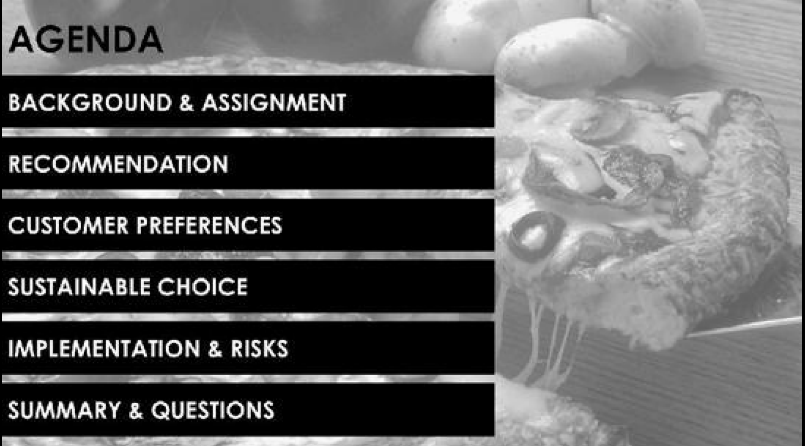
			-
	- Chapter 2 - Context and Background
		- You need to carefully balance between presenting information your audience may already know and possibly confusing them with unfamiliar information.
		- You need to be ruthlessly efficient with your time, though, providing only enough context to properly frame the problem and set up your solution.
		- Context should not last longer than 2 minutes for a well versed audience and 5 minutes for a complex background of a problem. Make sure the background material bridges the core principles of your message.
			- 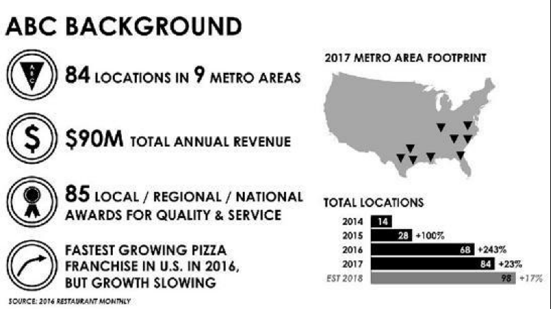
	- Chapter 3 - Recommendation - Leading with the answer
		- *Get to the point. One of the worst things you can do to executives is to waste your time.*
		  id:: 630adab8-9b66-4b5f-b14f-43599b3d4be6
			- *If you're making a recommendation or asking a leader to do something, you need to communicate quickly and clearly.*
		- **Make sure your presentation creates value to your audience**
		  id:: 630adab8-7511-4e9e-b762-3bd55b1a2d9d
		- The executive wants to know why he or she is there, what the recommendation is, and the potential side effects.
		  id:: 630adab8-9b76-4a2e-917f-38291ff074ca
		- Take the top-down approach instead of the bottom-up approach when delivering and organizing your story.
		  id:: 630adab8-7126-4b60-8b4f-e60f281d0b3e
			- **After giving just enough context for the audience to understand the issue, tell them what you plan to do, and then tell them you're going to explain why this is the right choice and how the organization can make it happen.**
			- When laying out the initial recommendation, you need to be clear on what you're recommending and the effects it will have.
				- 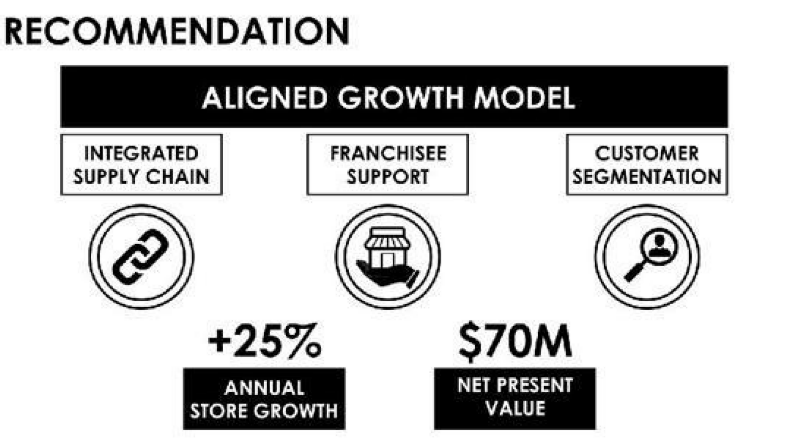
			- Exceptions to the top-down approach is when your recommendations are controversial or something that requires substantial explanation to make sense. You should consider walking your audience through the rationale or background.
	- Chapter 4 - "We Believe" versus "Research Shows"
	  collapsed:: true
		- The way to build your case with a strong foundation and ensure it will hold up to intense scrutiny is to substantiate it with data and information created through empirical research. Strategy should be derived from facts, research, and data. Data provides the strongest offense and defense.
		- In a marketing campaign it is critical to provide the target audience with "Reasons to Believe". They are underpinned with data, which provide the audience with the evidence that the company is is capable of delivering on their promise.
		- Data and examples must be of sufficient depth to be persuasive.
		- Examples of data - Benchmarks, white papers, original research
			- 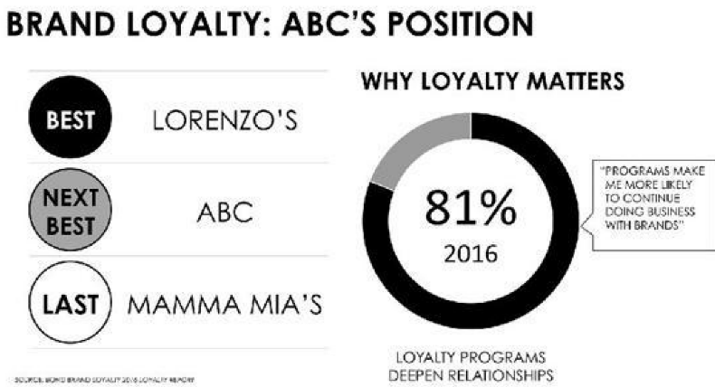
		- Consider using proof of concept or mockups as supporting information to persuade your audience
		  collapsed:: true
			- 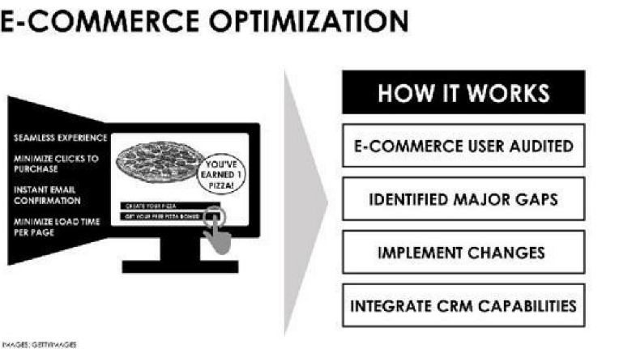
			- Make sure the mockup is responsive but balance between spending time on your mockups and building a strong persuasive reasoning
		- Show up with numbers on your presentation such as calculated return on investment, net present value, internal rate of return
			- Make sure your numbers support the value creation of your strategy and it is influential and significant enough to "move the needle" or cause interest
		- Decision Matrix
			- 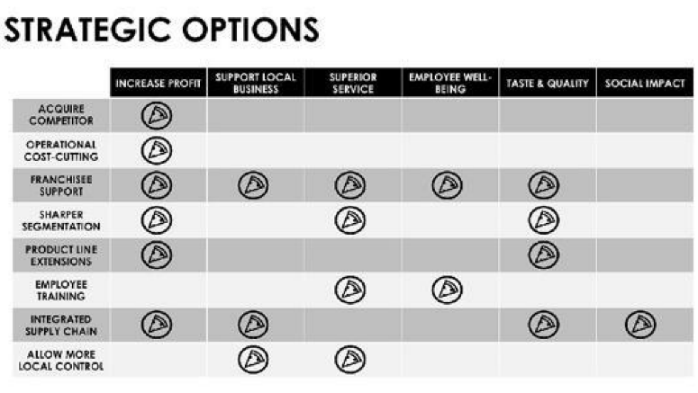
			- You can include one or two slides to show how you decided on your strategy. Expose the logic behind the choices.
				- What were the alternatives considered?
				- What was the rubric or set of determining factors that drove your decision?
				- Make sure you are concise at this phase as well. Spend 20 percent on the alternative and 80 percent on the strategy you chose.
				- 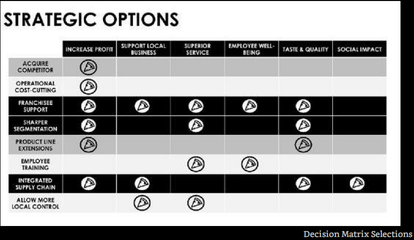
	- Chapter 5 - The Execution Plan
	  collapsed:: true
		- The Playbook
			- A comprehensive strategic recommendation includes three main elements
				- Strategy explanation - what needs to happen
				- Strategy rationale - why it needs to happen
				- Strategy execution - how it happens, when it happens, and who will make it happen
		- Make sure you talk about the feasibility of your recommendations and test for it early. Some questions to test and ask yourself
		  collapsed:: true
			- Will the company managers do something they have never done before?
			- Will they be targeting a new type of customer?
			- Will they be doing business in a new market?
			- Will they need a new sales/distribution channel?
			- Will they need a new production methodology?
			- Will they need a new (to the company) technology?
			- Will this require a merger, acquisition, or divestiture?
			- Will this require a significant culture/mindset change?
			- Will this require a substantial headcount addition?
			- Will this require a substantial financial (debt or equity) investment?
			- If you say yes to any of the questions, then you need to put some serious thought and explanation into the execution plan.
		- The How
			- Key Deliverables
				- Break down your strategy into a series of executable steps. Identify the important buckets and prioritize them.
			- Performance Measures
				- Questions
					- How do evaluate the impacts, benefits, and risks of performance measures and metrics.
						- Are they vanity metrics and they're helping us lie to ourselves
						- Are the metrics pointing us to the right direction or worse leading us to waste resources on activities that yield low returns
						- How do we ensure the measurements and results are comparable and useful? Some measurements may be in a vaccuum.
				- "If we don't measure it, it won't happen"
				- A good element in any execution plan is to outline how you will measure success and track progress. You can include this in the main deck or the appendix but definitely mention the metrics.
				- Make sure you first measure performance of the foundation before measuring whatever processes you build on top of it. Don't build excellently without checking if your developing on sinking sand.
				- Ensure that the benefit analysis is done correctly. Prioritize the branches that have the biggest impact.
				- If the baseline and foundations are not consistent among implementations and workstreams then the performance measures and metrics cannot be trusted and difficult to compare.
				- Identify the metrics to be tracked
					- What metrics should the company use to determine whether the strategy is approaching the desired goal and to make needed adjustments along the way?
				- Identify how they will be tracked
					- Dashboards, scorecards, and stoplight are common tools used by executives to monitor the health of their organization and the progression of major projects.
					- Lay out a simple tracking methodology that will help management understand real-time, weekly, monthly or quarterly how the strategy is peforming.
				- The When
				  collapsed:: true
					- Lay out a realistic and reasonable path for how long it will take to execute
					- Define the critical path items identified in the How and put them into an executable schedule.
						- Delineate dependencies here —which tasks must be completed in sequence and which can start in parallel.
						- 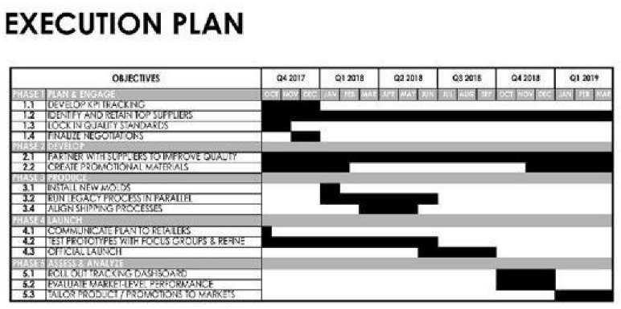
						- 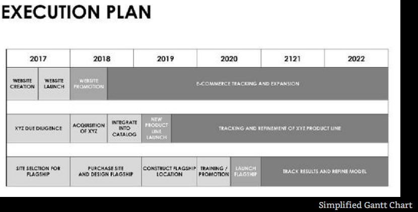
				- the Who
				  collapsed:: true
					- The playbook should define and assign basic roles.
					- A good operating plan will identify which organizations should be involved to address critical items as each function has a particular set of skills that support the organization's strategic objectives. Highlight why a specific function is needed, like what skills and expertise they have that contributes to solving the problem at hand.
					- Also highlight possible gaps in organization, required skills and knowledge, that needs to be filled to reach the strategic goals
					- 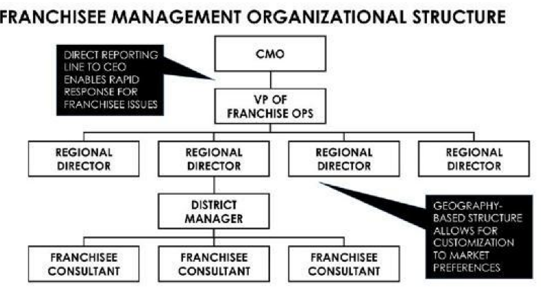
			- You want to provide more than an idea, you want the audience to believe it can become reality. By laying out the steps needed to implement your plan you will help them visualize it
	- Chapter 6 - Risks
	  collapsed:: true
		- You should plan to have at least one slide in your main deck that addresses risk with potentially more detailed backup slides that provide further detail.
			- It is far better to acknowledge risk up front than for your audience to conclude you haven't considered that risk.
		- Components of Risks
			- 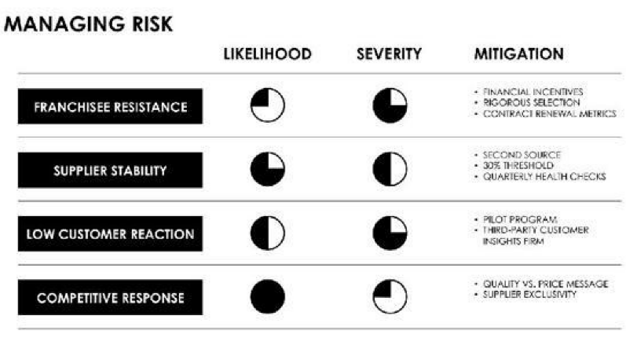
			- Risk can be broken down into likelihood and severity
				- You should balance both these components when considering whether or how you will address the risk.
		- Solution orientation
			- For every risk you identify you should point out steps the organization can take to avoid that risk or minimize its effect.
			- If your strategy is risky think about using a pilot program to test it on a limited scale.
	- Chapter 7 - Tying it all together
	  collapsed:: true
		- Create a slide that that wraps up all the information you have provided into a single, comprehensive, and concise message
		  collapsed:: true
			- 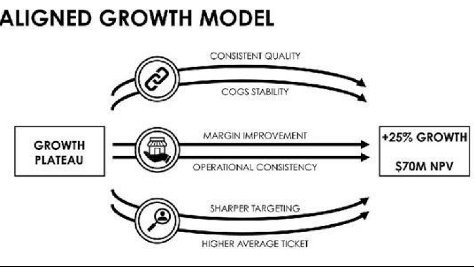
				- Each strategy or initiative has its own arrow connecting the current situation to the company's future state.
			- If you offer multiple recommendations, your slide pulls them altogether and highlights how each can benefit the company (e.g., increase revenue, reduce cost). Reinforcing loops or virtuous cycles are also solid structures to apply to a summary slide -
			  collapsed:: true
				- 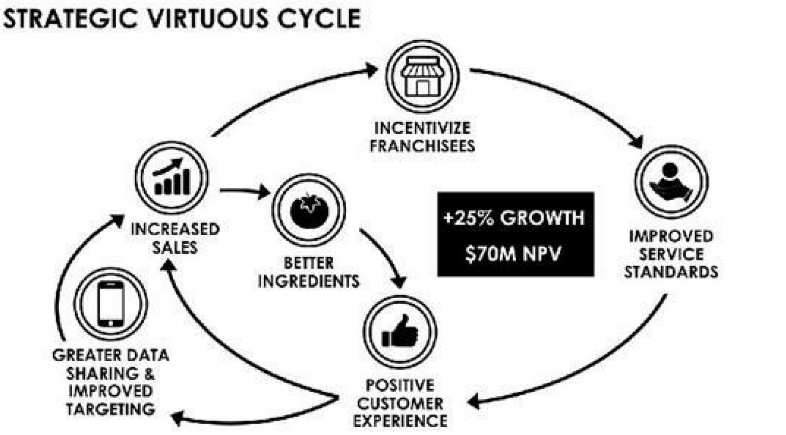
		- Prioritizing among multiple recommendations
			- Prioritize if presenting multiple recommendations. You can use resources (money, people, time, or production capacity) as criteria and clearly explain the ranking rationale.
		-
	- Chapter 8 - The Linked Appendix
	  collapsed:: true
		- The key to creating an effective index is thinking about how to build it from the start rather than addressing it when presentation is already finished.
		- When conducting research as you create your main presentation, collect your data and build it into the appendix as you go. Don't worry about just doing a data dump of relevant information into slides, you can always come back later and make it prettier.
		- Anything that has helped shaped the direction of your recommendation should be captured for backup. This includes things that helped you decide what NOT to do.
		- Use an index page that links the contents in the Appendix (if it is large) - the navigator page will include a link to every slide in both the main and the Appendix. The Navigator has to functions
			- functional - to link to the sides
			- strategic - the navigator shows the topic for every single slide in the whole deck
			- 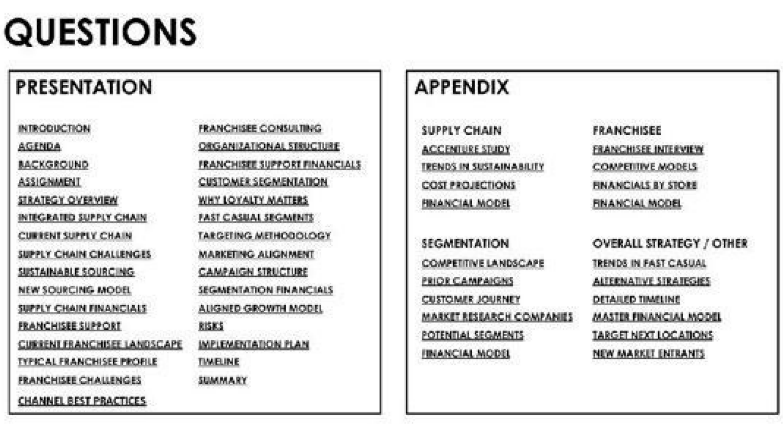
			- 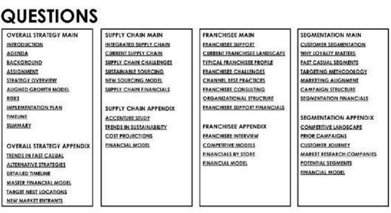
				- A good practice is to group your backup slides by topic aligned with the table of contest for the main deck
	- Chapter 9 - Storyboarding
	  collapsed:: true
		- You must the think of your presentation as a story. Storytelling is a powerful way to communicate a message and have it "stick" with the audience. The elements of storytelling are -
			- Understanding your audience
				- Ask yourself what is important to your audience. They have biases and you must pay attention to them in order to be heard.
			- Using visualization to map your story (storyboarding)
				- One way to build a clear story is to write down the key components of the story, one page per component. From there you arrange the order in which the story should unfold for your audience.
				- 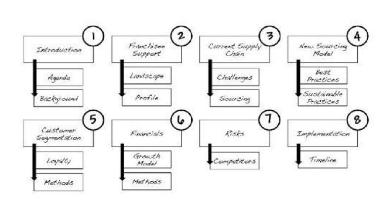
			- Ensuring that your story is linear
				- Story flow is critical. Good story flow is the best vehicle through which your solution will be easily consumed by your audience.
				- a poor story will leave your audience confused and they won't get your idea. It won't matter how good your content is if you can't communicate it clearly and understandably.
				- The order of the story matters—you need to take the audience through the customer's journey through your solution and using data to support each step if possible.
				- Once you've thoroughly explained with dat how the process works, you can then lay out your implementation plan the detailed benefits (e.g., financials)
				- You want to send 60 percent of your presentation time on the details and rationale of your plan.
			- Making sure you have some time for iteration
				- Allow time to poke and discover holes in your presentation. Find someone who can play devil's advocate. Criticize the layout of the presentation, the logic, story and clarity.
				- People are far more likely to remember the story of your presentation than the slides. And they'll be more able to follow your logic and understand your line of thinking if the story flows in a logical and rational manner.
	- Chapter 10 - Building Slides
		- When you're presenting to an executive-level audience, your deck needs to be perfect.
		- It's not always about the best ideas but the delivery and communication of it that is important
		- Flat Design
			- Flat design avoids the use of three-dimensional visuals and limits the usage of colors and font types.
		- Text versus Visual - Knowing your audience
			- Minimize the text on slides, using images to support what you are saying verbally.
			- However, if the environment you're in prefers text then try to conform to the organization's preferred style.
		- Visual Focus - Light Text
		  collapsed:: true
			- The slides are a tool to support what you are saying and should NOT be exclusive focal point. Th e slides should be sharing the attention with the presenters.
			- Use icons, tables, graphs, or other visuals to reinforce the points you cover verbally
			- Compare the following examples
			- Heavy Text
				- 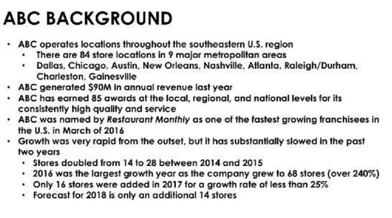
			- Light Text
				- 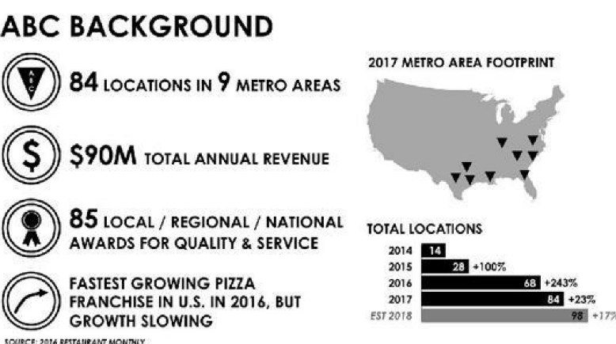
			- Medium Text
				- 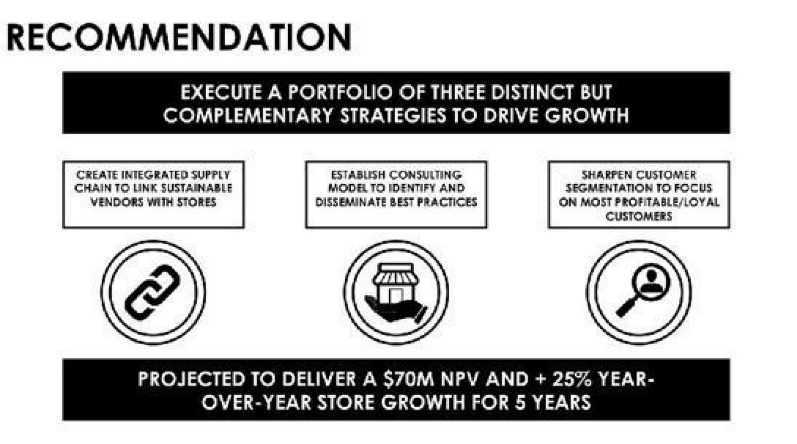
		- Enhancing the story versus creating distractions