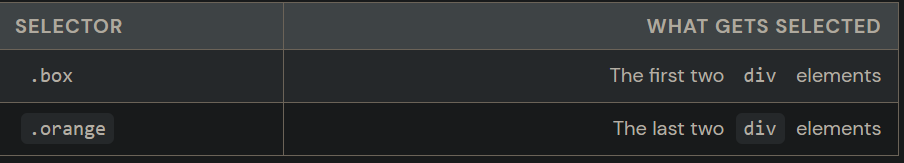
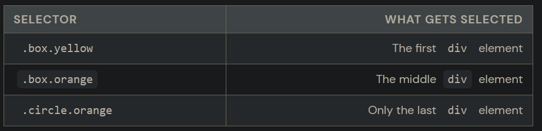

- What is a class?
  collapsed:: true
	- In CSS, a class is a group of elements that are the same or similar. You can have as many elements as you want in a class. And each element can be the member of multiple classes. Every class has CSS attributes (like color and font-size) that are specific to that class.
	- CSS classes are similar to a real-life class. A class is a group of students, who often share certain similarities: similar ages, area codes, interests, or life goals.
	  How to add a class to your HTML element:
		- ``` css 
		  		  <div class="class">
		  		  
		  ```
	- How to use a class in your CSS:
		- ``` css
		  		  .class {
		  		  
		  		  width:100px;
		  		  height:300px;
		  		  background:purple;
		  		  }
		  ```
	- Each HTML element can have multiple CSS classes.
		- ``` css
		  		  <div class="class another-class">
		  		  
		  ```
- What is an CSS ID?
  collapsed:: true
	- An ID is a singular identifier of one HTML tag. You can only have one HTML tag per ID and each HTML tag can only have one ID. Each ID has a specific set of CSS attributes that only apply to that one element.
	- To go back to our real-life class example, even if a group of students shares many attributes, each student has their own Social Security number that identifies them and only them.
	  How to add an ID to your HTML element:
		- ``` css 
		  	  <div id="id">
		  	 
		  ```
	- How to use them in your CSS:
		- ``` css 
		  	   #id {
		  	  	width:200px;
		  	    	height:200px;
		  	    background:blue;
		  	  }
		  	    
		  ```
	- Cocktail Party Fact
	- In CSS, HTML tags, classes, and IDs each have their own numerical value. IDs have the highest numerical value, followed by classes, and then HTML elements themselves. If an HTML element has two styles applied to it that conflict, CSS defaults to the higher value. Check out this CSS specificity calculator(opens in a  new tab).
- You will probably be using class selectors the most often in your CSS, since they will apply styles to every element that has a particular class name. Let’s look at an example of using a class selector to style multiple elements.
  collapsed:: true
	- We want to style all elements with the class of "boxy" to have:
		- A border-radius of 4px
		- A box-shadow with a y-offset of 2px
		- A blur of 2px
		- A black background-color that is 20% opaque
	- We could use the following CSS to achieve the above specs:
		- ```css
		  /* Class selector = class name preceded by a period */
		  .boxy {
		    border-radius: 4px;
		    box-shadow: 0 2px gray; /* offset-x | offset-y | color */
		    filter: blur(2px);
		    background-color: #000000;
		    opacity: 0.2; /* 100% = 1 */
		  }
		  ```
- Compound Class Selectors
	- When an HTML element has multiple classes applied to them.
		- ```CSS
		  <div class="box yellow"></div>
		  <div class="box orange"></div>
		  <div class="circle orange"></div>
		  ```
	- 
	- Right now, there's no way to have selector that can select just the second div element because if you use .box or .orange, you always get others. To solve this, you can specify a selector that is a combination of the two classes like this.
	- 
		- Notice that there is no space between each of the .class portions of the compound selectors. If you did put a space in there, then that's something called a descendant selector which you will learn about later in this article.
- One Rule, Many Selectors
  id:: 6296ba4c-e02c-4df2-a69b-34ded640593a
	- What if we wanted to italicize all H1 and H2 elements in the document? We can conveniently apply the same styles to multiple elements by combining selectors, separated by a comma. Here is how we would italicize all H1s and H2s:
		- ```css
		  h1,
		  h2 {
		    font-style: italic;
		  }
		  
		  ```
		-