tags:: product management, project management, books, book, napkin.one
author:: Jessica Torres
status:: reading

- #[[Literature Notes]]
- #[[Reference Notes]]
	- Introduction
		- To create successful products you need to obsess about customer needs, pain points, and desires.
	- Chapter 1 - The What and Why of Continuous Discovery
	  collapsed:: true
		- Discovery is the process of deciding what to build. Discovery isn't a one time activity.
		- Delivery is the work that you do to build and ship a product as a delivery
			- Many companies place an emphasis on deliver—they focus on whether the product was delivered on time, on scope, and on budget—while under-investing in discovery. Most companies forget to assess if they are building the right stuff.
				- Many teams are still measured by what they deliver and not whether anyone used it or if they created any other value for the customer or the business.
		- Decision Making
			- We started to push decision making from business stakeholders to product managers and eventually to the whole product team. We started to  question how we made discovery decisions.
				- This process change requires involvement of customers during the discovery processes and co-creating ideas with them. Rather than validating their ideas, they are co-creating with customers—combining the team's knowledge of what's technically possible with the customer's knowledge of their own needs, pain points, an desires to build better products.
		- Frameworks and Mindsets
			- Many teams chase frameworks, tools, and methodologies, hoping that each new innovation will suddenly unlock the door to product success. For these frameworks, tools, and methodologies to succeed a corresponding mindset needs to be applied.
				- Outcome-oriented
					- Rather than defining your success by the code that you ship (your output), you define success as the value that code creates for your customers and for the the business.
					- Rather than measuring values in features and bells and whistles, we measure success in impact—the impact we have had on our customer's live and the impact we have on the sustainability and growth for the business.
						- What about measuring output metrics like how Amazon's S team only cared about metrics they had direct control over
				- Customer-centric
					- The business is purpose is to create value and serve a customer. We elevate customer needs to be on par with our own business needs and focus on creating customer value and (our) business value.
					- Wells Fargo and the fraudulent openings of bank accounts unauthorized by their customers is one example of an even that could have been prevented if the business had a customer centric mindset on top of a outcomes oriented one. Solely an outcomes perspective will lead people to pursue goals through illegal means
					- (Balance customer service with knowing between good requirements to develop and those user requirements that should be ignored. )
				- Collaborative
					- Embrace the cross-functional nature of digital product work and reject the siloed model, where we had off deliverables through stage gates. Decisions should be made collaboratively with as much input from other teams.
				- Visual
					- Start to apply spatial thinking to supplement the spoken and written language. Start drawing to externalize your thinking and to map what you know.
				- Experimental
				- Continuous
		- A working definition of continuous discovery
			- **Product teams make decisions every day. Our goal with continuous discovery is to infuse those daily decisions with as much customer input as possible.**
	- Chapter 2 - A common framework for continuous discovery
	  collapsed:: true
		- Starting with outcomes, rather than outputs, is what lays the foundation for product success. Switch from obsessing about features (outputs) to focusing on the impacts those features have on both the customers and the business (outcomes.)
		- Meeting with clients is for conducting research in pursuit of a desired outcome that creates value for the customer.
		- Finding the best path to your desired outcome is what researchers call an ill-structured problem—also commonly called a "wicked problem." Ill-structured problems are defined by having many solutions. There are no right or wrong answers, only better or worse ones. #[[Books: Marketing Saves the World]]
			- Much of the work of solving an ill-structured problem is framing the problem itself.
			- Opportunities represents the customers needs, pain points, and desires collectively. They are opportunities for us to intervene in our customer's lives. We don't refer to them as problems because, not all problems that need solving are opportunities.
				- For example, ice cream is delicious and mountain biking is fun, however not necessarily needed as eating healthy vegetables and going to the gym may represent more of an ideal solution. In these examples, the opportunities are addressing desires not problems.
			- Good problem solvers try out many framings, exploring how each impacts the solutions space.
			- The two most important steps for reaching our desired outcomes are first, how we map and structure the opportunity and second, howe we select which opportunities to pursue. Often product teams skip these steps and immediately start with an outcome and simply generate ideas. The right problem framing will help ensure that we explore the problem space and ultimately ship better solutions.
		- Define the clear outcome you want in order to define the scope for discovery. From there you must discover and map out the opportunity space. This gives us the structure to the ill-structured problem of reaching our desired outcome. You can use an opportunity solution tree to help you visualize the problem.
		  collapsed:: true
			- 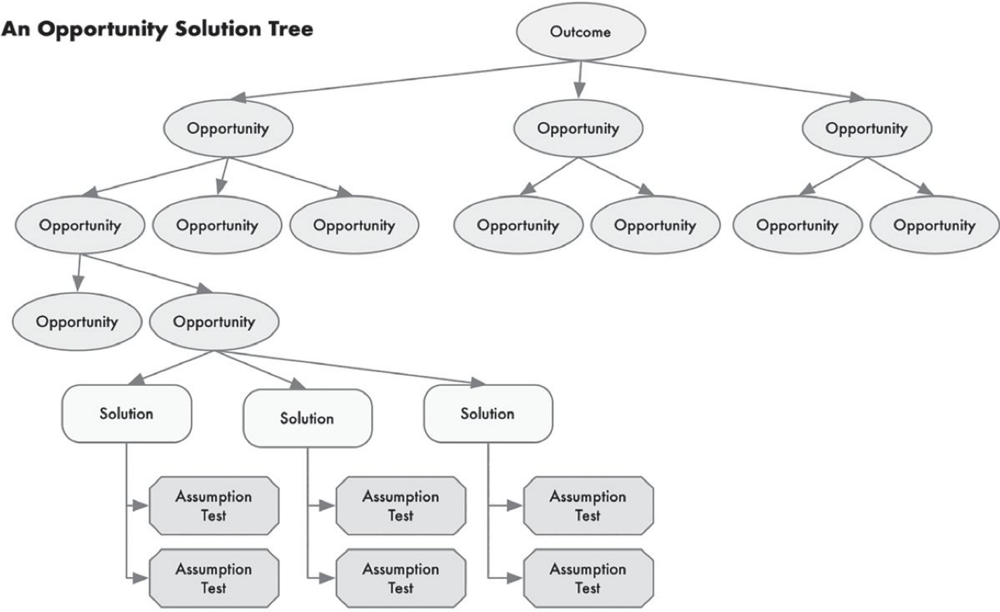
				- Opportunity solution trees are a simple way of visually representing the paths you might take to reach a desired outcome. The opportunity solution trees help you resolve the tension between business needs and customer needs by prioritizing your business needs like sustainability and cost efficiencies. Next explore the customer needs, pain points and desires that, if addressed, would drive the outcome. The key is finding the opportunities that would drive the busines needs.
				  collapsed:: true
					- 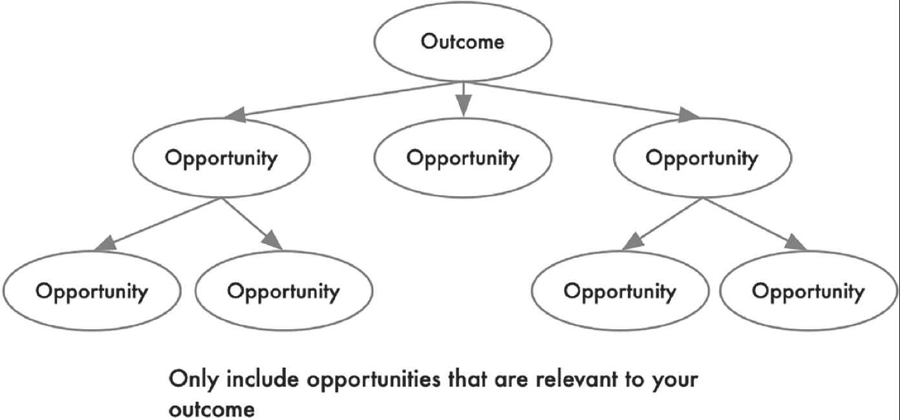
				- The opportunity solution tree breaks down large, project-sized opportunities into smaller opportunities. This can help us focus on one small opportunity at a time that still creates value for the business and our customer.
		- **We often don't remember to the framing of the problem and fall in love with our first solution. We forget to ask, "How else might we solve this problem."**
		- There are four blockers for good decision making
			- 1. Looking too narrowly at a problem. This is why we want to try out as many frames as possible to frame the opportunity space.
			- 2. Looking for evidence that confirms our bias.
			- 3. Letting our short-term emotions affect our decisions
			- 4. Overconfidence. We are often sure our ideas will be wildly successful.
		- Don't frame problems as "Whether or got should we do this?" Instead use "Which of these customer needs is most important for us to address right now?" as this question will compare and contrast our options
		- Problem Space vs Solution Space
		  collapsed:: true
			- 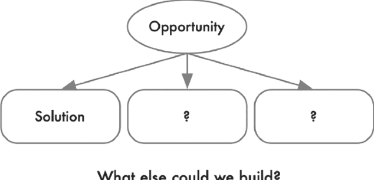
			- 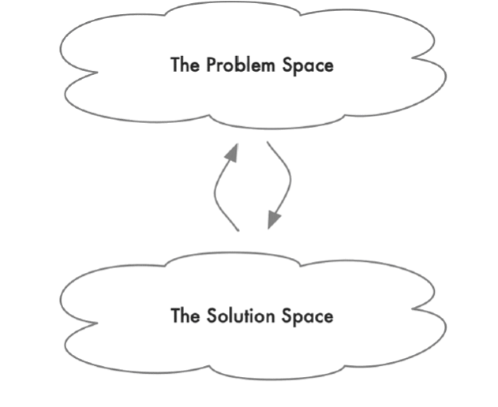
			- The solution space should evolve together with the problem space and not siloed by different roles and functions.
			- We should reflect on why ideas may fail to be a solution instead of quickly moving to testing the next idea. We want to ask "Based on my current understanding of my customer, I thought this solution would work. It didn't. What did I misunderstand about my customer?"
				- We then need to revise our understanding of the opportunity space before moving to new solutions. When we do, our next set of solutions become better.
				- We can combine this process with visualizing the opportunity with the OST so we have a visual understanding of the solutions. When a solution fails, they can revisit this mapping to quickly revise that understanding.
			- Work both from the top-down and bottom-up when working with the Opportunity Solution Tree.
				- Top down work means starting by clearly defining the desired outcome, then mapping out the opportunity space, then considering the solutions, and finally running assumption tests.
				- Bottom up work means using assumption tests to help evaluate the solutions and evolve the opportunity space. As the opportunity space is more understood the understanding of how to reach the outcome and how to best measure those outcomes will also evolve.
				- Good teams continue to conduct customer interviews from week to week to continue exploring the opportunity space even when after they've selected a target opportunity. They consider multiple solutions for their target opportunity, setting up good "compare and contrast" decisions. They run assumption tests across their solution set, in parallel, so that they don't overcommit to less-than-optimal solutions. They continue to visualize their work in the opportunity solution tree to help them assess what to do next.
			-
		- Stakeholder Management
		  collapsed:: true
			- Balance sharing too much information and too little with your stakeholders. Don't send them all your notes without synthesis or full recordings of meetings without highlighting the important takeaways your team agreed to. On the other hand, be careful of only sharing cherry picked information to stakeholders. One extreme asks too much work from your stakeholders, the other too little.
			- We want to strike a balance of information sharing where the stakeholders are able to give us important feedback easily on the process and progress of our work.
			- When sharing work stakeholders use the opportunity solutions tree to remind them of the desired outcome of the project. Next, we can walk them through the opportunity space to clarify our understanding of the customers and stakeholders.
				- The tree structure can help us communicate the big picture while also diving into the details. The tree should visually show what solutions you are considering and what tests you are running to evaluate those solutions. Instead of communicating your conclusions (e.g., "We should build these solutions"), you are showing the thinking and learning that got you there. #[[Decision Tree]]
					- This process allows the stakeholders to evaluate your work and to weigh in with information you may not have.
	- Chapter 3 - Focusing on Outcomes over Outputs
	  collapsed:: true
		- When teams manage outcomes we give our teams the autonomy, responsibility, and ownership to chart their own path. Instead of asking the team to deliver a fixed roadmap full of features by a specific date in time, we are asking them to solve a customer problem or to address a business need. The distinction with this strategy is that we are giving the team the autonomy to find the best solution over delivering features. Without a clear outcome, discovery work can never-ending, fruitless, and frustrating.
		  collapsed:: true
			- A fixed roadmap communicates false certainty. It says we know these are the right features to build, even though we know from experience their impact will likely fall short.
			- An outcome communicates uncertainty. It says, *We know we need this problem solved, but we don't know the best to solve it*. It gives the team the ability to explore and pivot when and if needed.
			- Managing by [[outcomes]] communicates how the team will measure success. A clear outcome helps a team align around the work they should be prioritizing, it helps them choose the right customer opportunities to address, and it helps them measure the impact of their experiments. #metrics
		- Managing outcomes is only as good as the outcomes we choose. If we choose incorrectly, we'll still get the wrong results. It's best to distinguish between business outcomes, product outcomes, and traction metrics.
		  collapsed:: true
			- 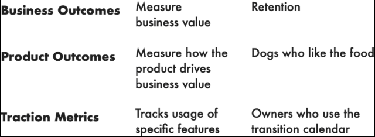
			- Business Outcomes
				- Start with financial metrics (e.g., grow revenue, reduce costs),
				- Strategic initiatives (e.g., grow market share in a specific region, increase sales to a new customer segment)
				- Are often lagging indicators. They measure something after it has happened. It's hard for lagging indicators to guide a team's work because it puts them in react mode, rather than empowers them to proactively drive results. It is better to assign a leading indicator over a lagging indicator.
				- Business outcomes require coordination across many business functions.
			- Product Outcomes
				- As a general rule, the team will make more progress on a product outcome, rather than a business outcome. Product outcomes measure how well the product moves the business forward—they are within the product team's span of control.
				- Each team member should have an assigned product outcome that is relevant to their function to increase the sense of responsibility and ownership.
				- When we assign the same outcome to multiple teams it becomes easy to shift the blame for the lack of progress.
			- Traction Metrics
			  collapsed:: true
				- Are specific outputs from outcomes. They are too narrow and restrictive to assign because once assigned we assume that the output or traction metric is the correct measurement instead of actually measuring its parent outcome.
				- Traction metrics are more appropriate to junior teams when the product is in its optimization phase rather than through its open-discovery phase. Traction metrics are fine for mature products where you fully understand system and its relationship to the traction. We are assuming that the broader discovery questions are already answered when favoring traction metrics over product outcomes.
		- Setting outcomes should be negotiated with the product owner and the product management team.
		  collapsed:: true
			- The product owner (person who knows the business the best) should communicate what's most important for the business, but not dictate what the solution should be. Outcomes are a good way for the product owner to communicate strategic intent.
				- The implementation team will bring in the customer and technology knowledge and communicate how much the team can move the outcome metric. The implementation team shouldn't be expected to communicate what solutions they will build at this time, as this should emerge from discovery.
		- It is important that the team members set up their own metrics rather than being told what metrics to measure to promote responsibility and ownership.
		- For teams working on new outcomes, they should first start with a learning goal (e.g., discover the opportunities that will drive engagement) before taking on a performance goal (e.g., increase engagement by 10%).
		  collapsed:: true
			- This is best if you have uncertainty on the best way to measure your outcome.
		- When you are being asked to deliver outputs with no regard for outcomes, try the following:
		  collapsed:: true
			- For new initiatives ensure you understand the business context and explore these questions:
				- Who is the target customer for this initiative?
				- What business outcome are we trying to drive with this initiative?
				- Why do we think this initiative will drive that outcome?
					- Be careful with *Why?* questions as they can put some leaders on the defensive.
			- Try to connect the dots between the business outcome and potential product outcomes.
				- Try mapping out which product outcomes might drive the business outcome.
		- Avoid the following common anti-patterns when setting product outcomes:
			- Avoid pursing too many outcomes at once
			- Avoid ping-ponging from one outcome to another
			  collapsed:: true
				- It takes time to learn how to impact an outcome. When we ping-pong from outcome to outcome, we never reap the benefits of learning through spending time understanding and exploring avenues to influence one targeted outcome. It's better to focus on one outcome for a few quarters to invest time learning and exploring the problem space.
			- Avoid setting individual outcomes instead of team wide outcomes
			  collapsed:: true
				- We want the team to collaborate to achieve product outcomes that drive business outcomes. This isn't possible if each member is focused on their own goal.
			- Avoid choosing an output as an outcome
			  collapsed:: true
				- A good place to start is to make sure your outcome represents a number even if you aren't sure yet how to measure it
				- To shift your outcome from less of an output to more of an outcome, question the impact it will have
			- Avoid focusing on one outcome to the detriment of all else
				- In addition to your primary outcome, a team needs to monitor health metrics to ensure they aren't causing detrimental affects elsewhere.
					- For example, customer-acquisition goals are often paired with customer-satisfaction metrics to ensure that we aren't acquiring unhappy customers.
			-
	- Chapter 4 - Visualizing what you know
	  collapsed:: true
		- The best path to a desired outcome is to discover and map out the opportunity space (i.e., opportunity solution tree). However, the opportunity space can present unlimited options it's easy to get lost. To make sense of the opportunity space we first need to take an inventory of of what we already know.
			- Map out the current customer experience and try to get multiple perspectives to ensure an aligned understanding of the current process.
			- Map out the known challenges and pain points
		- Set the scope of your experience map
			- First start with the outcome you want and map out the customer experience that maps to that outcome.
			  collapsed:: true
				- Think strategically about how broad or narrow to set the scope. when a team is focused on an optimization outcome, like increasing application submissions, it's fine to define the scope narrowly. However, when working on a more open-ended outcome, you'll want to expand the scope of your experience map.
				  collapsed:: true
					- For example, if we were working at Hulu and wanted to increase viewing minutes, the scope of that outcome can be broad (e.g., "How do customers entertain themselves through video?" as opposed to the more broad scope "How do customers entertain themselves?")
			- Start individually to avoid groupthink when problem solving and mapping the user experience
		- Experience maps are visual, not verbal
			- Drawing allows us to externalize our thinking, in turn, helps us examine that thinking.
			- When drawing the experience map focus on the experience of your customer instead of the product.
			  collapsed:: true
				- Using Netflix for example we don't want to draw a screen-by-screen flow of how to use Netflix but we want to think about the broader context. We should think, when and where does video play a role in a user's life? How do they hear about content? How do they make decisions about what to do when? Who do they do it with? What challenges and obstacles do they face along the way?
				- 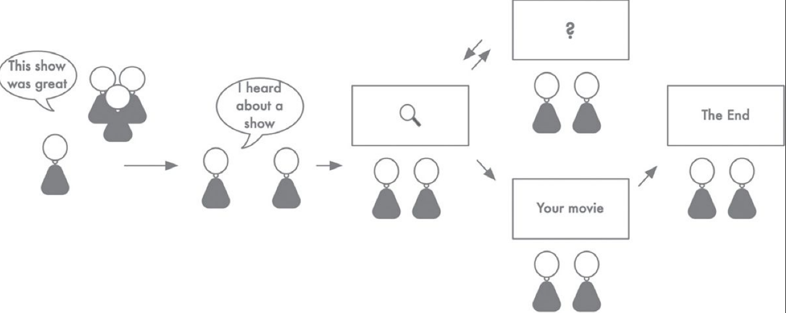
			- Take turns sharing your drawings among team members to get diverse perspectives of the same customer experience.
				- Pay particular attention to the differences. Be curious.
			- After everyone shares their version of the customer map, co-create a shared experienced map.
	- Chapter 5 - Continuous Interviewing
	  collapsed:: true
		- The purpose of customer interviewing is not to ask your customers what you should build. Instead the purpose of an interview is to discover and explore opportunities. Opportunities are customer needs, pain points, and desires. They are opportunities to intervene in your customers' lives in a positive way.
		  collapsed:: true
			- Apple revolutionized visual voicemail. A feature that customers would not have been able to articulate. Apple was able to uncover this opportunity and address them.
			  id:: 63365a96-751c-4db4-bb3b-5c3adcf466ae
		- The challenges with asking people what they need
		  collapsed:: true
			- Users are not very good at understanding their own behavior. Research shows that interview participants struggle to answer direct (factual) questions accurately. In a customer interview this might mean that the customer misremembers when they bought something or forgets why they signed up for a particular service.
				- Direct questions require that we recall facts without context. This process is prone to cognitive bias—common patterns in mental errors that result from the way our brains process information. We give answers that are influenced more by our sense of identity rather than our actual behavior. And we tend to come up with coherent reasons to explain our behavior that are often not grounded in reality.
			- We can't simply ask your customers about their behavior and expect to get an accurate answer. Most will obligingly give you what sounds like a reasonable answer. But you won't know if they are telling you about their ideal behavior or their actual behavior. Nor will you know if they are simply telling you a coherent story that sounds true but isn't true in practice.
			- If you ask the wrong questions that lead to faulty answers, then you will create a product that is built on faulty reasoning and lies.
		- Distinguish Research Questions from Interview Questions
		  collapsed:: true
			- The key to interviewing well is to distinguish what you are trying to learn (your research questions) from what you ask in the interview (your interview questions).
			- Assume you will be talking to your customers every week and only focus on what you need to learn at this moment in time. Don't plan too  much in the future.
			- Don't explore opportunities that the customer doesn't care about or is not important to them. Our primary research question in any interview should be: What needs, pain points, and desires matter most to this customer?
			- Instead of asking direct questions about your customer's behavior, the best way to learn about their needs, pain points, and desires is to ask them to share specific stories about their experience.
			  collapsed:: true
				- Instead of asking, "What criteria do you use when purchasing a pair of jeans?"—a direct question that encourages our participant to speculate their behavior—we want to ask, "Tell me about the last time you purchased a pair of jeans."
				- Uncovering the right questions can be challenging. You'll want to tailor the scope of the story-based question on waht you need to learn at that moment. A narrow scope will help you optimize your existing product. Broader questions will help you uncover new opportunities. The broadest questions might help you uncover new markets.
			- Excavate the Story
			  collapsed:: true
				- You may need to provide your interviewee the setting, time, and nuanced content of the story to elicit good story telling from them. Not all stories are of the same quality. You may need to work with your interviewee to tell the best usable story for your research question.
				- Ensure that the conversation remains about that specific instance and story instead of bouncing in and out between the story and what the interviewee considers ideal or generalizable. Keep the interview grounded in specific stories to ensure you collect data bout your participant's actual behavior, not their perceived behavior.
		- Interview Snapshot
		  collapsed:: true
			- Synthesize the meeting interview each time.
				- 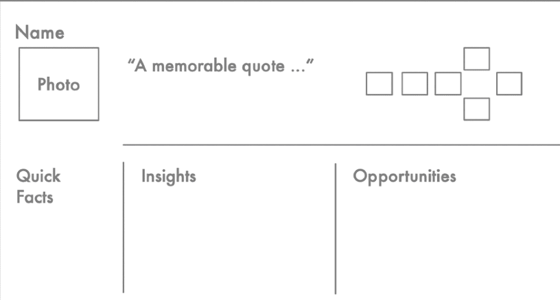
				- Take a photo or screenshot of the customer
				- Write quick facts about them to help you identify what type of customer you were talking to.
		- Be sure to present opportunities as needs and not solutions. If the participant requests a specific feature or solution, ask about why they need that, and capture the opportunity (rather than the solution).
			- "If you had that feature, waht would that do for you?"
		- Capture as much of the interview as possible as one unique customer interest may actually be common across customers.
		- Draw the stories you collect
			- Create experience maps for the generalized customer to see where individuals align and diverge
		- Interview every week
			- Weekly interviewing is foundational to a strong discovery practice. Interviewing helps us explore an ever-evolving opportunity space.
			- We can't assume that we chose the right target opportunity, that you'll be able to address the opportunity, and that everything will go according to plan.
			- Interview together, Act Together
				- Don't let one function serve as the "voice of the customer" and instead collaborate in a way that leverages everyone's expertise during interview.
				- The more diverse the interviewing team the more value you will get from each interview.
			- Avoid Common Anti-Patterns
				- Relying on one person to recruit and interview participants
					- Make sure everyone in your team is well-versed in recruiting and interviewing.
				- Asking who, what, why, how, and when questions
					- Instead generate research questions and identify one or two story-based interview questions.
				- Interviewing only when you think you need it
					- Continuous interviewing ensures that you stay close to your customers and their needs, opportunities, and pain points.
				- Sharing what you've learned by sending out pages of notes and/or sharing a recording.
					- Use your interview snapshots to share what you are learning with the rest of the organization.
				- Stopping to synthesize a set of interviews.
					- Synthesize as you go for each interview.
	- Chapter 6 - Mapping the Opportunity Space
	  collapsed:: true
		- The power of opportunity mapping
		  collapsed:: true
			- Our customer stories are rife with gaps between they expect and how the world works. Each gap represents an opportunity to serve the customer. With continuous discovery we may get overwhelmed too many opportunities and not know how to prioritize which to address.
			- Finding the best path to our desired outcome is an ill-structured problem and requires that we first structure or frame the problem space before we can dive into solving it.
			- Address the customer opportunities that have the biggest impact on our outcomes first.
		- Taming Opportunity Backlogs
			- Instead of using an opportunity backlog, use an opportunity solution tree to help map out and understand the opportunity space.
			- Opportunity trees show parent-child relationships and sibling relationship that help make sense of the opportunity space.
				- 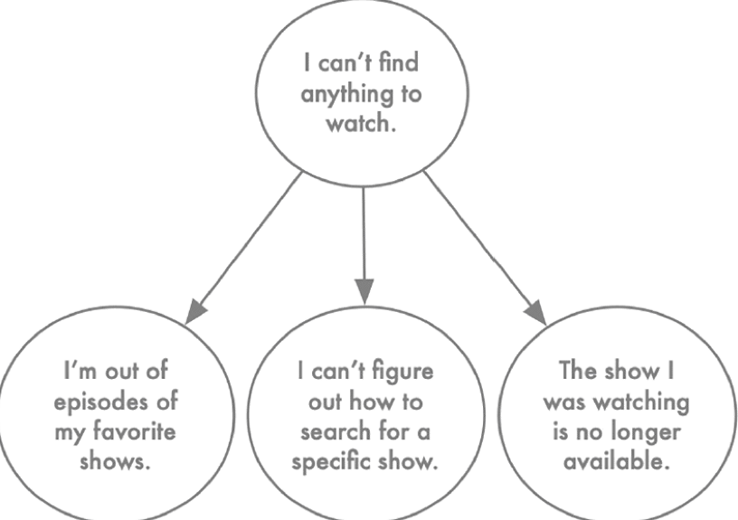
				- Sibling relationships help us make sense of similar opportunities like "I want to watch my shows on my flight" and "I want to watch my shows on my train commute." We can group these similar requests to the parent request "I want to watch my show on the go."
				- Trees helps us to deconstruct large, intractable problems into a series of smaller and more solvable problems.
				  collapsed:: true
					- Allows us to solve at first seemingly unsolvable problems by problem decomposition.
					- Each smaller problem allows us to deliver value over time, even though we may not be able to fully address the larger problem.
					- Allows us to organize, access and prioritize opportunities.
				- Identifying Distinct Branches #MECE
					- To be able to deconstruct big, intractable challenges into a series of more solvable, smaller problems we need a well-structured opportunity space.
						- A key concept that drives structure is the idea of distinctness. We need each opportunity to be distinct from  every other opportunity.
						- Overlapping opportunities doesn't allow us to address each individual opportunity one at a time.
						- To help find the underlying structure and create distinctness:
							- Use the experience map(s) that you created
							- Use your interview drawings or snapshots to identify key moments in time during the customer experience.
								- If your team isn't starting from a strong understanding of the customer experience, your map may not have distinct moments in time. It will need to evolve before you can identify them.
								- Analyze the customer stories you are collecting in your interviews.
				- Take an Inventory of the Opportunity Space
					- With distinct branches in place, take inventory of the opportunities you have heard in the customer interviews. Though avoid adding every opportunity to the tree. Instead, for each opportunity, ask:
						- Is this opportunity framed as a customer need, pain point, or desire and not a solution?
						- Is this opportunity unique to this customer, or have we seen it in more than one interview?
						- If we address this opportunity, will it drive our desired outcome?
					- 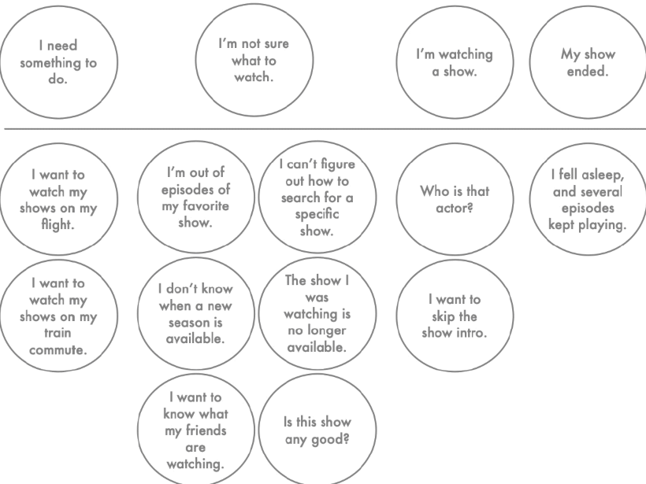
					-
				- Add Structure to Each Branch
					- Group similar stories together and if needed to be afraid to add a parent branch even if the customer did not explicitly say it.
					- Structure is done, redone, and undone. Structuring is continuous work
		- Avoid the common anti-patterns
			- Opportunities framed from your company's perspectives
			  collapsed:: true
				- Don't let your company's perspective dominate the customer's viewpoint.
				- In order to serve the customer, we need to solve customer needs while creating value for the business through framing opportunities through our customers.
				- If you're going to add to the customer experience map without the direct feedback from the customer ask "Can I imagine the customer saying this?"
			- Vertical Opportunities
				- When a parent only has one child, and that one child also only has one child, resulting in a vertical stack. Vertical opportunities are born from:
					- Similar opportunities from several interviews really saying the same thing in different words
						- Fix this by reframing one of the opportunities to encompass the broader need and remove the rest
					- There are missing sibling opportunities and that one child opportunity cannot fully solve the parent opportunity
			- Opportunities have multiple parent opportunities
				- If top-level opportunities represent distinct moments in time, then no opportunity should have two parents. If multiple parents are needed for a child then it is too broadly defined.
			- Opportunities are not specific
			  collapsed:: true
				- Opportunities that represent themes, design guidelines, or even sentiment aren't specific enough.
				  collapsed:: true
					- Opportunities that represent themes, design guidelines, or even sentiment, aren’t specific enough. “I wish this was easy to use,” “This is too hard,” and “I want to do everything on the go” are not good opportunities. However, if we make them more specific, they can become good opportunities: “I wish finding a show to watch was easier,” “Entering a movie title using the remote is hard,” and “I want to watch shows on my train commute" are great opportunities.
			- Opportunities are solutions in disguise
				- Often in an interview, your customer will ask for solutions. Sometimes they will even sound like opportunities. For example, "I wish I could fast-forward through commercials".
					- It would be helpful to you to reframe the request as "I don't like commercials."
				- To distinguish between a real opportunity and a solution is to ask "Is there more than one way to address this opportunity?"
				- We reframe opportunities posed as solutions back to real opportunities so we can create more than one option address the opportunity.
			- Capturing feelings as opportunities
				- When a customer expresses emotion in an interview, it's usually a strong signal  of an undiscovered opportunity.
				- However don't capture the feeling as the opportunity, but rather its cause.
	- Chapter 7 - Prioritizing Opportunities, Not Solutions
	  collapsed:: true
		- The obsession with producing outputs is a productivity drain. We end up spending hours prioritizing features, grooming backlogs, and micro-managing releases.
		- Our customers don't care about the majority of our feature releases. A solution mindset is good at producing output, but it rarely produces outcomes.
		- Customers care about solving their needs, pain points, and desires.
		- Product strategy happens in the opportunity space. Strategy emerges from the decisions we make about which outcomes to pursue, customers to serve, and opportunities to address.
			- Don't rush straight into prioritizing.
		- Focus on One Target Opportunity at a Time
		  collapsed:: true
			- Address only one opportunity so you can deliver more value quickly and iteratively. Spreading yourself out too thin can delay value delivery  as each different item you work on at the same time takes longer to deliver and gain customer feedback on.
			- Limit your work in progress to get an increase in quality and consistency.
			- Use the Tree to Aid in Decision Making
			  collapsed:: true
				- 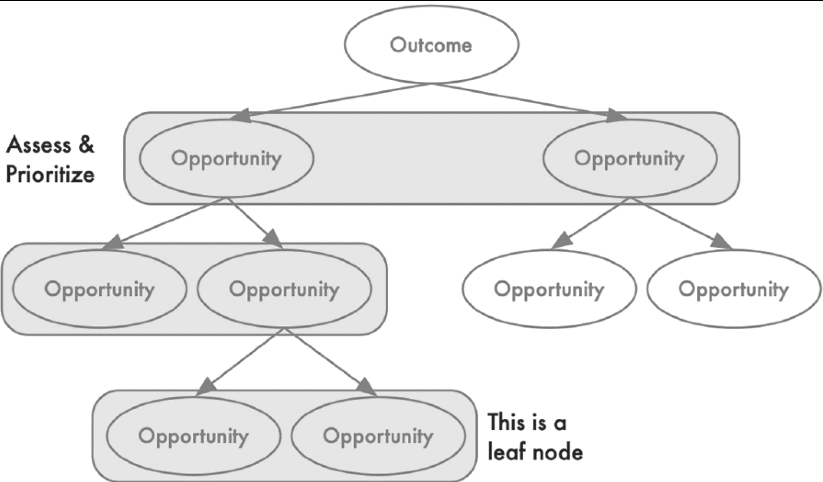
				- Choose one parent branch and work downwards. Ignore the other branches.
				  collapsed:: true
					- Repeat this as you go work yourself down, choosing only one branch at a time.
			- Assessing a Set of Opportunities
			  collapsed:: true
				- Opportunity sizing
					- Helps us answer how many customers are affected and how often. For each opportunity we are considering ask which opportunities affects the most customers and the most often.
				- Market Factors
					- Helps us evaluate how addressing each opportunity might affect our position in the market.
					- Consider how addressing each opportunity positions you against your competitors.
				- Company factors
					- Helps us evaluate the strategic impact of each opportunity for our company, business group or team.
					- Consider how the organization's identity aligns with the set of opportunities you are considering.
				- Customer factors help us evaluate how important each opportunity is to our customers.
					- We need to assess how important each opportunity is to the customer and how satisfied they are with current solution.
		- Embrace the Messiness
		  collapsed:: true
			- The judgments are relative, messy, and subjective. This is OK.
			- Ill-structured problems can never have one right answer. Leave room for doubt so you aren't afraid to course correct when you find out that you may be wrong.
		- Two-Way Door Decisions
		  collapsed:: true
			- When assessing and prioritizing the opportunity space, it's important to find the right balance between data-informed and not getting stuck in analysis paralysis.
			- Be slow and cautious on decisions that are difficult or impossible to reverse.
			- Feel free to move fast when the decisions are easily reversed. We'll learn more by acting on the decision more quickly than trying to imagine what would happen if we acted through data gathering and analysis.
		- Anti-Patterns to Avoid
		  collapsed:: true
			- Delaying a decision until there is more data.
				- Choosing a target opportunity is a reversible opportunity, if all your opportunities are derived from your interview then there are no wrong decisions.
			- Over-relying on one set of factors at the cost of the others.
				- Use the different lenses to weight your decisions (opportunity sizing, market factors, company factors, and customer factors)
			- Working backwards from your expected conclusion
				- Working backwards can narrow your solution too quickly. Working from a solution already formulated will make you miss possibly better alternative solutions to your opportunities.
	- Chapter 8 - Supercharged Ideation #[[Books: Where Good Ideas Come From]] #Ideation
	  collapsed:: true
		- Generating ideas alone is more advantageous than in a group setting—ideas were more diverse, original, and more. Individuals though had to work harder to get there.
		- Look at other analogue products for ideas.
		- Steps for ideation
			- Review your target opportunity
				- Make sure that everyone on your team knows what it means and is familiar with the necessary context
			- Generate ideas alone
			- Share ideas across your team
			- Repeat steps 2 and 3
		- Evaluating Your ideas
			- Ask if the idea addresses the target opportunity
		- During ideation avoid common anti-patterns
			- Not including diverse perspectives. Most of the exercise in this book are designed for product trios to do together. Make sure everyone has a chance to contribute their ideas. The more diversity in the group, the more diverse ideas you'll generate.
			- Generating too many variations of the same idea. When we get stuck generating ideas, we tend to riff on variatios on variation of the same idea. Deliberately work to identify categorically different ideas.
			- Limiting ideation to one session. Give ideation the time it deserves. Let your ideators consider ideas over time.
			- Selecting ideas that don't address the target opportunity.
	- Chapter 9 - Identifying Hidden [[Assumptions]]
	  collapsed:: true
		- Be Prepared to Be Wrong
		  collapsed:: true
			- Be cognizant of your confirmation bias where we are more likely to seek out confirming evidence than we are to seek out disconfirming evidence.
			- Also try to avoid the escalation commitment bias in which the more we invest in an idea, the more committed we become to that idea.
		- Types of Assumptions
		  collapsed:: true
			- Use Story maps to generate assumptions
			  collapsed:: true
				- 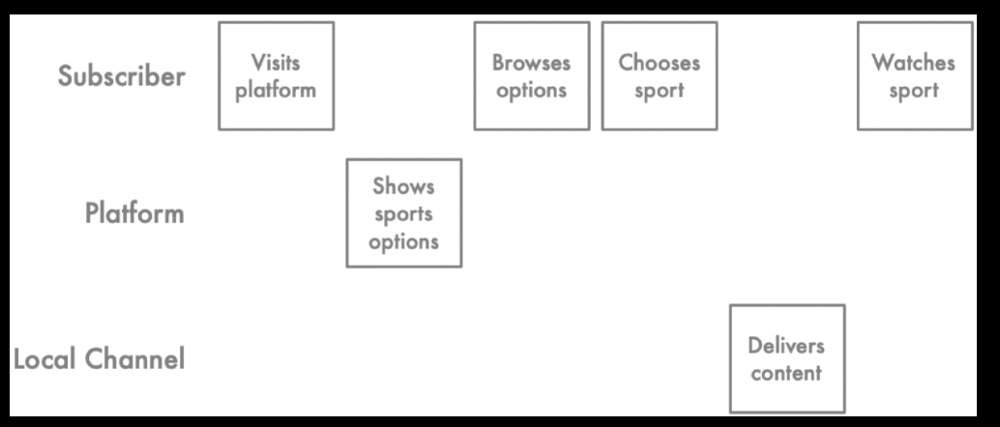
				- 
			- Desirability assumptions
			  collapsed:: true
				- Does anyone want it? Will our customers get value from it? As we create solutions, we assume that our customers will want to use our solution,
			- Viability assumptions
			  collapsed:: true
				- Should we build it? There are many ideas that will work for our customers but won't work for our business. (e.g., customer solutions versus generalized solutions for cost savings and sustainability). If we want to continue to serve customers over time, we need to make sure that our solutions are viable for our organization—that they create enough value to be worth the effort to create and maintain.
					- This means that the idea will generate more revenue than it will cost to build, service, and maintain.
			- Feasibility assumptions
			  collapsed:: true
				- Can we build it? We usually frame feasibility in technical terms but it can also be in the context of business feasibility. For example will our legal or security allow for it? Will our culture support it? Does it comply with regulations?
			- Usability assumptions
			  collapsed:: true
				- Is it usable? Can customers find what they need? Will they understand how to use it or what they need to do? Are they able to do what we need to do? Is it accessible?
			- Ethical assumptions
			  collapsed:: true
				- Is there any potential harm in building this idea?
			- Example Scenario of making an entertainment platform
				- Desirability: Our subscriber wants to watch sports
				- Desirability: Our subscriber wants to watch sports on our platform
				- Feasibility: We know what sports are available right now
				- Feasibility: We can display what sports are available right now
				- Usability: Our subscriber knows they can watch sports on our platform
				- Usability: Our subscriber thinks of our platform when it's time to watch sports
			- Feasibility: Our platform is available when our subscriber wants to watch sports.
		- Story Map to Get Clarity
		  collapsed:: true
			- It's hard to enumerate our assumptions if we aren't specific about what our ideas mean.
				- After ideation, our ideas tend to be vague concepts. This means that each person is making their own assumptions about how the idea will work.
			- One of the best ways to align as a team around what you mean is to story map them.
				- Story mapping is when the team map out each step end-users have to take to get value from a product or service. It forces you to get specific about how an idea will work and waht your end-users will do.
				- While story mapping is aligned around product requirements, it can also be used for helping us to surface underlying assumptions.
			- Story mapping steps
				- Start by assuming your solution already exists.
					- You aren't story mapping what it will take to implement an idea. Rather you are mapping what end-users will do to get value from the solution once it exists
				- Identify the key actors.
				- Map out the steps each actor has to take for anyone to get value from the solution
				- Sequence the steps horizontally over time.
		- Conduct a pre-mortem to generate assumptions #premortem
		  collapsed:: true
			- Imagine in the future where your product failed to meet its deadline, met its deadline but not scope. Ask yourself what are the contributing factors that would have led to those negative outcomes
			- Successful premortems must state the certainty of the outcome. State that the product did fail not that it might fail.
		- Use your solution trees and work backwards from your solutions
		  collapsed:: true
			- Using your solution trees you can generate assumptions by asking
				- This solution will address the target opportunity because
				- Addressing the target opportunity will drive the desired outcome because
			- Be specific. Why will your solution address the target opportunity?
			- The goal is to capture the logical inferences behind why you think this solution will address your target opportunity in a way that drives your product outcomes and ultimately, your business outcome. Each inference is an assumption that you can test.
		- Prioritize your assumptions
		  collapsed:: true
			- Evaluate your "leap of faith" assumptions. The assumptions that carry the most risk.
				- Assess how much do you really know about this assumption. What evidence do you already have that tells you whether this assumption is true or false.
				- 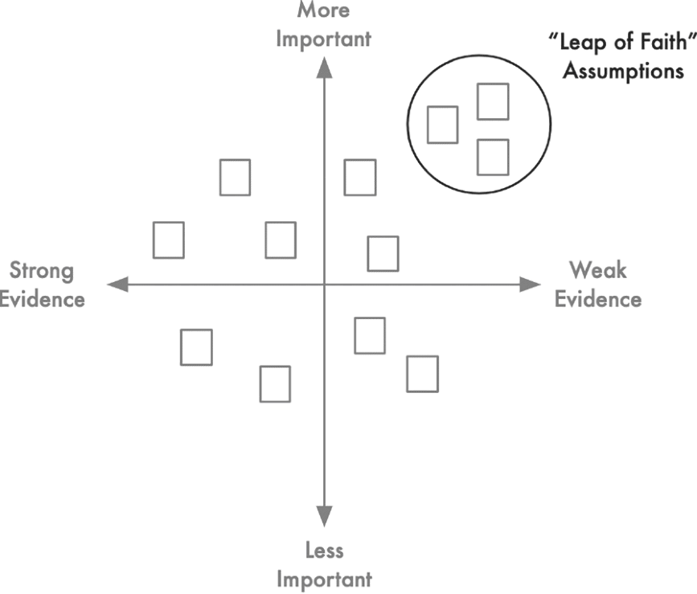
		- Avoid Common Anti-patterns about assumptions
		  collapsed:: true
			- Not getting enough assumptions
				- Generating assumptions, like ideating, is intended to be a divergent exercise. The more you generate the more likely you can identify the riskiest assumptions and are able to
			- Phrasing your assumptions such that you need them to be false.
				- Phrase your assumptions that they need to be true. For example phrase "Customers won't remember their password" won't work for your solution, the assumption must be phrased the opposite as "Customers will remember their password." This is the correct way if we are framing from the perspective of a working solution.
			- Not being specific enough to test
				- Vague assumption statements are not helpful. "Customers will have time", "Customers will know what to do," and "Our engineers can build something like this."
					- These assumptions are not specific enough to test.
				- Examples of specific assumptions.
					- "Customers will know how to select the right option based on their situation"
					- "Our engineers can identify the right subset of options to show the customer based on the customer based on the customer's profile data"
			- Favoring one category of testing assumptions over the other.
				- Ensure that your team carefully balances the testing of desirability, usability, and feasibility.
	- Chapter 10 - Testing Assumptions, Not Ideas
		- Before running experiments clearly define what we are trying to learn and what success looks like, leaving us with ambiguous results.
		- Working with Sets of Ideas
		  collapsed:: true
			- Compare and contrast our ideas against each other. It's easy to overcommit to our favorite ideas.
			- If we test only one idea at a time, we may be easily influenced by confirmation bias. Similarly the more time we invest in a single idea, the more likely we'll be all-in, committing to the idea, even if it has flaws.
				- Don't test one idea at a time rather test assumptions from a set of ideas.
			- We want to systematically collect evidence about our assumptions underlying all our ideas. The more we learn about each idea, the more likely we are to compare and contrast the ideas against each other. This helps us make better decisions about which ideas are most promising.
		- Simulate an Experience, Evaluate a Behavior
			- A strong assumption test simulate an experience, giving your participant the opportunity to believe either in accordance with your assumption or not.
			- To construct a good assumption test, you'll want to think carefully about the right moment to simulate. You don't want to simulate any more than you need to. This allows quick iteration.
			- Be specific about the evaluation criteria.
			- You want to test your assumption with as few people as possible but still gives your team the information they need to act on the data.
			- Remember you aren't trying to prove the assumption is true.
			- Don't invest in experimentation if you don't have an early signal that you're on the right track.
-