title::  Escaping the Build Trap
author:: Mellisa Perri
media:: book
link:: 
tags:: [[product management]]

- Takeaways
- How can I apply this for:
  collapsed:: true
	- project management
	- communication
		- [[Influence culture and process improvements on how we communicate.]]
	- knowledge management
	- value creation
		- for supervisors
		- for senior leadership
		- for colleagues
	- Other
- #[[Literature Notes]]
- #[[Reference Notes]]
	- Preface
	  collapsed:: true
		- > The point is, you can't keep doing the same thing and expect it to keep working. We had to do something different, but the really hard question was, "What is it?" We made plenty of mistakes along the way to answering that question, but the most important thing we identified was that we needed to know more about our customers and waht problems they were really trying to solve in their businesses—even if they didn't neatly fit into an existing category of ours. *Michael Dell*
		- The product led organization
		  collapsed:: true
			- For effective product managers to exist we need the organization to create an environment for them to thrive.
			- 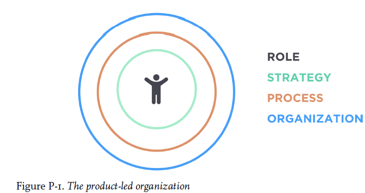{:height 371, :width 685}
			-
	- Chapter 1 - The Build Trap
	  collapsed:: true
		- The build trap is when organizations become stuck measuring  their success by outputs rather than outcomes. It is when the organization focuses more on shipping and developing features than on the actual value those things produce.
			- Outputs are easily quantified things that we produce—number of products or features, number of releases, or velocity of development teams.
			- Outcomes are the things that result when we finally deliver those features and the customer porlbems are solveds.
		- Companies can get out of the build trap by developing intentional and robust product management practices to maximize business and customer value.
		- For successful product management make sure you have time to be strategic.
			- Ensure that the organization has aligned priorities. That everyone knows what are the number one outcome to strive for. This means shifting the mentality of the organization from deliver to achieving outcomes. Change the structure, strategy and the policies and rewards governing how the organization works.
		- To get out of the build trap you need to look at the entire company, not just just at the development team. Are you optimizing the organization to continually produce value? Are you set up to grow and sustain products as a company? This is what a product-led organization does.
	- Chapter 2 - The Value Exchange system
	  collapsed:: true
		- Companies misunderstand value by associating value with the outcomes they want to to create for their business and customers, they measure value by the number of things they produce.
		- 
		  collapsed:: true
			- The customers only realize value when their problems, wants, and needs are resolved. Only then will they provide value back to the service.
			- 
		- Value, from a business perspective, is anything that can fuel your business: money, data, knowledge capital or promotion.
		- Value can be difficult to measure and to measure well from a customer or user perspective. Products and services are not inherently valuable. It's what they do for the customer or user that has the value—solving a problem or fulfilling a need.
		- When companies do not understand their customers' or users' problems well, they cannot possibly define value for them.
		- Constraints on the Value Exchange System
			- 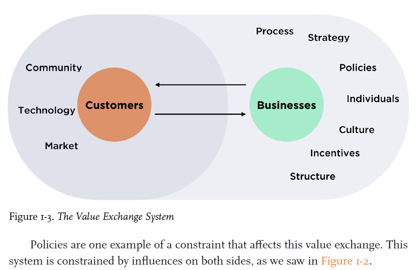
			- Businesses have control over their own constraints and how they deal with them.
			- To be strategic and to have people operate strategically we need to stop judging teams based on the quantity of features shipped.
	- Chapter 3 - Projects Versus Products Versus Services
	  collapsed:: true
		- Product Management is different from project management.
		- [[Products]] are vehicles of value. They deliver value repeatedly to customers and users, without requiring the company to build something new every time.
		- [[Services]] unlike products use human labor to primarily deliver value to the user. Examples of service-based organizations  are design firms that create logos or brands for businesses or they could be accounting companies.
			- These services can be "productivized" where they are the same service for the same price for every customer but they still inherently need people to execute them.
		- Projects is a discrete scope of work that has a particular aim. It usually has a deadline and specific outputs that will be delivered. Products are something that needs to be nurtured and grown to maturity. This takes a long time. When you ship features to enhance a product, you are contributing to this overall success. This feature enhancement is a project, but your work may not be done when you are finished.
			- You need discipline to move toward organizing for products over projects.
			- Product-led organizations are companies that optimize their products to achieve value. They are characterized by product-driven growth, scaling their organization through software products, and optimizing them until they reach the desired outcomes.
	- Chapter 4 - Product-led Organization
	  collapsed:: true
		- Product-led companies understand that the success of their products is the primary driver of growth and value for their company. They prioritize, organize, and strategize around product success.
		- Sales-led
			- Sales-led companies cannot scale very well as they serve more and more clients. When you have 50 or more customers you cannot build everything uniquely to match the needs of each one, unless you want to be a bespoke agency.
		- Visionary-led
			- Apple is example of a visionary-led company.  Steve propelled Apple forward, creating the product strategy, and it got over hurdles of failed products to the success it is today. He pushed the boundaries of waht was known, and the rest of the company followed.
			- Operating as a visionary-led company is not sustainable. Innovation needs to be baked in to the system so that one person is not the weakest link.
		- Technology-led
			- These companies are drive by the latest and coolest technology. However they often suffer from a lack of market-facing, value-led strategy. While technology is vital to company success, it cannot drive the product strategy. The product strategy must lead, not technology.
			- Product strategy connects the business, market, and technology together so the that they are all working in harmony.
	- Chapter 5 - What We Know and What We Don't
	  collapsed:: true
		- Product development is full of uncertainty. It is important to separate out facts from things we  need to learn.
			- 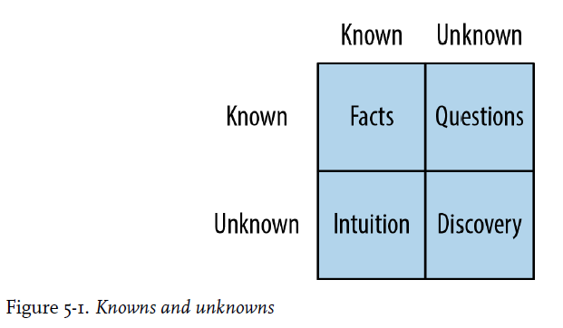{:height 370, :width 621}
			- When kicking off your projects, it's best to begin by identifying what you know to be true about the situation—your known knows. These come from facts you gather from data or critical requirements from customers.
			- Information you are unsure about are labeled as known unknowns. They are clarified enough that you know which questions to ask. They are assumptions  that you want to test, data points that you can investigate, or problems that you can identify and explore. You can discovery methods to clarify these, turn them into facts, and build to satisfy those facts.
			- Unknown knowns are those moments when you say, "I feel like this is the right thing to do." This is intuition from years of experience. Its imperative to check and experiment to see whether your intuition is right.
			- Unknown unknowns are the things that you don't know you don't know. You don't know enough to ask the right questions or identify the knowledge gaps. These are the moments of surprise that need to be discovered.
			- Product management is the domain of recognizing and investigating the known unknowns and of reducing the universe around the unknown unknowns. Anyone can run with solutions based on known knowns. Those facts are readily available. But it takes a certain skill to be able to sift through the massive amounts of information and to identify the right questions to ask and when to ask them.
	- Part II - The role of the product manager
	  collapsed:: true
		- Successful product managers deeply understands both the business and the customer to identify the right opportunities to produce value. They are responsible for synthesizing (combine a number of things into a coherent whole) multiples of data, including user analytics, customer feedback, market research, and stakeholder opinions, and team focused on the why—why are we building this product, and what outcome will it produce?
		- The chief product officer is the cornerstone of the product team in companies, helping to tie together the business outcomes to the roadmap and to represent its impact to the board.
		-
	- Chapter 6 - Bad Product Manager Archetypes
	  collapsed:: true
		- Agile promotes a better way of collaboration and a faster method of development, but it largely ignores how to do effective product management.
			- Agile assumes that someone is generating and validating ideas outside its framework. It assumes someone is thinking strategically about the product.
			- For agile to work, a product manager is needed to have thorough understanding of the users, they need to have done careful analysis of the systems, and an ability to see and execute on opportunities for your market.
		- Antipatterns for defining a product manager
			- Mini-CEO
				- Product managers are not the mini-CEOs of a product. They do not have the authority of CEOs to fire people, change up teams, or change directions.
				- The product manager's job isn't to produce their own ideas but produce value. Start listening to your team. Involve them. Listen to your customers and focus on their problems instead of your own solutions. Fall in love with those problems. Also, go seek out data to prove and validate your ideas. Turn to concrete evidence, rather than opinions. Listening to everyone's opinion is important, but it doesn't mean implementing every suggestion.
			- The Waiter
				- The waiter is a product manager who, at heart, is an order taker. They go to their stakeholders, customers, or managers, ask for what they want, and turn those wants into a list of items to be developed. There is no goal. There is no vision. There is no decision making involved.
				- The waiter doesn't discover problems but asks for requirements instead. The customer asks for a specific solution and the product managers implement them. This cycle creates product death.
					- 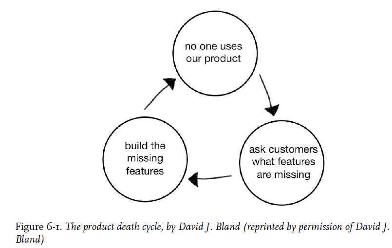{:height 402, :width 623}
					- Product death is harmful because you are implementing ideas without validating them. It's not the customer's job to come up with their own solutions. That is the product owner's job. You need to deeply understand their problems and then determine the best solutions for them.
				- Waiters are reactive thinkers not strategic thinkers. Pushing back on customer offered solutions and diving deeper into the problem is essential to building a successful product.
			- The Former Project Manager
				- Product managers are not project managers, although a little project management is needed to execute on the role correctly. Project managers are responsible for the when. They are concerned about when will the project finish? Is every one on track? Will we hit our deadline?
				- Product managers are responsible for the why? Why are we building this? How does it deliver value to our customers? How does it help meet the goals of the business? Answering why is very different than answering when. It requires a strategic mindset that understands the customer, business, market, and the organization.
	- Chapter 7 - A Great Product Manager
	  collapsed:: true
		- The real role of a product manager in the organization is to work with a team to create the right product that balances meeting business needs with solving user problems.  To do that, they need to wear lots of different hats. They need to understand:
			- The many sides of the company
			- The market and how the business works
			- Understand the vision and goal of the company
			- Deep empathy for the users for whom they are building products to understand their needs
		- One of the biggest misconception about the product owner is that they own the entire product and therefore can tell everyone what to build. Product managers really own the "why" of what they are building. They know the goal at hand and understand which direction the team should be building towards, depending on company strategy. They communicate this direction to the rest of the team.
		- The team collectively owns the product—the what.
			- Figuring out what to build takes strategic approach. The product owner should be at the helm of these experiments, while continuing to identify and reveal every known unknown. At the beginning of product development, the known unknowns begin to become clearer, the uncertainty then shifts to what will solve the customer problems.
			- Product owners shouldn't come up with solutions in a vacuum. They should work collectively with the team. The product manager carefully balances the line between all disciplines (marketing, technology, business knowledge) to be able to strategize and decide what is the best for the product. A great product manager listens intently to the inputs given from all their team members, but, at the end of the day, they make the difficult choices about what will be best for the business and the user.
		- A Great Product Manager
			- Start with the vision in mind.
			- Empathize with the users.
			- Know your users pain point.
			- Prioritize the pain point that aligns to your business vision.
			- Run experiments to see if your hypothesize for value creation is true.
			- Ensure you set up success metrics and goals.
		- Start With Why
			- Why even do this project?
			- What's the desired result that we hope to achieve here?
			- What does success look like?
			- How are we mitigating that risk?
		- The role of product owner in Scrum
			- Define the product backlog and create actionable user stories for development teams
			- Groom and prioritize the work in the backlog
			- Accept the completed user stories to make sure the work fulfills the criteria
		- Product ownership is just a piece of product management. Scrum is just a process, without scrum you are still a product manager, but not a product owner. Product owners is just a role you play.
		- Questions that product owners should own
			- How do we determine value?
			- How do we measure success of our products in the market?
			- How do we make sure we are building the right thing?
			- How do we price and package our product?
			- How do we bring our product to market?
			- What makes sense to build versus buy?
			- How can we integrate with third-party software to enter new markets?
		- One Role, Many Responsibilities
			- The product owners shouldn't be disconnected from the clients and customers. (SAFe - Scaled Agiled Framework). You cannot create good solutions without understanding problems well.
			- With a good strategy framework in place and ruthless prioritization around a few key goals, one person can effectively talk to customers, understand their problems, and help to define the solutions with the team. The amount of external versus internal work will shift, depending on the maturity and success of your product. But, you should never be doing all this work at once.
			- Ensure there is good strategy from top to bottom of the organization.
	- Chapter 8 - The Product Manager Career Path
	  collapsed:: true
		- Product management is not something you can master in a two-day course. You need to develop the skill set through experience and practice.
		- **Tactical work** for a product manager focuses on the shorter-term actions of building features and shipping them to customers.
			- It includes the daily activities of breaking down and scoping out work with the developers and designers, in addition to crunching the data to determine what to do next.
		- **Strategic work** is about positioning the product and the company t win in the market and achieve goals. It looks at the future state of the product and the company and what it will take to get there.
		- **Operational work** is about tying the strategy back to the tactical work. The product managers create a roadmap that connects the current state of the future state and that aligns the teams around the work.
		- {:height 397, :width 716}
			- The organization needs to allow for strategic work to happen not only tactical or operational.
			- Strategy - CPO
				- To inspire confidence in the product direction, CPOs work across many functions to gain buy in and alignment. It's necessary that they bridge and unify the key departments and stakeholders.  They do this by adjusting the way they tell a story and by conducting themselves among groups in an authentic way.
				- CPOS must be resilient and relentless. They need the desire to dig in and find out what is working and what is not. They are constantly assessing and analyzing, trying to prove their hypotheses right or wrong, and holding themselves accountable to data.
	- Chapter 9 - Organizing Your Team
	  collapsed:: true
		- Companies tend to organize in three main ways: value streams, features, and technical components.
			- Favor organizing the team around value streams instead of organizing around specific features and technical components. Organizing around features and components siloes and incorrectly prioritizes work that shouldn't be worked on, especially if the features and components are stable.
			- Instead of working toward a goal and saying no to anything that doesn't get us there, we tend to look for ways to develop more things related to our little slice of the product. When features are stable, we should monitor them but then move on to the more important work needed to support our strategy.
			- When companies are small you can organize around goals you are trying to reach. For example a team can focus on user retention and another on acquiring new users. Each of the teams has ownership of their goal and is judged for success based on their outcomes. This structure also creates redundancy throughout the company so that important information about a single product is not stuck in the head of one person.
		- A value stream is all of the activities needed to deliver value to the customer.
			- That includes the processes, from discovering the problem, setting goals, and conception of the idea, to the delivery the product and service. Every organization should strive to optimize this flow in order to get value out the door faster to customers.
			- How do you organize this way? First you begin with the customer or user— whomever is consuming your product at the end of the day. What is the value that you are providing them? Then work backward. What are the touchpoints they have with your company on the way to receiving that value? Having identified these, how do you organize to optimize and streamline that journey for them? How do you optimize to provide more value, faster?
		- Product - Many companies are confused by the word product. People think products as an app, a feature, or an interface but they are vehicles for value. If the app, feature or interface is not inherently providing value on its own, it's just a piece of the entire product.
			- For example an insurance company the products are what they sell to customers. While a mobile application is valuable to customers, they still need to actually acquire the car insurance for them to have total value. The app on it's own is only partially valuable. You can have a product manager for the app but they have to be part of the larger division of the car insurance division.
			- This structure makes it possible to set strategy at the division level, with the product manager able to execute on product initiatives that tie to their product. Keeping strategy and the value execution together is key. This approach allows you to really evaluate the work happening on your teams and to make sure it's essential to a
			- 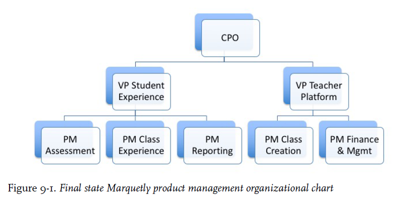{:height 356, :width 685}
		- People need to be aligned around value and to have the scope to actually make measurable impact toward it. Organizing round your strategy is the most important work for your business. When organization is not ruthless prioritizing around a few key goals, they end up spreading themselves thin. To make considerable impact  you need to have everyone going in the same direction, towards the same goals.
			- `There are many teams working to optimize components but not the whole.`
	- Part III - Strategy
	  collapsed:: true
		- A good strategy is not a plan; it’s a framework that helps you make decisions. Product strategy connects the vision and economic outcomes of the company back to product portfolio, individual product initiatives, and solution options for the teams. Strategy creation is the process of determining the direction of the company and developing the framework in which people make decisions. Strategies are created at each level and then deployed across the organization.
		- Make sure your actions align with  your organization's strategy. Focus the entire company around a solid vision. The vision not only states why the company exists but also the plan for getting there.
			- Netflix decided to build its own internet-connected device that plugged into TVs. They called it Project Griffin. The company spent years developing the product, testing and validating the device. Everyone was amped. Then, a few days before launch in 2007, Reed Hastings sent out an email to the entire company saying to stop production on it. “Just kill it”, he said. All that time, all that money, wiped out, a few days before launch. Why? Hastings realized that if he launched a hardware device, he could not partner with anyone else. He would be in the business of hardware, not software or entertainment. That wasn’t part of the Netflix core vision. So, he made the hard call and decided to stop a project, even when it was so close to being done, because it did not align with the overall strategy.
			- Instead, Netflix spun off Project Griffin as a separate company, which you know today as Roku. Then it turned its sights to finding a partner with a device for which they could build an app. They approached Microsoft, and, six months later, Netflix was enabled on more than one million Xbox devices, accomplishing the goal of gaining more streaming customers.
			- > After we eventually won the Blockbuster battle, I looked back and realized all those things distracted us. They didn’t help, and they marginally hurt. The reason we won is because we improved our everyday service of shipping and delivering. That experience grounded us. Executing better on the core mission is the way to win.
			- Netflix self-organized around key outcomes and strategies to help reach its goals. One of the goals was to “delight customers, in margin-enhancing, hard-to-copy ways.”
				- 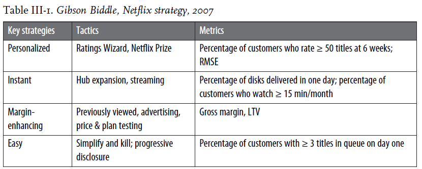
				- This combination of vision, goals, and key initiatives helps create a system in which Netflix can make decisions about its products—sometimes difficult decisions, like killing Roku. Netflix can change tactics or kill ideas because it commits itself not to the solutions they are building but rather to the outcomes these solutions produce. The company then enforces this mentality with a product strategy that is coherently aligned and decision enabling
					- (To help our organization improve decision making ensure it has clearly defined vision, goals, and key initiatives.)
				- Strategic frameworks enable us to think about the whole before worrying and attempting to work on the details. Often when we build software  concern about the details and neglect the big picture. We ask ourselves what features we can build, how do we optimize, when it will be deliver?
					- When an organization thinks only about the feature-level model, it loses track of outcomes those features should produce.
	- Chapter 10 - What is Strategy?
	  collapsed:: true
		- Good strategy isn't a detailed plan. It's a framework that helps you make decisions.
			- > Strategy is a deployable decision-making framework, enabling action to achieve desired outcomes, constrained by current capabilities, coherently aligned to the existing context.
			- A strategy is long term. If you are changing strategy yearly or monthly without good reason from data, you are using your plan as a strategy. A good strategy should sustain an organization for years, focusing the organization
		- Strategy isn't a vision. It's good to communicate the end state of a product, however it becomes dangerous when we commit to these visions and lofty features without validation.
		- Always as "How do you know this is the right thing to build?".
			- The strategy should help you definitively answer that question.
			- Your strategy should drive you to validate your decisions and to provide strong justifications for your actions.
	- Chapter 11 - Strategic Gaps
	  collapsed:: true
		- When companies approach strategy as a plan, they often fail to achieve what they expected. This failure stems from the actions that tries to fill in the gaps between outcomes, plans, and actions. These gaps ultimately cause friction within the organization
		  collapsed:: true
			- The knowledge gap
				- 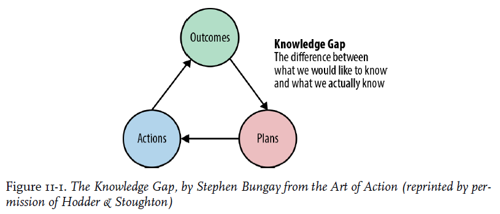
				- The knowledge gap is the different between what management would like to know and what the company actually knows. Organizations try to fill this gap by providing and demanding more detailed information.
				- Instead of seeking more detailed information we should concentrate more defining and communicating the strategic intent or the goals of the business. Where the company wants to go and what are the desired outcomes when the company reaches its destination.
				- Solutions: The knowledge gap can be addressed through training and experience in doing the work.
			- The alignment gap
			  collapsed:: true
				- 
				- The alignment gap is the difference between what we want people to do and what they actually do
				- The alignment gap is what demands more detailed information. The goals of the team do not line up to an overall vision and strategy of the company.
				- Instead of sending down mandates (from leadership level) organizations should turning every level of the company around the why and should give the next layer down the opportunity to figure out how and report back.
				- When leadership is not aligned at the top, the issues trickle down to the teams.
			- The effects gap
			  collapsed:: true
				- 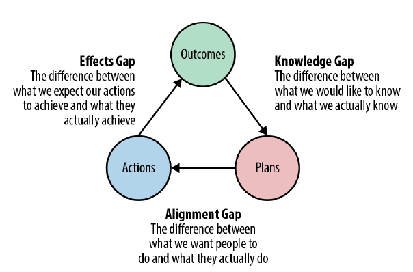
				- The effects gap is the difference between what we expect our actions to achieve and what actually happens. When organizations do not see the results they want, they try to fill this gap by putting more controls in place.
				- We need to balance process improvements and controls with autonomy. Giving individuals and teams the freedom to adjust their actions so that they are in line with their goals is what will truly allow them to achieve results.
				- What often happens is that management makes the decisions and decides how to execute and prescribes the solution without sharing the why. This restricts teams and the organization robs the front line staff the ability to learn and course correct their decisions as they go.
		- Solutions to strategic gaps
			- Autonomous teams
			- To solve various gaps and deliver great products to customers our strategy needs to enable action to achieve results. You scale an organization by enabling through autonomous teams.
			- When teams are not aligned with a clear direction and goals, they cannot effectively make decisions. If they do try, much of the times, the leader steps in and says, "No that's not right" because leadership has different stances and thinking.
			- Leading by authority is a relic when low skilled workers were supervised closely so that their output was maximized.
			- The organization needs to acknowledge they are hiring incredibly smart people and paying them high salaries to make decisions on creating great products. A prescriptive leadership style stymies talent.
			- A good strategic framework promotes talented staff to work autonomously without a lot of management oversight.
		-
	- Chapter 12 - Creating a good framework
	  collapsed:: true
		- Great strategy is customer focused. Don't prioritize based on what leadership says especially if it isn't aligned to what the customers are saying.
		- A good company strategy should be made up of two parts:
			- the operation framework - how to keep the day-to-day activities of a company moving
			- the strategic framework - how the company realizes the vision through product and service development in the market
		- Don't treat these frameworks as one. Ensuring that a company has a well thought out strategic framework to create a path forward for developing great products and services.
		- The strategic framework aligns the company's strategy and vision with the products that are developed by the teams. Having a strong company vision and product visions that align to the strategy framework helps companies avoid challenges in planning and execution.
		- Companies should be continuously evaluating where they are and where they need to take action and then fund those decisions.
		- When strategy is communicated well in an organization, product development and management are synchronized. The company strategy informs the activities of the product developments, and the execution of work on the product and data this produces informs the company direction.
		- Strategy Deployment
		  collapsed:: true
			- Strategy deployment is the act of communicating and aligning strategies—the interconnecting stories told throughout the organization that explain the objective and outcomes, tailored to a specific time frame.
			- At different levels of organizations, we tell stories with different scales of time (timespans), about our work and why we are doing it. In order for people to act on the stories they hear, the stories can’t have significantly different time scales than they are accustomed to. Agile teams are really good at telling two- to four-week stories. That’s what they deal with on a daily basis. As you go up in the organization, you tell stories with longer timespans. Executives are really good at telling five-year stories, but a team cannot act on a five-year story when they’re used to thinking in two to four weeks. There’s too much space to explore.
			- Strategy deployment is about setting the right level of goals and objectives throughout the organization to narrow the playing field so that teams can act. So, while executives might be looking at a five-year strategy, middle management is thinking in smaller strategies—yearly or quarterly—bounding the teams in a direction that allows them to make decisions on a monthly or weekly basis.
			- Not having the right level of direction lands us in the build trap. Teams are given instructions that are either too prescriptive or too broad.
			- In most product organizations, there should be four major levels in strategy deployment
			  collapsed:: true
				- 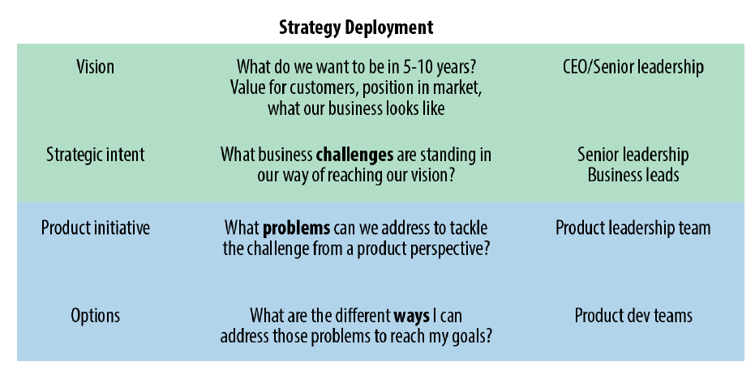
				  id:: 639652b0-7f53-40fa-b679-441e9d26edcb
				- Vision
				- Strategic intent
				- Product initiatives
				- Options
		- Strategy Creation
			- Strategy creation is the process of figuring out which direction the company should act upon and of developing the framework in which people make decisions.
			- Strategies are created at each level and then deployed across the organization.
			- Strategy Creation Phases
				- 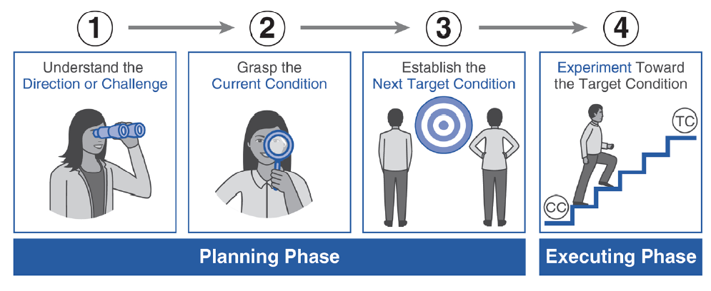
		- Strategy creation is not a one-day or one-week process. You need to be identifying problems and determine how to organize around solving them at every level of strategy.
		- The Product Kata - Plan, Do, Check Act (PDCA) Cycles of the Executing Phase from the Strategy Creation Phases - to inform the strategy and vision.
			- 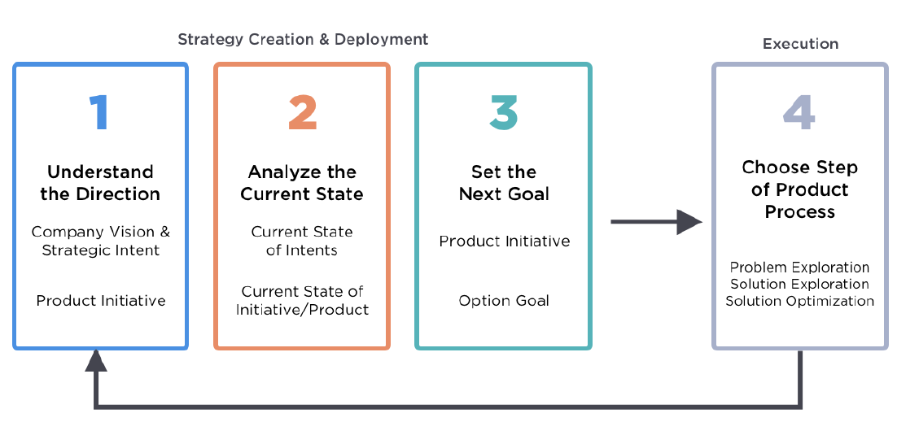
			- 1. Understand the Direction
				- You are looking at either the vision, strategic intent or product initiative
			- 2. Analyze the Current State
				- The current state is related to where you stand in relation to your vision. It also reflects the current state of the outcomes, including the current measurement of those outcomes.
			- 3. Set the Next Goal - Option Goal
				- Option goals are our next level of goals from the team. These are the outcomes you need to achieve in order to make progress toward your initiative or intent. Then you conduct your product process to experiment around systematically tackling problems to reach your goal.
			- 4. Execution
				- Through the act of exploring and identifying problems you uncover data that is needed to help inform the strategy and vision.
			- Vision is not set solely top-down by management. The entire organization should be sharing information as they learn about what will reach goals and help inform the strategy. The process of communicating data and direction up and down—and across—the organization is how we maintain alignment. But it needs to first start at the company level.
				- One of the biggest issues I hear from executives is that they do not have the data they need to make decisions. People ask them to create a vision, but they do not continuously surface information in a way that helps inform the strategic decisions that enable the organization to achieve the vision. The teams should be out there, analyzing, testing, and learning and then communicating what they discover back to their peers and their management teams. This is how we set strategy.
		- Chapter 19 - Evolving the Product Vision
		  collapsed:: true
			- Story mapping helps team break down their work and align around goals. It's purpose is to help the team communicate about their work and what needs to get done to deliver value.
			- North Star documents explains the product in a way that can be visualized by the entire team and company. This includes the problem we are solving. It's a good document to provide context to a wider audience.
			- Building understanding as a team helps you develop product faster, which means getting value out to the customers faster.
			- Prioritizing Work
				- Cost of delay  - a model to help with prioritization. It is a numeric value that describes the impact of time on the outcomes you hope to achieve. It combines urgency and value so that you can measure impact and prioritize what you should be doing first.
				- For considering what functions compose your first release of your product you need to think of the trade-offs between the amount of value you can capture with the scope of the release and the time it takes to get it out of the door. You want to reduce scope enough so that you can capture the maximum value in the right time.
				- 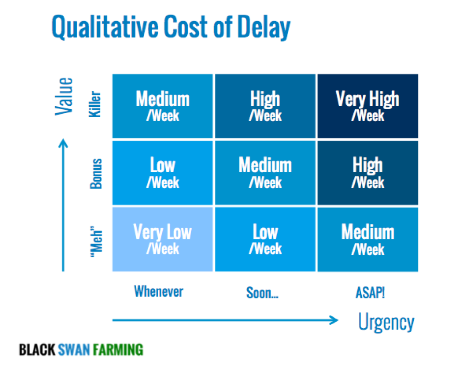
					- [More details on Cost of Delay](https://blackswanfarming.com/cost-of-delay/)
				-
			- The Real Definition of Done
				- We are done developing or iterating on a feature only when it has reached its goals. Set the success criteria before launch, while measuring and iterating until they reach it.
	- Chapter 13 - Company Level Vision and Strategic Intents
	  collapsed:: true
		- Company Vision
			- The company vision is the linchpin in the strategy architecture. It sets the direction and provides meaning for everything that follows. It gives you a framework around which to think about your product.
			- Amazon is an example of a company with a great vision and strategy. Amazon's vision is, "to be Earth's most customer-centric company, where customers can find and discover anything they might want to buy online, and endeavor to offer its customers the lowest possible prices."
			- The strategy needs to come from the stop, start at the corporate level, moving through the business lines, and ultimately arriving at the products. the products and services are vehicles for value.
		- Vision vs Mission
		  collapsed:: true
			- A good mission explains why a company exist. A vision explains where the company is going based on that purpose. It is good practice for a company to combine the vision and mission.
			- At Bank of America, we are guided by a common purpose to help make financial lives better by connecting clients and communities to resources they need to be successful.
		- Strategic Intents
		  collapsed:: true
			- While the vision should remain stable over a long period of time, how you intend to reach that vision changes as the organization matures and develops. Strategic intents communicates the company's current areas of focus that help realize the vision. Strategic intents take a while to reach on the magnitude of several years.
			- To determine the intents ask "What is the most important thing we can do to reach our vision, based on where we are now?" Keep the list small to focus everyone.
			- To set strategic intents, you have to first understand what business value really means
			- Framework to view business value
				- 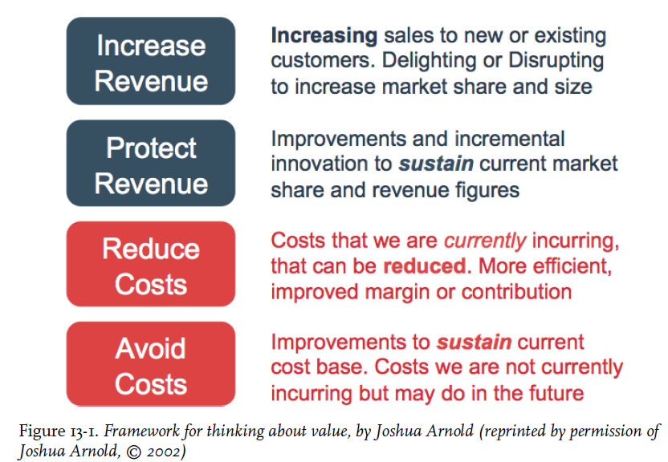
		- When planning strategic events think about how each function of the organization can contribute to the goals of the business value.
		- Strategic intents should be at the high level and business focused. They are about entering new markets, creating new revenue streams, or doubling down in certain areas. Because you want the whole company working on the strategic goals, they should not be small.
			- Example of Strategic Intent
				- 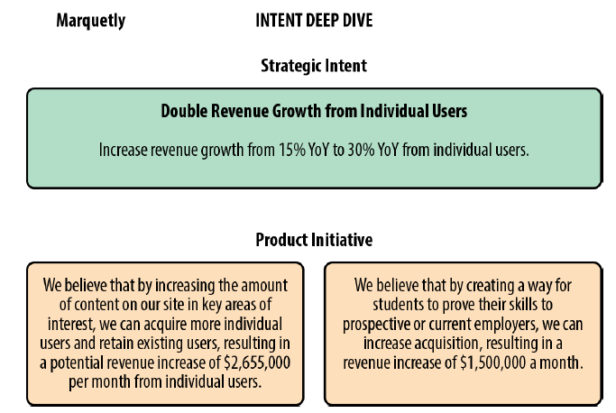{:height 447, :width 654}
	- Chapter 14 - Product Vision and Portfolio
	  collapsed:: true
		- Product initiatives are how strategic initiatives are broken down so the rest of the company can contribute to reaching the company vision. They translate the business goals into the problems that we will solve with our product.
		- The product initiatives answer how? How can I reach these business goals by optimizing my products or building new ones?
		- Options represent possible solutions that teams will explore to solve the product initiative. The product initiatives help set the direction where the product team can explore options.
		- The product manager has to ensure that the product intent and options are aligned with the vision of an existing product portfolio.
		- Product Vision
		  collapsed:: true
			- The product vision communicates why you are building something and what the value proposition is for the customer.
			- The product vision emerges from experimentation round solving problems for users. After you validate that the solution is the right one, you can grow it into a scalable, maintainable product.
			- Avoid making the product vision too specific that it stifles the way you grow your product.
		- Product Portfolio
		  collapsed:: true
			- A product portfolio is comprised of multiple products.
			- Having a philosophy for how your products or services help your company reach that vision in the near term or long term is key. Some questions to ask and find answers for:
			- How do all of our products work as a system to provide value to our customers?
			- What unique value does each of the product lines offer that makes this a compelling system?
			- What overall values and guidelines should we consider when deciding on new product solutions?
			- What should we stop doing or building because it does not serve this vision?
			- Make the time to innovate. Build innovation into your portfolio. Amazon is an example of creating teams to explore a problem and find a valuable solution from it.
				- Amazon Kindle, Amazon Groceries, AWS, and the Amazon shipping logistics are example of building innovation in their workflows.
	- Product Management
	  collapsed:: true
		- The best solutions are linked to real problems that users want solved. Product managers use a process to identify which of those problems the team can solve to further the business and achieve the strategy. Product managers can rely on the Product Kata to help them develop the right experimental mindset to fall in love with the problem rather than the solution. They continue iterating until they reach the outcome.
	- Chapter 15 - The Product Kata
	  collapsed:: true
		- 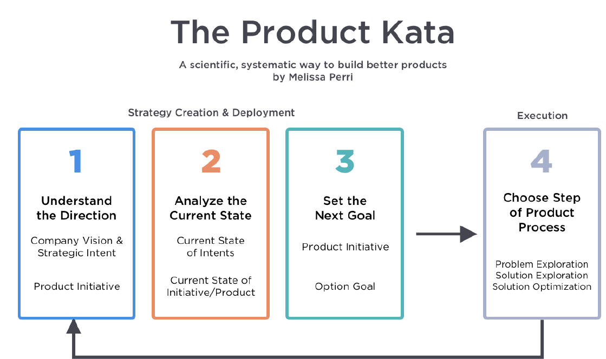
		- A process by which we uncover the right solutions to build.
		- The first step is to get the product initiative.
			- To do this you need to understand the strategic initiative, evaluate the current state of that strategic intent in relation to where you products can help, and determine what problems you can solve to further strategic intent.
			- It's important to take a step back and understand where you are and what is needed to get to where you want to be before jumping into any work.
			- After you set the walk through the product kata.
				- What is the goal?
				- Where are we now in relation to that goal?
				- What is the biggest problem or obstacle standing in the way of me reaching that goal?
				- How do I try to solve that problem?
				- What do I expect to happen (hypothesis?)
				- What actually happened, and what did we learn?
	- Chapter 16 - Understanding the Direction and Setting Success Metrics
	  collapsed:: true
		- (Success metrics from industry is easy because they have voluntary users and finances that they can measure. In OBI those metrics don't exist. Instead we have customer satisfaction and cost of development and maintenance.)
		- We can measure how many bugs are encountered and how impactful those defects are.
		- Product Metrics
		- Tell you how healthy your product is. They help you set the direction.
		- Pirate metrics
		  collapsed:: true
			- 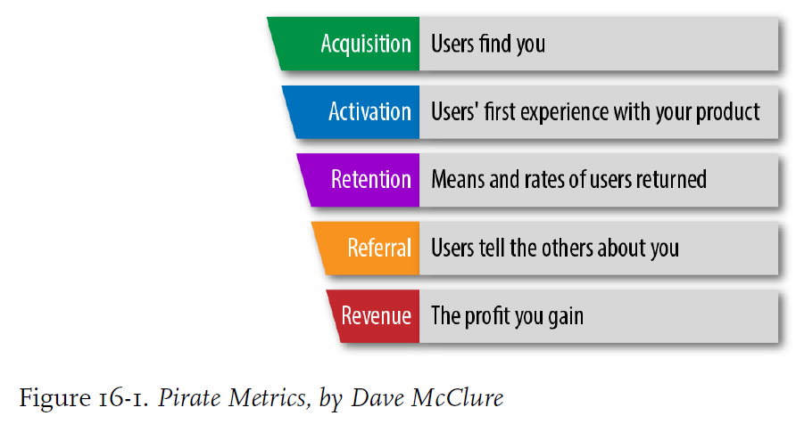
			- Acquisition is when users land on your site and sign up.
			- Activation is when someone is taking their first step on your product that creates value for them.
			- (Pirate metrics seems difficult to use for OBI since we aren't selling a service)
		- HEART Framework 
		  collapsed:: true
			- Measures happiness, engagement, adoption, retention, and task success. (source - How to choose the Right UX Metrics for Your Product."
			-
	- Setting Direction with Data
	  collapsed:: true
		- It's important to have a system of metrics, not just one, to guide product decisions. It's too easy to game one metric when it's your singular focus.
		- Choose leading metrics instead of lagging indicators.
		- You need to define and explore the problem to set up a success metric. Your success metric should be related to a problem.
	- Chapter 17 - Problem Exploration
	  collapsed:: true
		- Write out problems in the form of a user story. (example of a online course creator)
			- "When I am transferring my course from another school, I want to easily and accurately upload all my information into Marquetly (the online teaching product) so that I do not spend time reentering everything."
			- "When I am creating a new course, I want to import all of my content easily so that I can launch faster."
		- Understanding the Problem
			- Product managers are often spoken about as the "voice of the customer" but many PMs are not getting out and talking to the customers as much as they should. (Read talking to Humans by Giff Constable)
			- Problem-based user research is generative research, meaning that its purpose is to find the problem you want to solve. It involves going to the source of the customer's problem and understanding the context around it.
			- You can form a better solution when you understand the context of the customer's problem.
			- Don't get into the build trap of solving a problem you don't understand the root cause is.
			- (If your customers are stating their problems as features, try to get the real problem underlying their request for a specific functionality).
			- It's not the customer's job to solve their own problems. It's your job to ask the right questions.
		- Validating the Problem
			- A problem may be lying underneath your assumed problem. Keep digging until you find the root cause.
	- Chapter 18 - Solution Exploration
	  collapsed:: true
		- Before designing a solution ensure you have the problem statement clearly defined. And design your hypothesis and experiments around
		- Experiment to Learn
			- Building to learn is experimentation. It allows you to understand your customers better and prove whether there is value in solving a problem.
			- Experiments should not be designed to last for a long time, if it is not scalable and sustainable to prove your hypothesis right or wrong. This is usually the case as experimentation should be fast so the quick and dirty option maybe expensive and unsustainable.
			- We should frame away from MVPs as "whatever is built in the first release" as we may not know exactly what and how to build the first cut. We should allow the organization to be able to scrap and learn from the initial release. (Though can we mitigate errors like this and ensure the MVP is as close to the optimal solution?)
			- Limit exposure to customers for MPVs because they are not close to the "good"solution and it can turn off customers who are not ready to use it.
		- Concept Testing
			- You try to demonstrate or show concepts to the users to gauge their feedback. These can vary in execution, from landing pages and low-fidelity wire-frames to higher-fidelity prototypes or videos of how the service might play out.
			- These types of experiments are generative rather than evaluative. Generative solution experiments help you gain more awareness around what a user desires in a solution.
		- When to test and experiment
		  collapsed:: true
			- Experimentation is helpful when dealing with decision making around highly
			- Prototypes are helpful for when you need to learn whether a specific user flow or feature solves a problem for the user and allows them to achieve their desired outcome, you can turn to prototypes.
			- Experiments don't help when you need to validate the problem. That's why you need to focus on exploring the problem before any solution activities.
			- Example Product Kata
				- 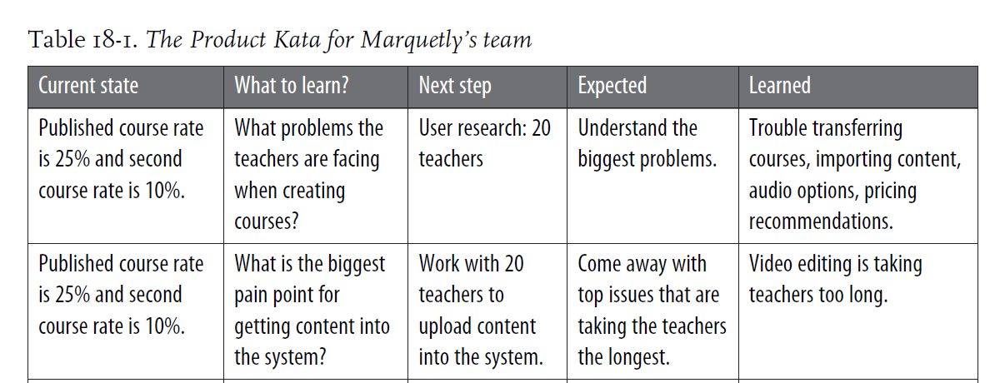
	- Chapter 19 - Evolving the Product Vision
	  collapsed:: true
		- Story mapping helps team break down their work and align around goals. It's purpose is to help the team communicate about their work and what needs to get done to deliver value.
		- North Star documents explains the product in a way that can be visualized by the entire team and company. This includes the problem we are solving. It's a good document to provide context to a wider audience.
		- Building understanding as a team helps you develop product faster, which means getting value out to the customers faster.
		- Prioritizing Work
			- Cost of delay  - a model to help with prioritization. It is a numeric value that describes the impact of time on the outcomes you hope to achieve. It combines urgency and value so that you can measure impact and prioritize what you should be doing first.
			- For considering what functions compose your first release of your product you need to think of the trade-offs between the amount of value you can capture with the scope of the release and the time it takes to get it out of the door. You want to reduce scope enough so that you can capture the maximum value in the right time.
			- Cost of Delay
				- 
				- .[Details on cost delay](https://blackswanfarming.com/cost-of-delay/)
		- The Real Definition of Done
			- We are done developing or iterating on a feature only when it has reached its goals. Set the success criteria before launch, while measuring and iterating until they reach it.
	- The Product-Led Organization
	  collapsed:: true
		- The product-led organization is characterized by a culture that understands and organizes around outcomes over outputs, including a company cadence that revolves around evaluating its strategy in accordance to meeting outcomes. In product-led organizations, people are rewarded for learning and achieving goals. Management encourages product teams to get close to their customers, and product management is seen as a critical function that furthers the business.
			- Companies die off when it is reactive rather than innovative (e.g., Kodak). This can be avoided by adopting a product-led mindset. To truly get out of the build trap, you need to become a product-led organization, both in mentality and practice.
	- Chapter 20 - Outcome-focused Communication
	  collapsed:: true
		- Measure success through well-defined desired outcomes instead of defining success as numbers of features shipped.
		- Cadence and Communication
			- Visibility in organizations is absolutely key. The more leaders can understand where teams are, the more they will step back and let the teams execute.
			- The more you try to hide your progress, the wider the knowledge gap becomes.
		- Meeting types and cadence
		  collapsed:: true
			- Quarterly business reviews - the senior leadership team, made up of executives and the highest level of the organization, should be discussing progress toward the strategic intents and outcomes of a financial nature.
				- This includes reviewing revenue for the quarter, churn of customers, and costs associated with development or operations.. Communication on the outcomes of product initiatives have furthered strategic intents.
			- Product Initiative Review - This is a quarterly meting for the product development side of the house. It is a meeting to review the progress of the options against the product initiatives and adjust strategy accordingly.
				- A meeting for product managers to share results of preliminary experimentation, research, or first releases, as they relate to overall goals.
			- Release review- Provide the opportunity for teams to show off the hard work they have done and to talk about success metrics. These should happen monthly before features go out, to showcase what is in the pipeline to be release. Only talk about what is going to ship—not experiments or research being conducted.
		- Roadmaps and Sales Team
			- Instead of thinking of roadmaps as a Gannt chart, you should view them as an explanation of strategy and the current stage of your product.
				- This combines the strategic goals with themes of work and emerging product deliverables from it. Product roadmaps should be updated constantly, especially at the team levels.
				- Roadmaps are not one-size-fits-all. They need to be communicated differently, depending on whether you are talking internally to your about uncertainty about features that you can communicate to customers.
		- Roadmaps consist of a few key parts
			- The theme
			- Hypothesis
			- Goals and success metrics
			- Stage of development
			- Any important milestones
		- Stages of development
			- Experiment - This phase is to understand the problem and to determine whether it's worth solving. No production code is being created. Conduct problem exploration and solution exploration activities.
			- Alpha
				- This phase is to determine  whether the solution is desirable to the customers. This is a minimum feature set or a robust solution experiment, but built in production code and live for a small set of users.
				- The users understand that they are getting early access to a feature that might change or be killed, if not solving their problems.
			- Beta
				- This phase determines whether the solution is scalable, from a technical standpoint. Although not always needed, this is a good phase to reduce risk. This release is available to more customers than the Alpha phase, but is still only a smaller subset of the entire population.
				- The solution has been proven desirable to customer and most likely won't be kill unless it is not technically available.
			- Generally Available
				- This phase means the solution is widely available to all our clients.
	- Product Operations
	  collapsed:: true
		- Viewing progress is important to leadership, so create documentation for this. If the team gets too large consider product operations to help with the administrative work of communication, streamlining all process work that ensures the team is successful.
		- Activities include
			- Create automated and streamlined ways to collect data on progress towards goals and outcomes across teams
			- Reports on goals, outcomes, roadmaps, progress, capacity, and costs across the product organization
			- Set up and maintain a product analytics platform to report on product engagement metrics across the organization
			- Standardize produce processes that go across teams, such as strategy cadences, experimentation tracking and feedback, documentation on product features, collecting data, setting goals, creating and maintaining roadmaps, and sales enablement.
			- Organize and run critical product meetings for strategy creation, strategy deployment, and releases
			- Conduct any coaching or training for the product teams
		- The team isn't about telling people how to work and instead create the criteria for inputs and outputs of the work. This team would be helpful if you have tens or hundreds of scrum teams with no standardization around releasing or testing.
	- Chapter 21 - Rewards and Incentives (skipped)
	- Chapter 22 - Safety and Learning
	  collapsed:: true
		- Experimentation is the ultimate risk-management strategy because, when you experiment early, you can prevent the failure of something you will have spent billions of dollars later.
		- Ideally product managers should be risk mitigators.
			- How do I test this option and ensure that this is actually what we want?
			- How do I become more confident that we're on the right path before I invest resources on this?
			- Segment your customers for alpha and beta phases.
		- Run experiment to improve your product or organization.
		  
		  <!--EndFragment-->
	- Chapter 23 - Budgeting (skipped)
	- Chapter 24 - Customer Centricity
	  collapsed:: true
		- "The most important single thing is to focus obsessively on the customer. Our goal is to be the earth's most customer centric company."
		- Ask yourself "What would make my customers happy and move our business forward?"
		- Being customer-centric allows you to figure out what products and services will fulfill and create value for customers.]
		- Go and observe your customers.
		  
		  <!--EndFragment-->
	- Chapter 25 - Example Company
	- Afterword: Become Product-Led
	  collapsed:: true
		- Consider the power of personalities in an organization. People will get in the way of a good product every time. To mitigate the personality risk, you need to deeply understand what motivates people and to know how you can address their personal motivations by introducing information and at data that wins them over.
		- Amazon, Netflix, and Google are not reactively building whatever customers requests comes their way. They are not following Agile processes blindly to build whatever feature they can. Instead they are developing products with the intent to deliver value to their customers.