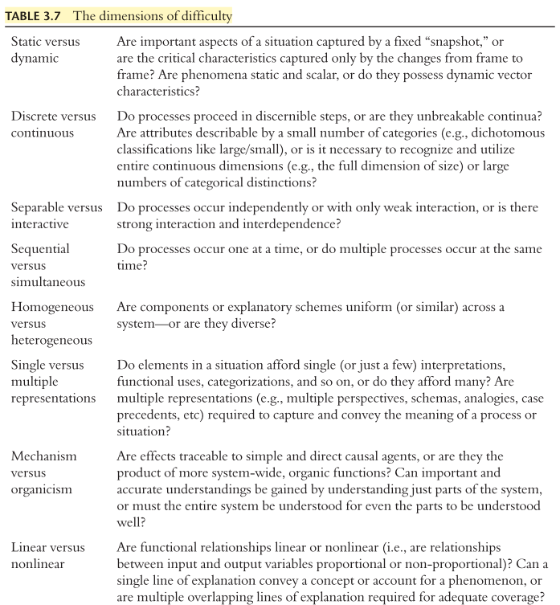

title:: Expertise : Research and Applications Series : Accelerated Learning : Training for High Proficiency in a Complex World (highlights)
author:: [[Hoffman, Robert R.(Author)]]
full-title:: "Expertise : Research and Applications Series : Accelerated Learning : Training for High Proficiency in a Complex World"
media:: #articles
url:: https://readwise.io/reader/document_raw_content/3740080

- Highlights first synced by [[Readwise]] [[2023-03-03]]
	- In recent years there has been wide recognition in the business community of the importance of knowledge capture, preservation, and sharing in knowledge-based organizations ([View Highlight](https://read.readwise.io/read/01gth6q3hhdzp86vksftzka0dw))
	- **Domain practitioners who achieve high levels of proficiency provide technical judgment to speed decision-making in time-critical events. They provide resilience to operations by resolving tough problems, anticipating future demands and re-planning, and acting prudently by judgment rather than by rule. High proficiency practitioners exercise effective technical leadership in ambiguous or complex situations, often by communicating subtle features that other people will not see until they are pointed out. Often they are also the ones who understand the history, the interdependencies of units and processes, and the culture of their complex organizations—knowledge that is often essential in actually “getting things done”** (e.g., Stein, 1997). ([View Highlight](https://read.readwise.io/read/01gth6r9nqesx35s9p7nwbbxpf))
	- As workplaces and jobs become more cognition-intensive, organizations need to take traditional notions of training to new levels, and well into the territory of complex systems. Workers in sociotechnical systems must be trained to be adaptive, so that they can cope with the ever-changing world and ever-changing workplace. People must be trained to be resilient, so that they can cope with complexity when unexpected events stretch resources and capabilities. And workers must be trained faster. Intelligent systems technology, and intelligent use of technology, will certainly play a critical role in this. ([View Highlight](https://read.readwise.io/read/01gth6scys1a02qes8jff5118v))
	- In many sociotechnical domains, there is a need for personnel who are trained at a number of levels of proficiency. While there may be some requirements for more senior experts in select areas, there is a more profound and continuing need for journeymen and senior journeymen to carry out the complex cognitive work effectively to ensure current and future success. ([View Highlight](https://read.readwise.io/read/01gth6w9k61389fa7jy6vd5cqz))
	- Simply “working at a job” does not promote progression along the proficiency continuum (e.g., Feltovich, Preitula, & Ericsson, 2006). Unless there is continuous deliberate practice and feedback on difficult tasks or, at the very least, recurrent engagement in activities that will maintain the current level of skill, the only thing one can do “on the job” is forget and actually experience skill degradation. ([View Highlight](https://read.readwise.io/read/01gth70g2231h85f442ahn6hmj))
	- Furthermore, the current challenges for training involve two different sorts of transfer. One is transfer across situations. An example would be an infantry commander, who knows how to conduct traditional warfare but is asked to develop tactics for an insurgency operation. The second challenge is transfer across responsibilities. An example would be a warfighter having a skill at maintenance of an F-16 engine who is promoted to a supervisory position. Since different skill sets would be involved, one would need to train for the new role, and not just assume that previously developed skills would transfer (or even be applicable) and constitute a sufficient basis for success in the new role ([View Highlight](https://read.readwise.io/read/01gth71z1vt5kst1hesv963y9a))
	- **What we saw was that there is a growing role for a chief learning officer type within enterprise-level companies … there is a need to have somebody focused on how to keep the skills of the corporation’s work force at a high level.** ([View Highlight](https://read.readwise.io/read/01gth740r6rrh0d9xzvyzzpd6v))
	- In the Knowledge Management process, company management establishes a program whereby experts who possess valuable undocumented knowledge collaborate with a knowledge engineer. Working together, they elicit the worker’s wisdom for inclusion in the organization’s knowledge base. In extreme cases, such as a senior worker retiring, the individual might be retained or brought back as a consultant (Becerra-Fernandez & Leidner, 2008).
	  **The field of Knowledge Management raises the practical problem of knowledge finding; identifying individuals who possess knowledge that is:
	  1 Unique to them, 2 Critical to the organization, and 3 Tacit in the sense of being undocumented.** ([View Highlight](https://read.readwise.io/read/01gth74t2k5x3w1dg45wdycz44))
	- all our lessons learned in cognitive systems engineering and complexity theory imply that more automation may result in simplifications, but they will hide deeper complexity, and at those moments where resilience and high-performance are needed, there will have to be greater operator expertise. ([View Highlight](https://read.readwise.io/read/01gth7j91yx0905d75wrj7vy5d))
	- Defining Accelerated Learning
	  Accelerated learning has been defined in a number of ways (Hoffman et al., 2009). These are diagrammed conceptually in Figure 2.1. ([View Highlight](https://read.readwise.io/read/01gtj3qx4sc1d3wbn6h6phremq))
	- The first sense is rapidized training—the idea of training individuals to achieve some minimal level of proficiency at a rate faster than usual. The second sense is accelerated proficiency—the idea of getting individuals to achieve high levels of proficiency at a rate faster than ordinary (i.e., accelerated proficiency). The third sense is facilitated retention—the idea of making learning less susceptible to decay. The fourth sense is rapidized cognitive task analysis—while both training design and tool design depend crucially on cognitive task analysis, cognitive task analysis (CTA) is understood to be too labor and time-intensive. Fifth and finally, how might rapidized transposition of knowledge from the operational setting to the training setting be brought about? The fast transposition of “lessons learned” from workplace to schoolhouse is a crucial need in many domains, spanning the academy, business, and the military. We take each of these senses of “accelerated learning” as a challenge. ([View Highlight](https://read.readwise.io/read/01gtj3re95yg3fxszpp0rtmhyv))
- New highlights added [[2023-03-06]] at 10:34 PM
	- The phrase “declarative knowledge” assumes a class of knowledge that is not declarative or not verbalizable in principle. This latter category represents an indeterminate class, sometimes called “tacit” knowledge, hiding in a philosophical hornet’s nest. Thus, we might refer instead to Teachable/Conceptual Knowledge as knowledge that is developed by being taught or mentored and by studying training materials. Experiential Knowledge can be learned only by direct personal experience—actually being there to know what it feels like. Conjectural Knowledge/Skill is an aptitude for strategic sensemaking, mental projection, insightfulness, resourcefulness, opportunism and similar capabilities. These distinctions, while slippery, are important because all generalizations about
	  learning, retention, decay, transfer, the role of feedback, etc regarding one type are not likely to apply directly to other types ([View Highlight](https://read.readwise.io/read/01gtsv4m0bskne0dv1rhxj0462))
	- Three topics of proficiency development are particularly pertinent to accelerated learning: the nature of high proficiency, proficiency scaling concepts and methods, and the features that make the achievement of high proficiency difficult. To accelerate proficiency, one must accelerate the acquisition of knowledge that is extensive and highly organized. One must also accelerate the acquisition of expert-level reasoning skills and strategies (Klein et al., 1993). Thus, expertise is the “gold standard” for training, it is the source for training materials, and it is a goal for accelerated learning (Feltovich, Prietula, & Ericsson, 2006). ([View Highlight](https://read.readwise.io/read/01gtsv86eywmj5gdjp37234q4c))
	- One widely cited rule of thumb is that the development of high proficiency takes at least ten years (Chase & Simon, 1973 a, b; Hayes, 1985). Another rule of thumb is 10,000 hours of practice or engagement with a task. (Ten years at a full-time job would be about 20,000 hours, assuming that in an eight-hour working day the typical worker spends about half their time actually engaged in their fundamental task work.) These rules are admittedly approximate and there is considerable variation across domains (Hoffman & Militello, 2009; Ward, Hodges, Williams, & Starkes, 2004).
	  It is obvious that mere time in grade does not enable just anyone to qualify as an expert. A person may achieve journeyman status, become demotivated, and stay at that level for the rest of their career. ([View Highlight](https://read.readwise.io/read/01gtsvbrzk5ng8z898esm9fg1n))
	- **To achieve high proficiency there is a need for: • Critical skills for accomplishing the mission and achieving national defense, • A constant “stretching” of the skill, defined by increasing challenges (tough or rare cases), • High levels of intrinsic motivation to work hard on hard problems, • Practice that provides rich, meaningful feedback, and • Practice based on mentoring or expert instructional guidance.** ([View Highlight](https://read.readwise.io/read/01gtsvc51jng27ws3116v9ge5e))
	- The developmental factors noted in the academic literature on expertise in less complex domains, such as chess, are also observed in more complex domains: self-assessment and self-directed learning, deliberate practice, self-awareness of the development toward expertise, and so forth (Fletcher, 2009). **For many occupational specialties, as is true for expertise in general, there is mixed evidence that increased experience alone is related to improved performance (Fletcher, 2009). Rather, success seems to be related to such additional factors as cognitive flexibility, team composition, and practice, especially practice with zeal on tough cases.** ([View Highlight](https://read.readwise.io/read/01gtsve03ybsv6zb2t24ztqb8r))
	- While higher intelligence is related to better learning and performance on complex tasks, high intelligence (as measured in the classical scholastic way) is not always a strict prerequisite for the achievement of proficiency or expertise at certain skills or tasks or in certain domains (Ceci & Liker, 1986; Lafrance, 1989). That being said, **high proficiency is distinguished by reasoning strategies and skills.** ([View Highlight](https://read.readwise.io/read/01gtsvegpf4e6wya0kwnj51fxd))
	- basic reasoning operations or strategies (deduction, induction, goal decomposition, etc) are applied in different orders and with different emphases for experts versus non-experts. **In the initial stages of problem solving, experts spend proportionately more time than students in forming a conceptual understanding of the problem. Experts generate representations that are conceptually richer and more organized than those of the students. Students tend to use hastily formed “concrete” (that is, superficial) problem representations.** **Experts use “abstract” representations that rely on “deep” knowledge; that is, imaginal and conceptual understanding of functional relations and physical principles** ([View Highlight](https://read.readwise.io/read/01gtsvg487q6hnwwtzk3jnpzvp))
	- t**hat relate concepts (e.g., in the case of experts at mechanics, principles such as conservation of energy). Furthermore, experts are better able to gauge the difficulty of problems and know the conditions for the use of particular knowledge and procedures (e.g., if there is acceleration, use Newton’s second law)** (Chi et al., 1982). ([View Highlight](https://read.readwise.io/read/01gtsvg9dqreh7xwsr8e14rse2))
	- **When experts approach familiar problems, their responses do not tend to be from an analytical or deliberative process as is the case for non-experts (Sternberg & Frensch, 1992). Rather, an organized set of memories drawn from extensive experience forms schemas or mental models (Gentner & Stevens, 1983), which give meaning and structure to familiar and repeatedly encountered problem sets. These schemas provide intuitive, immediate cognitive frameworks to help understand the nature of the problem, derive potential solutions, and anticipate constraints** (Reimann & Chi, 1989). This has been called Recognition-Primed Decision Making (Klein, 1989; Oliver & Roos, 2005). ([View Highlight](https://read.readwise.io/read/01gtsvq61rryz3s5py11g26nna))
	- One can conceive of superiority in a number of ways: effectiveness, efficiency, or work process quality, all of which are likely to be situationally determined. There is also some wiggle room with regard to tasks that should be considered (most) representative. ([View Highlight](https://read.readwise.io/read/01gtsvr1w5e2p0hb3nenmqgxyp))
	- **Simply put, experts consistently do very good work. While important, the goodness of work is not easily measured. Some of the features in Table 3.1 can be readily operationalized** ([View Highlight](https://read.readwise.io/read/01gtsvrneycmcj80r55dqa3n92))
	- Table 3.1 Some features of high proficiency
		- • The expert is highly regarded by peers. • The expert’s judgments are accurate and reliable. • The expert’s performance shows consummate skill (i.e., more effective and/or qualitatively different strategies) and economy of effort (i.e., more efficient).
		  • For simple, routine activities, experts display signs of “automaticity” where the expert seems to be carrying out a task without significant cognitive load and conscious processing is reserved for strategic control and/or more complex activities.
		  • The expert possesses knowledge that is fine-grained, detailed and highly organized. • The expert knows that his knowledge is constantly changing and continually contingent. • The expert forms rich mental models of cases or situations to support sensemaking and anticipatory thinking.
		  • The expert is able to create new procedures and conceptual distinctions. • The expert is able to cope with rare and tough cases. • The expert is able to effectively manage resources under conditions of high stakes, high risk and high stress.
		  • Typically, experts have special knowledge or abilities derived from extensive experience with subdomains.
		  • The expert has refined pattern perception skills and can apprehend meaningful relationships that non-experts cannot.
		  • Experts are able to recognize aspects of a problem that make it novel or unusual, and will bring special strategies to bear to solve “tough cases.” ([View Highlight](https://read.readwise.io/read/01gtsvt3tx0ya2vh3ykgy5p4ge))
	- Technically, a novice is a person who has begun an introductory course of instruction. Unlike a person that is “naïve,” someone who may not even know that the domain exists, novice refers to an individual who has committed to a course of training. ([View Highlight](https://read.readwise.io/read/01gtsvwhs11w35zp329d5sryef))
	- **novices and apprentices tend to rely on superficial features and rote procedures whereas more proficient individuals apprehend the underlying relational structure, the constraints, and the pertinent principle**s (Carlson, 1990; Chi, Glaser, & Rees, 1982; Egan & Schwartz, 1973; Larkin, 1981; Reed, Dempster, & Ettinger, 1985). **Experts engage in rapid apprehension of the situation and/ or recognize solution paths, whereas novices engage in deliberate processing** (Frensch, 1988). ([View Highlight](https://read.readwise.io/read/01gtsvx6j2vjx7k16072004745))
	- “The knowledge of novices is not simply an incomplete version of the knowledge of the expert or mature learner, it is qualitatively entirely different” (Cazden, 1976, p. 320). ([View Highlight](https://read.readwise.io/read/01gtsvxjqk7yy8z22mvmx7dnnm))
	- The literature of expertise studies includes many discussions of the notion of “automaticity” (James, 1890). Numerous features have been highlighted in the definition of automatic processing: it is often described as being fast, parallel and effortless (i.e., utilizes no attentional resources and, hence, is efficient and robust to interference from other concurrent mental operations), operates outside of awareness (i.e., the process itself is not consciously accessible), autonomous (i.e., not consciously controlled or potentially even controllable, except via some other controlled inhibitory process), and involuntary or unintentional (e.g., Bargh, 1982; Hasher & Zacks, 1979; Logan & Cowan, 1984; Posner & Snyder, 1975). In simple terms, one can think of automaticity as the idea that knowledge or skill undergoes a “declarative-to-procedural shift” or becomes “routinized” (Anderson, 1987) ([View Highlight](https://read.readwise.io/read/01gtswnp1rnek8d2ndkyxbgfqn))
	- Table 3.2
	  Levels of proficiency (after Dreyfus & Dreyfus, 1986)
	  Level One Practitioners at this level have knowledge that is declarative or propositional;, their reasoning is said to be explicit and deliberative. Problem solving focuses on the learning of facts, deliberative reasoning, and a reliance on general strategies.
	  Level Two The declarative knowledge of practitioners at this level has become procedural and domain-specific. They can automatically recognize some problem types or situations.
	  Level Three At this level, procedures become highly routinized. Level Four
	  These practitioners are proficient and have a great deal of intuitive skill. Level Five
	  Practitioners at this highest level can deliberately reason about their own intuitions and generate new rules or strategies (what Dreyfus and Dreyfus call “deliberative rationality”). ([View Highlight](https://read.readwise.io/read/01gtswp9kppf548ewrqzs59jx1))
	- Table 3.3 Basic proficiency categories based on the traditional craft guild terminology (adapted from Hoffman, 1998) Naïve
	  One who is ignorant of a domain. Novice Initiate Apprentice
	  Literally, someone who is new—a probationary member. There has been some (“minimal”) exposure to the domain.
	  Literally, someone who has been through an initiation ceremony—a novice who has begun introductory instruction.
	  Literally, one who is learning—a student undergoing a program of instruction beyond the introductory level. Traditionally, the apprentice is immersed in the domain by living with and assisting someone at a higher level. The length of an apprenticeship depends on the domain, ranging from about one to 12 years in the craft guilds.
	  Journeyman Expert
	  Literally, a person who can perform a day’s labor unsupervised, although working under orders. An experienced and reliable worker, or one who has achieved a level of competence. It is possible to remain at this level for life.
	  The distinguished or brilliant journeyman, highly regarded by peers, whose judgments are uncommonly accurate and reliable, whose performance shows consummate skill and economy of effort, and who can deal effectively with certain types of rare or “tough” cases. Also, an expert is one who has special skills or knowledge derived from extensive experience with subdomains.
	  Master
	  Traditionally, a master is any journeyman or expert who is also qualified to teach those at a lower level. A master is one of an elite group of experts whose judgments set the regulations, standards or ideals. Also, a master can be that expert who is regarded by the other experts as being “the” expert, or the “real” expert, especially with regard to subdomain knowledge. ([View Highlight](https://read.readwise.io/read/01gtswpw1s3k3kk90zz2dsxbav))
	- **Although mere years of experience do not guarantee expertise, there is a partial linkage in that the longer the career, the greater the opportunity for more experience, and more diverse experiences. Experience scaling can also involve an attempt to gauge the practitioners’ breadth of experience—the different contexts or sub-domains they have worked in, the range of tasks they have conducted, etc. Deeper experience (i.e., more years at the job) affords more opportunities to acquire broader experience. Hence, depth and breadth of experience should be correlated. But they are not necessarily strongly correlated, and so examination of both breadth and depth of experience is always wise.** Thus, one comes to a resolution that age and proficiency are generally related; that is, partially correlated. This is captured in Table 3.5. Note that there are always exceptions to a general rubric such as the one proposed in this table (e.g., gymnastic athletes often attain expertise prior to 20 years of age; for livestock judges, training to proficiency takes well over ten years but also generally commences during childhood). ([View Highlight](https://read.readwise.io/read/01gtswras6vtd2bfpx26hg099m))
	- What Makes the Achievement of High Proficiency Difficult?
	  **Studies that have attempted to create domain-appropriate proficiency scales (e.g., Ericsson et al., 1993; Hoffman et al., 2002) have shown that the amount of practice is the single greatest determinate of superior expertise, followed by specificity of practice and deliberateness of practice** (see Schmidt & Lee, 2005; Ericsson, 2003; Ward, Hodges, Starkes, & Williams, 2007). **Expertise is achieved only after working hard on hard problems** (Eccles & Feltovich, 2008). For instance, in the field of continuing education it is recognized that the progression to proficiency depends on practice at difficult tasks. Valkeavaara (1999) interviewed a group of highly experienced workers in the field of human resource management to reveal the features of problems that made them difficult. The semi-structured interviews confirmed that the best “lessons learned” were in situations that placed new demands on the worker. ([View Highlight](https://read.readwise.io/read/01gtswtjqwjskqf5btm57d96q1))
	- Table 3.7 The dimensions of difficulty ([View Highlight](https://read.readwise.io/read/01gtsx0esd4vdswqjh8p39avjg))
		- 
	- **When the material to be learned or understood is characterized by the second alternative in each of the pairs in Table 3.7, then learners will tend to interpret the situations as though they were characterized by the simpler alternatives, and their understandings will tend to be reductive; that is, they will tend to simplify and will attempt to defend their simple understandings when confronted with facts that suggest that the situation is more complex than what they suppose.** ([View Highlight](https://read.readwise.io/read/01gtsx2ewjkkwe2sqe9kwfv4zk))
	- **So at any point in time, the human’s understanding of anything that is at all complex, even some of the understandings held by domain experts, is bound to be overly simplistic at least in some respects.** The reductive tendency is not to be confused with the notion of cognitive bias or the notion of encapsulation—a process of abstraction where skilled individuals subsume many lowerorder constructs into fewer higher-order concepts (Schmidt & Boshuizen, 1993) ([View Highlight](https://read.readwise.io/read/01gtt7s435hbama20yp2v1k841))
	- **When learners are confronted with evidence contrary to their views, they engage mental maneuvers to rationalize their faulty beliefs without fundamentally altering their views. These are the “knowledge shields.”** Twenty-three of them have been identified (Feltovich et al., 2001). The knowledge shields allow people to maintain their incorrect beliefs and understandings. It requires effort, practice and experience (i.e., the achievement of expertise) for people to begin to overcome the knowledge shields. ([View Highlight](https://read.readwise.io/read/01gtt7tcrpbmcjxjze2ra7nk0c))
	- **Studies of experts and expert-novice differences also suggested that the achievement of proficiency depends on the learner’s active, deliberative creation and refinement of their own knowledge.** The Cognitive Flexibility Theory of Paul Feltovich, Rand Spiro, and their colleagues (Spiro, Feltovich, Jacobson, & Coulson, 1991, 1992; Spiro & Jheng, 1990) asserts that people (especially experts) have the ability to restructure their knowledge to adapt to complex, ill-structured problems. ([View Highlight](https://read.readwise.io/read/01gtt7v7fp617haecneknpw4yw))
	- Cognitive flexibility is “the ability to ([View Highlight](https://read.readwise.io/read/01gtt7vh3pgtw5yfxnjkf0a41p))
	- represent knowledge from different conceptual and case perspectives and then, when the knowledge must later be used, the ability to construct from those different conceptual and case representations a knowledge ensemble tailored to the needs of the understanding or problem-solving situation at hand” (Spiro et al., 1992, p. 58). This ability hinges on experience with diverse problem types, and opportunities to understand the material from differing perspectives. This enables people to refine their understanding of concepts and the relations among concepts, in processes such as those discussed by Jean Piaget (e.g., Inhelder & Piaget, 1959) and David Ausubel (1968; Ausubel, Novak, & Hanesian, 1978) involving assimilation and accommodation. ([View Highlight](https://read.readwise.io/read/01gtt7w3hychsct4ctf518nrab))
	- The theory also asserts that knowledge is context-dependent, and so instruction needs to be with reference to meaningful contexts. This entails some straightforward guidelines for effective instruction:
	  • Learning activities must provide multiple representations of content. • Instructional materials should avoid oversimplifying the content domain and support context-dependent knowledge.
	  • Instruction should be case-based and emphasize knowledge construction, and not just the transmission of information.
	  • Knowledge sources should be highly interconnected rather than compartmentalized ([View Highlight](https://read.readwise.io/read/01gtt7whzy3gpxkgfhfd1vmf38))
	- it has been confirmed that rehearsal in the medium of mental imagery appears to be an effective strategy to reduce forgetting of declarative material or decay of psychomotor skill during the retention interval, and so mental rehearsal is considered an effective form of “practice”, including psychomotor skills (e.g., Driskell, Coopper, & Willis, 1992; Jeannerod & Decety, 1995). ([View Highlight](https://read.readwise.io/read/01gtt8xyx6p2sfp23e7hqjdb1n))
	- Research has shown that mental practice can serve as an effective substitute for physical practice for both enhancing knowledge of particular sequences and improving general skill and promoting transfer of training (Healy, 2007; cf. Dunlosky et al., 2013). ([View Highlight](https://read.readwise.io/read/01gtt8y7yveqx3fw1he1npvcqp))
	- If there can be any one generalization about the science of training and instructional design and in which we can be confident, it is this:
	  Generalization is difficult. ([View Highlight](https://read.readwise.io/read/01gtt8yxk6t3tmjrqa1tbaq39a))
	- It is generally held in the learning literature that distributed practice leads to better learning than massed practice. This conclusion, however, needs an important qualification since the effects of spacing appear to be moderated by many factors, including length of interval between practice sessions, length of retention interval, and type of task (see Donovan & Radosevich, 1999). ([View Highlight](https://read.readwise.io/read/01gtt8zryftqr71zmsvaapv79k))
		- **Note**: Distributed practice is a learning method in which information is reviewed for short durations over an extended length of time. Mass practice refers to learning and studying conducted less frequently and for longer periods of time.
	- One factor that has been shown to moderate long-term retention is the relationship between the length of the interval between learning (or practice or testing) sessions (i.e., the itersession interval; ISI) and the length of the period between the last learning activity and the point when the learner will be required to use this information in the future (i.e. the retention interval; RI). Some studies have found that optimal performance on a post-hiatus test can result when the interval between practice trials is approximately equal in length to the retention interval. This conclusion seems to hold even when practice is distributed across sessions rather than across trials within a session (Healy, 2007). Some studies find that the best retention occurs when the RI is 20 percent shorter (or less) than the ISI (Cepeda, et al., 2008). In their review of the literature, Dunlosky et al. (2013) point out that the spacing of practice can result in the most forgetting between the practice sessions, but better retention in the long term. ([View Highlight](https://read.readwise.io/read/01gtt97eaz0hzzk71jqt371nk4))
	- A number of researchers have found that randomized practice schedules that make practice more difficult during acquisition (i.e., random practice) delay the rate of acquisition of each task but increase learning in subsequent tests of retention. In contrast, blocked practice results in better performance during the acquisition period but skill retention is degraded subsequently (Landauer & Bjork, 1978; Shea & Morgan, 1979; Rea & Modigliani, 1985). This holds true for both simple motor skills and simple verbal memory tasks. It is theorized that randomized practice forces the learner to continuously engage with new information that is difficult to process, which can be to the detriment of initial retention, but prevents reliance on a “superficial massed rehearsal.” This allows for greater long-term retention ([View Highlight](https://read.readwise.io/read/01gtt99f1v3md7pb5r8qsgrxbt))
- New highlights added [[2023-03-06]] at 11:34 PM
	- he ([View Highlight](https://read.readwise.io/read/01gtx2dm6cf6rymkvdzpk09tr8))