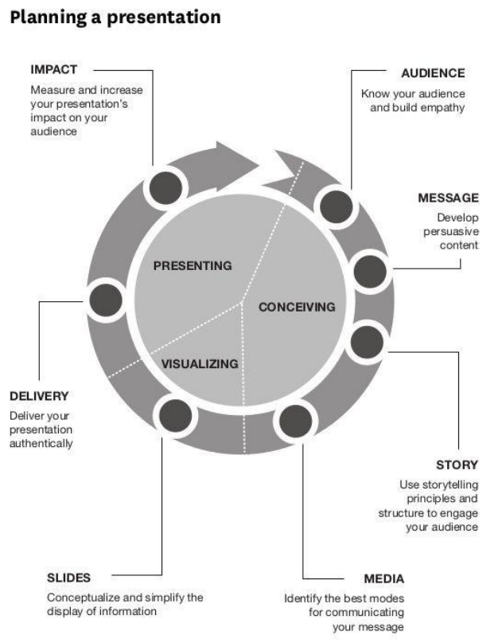

title:: HBR Guide to Persuasive Presentations (highlights)
author:: [[Nancy Duarte]]
full-title:: "HBR Guide to Persuasive Presentations"
media:: #book
status:: #📥inbox 
url:: https://readwise.io/reader/document_raw_content/26202161

- Highlights first synced by [[Readwise]] [[2023-01-12]]
	- Introduction
	  If I am to speak for ten minutes, I need a week for preparation; if fifteen minutes, three days; if half an hour, two days; if an hour, I am ready now. —Woodrow T. Wilson
	  We work in a first-draft culture. Type an e-mail. Send. Write a blog entry. Post. Whip up some slides. Speak. But it’s in crafting and recrafting—in iteration and rehearsal—that excellence emerges. ([View Highlight](https://read.readwise.io/read/01gpjab9jyczv9p2vzmj45b26w))
	- It actually takes more careful planning to distill your ideas into a few key takeaways than it does to create an hourlong presentation (see figure I-1). ([View Highlight](https://read.readwise.io/read/01gpjafm2brmbzw8c5fynds24d))
	  collapsed:: true
		- 
	- When audiences can see that you’ve prepared—that you care about their needs and value their time—they’ll want to connect with you and support you. You’ll get people to adopt your ideas, and you’ll win the resources to carry them out. You’ll close more deals. You’ll earn the backing of decision makers. You’ll gain influence ([View Highlight](https://read.readwise.io/read/01gpjagxy2fq01bj5fhcsb2ptc))
	- Section 1 Audience
		- Designing a presentation without an audience in mind is like writing a love letter and addressing it “to whom it ([View Highlight](https://read.readwise.io/read/01gpjahezw9etp903hga9wzsat))
	- Spend a moment in your audience’s shoes. Walk people through why the initiative matters to them and to the organization, what internal and external factors are driving it, and why their support will make it successful. Yes, get through the nitty-gritty details, but set up the valuable role they’ll play in the scenario rather than dictate a laundry list of to-do’s. ([View Highlight](https://read.readwise.io/read/01gpjajze8e1mz2p6zn9vryf55))
	- Though presentations and audiences vary, one important fact remains constant: The people in your audience came to see what you can do for them, not what they must do for you. So look at the audience as the “hero” of your idea—and yourself as the mentor who helps people see themselves in that role so they’ll want to get behind your idea and propel it forward. ([View Highlight](https://read.readwise.io/read/01gpjakhgr158pb8fd00e6gtnn))
	- Like Yoda and other mentors in mythology, presenters should:
	  Give the hero a special gift: Give people insights that will improve their lives. Perhaps you introduce senior managers at your company to an exciting new way to compete in the marketplace. Or maybe you show a roomful of potential clients that you can save them money and time.
	  Teach the hero to use a “magical” tool: This is where the people in your audience pick up a new skill or mindset from you—something that enables them to reach their objectives and yours.
	  Help the hero get “unstuck”: Ideally, you’ll come with an idea or a solution that gets the audience out of a difficult or painful situation. ([View Highlight](https://read.readwise.io/read/01gpjam36gtvh2p1n765r5cpaw))
	- Segment the Audience
	  If you see your audience as a homogenous, faceless clump of people, you’ll have a hard time making a connection and moving them to action. Instead, think of them as a line of individuals waiting to have a conversation with you. Your audience will usually include a mix of people—individuals in diverse roles, with various levels of decisionmaking authority, from different parts of the organization—each needing to hear your message for different reasons. Decide which subgroup is the most important to you, and zero in on that subgroup’s needs when you develop your presentation.
	  When you’re segmenting your audience, take a look at: Politics: Power, influence, decision process Demographics: Age, education, ethnicity, gender, and geography Psychographics: Personality, values, attitudes, interests, communities, and lifestyle Firmographics: Number of employees, revenue size, industry, number of locations, location of headquarters
	  Ethnographics: Social and cultural needs ([View Highlight](https://read.readwise.io/read/01gpm07f9f95ndrfr83qff4hzb))
	- After you’ve segmented the group, figure out which members will have the greatest impact on the adoption of
	  your idea. Is there a layer of management you need to appeal to? Is there a type of customer in the room with a lot of sway over the industry? ([View Highlight](https://read.readwise.io/read/01gpm07tbbdjdnye2v12df8rpb))
	- Then view yourself as a curator of content for your most valuable and powerful stakeholders. Pick the one type of person in the room with the most influence, and write your presentation as if just to that subgroup. The presentation can’t be so specialized that it will alienate everyone else—you’ll need some content that appeals to the greater group. But tailor most of your specifics to the subgroup you’ve targeted. ([View Highlight](https://read.readwise.io/read/01gpm08mhp0hbj1y5w9gjrr02n))
	- Enterprise division Martin, CMO Marco, CTO
	  near-death experience
	  CEO’s favorite, empirically minded, arrogant, sabotages projects
	  Political, risk-averse, analytical, introverted, has self-doubt ([View Highlight](https://read.readwise.io/read/01gpm0a1v9qm4cjyeeqwevze1p))
	- Present Clearly and Concisely to Senior Executives
		- Senior executives are a tough segment to reach. They usually have very little time in their schedules to give you. Though that’s true of many audiences, what sets this crowd apart is that they need to make huge decisions based on accurate information delivered quickly. Long presentations with a big reveal at the end do not work for them. They’ll want you to get to the bottom line right away—and they often won’t let you finish your shtick without interrupting. (Never mind that you would have answered their questions if they’d just let you get through the next three slides.) ([View Highlight](https://read.readwise.io/read/01gpm0b8km3yz3kpkngvmskt40))
		- Get to the point: Take less time than you were allocated. If you were given 30 minutes, create your talk within that timeframe but then pretend that your slot got cut to 5 minutes. That’ll force you to be succinct and lead with the things they care about—high-level findings, conclusions, recommendations, your call to action. Hit those points clearly and simply before you venture into supporting data or tangential areas of importance to you. ([View Highlight](https://read.readwise.io/read/01gpm1wqpqegz4ttjbwwv5bfaw))
		- Give them what they asked for: Stay on topic. If you were invited to give an update about the flooding of the manufacturing plant in Indonesia, do that before covering anything else. They’ve invited you because they felt you could supply a missing piece of information, so answer that specific request quickly. ([View Highlight](https://read.readwise.io/read/01gpm1x30kfggnmedjre39x7mf))
	- Set expectations: At the beginning, let the audience know you will spend the first 5 of your 30 minutes presenting your summary and the remaining time on discussion. Most executives will be patient for 5 minutes and let you present your main points well if they know they’ll be able to ask questions fairly soon. ([View Highlight](https://read.readwise.io/read/01gpm1x8nvwa1bpnej7x0kk3gt))
	- Create executive summary slides: Develop a clear, short overview of your key points, and place it in a set of executive summary slides at the front of the deck; have the rest of your slides serve as an appendix. Follow a 10% rule of thumb: If your appendix is 50 slides, devote about 5 slides to your summary at the beginning. After you present the summary, let the group drive the conversation. Often, executives will want to go deeper on the points that will aid their decision making. You can quickly pull up any slides in the appendix that speak to those points. ([View Highlight](https://read.readwise.io/read/01gpm1zzek9zcdd51t8rtdhm1f))
	- Rehearse: Before presenting, run your slides by someone who has success getting ideas adopted at the executive level and who will serve as an honest coach. Is your message coming through clearly and quickly? Do your summary slides boil everything down into skimmable key insights? Are you missing anything your audience is likely to expect? ([View Highlight](https://read.readwise.io/read/01gpm208m34qzdffycs7597pvc))
	- Get to Know Your Audience
	  Segmenting your audience members politically, demographically, psychographically, and so on is a great start, but connecting with people means understanding them on a more personal level. To develop resonant content for them, dig for deeper insights about them. Ask yourself:
	  What are they like? Think through a day in their lives. Describe what that looks like so they’ll know you “get” them.
	  Why are they here? What do they think they’re going to get out of this presentation? Are they willing participants or mandatory attendees? Highlight what’s in it for them.
	  What keeps them up at night? Everyone has a fear, a pain point, a thorn in the side. Let your audience know that you empathize—and that you’re here to help.
	  How can you solve their problems? How are you going to make their lives better? Point to benefits you know they’ll care about.
	  What do you want them to do? What’s their part in your plan? Make sure there’s a clear action for your audience to take. (See “Build an Effective Call to Action” in the Message section of this guide.)
	  How might they resist? What will keep them from adopting your message and carrying out your call to action? Remove any obstacles you can.
	  How can you best reach them? How do they prefer to receive information? Do they like the room to be set up a certain way? Do they want materials to review before the presentation? Afterward? What atmosphere or type of media will best help them see your point of view? Give them what they want, how they want it. ([View Highlight](https://read.readwise.io/read/01gpm2120jxw3xxw91q04hs6kv))
	- When getting ready to present to an audience you’ve never met, do some research online. If you know the names
	  of stakeholders in your audience, look up their bios. If you know only generalities about the audience, find the event on social media feeds and read what’s on the minds of those who’ll be attending. If you’ll be presenting to a company, find recent press mentions, look at how the company positions itself against competitors, read its annual report, and have Google Alerts send new articles about the company to your e-mail.
	  One time, I was preparing to present to beer executives, and I don’t like beer or know anything about the industry.
	  So I hosted a beer-tasting event at my shop, read their annual report, read recent press, studied key influencers, and looked up each attendee online. During the Q&A, a question came from one of the top executives (I knew he was at the top because I’d looked him up)—and I answered his question with timely examples. ([View Highlight](https://read.readwise.io/read/01gpm2dnn16jqp7znxk1szndx9))
	- People don’t fall asleep during conversations, but they often do during presentations—and that’s because many
	  presentations don’t feel conversational. Knowing your audience well helps you feel warmly toward the people in the room and take on a more conversational tone. Speak sincerely to your audience, and people will want to listen to your message and root for and contribute to the success of your idea. ([View Highlight](https://read.readwise.io/read/01gpm2e9s422wjfnhs323ezbbv))
	- Define How You’ll Change the Audience
	  When you present, you’re asking the people in the room to change their behavior or beliefs in some way, big or small. Before you begin writing your presentation, map out that transformation—where your audience is starting, and where you want people to end up. This is the most critical step in planning your presentation, because that desired endpoint is the whole reason you’re presenting in the first place, and people won’t get there on their own. Ask yourself, “What new beliefs do I want them to adopt? How do I want them to behave differently? How must
	  their attitudes or emotions change before their behavior can change?” By thinking through who they are before they enter the room and who you want them to be when they leave,
	  you’ll define their transformation arc, much as a screenwriter plans the protagonist’s transformation in a film. ([View Highlight](https://read.readwise.io/read/01gpm41p6evs437k0s4y5yhmsh))
	- Find Common Ground ([View Highlight](https://read.readwise.io/read/01gpm48efm1xmthegsftjb9qff))
	- Figure out where you have
	  common ground, and communicate on that frequency. Think about what’s inside them that’s also inside you. That way, you’re not pushing or pulling them; they’re moving because you tapped into something they already believe. ([View Highlight](https://read.readwise.io/read/01gpm48xnvhjc0qh871zsrm72w))
	- Shared experiences: What from your past do you have in common. Do you share memories, historical events, interests? Common goals: Where are you all headed in the future? What types of outcomes are mutually desired?
	  Qualifications: Why are you uniquely qualified to be the audience’s guiding expert? What did you learn when you faced similar challenges of your own, and how will your audience benefit from that insight? The amount of common ground you discover will depend on the depth of your relationship with the group. ([View Highlight](https://read.readwise.io/read/01gpm49h07hgtrtw74wqnr7jk2))
	- Section 2
	  Message ([View Highlight](https://read.readwise.io/read/01gpm4waebv1vv8f26f6nmm48m))
	- Define Your Big Idea
	  Your big idea is that one key message you must communicate. It’s what compels the audience to change course. (Screenwriters call this the “controlling idea.”) It has two components:
	  Your point of view: The big idea needs to express your perspective on a subject, not a generalization like “Q4 financials.” Otherwise, why present? You may as well e-mail your stakeholders a spreadsheet and be done with it.
	  What’s at stake: You’ll also want to convey why the audience should care about your perspective. This helps people recognize their need to participate rather than continue with the status quo. Express your big idea in a complete sentence. It needs a subject (often some version of “you,” to highlight the
	  audience’s role) and a verb (to convey action and elicit emotion). ([View Highlight](https://read.readwise.io/read/01gpm4ww4h5qx1r4d9v4eg4pmj))
	- Generate Content to Support the Big Idea ([View Highlight](https://read.readwise.io/read/01gpmncfe7hyrjxa83pphqctz5))
	- Gathering existing content: You don’t have to start from scratch. Dig up other presentations, industry studies, news articles, reports, surveys—anything that’s relevant to your big idea.
	  Building on existing content: Push on the ideas in the content you’ve gathered. Challenge them, or consider them from a new angle. Draw new connections.
	  Creating new content: Be curious, take risks, and let your intuition guide you. Experiment and dream. ([View Highlight](https://read.readwise.io/read/01gpmncncwhr83yzqdh8dn496e))
	- Anticipate Resistance
	  As a presenter, you’re asking people to change their beliefs or behavior. That’s not something they’ll enjoy or find easy, so every audience will resist in some way. People will adamantly defend their own perspectives to avoid adopting yours. While listening to you, they’ll catalog what they hear. Having come into the room with their own knowledge and biases, they’ll constantly evaluate whether what you say fits within or falls outside their views. ([View Highlight](https://read.readwise.io/read/01gpmndf7pan4ehwqgv6b2wq99))
	- Logical resistance: Can you find logical arguments against your perspective? Dig up articles, blog posts, and reports that challenge your stance to familiarize yourself with alternate lines of reasoning. This kind of research prepares you for skeptical questions and comments you may have to field—and it helps you develop a deeper understanding of the topic and a more nuanced point of view. ([View Highlight](https://read.readwise.io/read/01gpmndm8yd918zbrnpjhspvh2))
	- Emotional resistance: Do the people you’re addressing hold fast to a bias, dogma, or moral code—and does your idea violate that in some way? Hitting raw nerves will set off an audience, so proceed carefully. For example, if you’re at a medical conference launching a new HPV vaccination for kids, also emphasize the importance of abstinence in youth. ([View Highlight](https://read.readwise.io/read/01gpmnfhxr9tb5kpkqvw328rjg))
	- Practical resistance: Is it physically or geographically difficult for the audience to do what you’re asking? Will it take more financial means than people have? Be sensitive if you’re asking employees to hang in there as you temporarily freeze salaries to weather a recession, for instance, or giving your team a deadline that will take nights and weekends to meet. Acknowledge the sacrifices people are making— and show that you’re shouldering some of the burden yourself. Say that your salary will be frozen, too. Or explain that you’ll be in 24/7 mode right along with your team until the big project is wrapped up—and that everyone will get comp time afterward. ([View Highlight](https://read.readwise.io/read/01gpmp0xnk9mbbf9e3wd55yv1a))
	- Amplify Your Message Through Contrast
	  People are naturally drawn to contrast because life is filled with it: Day and night. Male and female. Love and hate. A skilled communicator captures an audience’s interest by creating tension between contrasting elements—and
	  then provides relief by resolving that tension. It’s how you build a bridge between others’ views and yours. ([View Highlight](https://read.readwise.io/read/01gpmp1p6dzj32gj2mbcbdx6q5))
	- TABLE 2-1 Dynamic opposites Past/present Future Need
	  Fulfi llment Speed Endurance
	  Ambition Humility Stagnation Growth Roadblocks Clear passage Sacrifice Reward Budget Quality ([View Highlight](https://read.readwise.io/read/01gpmp1z0e1cnx0ry5d1txfcbw))
	- Build an Effective Call to Action
	  Presentations move people to act—but only if you explicitly state what actions you want them to take, and when. Are you asking them to be doers, suppliers, influencers, or innovators (see table 2-3)? ([View Highlight](https://read.readwise.io/read/01gpmpjk8a5e58wtdqpmp4p6da))
	- Make it clear what you need to accomplish together and break that down into discrete tasks and deadlines that feel
	  manageable to the audience. ([View Highlight](https://read.readwise.io/read/01gpmpkxrrk38mc718yw061txt))
	- Choose Your Best Ideas
	  Up to this point, we’ve been focusing on how to generate presentation ideas and content. That’s actually the easy part. It’s much harder to trim everything down so only the most effective messages remain. But the quality of your presentation depends as much on what you choose to remove as on what you choose to include. ([View Highlight](https://read.readwise.io/read/01gpmpp29qfjcn0kh14tts35c1))
- New highlights added [[2023-01-15]] at 7:22 PM
	- Your primary filter should be your big idea (see “De-fine Your Big Idea” at the beginning of the Message section). Everything you keep in your talk must support it. ([View Highlight](https://read.readwise.io/read/01gpmqwpa6nxg9watwb5e59rwf))
		- **Note**: Screenshot
	- Bringing in culture consultants Receivables are at net 45 days Need to retool the factory floor ([View Highlight](https://read.readwise.io/read/01gpmqysn4sv984334mbvqjyyj))
	- Organize Your Thoughts
	  Because presentation programs such as PowerPoint are visual tools, we often jump too quickly into visually expressing our ideas when we use them—before we’ve spent enough time arranging our thoughts and crafting our words ([View Highlight](https://read.readwise.io/read/01gpmr0667j69q6p4676t85fdw))
	- Balance Analytical and Emotional Appeal
	  Now that you’ve outlined your message, consider how you’ll appeal to people’s minds and hearts. Strike the wrong balance of analytical and emotional content in your presentation, and you risk alienating the
	  audience and diminishing your credibility. But how do you get it right? Take your cues from the topic and the audience. Certain topics—like layoffs and product launches—are inherently charged and naturally lend themselves to
	  emotional appeal. Others—like science, engineering, and finance—invite more analytic treatment. ([View Highlight](https://read.readwise.io/read/01gpmr33jwg24631n490ft1r6q))
	- Ask “why” questions to unearth your big idea’s emotional appeal. For example, if you’re requesting funding to
	  pay for cloud storage, start by asking, “Why do we need to buy cloud storage?” Your answer may be “to facilitate data sharing with colleagues in remote locations.” So then ask, “Why do we need to facilitate data sharing with colleagues in remote locations?” Eventually you’ll get to the human beings whose lives will be affected by your idea, and that’s where you’ll discover your emotional appeal: Maybe you need cloud storage “to help those remote colleagues coordinate disaster relief efforts and save lives.”
	  Once you know what that hook is, use words or phrases that have emotional weight to them—like “save lives” in
	  the cloud example above. Tell personal stories with conviction and describe not just what people did, but how they felt. (See “Add Emotional Texture” in the Story section of this guide.) ([View Highlight](https://read.readwise.io/read/01gpmr3wj9cnef6zy5v1rd3jqj))