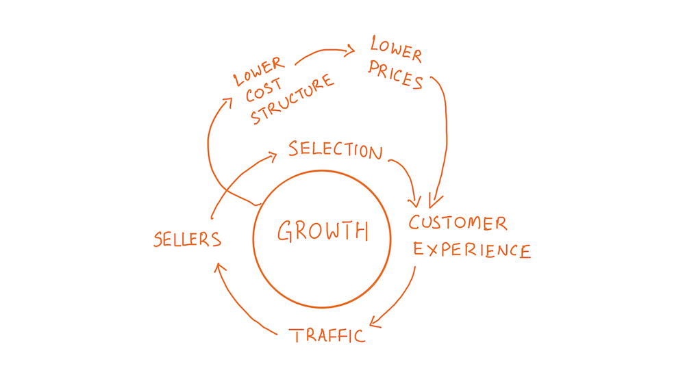

tags:: article, metrics

- link: https://omnivore.app/philipv/this-is-how-amazon-measures-itself-1822224b851
- #[[Literature Notes]]
- #[[Reference Notes]]
	- The biggest takeaway that you’ll get from *Working Backwards* is the idea that *good operators must instrument the organizations they are running.* If you don’t instrument, you won't know what’s going on. And if you don’t know what’s going on, you can’t possible be a good operator — you don’t know what to focus on to get the outcomes you desire.
	- Amazon divides metrics into two types: **controllable input metrics** and **output metrics**. This is more commonly known in the industry as [leading indicators and lagging indicators](https://www.holistics.io/blog/the-two-types-of-operating-indicators/)
	- How does Amazon create its metrics? The short answer is that they run a process improvement method called DMAIC, which they copied from Six Sigma. The acronym stands for: Define, Measure, Analyze, Improve, and Control. The authors say that if you want to implement your own Amazon-like WBR meeting, then you should run through the DMAIC steps in the right order, and not skip any steps, or else. (Elsewhere in the book they mention that teams that do not go through the DMAIC steps in exactly the right order tend to stumble later. Lesson learnt.)
		- Define
		  collapsed:: true
			- Nearly every metric that is presented in the leadership WBR falls into one of the elements of the famous Amazon flywheel:
			- 
			  id:: 62d9d245-6b83-4b64-9d35-9e9e77a64e98
			- **Identify the Correct, Controllable Input Metrics**
				- The first thing that Amazon does is to figure out what the correct, controllable set of input metrics are. This is deceptively tricky, and requires a repeated trial and error process.
		- Measure
		  collapsed:: true
			- The measure stage is where you have to set up instrumentation — where you buy tools and set up systems to measure your chosen metrics.
			- First, **removing bias in your metrics is incredibly important** — and necessary, if you want to uncover the ground truth of your business.
			- Second audit your metrics. Metric owners should have a regular process to audit their metrics to ensure the metric is actually measuring something useful.
				- The base assumption or justification is that something will eventually cause your metric to shift and therefore the numbers to skew. Audits allows us to mitigate for the future.
			- Third step is to invest in the time to instrument your business. Make sure you instrument the right thing, whatever that is for the business. This means choosing the more difficult way to measure your metric and gain data.
		- Analyze
		  collapsed:: true
			- This stage is where we gain a deep and comprehensive understanding of the underlying drivers behind the metrics.
			- For every new metric that you define, there will be a period where you have to develop a deep understanding of how the metric works, what the root causes are, what the natural variances look like, and so on. This 
			  enables you to move on to the next stage.
		- Improve
		  collapsed:: true
			- Once you have developed a solid understanding of your process and your  metrics, you are finally ready to start improving said process. For 
			  instance, if your in-stock metric is 95%, you might ask “what would it 
			  take to bring it up to 97%?”
			- The reason improve comes after ‘define, measure, and analyze’ is that now, you’re going to be making changes on a solid foundation of 
			  understanding. **Amazon has had departments who have attempted to improve their processes without a full define, measure, and analyze loop. This has nearly always resulted in a lot of thrash, with little to no 
			  meaningful results.**
			- The authors note that if you improve your process over time, it is possible for a previously useful metric to stop yielding useful information. In such cases, it is totally ok to prune it from your dashboards.
		- Control
		  collapsed:: true
			- Finally, a metric enters the steady-state *control* phase. This stage is all about ensuring that your processes are operating normally and performance is not degrading over time.
				- In some Amazon teams, metrics are so well controlled and processes are so smooth that the WBR becomes an exception-based meeting instead of a regular meeting discussing each and every metric. People meet solely to discuss anomalies.
			- Another thing that happens in the control stage is that operators may be able to identify processes that may be automated completely. After all, if a process is well understood and the decisions are predictable, then it is likely that the entire process may be replaced with software.
				- Amazon’s forecasting and purchasing are two examples where the processes are now completely automated — though it took *years*of collaboration between category buyers and software engineers in order to automate purchasing across millions of Amazon’s products.