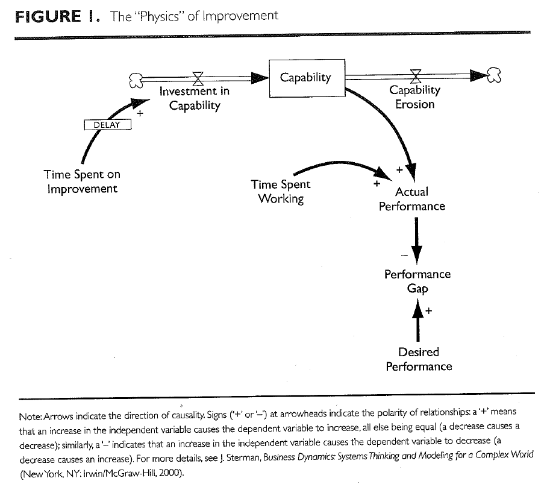
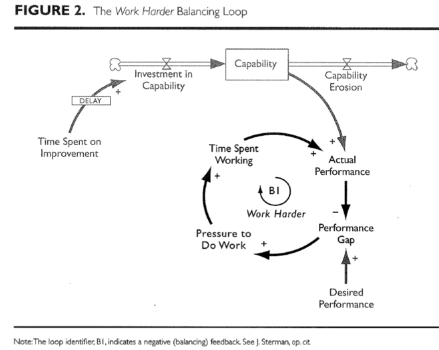
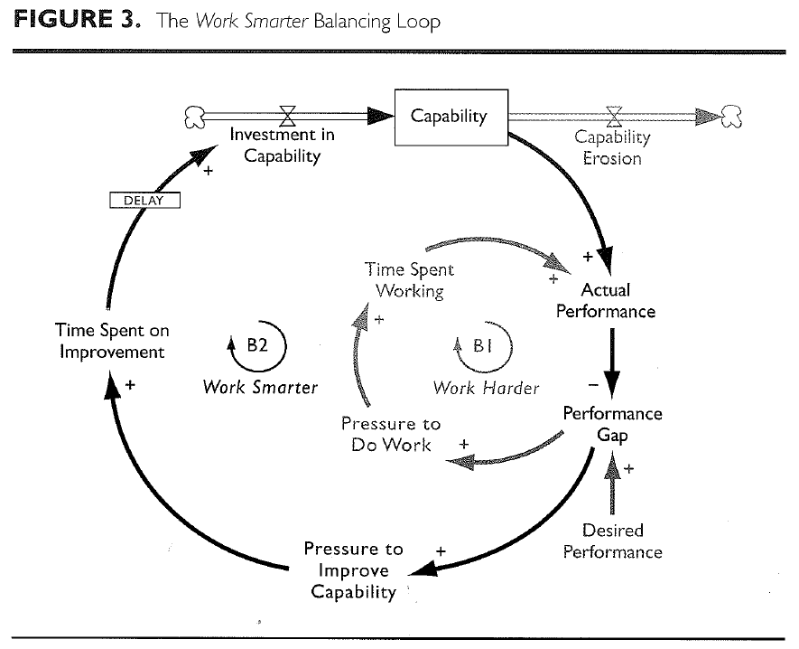
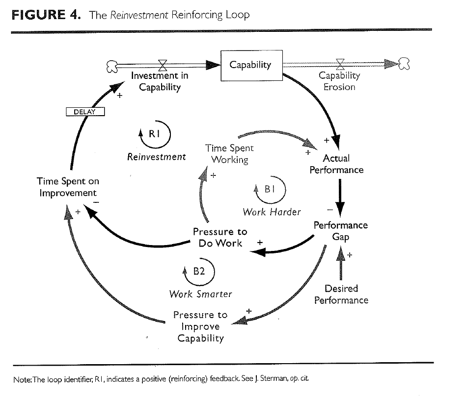
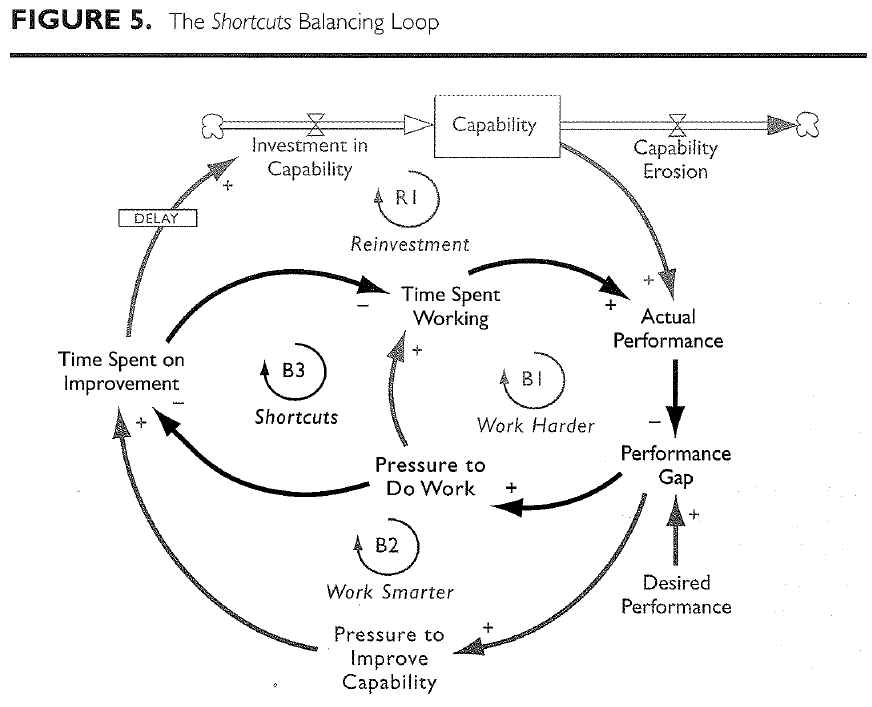

media:: [[article]] 
tags:: [[process improvements]]
status:: reading, napkin.one
link:: https://readwise.io/reader/document_raw_content/7618006

- Reference Notes
	- Introduction
	  collapsed:: true
		- Despite vast expenditures, and notwithstanding dramatic successes in few successes in a few companies, few efforts to implement such programs actually product significant results.
		- You can't buy a turnkey (complete or ready to use product) six-sigma quality program. It must be developed from within.
		- Process improvement programs like Six-Sigma and their successful deployment in organizations is dependent on how the introduction of a new improvement program interacts with the physical, economic, social and psychological structures in which implementation takes place.
			- Failure or successes of implementing process improvement programs aren't a tool problem, resource problem or leadership problem. Instead it is a systemic problem, one created by the interaction of tools, equipment, workers, and managers.
	- The Structure of Improvement
		- The actual performance of any process depends on two factors:
			- the amount of time spent working
			- capability of the process used to do that work
		- The performance of any process can be increased by dedicating additional effort to either work or improvement.
		  collapsed:: true
			- 
			- Time spent on improving the capability of a process typically yields the more enduring change. This is because increasing time spent working is only effective at that time (obvious). Time spent on improvements increase the flow of investments. However time spent on improvements does not immediately improve performance, it takes time uncover the root causes of process problems and then to discover, test, and implement solutions, shown in the diagram as a delay between improvement activities and the resulting change in process capability.
			- No improvements in capability lasts forever. Processes go out of control without regular attention, designs become obsolete, and procedures become outdated. Capability goes down without regular maintenance.
		- Work harder loop to increase capability
		  collapsed:: true
			- 
		- Work smarter loop
			- 
			- Improvements efforts don't always find the root cause of defects, new tools sometimes don't produce the desired gains, and experiments often fail.
			- Improvements don't solve the current problems that are in play. They only improve the future state.
		- Reinforcement loop
		  collapsed:: true
			- 
			- In the reinforcement loop there is positive feedback to spend the time saved by the time spent on improvement back to those activities (reinvestment) compared to the work harder loop where the time spent on improvement may not be invested back to the same activities.
		- The shortcuts and the capability trap
		  collapsed:: true
			- 
			- Favoring short term results at the expense of long term gains. An example is foregoing documentation (shortcut) now in order to spend time coding. In the future that documentation could save you time when it is vital to have documented the process.
			- Working harder and taking shortcuts produce more immediate gains and help solve today's problems, managers unaware of the inherent "better or worse" trade-off are likely to choose them over working smarter. These temporary gains comes at the expense of of the long-run health of the process.
		- Faulty Attributions
		  collapsed:: true
			- When finding causes for problems, people generally assume that cause and effect are closely related in time and space. To explain a puzzling event, we look for another recent, nearby even that might have triggered it. People also tend to assume each event has a single cause, underestimate time delays, and fail to account for feedback processes. The true cause may be distant in space and item from the defects it creates.
				- As a result, managers are likely to conclude that the cause is inadequate worker effort or insufficient discipline, rather than features of the process. This leads to pressure to work harder rather than investing in process improvements.
		- Overcoming the Capability Trap
			- Successful improvement must include a significant shift in the mental models of those both leading and participating in an improvement effort.
			- We need to acknowledge that implementing a process improvement may diminish current output in favor of long term gains, unless excess capacity already exists to invest in process improvements.