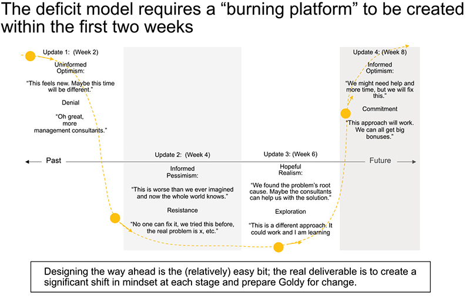
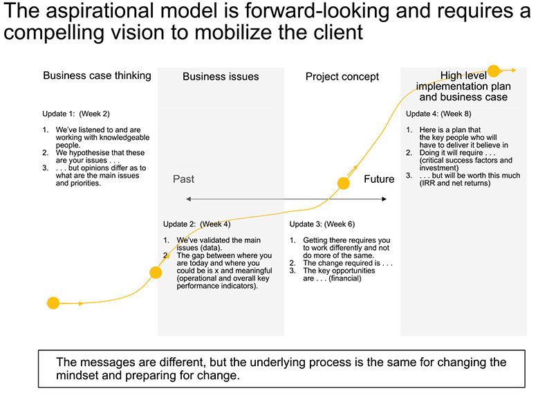

- The storyboard must go up publicly on the working office space walls
- Initially the storyboards will be pencil sketches on A4 sheets of paper, but over time, each page will be replaced with a draft slide prepared with PowerPoint. Over time this draft will be updated. (Make your thinking public for feedback and comments)
- The business case team must write out their proposed story so that everyone on the team can understand their progress and thinking. If their thinking changes, this must be immediately reflected in the storyboard by taking down a page and replacing it with a new page.
- There should be a story and it should flow horizontally across headlines and vertically down an individual slide from the headline to the content and finally the kicker.
- Allow a process where comments on each slide are collected and posted next to each slide.
	- Red note: The slide is seriously flawed and needs to be redone.
	- Orange note: Data needs verification
	- Yellow note: Findings do not reconcile with findings by other members of the engagement team
	- Pink note: Data verified internally and with the client
	- Green note: Slide is completed
- Anyone can leave comments using post it notes
- The story should not serve as a diary of work done or analyses completed. Only the most important important insights should appear and the best storyboards are simple and logical to follow. They are also short.
- The story must stand by itself. The rest of the team must be able to understand the details. No further explanation should be needed.
- **The storyboard must be created before the data is ready.**
	- The hypotheses and value trees outline the data needed to prove or disprove them. Accordingly, the storyboard should be constructed before the data is ready, by assuming the results of testing the hypotheses, and not conveniently developed based on the data the consultant can find.
	- Storyboards that are constructed after the data is collected are poor because the consultant means their creating a story based on the data they have, not on what dat they need.
	- The storyboard shouldn't be built on interesting data but it must always be be designed around telling a story based on the required analyses to test hypotheses in the engagement.
- Only the headlines of the panels comprise the storyboard. No data and graphs should be added at this point, but the consultant could think about the data that will be used.
- Kickers ("so what" statements) at the end of the slide may also be added
- The business case team will use a [[deficit model]] to design the business case
  collapsed:: true
	- The deficit model describes the approach the team will use to deliver the findings, it is whereby the first feedback session to the client shows that the situation is very bad and likely to get worse before things improve. The objective of this style of business case development is to create a "burning platform" for change. The client must see how bad things are before they will change.
		- Change must start immediately or the business situation could get much worse or even lead to a closure of the business.
	- 
- The alternative is to use an [[aspirational model]] where the business case team shows the client how good things could be.
	- The immediate poor performance is indicated but is not the central point or reason for change
	- The potential of the business and subsequent value creation in fulfilling this potential is the reason for change
	- Aspirational models are used for clients who understand the reason for change and are trying to move forward with their businesses.
		- Executives who see themselves as visionaries tends to like this model.
	- 
- Deciding between the deficit and aspiration models is a critical step. It will significantly impact the engagement.