- Knowledge Hub
	- Practioner Program
		- Foundation of Change Management
		  collapsed:: true
			- The change landscape is full of initiatives that are on time, on budget, and meet technical requirements but do not deliver expected results and outcomes. The gap between requirements and results? Ensuring that employees effectively adopt and use the change being introduced. This is the reality of change and the reason for change management.
			- Change management is a structured and intentional approach that prepares, equips and supports individuals through change. With a dedicated focus on achieving adoption and usage, change management supports holistic and successful change.
			- The Foundation of Change Management section explains the why and what [5 Tenets of Change Management and Unified Value Proposition], and the who [Roles] of change management. The foundation also provides context, models and a common language for change practitioners to begin applying change management.
		- What and Why of Change Management: The 5 Tenets of Change Management
		  collapsed:: true
			- A tenet is a principle or belief that is generally held to be true. The 5 Tenets of Change Management provides a grounding in the reality of how change actually happens and enables a better understanding and more robust application of the tools and processes for managing the people side of change. Each tenet builds on the other, and together they form the basis for the what and why of change management.
			- 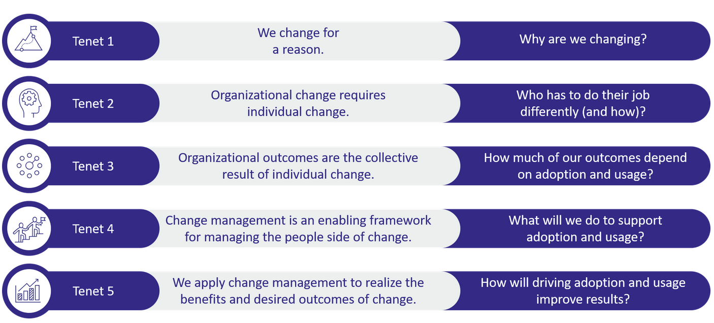{:height 216, :width 459}
				- A graphic that lists each of the 5 Tenets of Change Management and the associated plain language question from Tenet #1 at the top to Tenet #5 at the bottom. The 5 Tenets of Change Management provides a grounding in the reality of how change actually happens and enables a better understanding and more robust application of the tools and processes for managing the people side of change. Tenet 1: We change for a reason (Why are we changing?). Tenet 2: Organizational change requires individual change (Who has to do their job differently and how?) Tenet 3: Organizational outcomes are the collective result of individual change (How much of our outcomes depend on adoption and usage?). Tenet 4: Change management is the enabling framework for managing the people side of the change (What will we do to support adoption and usage?). Tenet 5: We apply change management to realize the benefits and desired outcomes of change. (How will driving adoption and usage improve results?).
		- More Information on the 5 Tenets of Change Management
		  collapsed:: true
			- 5 Tenets of Change Management
			  Why Change Management?
			- The results and outcomes of workplace changes are intrinsically and inextricably tied to individual employees doing their jobs differently. Change management enables employees to adopt a change so that business objectives are realized. It is the bridge between solutions and results and is fundamentally about people and our collective role of transforming change into successful outcomes for our organizations. But what does it mean to manage the people side of change and what exactly is change management? How does change management create successful change? To answer these questions, it is necessary to establish the foundational tenets for change management. This grounding in the reality of how change actually happens will enable a better understanding and more robust application of the tools and processes for managing the people side of change. Each of these tenets will build on the other, and together they form the basis for the what and why of change management.
			- Tenet 1: We change for a reason.
			  collapsed:: true
				- 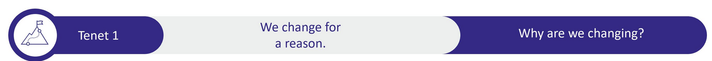
				- To begin, we need to have an anchor point that you as a reader can agree with and that establishes a starting point for this discussion: We change for a reason. As simple as this sounds, an underlying principle for managing change is that a future state can be envisioned that is different than today, and we are changing to that future state to achieve a specific and desired outcome. When we say we change for a reason, that does not mean that the reason for every change is the same, only that there is a specific reason or objective for a given change. The reasons for change are as varied as change itself: revenue growth, improved customer satisfaction, reduced costs, better product or service quality, reduced risk exposure, improved quality of life, and so on. Projects and initiatives are undertaken not because they are fun and exciting, but because there is an opportunity present or a problem to solve; most importantly, a chance to improve performance in a meaningful way. A fundamental assumption of change is that something different is possible.
			- Tenet 2: Organizational change required individual change.
			  collapsed:: true
				- 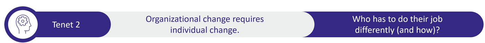
				- Change has only truly occurred when individuals in the organization begin working in new ways: displaying new behaviors, using new tools, adhering to new processes, and adopting new values. Individual shifts in behavior are the cornerstone of change. When numerous individual shifts are taken together as a whole, the desired future state of the organization is achieved. Change ultimately results from people adopting new skills and demonstrating new capabilities; and, while this may seem like common sense, we often assume that change at an individual level will just happen.
				- The realization of change, even large-scale organizational projects and initiatives, is, at its core, an individual phenomenon. In other words, the degree to which a change produces results is directly correlated with individual change.
			- Tenet 3: Organizational outcomes are the collective result of individual change.
			  collapsed:: true
				- 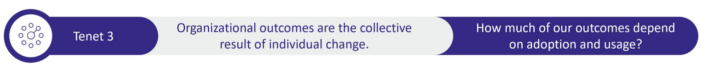
				- When you consider that the realization of a change and the achievement of specific outcomes are tied to people, we can ask the right questions: How many total employees will engage in the change versus how many will opt out or find work-arounds (referred to as the ultimate utilization of the change)? How quickly will our employees get on board with the change (the speed of adoption)? How effectively will the change be implemented at an individual level (proficiency)? Since change is ultimately an individual phenomenon, it is these individual factors that drive or constrain the value a change creates. When project managers and business leaders assume that the human factors of change (ultimate utilization, speed of adoption, and proficiency) will automatically reach 100% the moment a change is introduced (or at the “go-live” date), they fall into the trap that designing and implementing a business solution is sufficient to achieve results. Without the engagement of each employee who must do his or her job differently as
			- Tenet 4: Change management is an enabling framework for managing the people side of change.
			  collapsed:: true
				- 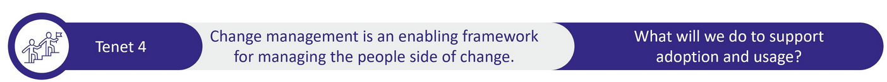
				- So if you are asked, “Why change management?” the answer is simple: to ensure that each change in our organization produces the results we are expecting. If you are then asked, “What is change management?” or “What is organizational change management?” the answer and the fourth tenet is: Change management is an enabling framework for managing the people side of change. Change management should not be viewed as simply a mechanism to reduce employee resistance, or a plan to mitigate the risk of negative things happening to the organization during change. Change management provides an organizational framework that enables individuals to adopt new values, skills and behaviors so that business results are achieved. Change management, as a practical matter, leverages the normal mechanisms within an organization to influence and develop employees through broad activities, such as communications, training and visible sponsorship. At the same time, change management enables action at an individual employee level through coaching and resistance management. “Change managers” refers not just to project team members or change management practitioners. Change managers include organization leaders, executives, managers, front-line supervisors and employees; all of whom enable individuals within an organization to transition from their current state to a new future state. All of these change management activities and roles comprise a discipline and field of study that enable individual and organizational transitions.
			- Tenet 5: We apply change management to realize the benefits and desired outcomes of change.
			  collapsed:: true
				- 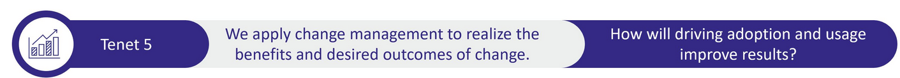
				- This concluding principle is an essential and distinguishing quality of change management. Unlike project management, which is focused on the realization of a technical solution, change management is focused on the achievement of the desired results or outcomes of the change by managing people through their transitions. This tenet is supported by research. Prosci’s benchmarking studies show that projects effectively applying change management were six times more likely to meet their project objectives. So while training, communications, sponsorship, resistance management and employee coaching are critical elements of change management, they do not define change management. In other words, we do not apply change management to enhance communications and training, or to implement employee recognition programs. Nor do we apply change management only to reduce the risks to the organization during change, such as lower employee morale, productivity loss, undesired turnover or negative impacts on customers. While a strong case for change management can be made on mitigating risks, it is a classic case of “necessary but not sufficient.” Change management has a more important and primary objective: to increase the probability that the future state is realized and that the associated outcomes (objectives of the change) are achieved.
		- Unified Value Proposition (UVP)
		  collapsed:: true
			- How Prosci Defines Change Management: Unified Value Proposition
			- On a project level, change management is the application of a structured process and set of tools for leading the people side of change to achieve a desired outcome. On an organizational level, change management is both a leadership competency for enabling change within an organization and a strategic capability designed to increase change capacity and responsiveness.
			- 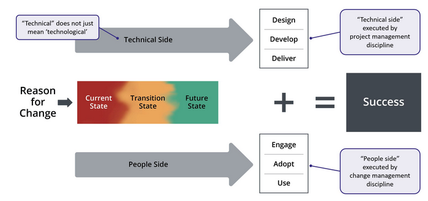
			- The Unified Value Proposition is a model that represents change management on a page. The model demonstrates that change management and project management are complementary disciplines with a common objective. To realize organizational benefits, we need to pay attention to both the technical and people sides of change.
			- Unified Value Proposition of change management and project management. On top is an arrow labeled technical side pointing to the right at a box labeled design, develop, deliver. On the bottom is an arrow labeled people side, pointing to the right to a box labeled engage, adopt, use. Between these are three equal sized boxes labeled from left to right, current state, transition state, future state followed by a plus sign, and equals sign and a box reading results, outcomes, success.
			- The Unified Value Proposition is a Prosci model that represents “change management on a page” and helps practitioners define and position change management at a high level for others. To realize organizational benefits, we need to pay attention to both the technical side and the people side of change. The Unified Value Proposition illustrates this clearly and demonstrates that change management and project management are complementary disciplines with a common objective: successful change.
			- 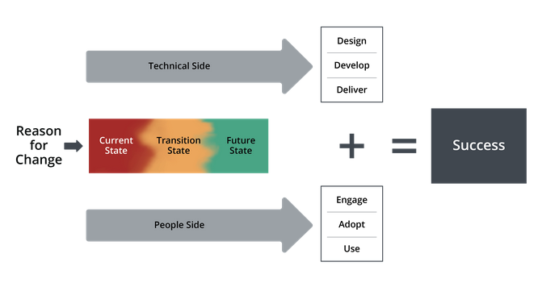
			- The Unified Value Proposition is an organizing framework for describing and advancing change. It shows how the technical side and people side of change must come together to ultimately deliver success with a change effort.
			- The change landscape is littered with examples of initiatives where the technical side was completed effectively—the solution was designed, developed and delivered—but the change was unsuccessful because people did not adopt the solution.
			- Successful change requires success on both sides. The Unified Value Proposition model is effective for positioning change management and defining its critical contribution to project and organizational outcomes.
			- Reason for Change
				- 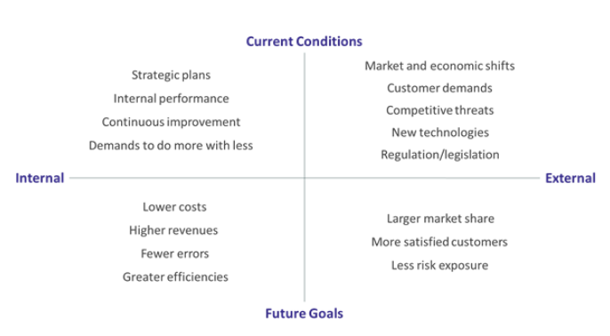
				- The Unified Value Proposition begins with a reason for change. The reason can come from inside the organization or outside the organization. The reason can be grounded in how things are today (current conditions) or the desire to attain something yet to come (future goals). For most projects and initiatives, there are multiple reasons for change.
				- There is always a reason for change—an opportunity to capitalize on, a problem to solve, a chance to improve in a meaningful way. The reason gives the change team needed context to define success for the project or initiative, which is the critical first step in the process for managing change. Success is defined by both the project objectives (what the project achieves and delivers) and the organizational benefits (value realized upon addressing the issue or seizing the opportunity).
			- States of Change
				- 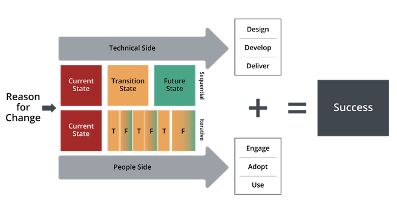
				- Organizational change progresses through three states in the Unified Value Proposition model: the current state, transition state and future state.
				- The current state is the status quo or how things exist today. It is known. It may not be great, but it is familiar and understood by people.
				- The future state is the destination. It is unknown, which can create fear and trepidation. The future state is also aspirational, a state where conditions have improved in some marked way as a result of the change initiative.
				- The transition state is messy and ambiguous. It is usually not linear and involves some moving forward and backward. Successful change requires stepping out of the current state and effectively navigating the transition state to ultimately reach the envisioned future state.
				- The way a change progresses through the three states can be sequential, iterative or hybrid in nature. In sequential change, the organization experiences a singular push culminating from a series of progressive steps. We depict sequential change visually with single transition state and future state.
				- For an iterative change, cycles of development move toward a final, intended outcome with more engagement from the organization during the cycles. Iterative change is shown with multiple transition states and interim future states during each change cycle. Common iterative change approaches include Agile and Continuous Improvement (such as Plan-Do-Check-Act).
			- Technical Side
			  collapsed:: true
				- The arrow at the top of the Unified Value Proposition is the technical side of the change. This includes all the work and effort to design, develop and deliver a solution that meets the opportunity or issue being addressed. Consider an electronic health records installation. The software and hardware, processes and policies, roles and requirements constitute the technical-side solution. For a merger, the new organization chart, reporting structure, and operational integration plans comprise the technical-side solution. Although many contemporary solutions are embodied or enabled by technology, the technical side of change does not necessarily have to be “technological” in nature or technology based. In a merger, there will be both technological aspects (e.g., an integrated finance system) and non-technological aspects (e.g., cultural alignment and integration) on the technical side of the change.
				- Some of the more common technical-side changes for which change management is applied today include enterprise resource planning (ERP) applications, new internal communication and collaboration platforms, new product or service launches, adopting hybrid workplaces, and culture initiatives and transformations.
				- The technical-side solution can cause confusion because people may not think beyond it without help. Although the technical-side solution is easier to understand and often more tangible, it only represents half of the change equation. Regardless of the approach taken on the technical side of the change, a solution that is designed, developed and delivered to meet specifications without a complementing people-side solution throws the Unified Value Proposition off balance, putting change success in peril. A technical-side solution that people do not engage, adopt and use offers little to no value to an organization. Even the best technical-side solution needs a people-side approach to achieve the adoption and usage required to realize intended benefits and achieve success.
			- People side
			  collapsed:: true
				- 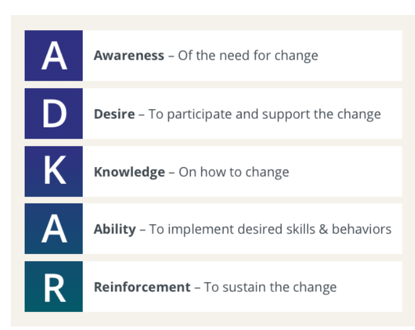
				- The bottom arrow of the Unified Value Proposition represents the people side of the change. This includes the effort to ensure that the people who must do their work differently because of the technical-side solution will in fact engage, adopt and use it.
				- People do not simply adopt and proficiently use a solution because it is installed for them. Effectively adopting a new process, using a new tool, or demonstrating a new mindset is an individual journey. Every individual must move through the change process to reach their own personal future state in support of the organization’s future state.
				- The Prosci ADKAR Model comprises five elements of successful individual change: Awareness, Desire, Knowledge, Ability and Reinforcement. Effective change management helps ensure that people can move through each element successfully.
				- A graphic to depict each element of the ADKAR Model starting with : Awareness of the need for change, Desire to support and participate in the change, Knowledge on how to change, Ability to implement required skills and behaviors, and Reinforcement to sustain the change. The ADKAR Model Describes the five ‘building blocks’ or elements an individual needs to achieve for a change to be successful.
				- Change management is the application of a structured process and set of tools for leading the people side of change to achieve a desired outcome. From an organizational perspective, change management addresses the people side of the Unified Value Proposition by providing a structured approach for enabling successful individual change at scale.
				- The change practitioner’s role is to apply a methodology, structured process, and robust toolset to improve adoption and usage of the technical-side solution. The change practitioner also works to activate a system of people, including sponsors and people managers, to carry out the employee-facing activities involved. And when the organization achieves a predetermined level of success with the change, the people side includes a plan to support sustained outcomes and conclude the change management work, formally moving from the transition state into the new future state.
				- Applying a structured and intentional approach to change management reduces the costs, risks and negative consequences of poorly managed change. And Prosci’s Best Practices in Change Management research consistently shows that change management significantly improves the likelihood of change success.
				- 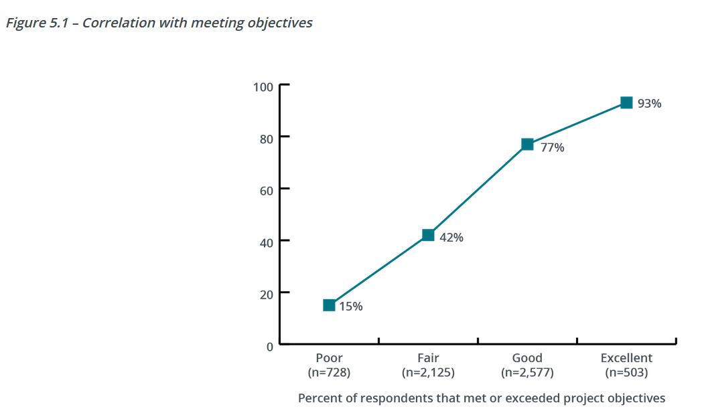
			- Success
				- When the technical side and people side work together effectively, the Unified Value Proposition model ends with Success. The change achieves success by meeting or exceeding project objectives and delivering the expected organizational benefits.
				- Success will depend on the specific change and the intended performance improvement desired in the future state. Success for a merger differs from success for an electronic health records program. A clear definition of success is a critical first step in organizational change. It is so important, the Prosci Change Triangle (PCT) Model places it at the center of the model.
			- ### Separate in Theory, Integrated in Practice
				- 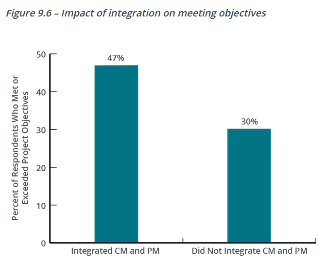
				- In the Unified Value Proposition, the technical side and people side of change are represented separately as arrows on either side of the states of change. In practice, the technical side and people side of change are most effective when fully integrated. Prosci’s Best Practices in Change Management research revealed that participants who integrated project management and change management reported meeting or exceeding project objectives more often than those who did not.
				- Project management and change management are complementary disciplines with a common objective. Project management prepares the solution for the organization while change management prepares the organization for the solution. The Unified Value Proposition describes the common objective—success—which both project management and change management aim to deliver, setting the foundation for collaboration and integration.
				- Integrated Approach
					- Integrating project management and change management in the real world is a practical matter requiring structure and intent. In the Prosci Methodology and Prosci Change Triangle (PCT) Model, achieving an integrated approach for organizational change occurs along three dimensions: people, process and tools.
					- People – Who does the work, and the collaboration and partnership between the project team and the change practitioner
					- Process – The sequences of tasks and activities of the technical and people sides to advance the change in alignment
					- Tools – What is used to move the change forward, including commonly integrated tools such as a communications plan, timeline and risk log
					- 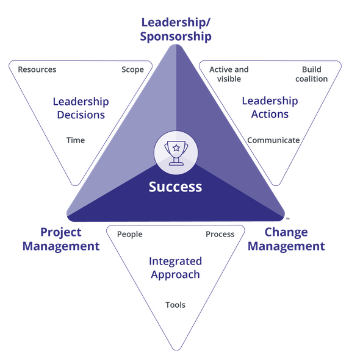
				- Using the Unified Value Proposition
					- The Unified Value Proposition can be used by change practitioners in numerous ways to improve change outcomes. It helps describe change and the various aspects of successful change clearly to build a shared view among team members, sponsors and change practitioners.
					- The Unified Value Proposition is also helpful for troubleshooting. Examining each of the aspects enables practitioners to identify gaps and risks to develop and take corrective actions. And finally, Unified Value Proposition offers a holistic view of change, enabling alignment across an organizational project or initiative.
		- Roles in Change Management
		  collapsed:: true
			- Who Does Change Management: Roles in Change Management
			  collapsed:: true
				- 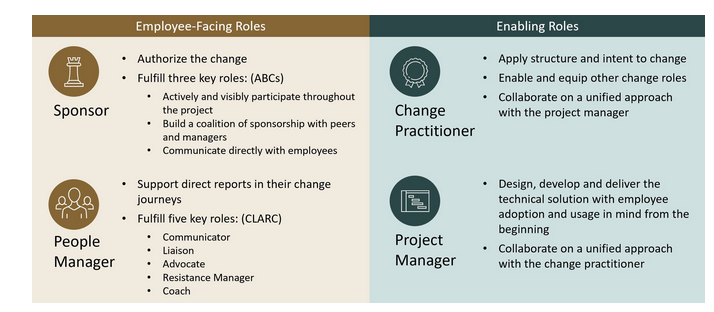
				- Change practitioners need to work with and through others to be successful. The ultimate goal of change management is to achieve organizational results and outcomes by engaging impacted individuals and inspiring their adoption of a new way of working.
				- A whole system of people in the organization supports impacted individuals to make successful transitions in change. Change practitioners identify required individuals and support people to effectively fulfill their unique roles.
				- A Coordinated System of Support
				  collapsed:: true
					- 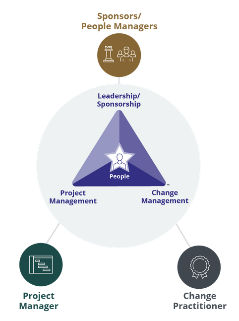
					- The ultimate goal of change management is to drive organizational results and outcomes by engaging employees and inspiring their adoption of a new way of working. Whether the change is to a process, system, job role, organizational structure, or all of these, a project or initiative can only be successful if individual employees change their behaviors. This is the essence of change management. And to manage change successfully, all core roles must participate.
					- Much like putting on a play—where actors, directors, costume designers, lighting and sound crews coordinate their unique talents to deliver a single successful outcome—change management requires individuals in key roles to engage with the change and coordinate their efforts in defined ways. From the highest levels of leadership to front-line employees, an entire system of people within the organization must support employees through the transition. This section examines the core roles in change management:
					- Change practitioners
						- Sponsors
						- People managers
						- Project managers
						- People (impacted employees)
				- Descriptions and Misconceptions
				  collapsed:: true
					- The table below describes each core role from the perspective of the person or group executing it. These “I-by” statements illustrate what each individual or group might say when they understand their role and are actively engaged in managing change. The table also includes what they might say when they do not clearly understand their role.
					- 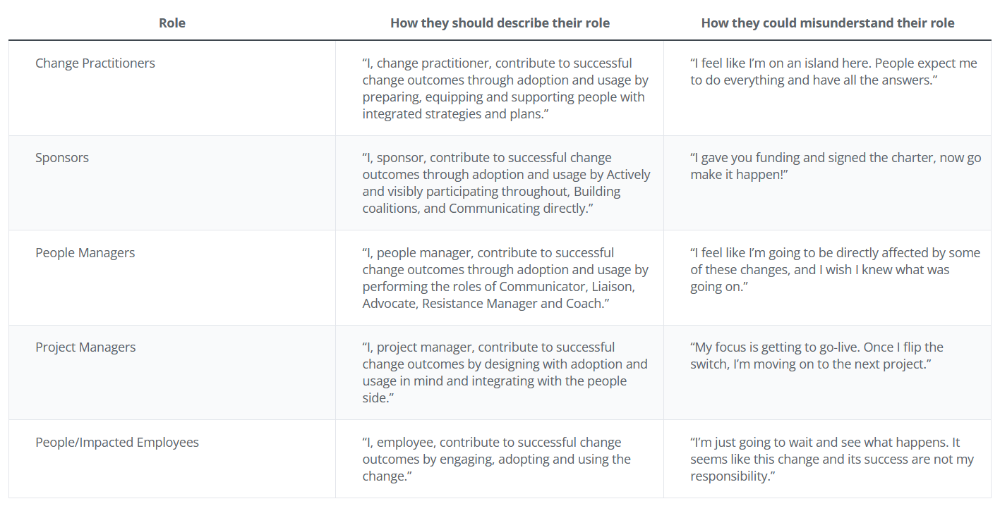
			- ### Employee-Facing vs. Enabling
			  collapsed:: true
				- Of the core roles presented above, two have direct contact with front-line employees impacted by the change—they’re actors on the stage and in the spotlight. Two other roles do more of their work behind the scenes. They’re the directors and stage crew who quietly guide others to successful outcomes.
				- Employee-Facing Roles
					- Sponsors and people managers are the two roles that interact directly with individuals who need to change. To the impacted employee groups, they are the visible actors on the change stage. Sponsors and people managers deliver communications, and support and coach teams through their transitions. They also present the organization’s “desired future state” to impacted groups via one-to-one interactions and one-to-many interactions.
					- Why are these two roles employee-facing?
						- Because these are the people that employees want to hear from.
				- Enabling Roles
					- Change practitioners and project managers are facilitators of change. Like producers and directors who operate off-stage to produce a successful play, enabling roles develop and coordinate the plans employee-facing roles will execute during change.
					- Why are these two roles typically not employee-facing in times of change?
						- Because employees don't know who they are, and they are not preferred senders of messages.
					- One of the most important takeaways from this discussion about roles is that change practitioners need to work with and through others to achieve change success. Although change practitioners are often resourced from a project team, HR, OD consultants, or a specialized change management group, most of the change management work gets carried out by others.
				- Additional Roles
					- In addition to the core roles, you may need additional or what we call “extend” roles to execute your change management plan. Roles that extend your support resources may include, but are not limited to:
					- Internal communication or training specialists
					- Human resources business partners
					- Organizational development staff
					- Business analysts
					- Subject matter experts
					- Change agent networks
					- Solution developers
				- When you identify the extend roles needed in your organization and for your particular change initiatives, it is important to select individuals who will actively engage with the role. They should also understand and be able to describe their roles using the structure of the “I-by” statement (as in the table above):
				- 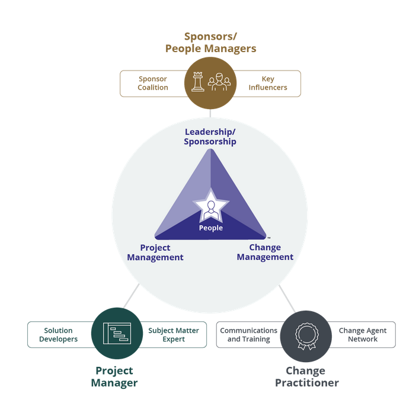
				  collapsed:: true
					- Extend roles in change management connected to the Prosci Change Triangle. The PCT Model is in the center. It is an equilateral triangle with three labels on each corner. The top corner is leadership/ sponsorship. Above this label is a connected circle with roles labeled as Sponsors/ People managers. There is a box on either side of the circle. The box on the left is labeled sponsor coalition, the box on the right is labeled key influencers. The bottom left is project management. From this label is a connected circle with the role labeled Project Manager. There is a box on either side of the circle. The box on the left is labeled solution developers, the box on the right is labeled subject matter expert. The bottom right is change management. From this label is a connected circle with the role labeled change practitioner. There is a box on either side of the circle. The box on the left is labeled communications and training, the box on the right is labeled change agent network. In the center of the triangle is an icon with a star and a person. The icon is labeled people.
				- “I, ____ , contribute to successful change outcomes (through adoption and usage) by ____.”
				- For example, “I, change agent network, contribute to adoption and usage by providing a voice for end users and sharing key messages in a timely manner.”
				- ### Importance of Each Role
				  collapsed:: true
					- Change Practitioners
					  collapsed:: true
						- Why the dedicated change management resources are important:
							- A growing body of data shows a strong correlation between the success of a change initiative and how well the people side is managed. According to Prosci’s Best Practices in Change Management studies, change management projects with excellent change management are six times more likely to meet objectives and outcomes.
							- Having dedicated resources for change management is consistently one of the greatest contributors to success in Prosci’s Best Practices in Change Management research.
							- Dedicated change management resources provide focus and keep track of change management activities. They act as a point of responsibility and accountability. When budgets and schedules are squeezed, change management activities are easily pushed to the bottom of the priority list if there are not dedicated resources.
						- What the change practitioners must do:
							- Apply a structured change management methodology
							- Instead of operating in an ad hoc manner, the dedicated change management resources approach change management with structure and intent through a proven methodology.
							    Formulate strategy
							- They evaluate how big a change is and who will be impacted to develop a customized and scaled strategy for managing the people side of the initiative.
							    Develop role-based and activity plans
							- Based on the organization’s strategy work, the change team creates a tailored set of plans for moving people forward. Guided by an ADKAR Blueprint, change practitioners develop two role-based plans (Sponsor Plan and People Manager Plan) and follow with two activity plans (Communications Plan and Training Plan). The team may also need to add unique plans to address the organization’s unique needs. Note that the ADKAR Blueprint is a primer for the set of plans. If the change is small enough, the team could choose to use only an ADKAR Blueprint.
							    Support other roles
							- The change management resources are the coaches and go-to people responsible for enabling success with the other roles that are vital to change management.
					- Sponsors
					  collapsed:: true
						- Why sponsors are important:
							- Active and visible sponsorship has been cited consistently as the top contributor to success with change management in Prosci’s Best Practices in Change Management research for more than two decades.
							- Employees want to see and hear the sponsor’s commitment to the change. The authority they provide carries over to other change management roles.
							- Effective sponsorship is a predictor of success or failure on the project.
						- What sponsors must do:
							- Sponsors execute the ABCs—an acronym for the three roles a sponsor must perform to be an effective leader of change.
							- Actively and visibly participate throughout the life of the project
								- There are three key ideas here: active, visible and throughout. Sponsors must be present and seen by employees from start to finish.
							- Build a coalition of support
								- The sponsor coalition describes the group of leaders and influencers who will give the change credibility and prioritize it with their own departments, divisions and workgroups. The primary sponsor must build and maintain a healthy sponsorship coalition.
							- Communicate directly with employees
								- Employees want to hear the business reasons for the change from someone at the top. Sponsors need to communicate, support and promote the change to impacted groups.
						- Sponsor Assessment
						  collapsed:: true
							- The Sponsor Assessment enables a sponsor to assess their effectiveness in fulfilling the ABCs for their role. Participants attending the Prosci Change Management Sponsor Briefing complete the Sponsor Assessment using a past change that they were involved with as a sponsor. While it is completed as a self-assessment, a sponsor can also have others, including key business stakeholders, the project manager and the change practitioner assess their performance using the assessment.
							- The assessment has three scoring ranges: High = 80-100; Moderate = 70-79 and Low = <70. The assessment results can help identify areas of sponsor strength and areas of opportunity, which in turn can be used as a valuable inputs to the development of the Sponsor Plan by the Change Practitioner. Novice change practitioners should use the Sponsor Assessment with caution. For example, some sponsors may react negatively to the assessment, as they don’t like being “scored” on their sponsorship ability. In such situations, the assessment can instead be used as a checklist, without the scoring.
					- People Managers
					  collapsed:: true
						- Why people managers are important:
							- People managers are close to the action. Their teams are the people who must alter how they do their jobs to make a change successful. People managers are the preferred senders of messages about the personal impact of a change on their team members.
							- In any organization, changes come from many sources, such as strategic initiatives launched by senior leaders and changes due to daily demands from customers and suppliers. People managers support their employees through all types of changes.
							- The attitude and actions of a manager will show up in their people, whether the attitude is one of support or opposition.
						- What people managers must do:
						  collapsed:: true
							- Managers and supervisors—or people managers—are essential during any change. They play five key roles, as described below. We call these the CLARC roles for people managers.
								- Communicator
									- Employees prefer to hear messages about how the change directly impacts them and their team from the person they report to.
								- Liaison
									- The role of liaison involves interacting with the project team, taking direction and providing feedback.
								- Advocate
									- If the manager opposes the change, chances are their team will too—and vice versa. The first step the change management team must take is to get people managers on board with the change. Only then can they expect managers and supervisors to fulfill their roles in change management.
								- Resistance manager
									- Research shows that the best intervention to mitigate resistance comes from the employee’s immediate supervisor because they know their people best and can work to prepare, equip and support them based on their unique needs and challenges.
								- Coach
									- Helping employees through their personal transitions is the essence of the change coaching that people managers do.
						- People Manager Assessment
						  collapsed:: true
							- The People Manager Assessment enables a people manager to assess their effectiveness in:
								- Adapting to change that is happening to them
								- Leading their team through change
							- Participants attending the Prosci Leading Your Team Through Change Program complete the People Manager Assessment for a past change that they were involved in as a manager. The assessment has four sections, with each section worth 25 points for a total possible score of 100. The results can be used by People Managers to develop their own change management improvement plans. The results can also provide the change practitioner with valuable insights on common improvement opportunities that can be addressed in the People Manager Plan.
							- Novice change practitioners should also use the People Manager Assessment with caution, particularly in situations where people managers may react negatively to being scored on their effectiveness. In such situations, the assessment can instead be used as a checklist, without the scoring.
							  People Manager Assessment (PDF)
							  Assess behaviors for adapting to change, introducing change to employees, managing employees through the transition and reinforcing and celebrating success
					- Project Manager
					  collapsed:: true
						- Why the project manager is important:
							- The project manager focuses on the project’s design, development and delivery—the technical side of the change.
							- Without direction and management, the technical side of the project will not move forward.
							- The project manager also helps ensure that change management is part of the project by providing appropriate time and resources, including budget and personnel.
						- What the project manager must do:
							- Project managers play an essential role during change, as described below.
								- Design the actual change
									- The project manager creates the solution that ultimately impacts how people do their jobs.
							- Manage the “technical side”
								- With tools like the charter, business case, schedule, resources, work breakdown structure, budget, etc., the project manager advances the technical side of the change.
							- Engage with the change practitioner
								- By working with the change practitioner, the project manager ensures that the technical side and the people side of the change move forward in unison.
							- Integrate change management plans into project plans
						- Change management is most effective when it is engaged early at project initiation. By engaging at the right time and weaving the change management strategy and plans into the technical-side plans, the project manager creates a single, seamless project plan.
					- People/Impacted Employees
					  collapsed:: true
						- Why people/impacted employees are important:
							- People are the heart of change management - Employees impacted by change in their organization are at the center of what we do as change leaders. Helping people adopt change is simply the right way to treat people. Change happens one person at a time.
							- Organizational change requires individual change - If we don’t help individuals adopt and use the change, the probability of achieving desired outcomes is very low.
							- Change management is the people-side framework - Just as project management focuses on the technical side of change, the change management framework centers on people—those who must do their jobs differently, how they will do their jobs differently and what we must do to support them—improving adoption and usage as a result.
						- What the people/impacted employees must do:
						- Participate in the change
							- When individuals engage with the change, they more easily adopt it.
						- Understand their emotional responses to the change
							- Although circumstances affect individual reactions to change, all people react to change in predictable ways. Understanding and addressing barriers to change enables people to move through it.
						- Identify needed support
							- Communicating specific needs enables change leaders to help individuals take control of their change experience and thrive during change.
					- Implications of the Additional or “Extend” Roles
					  collapsed:: true
						- Each of the roles discussed above is a core role and must be part of every project or change initiative. As mentioned earlier, your specific change might call for additional “extend” roles, which typically contribute to designing, developing and delivering the solution or engaging, adopting and using the solution. These complementary functions extend the execution of change management activities and help maintain strategic alignment with broader organizational goals.
						- What the extend roles might do:
							- Incorporate their experience and expertise
								- Extend roles bring experience on past changes that can be applied to the current change.
							- Contribute knowledge
								- Each of these groups has specialized knowledge that can help the project team and the change management resource or team.
							- Offer tools
								- Each of the areas brings specific tools that support change management activities. Support roles need to ensure their tools are applied in alignment with change management best practices.
				- ### Build Your System of Support for Change
				  collapsed:: true
					- Begin making a case for why it is important to manage the people side of change
						- As a change practitioner, you must make a compelling case for the value of change management and how it supports both people and the organization. To build the system of support you need to be effective, you will need to make this case for each specific role:
							- Project teams
							- Sponsors
							- People managers
						- Be sure to answer “What’s in it for me?” and connect change management to what they care about, such as meeting financial objectives (for sponsors) or delivering a project on time, on budget and on target to meet objectives (for project teams).
					- Provide knowledge, training, tools and coaching
						- For many of the different actors, applying change management is a new job requirement. You will need to help each of them build their personal competency for leading change. Whether it is a project team you are working with to integrate change management into the project plan, the division president you are asking to fulfill the role of sponsor, or a front-line supervisor you are asking to coach their direct reports, you need to be there to provide support and answer questions. You are now the coach for the agents of change throughout your organization.
					- Apply change management principles to your engagement of other roles
						- The Prosci ADKAR® Model of individual change provides a framework for engaging players who need to fulfill the other roles in change management. The ADKAR Model describes the five key building blocks an individual needs to successfully make a change.
					- The model states simply that for someone to effectively engage in their role in change management, they need:
						- Awareness of the need for change management
						- Desire to participate and support the application of change management
						- Knowledge on how to manage change
						- Ability to implement the required skills and behaviors for their role in change management
						- Reinforcement to sustain change management
					- You cannot simply send someone to change management training or send them a memo and expect them to fulfill their role. They will first need Awareness of why it is important and a Desire to fulfill their role.
					- The conversation you have with a CEO will differ greatly from the one you have with a front-line supervisor. Draw on best practices and research to demonstrate the specific actions you need and the biggest mistakes typically made by these groups. In the end, you must connect effectively managing change with what the individual cares about.
			- Work Together for Successful Change
			  collapsed:: true
				- A coordinated system of key roles works to bring about change in an organization. Some roles are the actors on stage while others orchestrate change activities behind the scenes. And employees make personal transitions with help from those who prepare, equip and support them during the change. Ultimately, the collective impact of these successful individual transitions helps the organization achieve its change objectives and realize the enriched future state its strategic leaders envisioned.
		- Introduction to the Prosci Methodology
		  collapsed:: true
			- Apply the Prosci Methodology to Achieve Change Success
				- The Prosci Methodology is a structured, adaptable and repeatable approach to enable the people-side of change to deliver results. Based on over 25 years of research, the Prosci Methodology takes what we know about people, change and results and organizes it into a simple, repeatable, process practitioners can apply to create change management strategies and plans that increase adoption and usage on a particular initiative.
				- 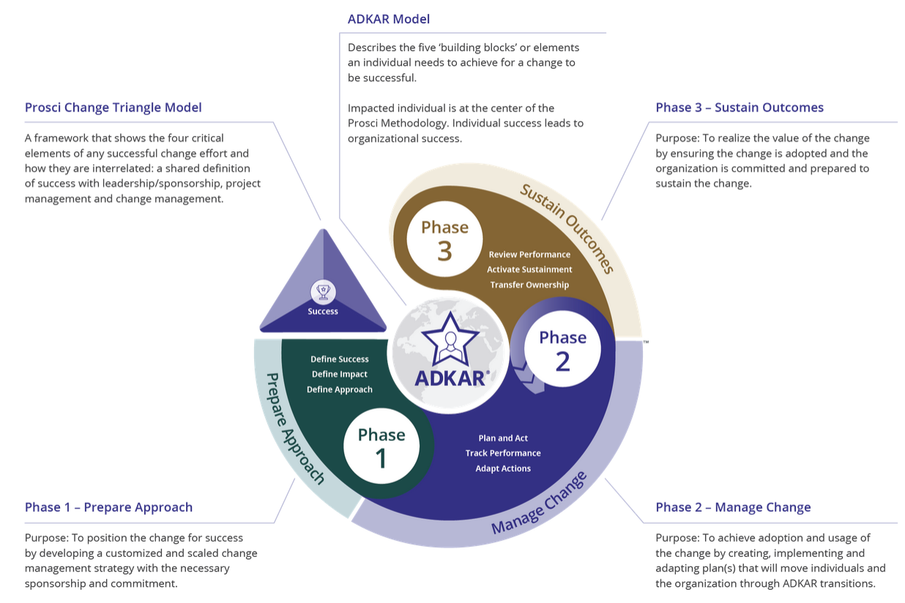
			- Prosci Methodology Scope Statement
				- What is it: A process to enable the people side of change to deliver results
					- The Prosci Methodology is a structured, adaptable and repeatable approach to enable the people side of change to deliver results. Based on over 20 years of research, the Prosci Methodology takes what we know about people, change and results and organizes it into a simple, repeatable, process practitioners can apply to create change management strategies and plans that increase adoption and usage on a particulate initiative.
				- Why use it: Improve change management effectiveness
					- A structured approach improves change management effectiveness, and therefore increases the likelihood of change success. The Prosci Methodology focuses on individual adoption and usage, while offering a structured process to guide the development and execution of organizational strategies and plans. The Prosci Methodology is unique because it is research based, practitioner-informed and easy to use.
				- Who uses it: Change practitioners
					- Change practitioners use the Prosci Methodology to develop strategies and plans to achieve adoption and usage on change initiatives. Change practitioners may or may not have a formal title, may or may not be a dedicated resource, and often have to fulfill change management responsibilities under a different title or role.
				- How to use it: Customize and scale to achieve change success on all types of change initiatives where results and outcomes depend on adoption and usage
					- The Prosci Methodology includes the Prosci 3-Phase Process that equips practitioners with a purpose driven, performance-oriented process to drive adoption and usage of a change. Because the Prosci Methodology is based on helping individuals through their ADKAR journeys, it can be applied to changes of any size and complexity. It can also be adapted to work with a variety of solution development methods or approaches.
				- When to use it: Ideally, at project initiation
					- The Prosci Methodology is designed to begin at project initiation but can be applied and adapted to accommodate later entry points in the project lifecycle.
				- Limitations: The Prosci Methodology is not designed to help you decide what to change
					- The Prosci Methodology is based on the assumption that the senior leaders of an organization have defined why a change is required and what needs to change. The Prosci Methodology is not designed to determine if the change is the right change, for the right reason at the right time. It is also not designed to develop the technical solution for a specific issue or opportunity.
		- PCT Model
		  id:: 64a5d558-7f32-4259-8efe-c592beb798df
		  collapsed:: true
			- Prosci Change Triangle (PCT) Model Overview
				- Since it was first released in July 2006, The Prosci Change Triangle Model—commonly known as the PCT Model—has helped countless project teams and change management professionals become more effective by understanding and improving the key aspects of a project’s success. The model describes the four aspects of a successful initiative and how those aspects relate to one another. Using the model and supporting assessment, change practitioners can evaluate project health to identify risks and improve initiative outcomes.
				- 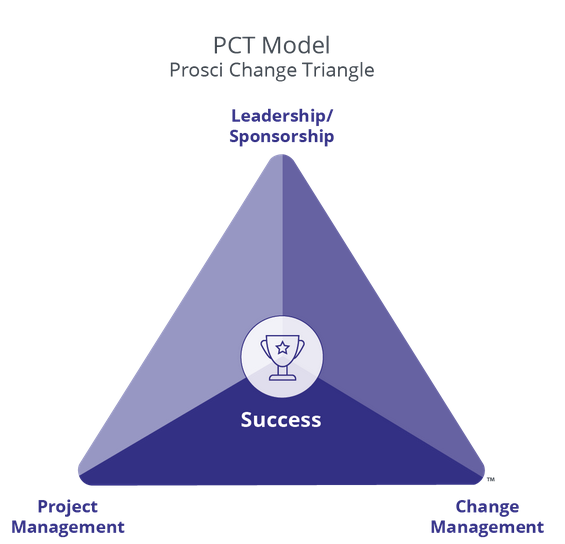
			- What is the PCT Model?
			  collapsed:: true
				- The PCT Model is a simple but powerful framework that shows the four critical aspects of any successful change effort: success, leadership/sponsorship, project management and change management. Success is at the center of the model, and the other three aspects are at the corners:
					- Success represents the purpose of an initiative or project
					- Leadership/sponsorship represents the strategy and direction of an initiative or project
					- Project management represents the technical side of an initiative or project
					- Change management represents the people side of an initiative or project
			- How the PCT Model Works
			  collapsed:: true
				- To understand how the PCT Model works at a basic level, it helps to imagine it as a three-legged stool.
				- Success at the center
					- The seat of the stool represents the success at the center of the model. Defining success for your change includes identifying the reason for the change, the project objectives, and the organizational benefits. In the analogy, these are all stacked on the seat of the stool, which is supported by the three legs described below. All three legs must be long enough and strong enough to support achieving the project objectives and desired benefits stacked on the seat.
				- Leadership/sponsorship leg
					- The leadership/sponsorship leg represents the direction and guidance for a project or initiative provided by those who have the authority and resources to launch the effort. Leadership/sponsorship is accountable for defining why a change is happening, how it aligns with the direction of the organization, and why it is a priority. This leg also represents the decisions and actions required by leaders to successfully implement and sustain the change, such as providing resources or building a coalition of support with peers.
				- Project management leg
					- The project management leg represents the discipline that addresses the technical side of a change by designing, developing and delivering the solution that solves a problem or addresses an opportunity, within the constraints of time, cost and scope. The change process may be sequential, iterative or a hybrid—but in any case, the project management leg must be healthy enough to support the seat.
				- Change management leg
					- The change management leg represents the discipline that addresses the people side of the change, enabling people to engage, adopt and use the solution. By understanding what the change means to people’s work and how they navigate or struggle with change, the change management leg supports delivering successful outcomes through the people who must adopt the solution in their day-to-day work.
				- > An Unbalanced PCT Creates A Wobbly Stool
				  
				  *Like a three-legged stool, a project that is missing one of the corner aspects of the Prosci Change Triangle will fail. If one leg is too short, the project will wobble—causing the benefits to “slide off” the seat. Without leadership and direction, a project can struggle to remain a priority and get lost among the numerous projects in the organization. Without a solid project management approach for the technical side, a project may not deliver the necessary solution to meet the need or opportunity. And without a solid change management approach for the people side, employees may never embrace, adopt and use the solution—resulting in diminished outcomes.*
				-
				-
			- How the PCT Model Corners Interrelate
			  collapsed:: true
				- 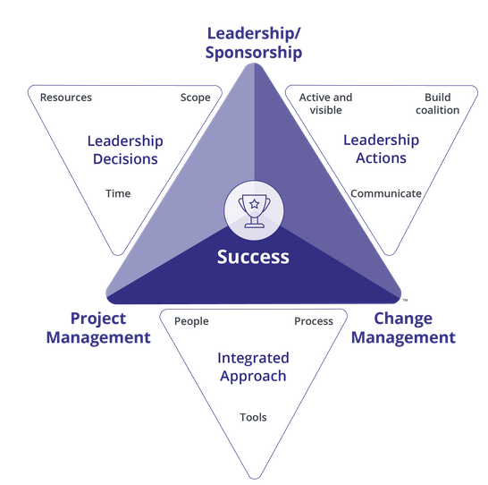
				- In addition to the corners and center of the PCT Model—the four aspects of the PCT—it is critical to understand the sides of the triangle that connect the corners. These sides represent how the three corner aspects connect to and work with the other disciplines during a change. The leadership/sponsorship aspect plays a role at two levels. At the organizational level, leaders are responsible for creating the vision and strategy for where the organization is heading. At a project level, leaders must show how a project or initiative aligns with and supports that organizational direction. For any change to be successful, leadership/sponsorship must participate in both decisions (the connection with project management) and actions (the connection with change management).
				- Leadership Decisions
					- The Leadership Decisions side of the PCT Model represents the relationship between leadership/sponsorship and project management. This connects the decisions executives make to the project, scope, schedule and resources for the change. Note that leaders and sponsors are typically comfortable with making such decisions because they already view decision-making as part of their job role.
					- 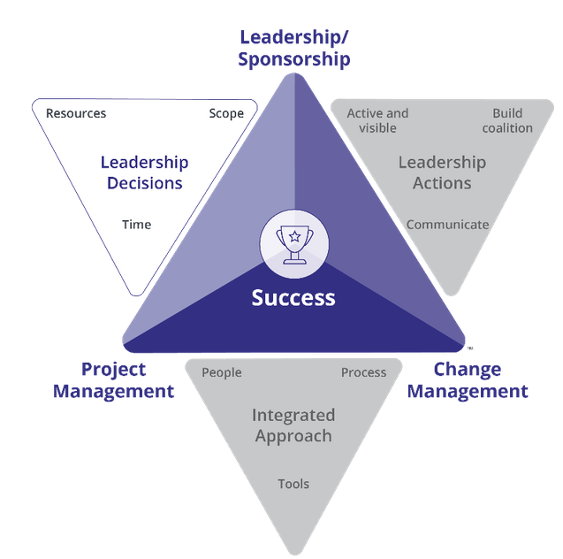
				- Leadership Actions
					- Leadership Actions highlight the relationship between the leadership/sponsorship and change management aspects of the model. This involves ensuring that leaders/sponsors perform the three critical roles required for project success. Emerging from years of research on the role of sponsorship in driving change success, Prosci refers to these the ABC’s of Sponsorship:
						- Actively and visibly participate in the project
						- Build a coalition of support
						- Communicate directly with employees
					- When change management is new to a leader or sponsor, or they need clarification about their role, it is the change practitioner’s job to provide coaching and support to enable the leader to fulfill their role successfully.
				- Integrated Approach
					- The integrated approach refers to the relationship between project management and change management in the PCT Model. This includes three dimensions of integration: people, process and tools.
					- People describes who does the work, process describes how the work gets done, and tools describes what we use to do the work. Note the deliberate placement of “people” on the project management side to remind project management teams of the importance of integrating with the people side of a change. Similarly, “process” is located on the change management side to highlight the importance of project management activities to change managers. Initiatives that execute project management and change management through an integrated approach are more successful.
			- Apply the PCT Model with the PCT Assessment
			  collapsed:: true
				- In addition to understanding the implications of the PCT Model as a framework, teams can apply Prosci’s PCT Assessment to position the project for success by gauging project health across the four critical aspects of the model at a point in time. The PCT Assessment guides the user through three key activities in logical order: assessment, analysis, and actions to address. The assessment enables change practitioners to identify and address specific risks or weaknesses in the initiative. If the results reveal that a project is weak in any of the four PCT Model aspects, the project will struggle or fail. However, leveraging the assessment outputs and resulting analysis enables the team to develop targeted actions to address such weaknesses. And when applied properly, the PCT Assessment scores are a strong indicator of the potential for a successful implementation.
				- Any qualified member of the change management team, project team, senior leadership or key business leader from the impacted groups can conduct a PCT Assessment. What matters is that you conduct an initial PCT Assessment early in the lifecycle of the project to establish a baseline. Conducting the assessment again at key points during the project reveals whether scores are improving over time and where attention is needed. After each assessment, the change teams should create a set of action plans to improve performance where scores are low.
			- Value of the PCT Model
			  collapsed:: true
				- The PCT Model and the PCT Assessment offer value to project and change teams in several ways:
					- A shared understanding of the PCT Model provides project teams with common language and context for the four aspects of successful change.
					- The PCT Model positions change management’s unique contribution relative to project management and leadership/sponsorship at a glance, as well as in depth.
					- Applying the model and PCT Assessment enables teams to evaluate the health of an initiative at a point in time to identify key risks. Through repeated application over the lifecycle of the initiative, the model and assessment enable teams to evaluate progress and improve initiative health with informed interventions.
					- Leveraging the model and assessment enables teams to identify organizational competencies and gaps by evaluating assessment results from multiple projects.
			- Improve Project Outcomes
				- Healthy projects have four aspects in common: a clear and shared definition of success, guidance and direction from leaders, a well-delivered technical solution, and adoption of that solution by impacted people. The Prosci Change Triangle captures these four aspects and makes their interrelationships clear. The PCT Assessment extends the model’s value by providing teams with a diagnostic tool for evaluating project and initiative health, identifying risks, and enabling actions. Change practitioners, project managers and leaders can use this simple yet powerful model to improve outcomes on projects and initiatives.
		- ADKAR Model
		  collapsed:: true
			- 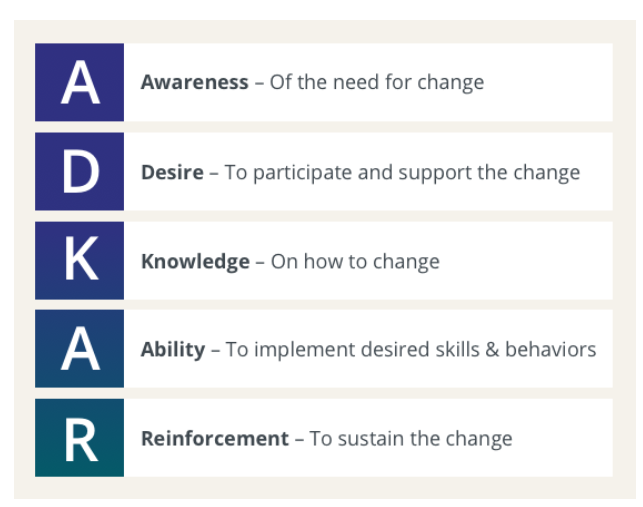{:height 393, :width 426}
			- The Prosci ADKAR Model: Why it Works
				- The five building blocks of the Prosci ADKAR® Model are sequential:
				- Awareness of the need for change
				- Desire to participate and support the change
				- Knowledge on how to change
				- Ability to implement required skills and behaviors
				- Reinforcement to sustain the change
			- When a person has all five elements, he or she has made the change successfully. When a change is not implemented, it is usually because one or more of the five blocks is missing. Our experience with thousands of practitioners has shown that the easy-to-learn ADKAR Model also:
				- Creates a new lens for viewing change
				- Drives action
				- Addresses how change happens one person at a time
			- Prosci's ADKAR Model is based, fundamentally, on how we as human beings experience change. The origins of the ADKAR Model stem from the model's developer, Prosci founder Jeff Hiatt, asking himself why change management activities work:
				- Why do we communicate?
				- Why do we need to see executives supporting a change?
				- Why do we train people?
			- As the answers to these "whys" became clear, the five key building blocks of the ADKAR Model emerged. Prosci then began extensive research to validate and refine the elements of the model used today.
			- If you have ever watched someone make a change successfully in life or at work, you have seen the ADKAR Model in action. Think about the first thing someone needs to make a change: an understanding of why the change is needed in the first place.
			- Learning to Use ADKAR
				- ADKAR is so easy to learn that many reflect that it seems like common sense. The letters are simple to remember, and the five building blocks become second nature once you are exposed to and apply the model to something meaningful to you. In Prosci's Change Management Certification Program, we begin by applying the model to a change outside of the work setting. This is the fastest way to see the model come to life, and often that first personal application is what helps solidify the model. Once you have applied it to a non-work change, you can quickly begin applying it to changes at work.
			- A New Lens for Viewing Change
				- Once you've seen one change through ADKAR glasses, you can't help yourself. You begin seeing change in terms of Awareness, Desire, Knowledge, Ability and Reinforcement. When you write an email to a colleague, you start to ask yourself, "Have I provided the information needed to create Awareness of the need for change?" When you read the newspaper, you begin evaluating whether a Knowledge effort was preceded by the necessary Awareness and Desire. When you work to make a change in your personal life, you break the change down into the five ADKAR building blocks.
				- Seeing change through ADKAR glasses means you have a new perspective on what change requires and what is needed for a change to be successful.
			- ADKAR Drives Action
				- Some individual models of change are descriptive, observing how an individual navigates a change around or to them. However, the ADKAR Model is prescriptive. It defines the elements that must be present for a change to be successful. Because it is outcome-oriented, ADKAR drives action. It provides a map of what needs to be done to advance a change rather than merely describing how someone proceeds through change. This is a fundamental shift in thinking, moving away from thinking in terms of change management activities to the goal of change management, as defined by the ADKAR Model.
				- Change Happens One Person at a Time
					- In the end, change happens one person at a time. Even large, complex organizational changes are only successful if the impacted individual changes how they do their day-to-day work. Organizational change is the culmination of many individuals moving from their own current state to their own future state.
					- Because change happens one person at a time, a model that describes individual change is powerful and necessary for change management practitioners. It is not enough to understand how to make a nice-looking newsletter or outline key talking points for a kick-off meeting. You must understand how to support a single individual through change in order to have context and purpose for your change management activities.
				- ADKAR: A Model for Change in Business, Government and Our Community describes the secret to successful change as,
				- > “beyond the visible and busy activities that surround change. Successful change, at its core, is rooted in something much simpler: How to facilitate change with one person."
				- This is the crux of why an individual change management model like ADKAR is ultimately the cornerstone of any successful change effort in an organization.
		- Prosci 3-Phase Process
		  collapsed:: true
			- An Enabling Framework for Managing the People Side of Change: Prosci 3-Phase Process
			- Change Management Process
				- > “The Prosci 3-Phase Process is the critical link between individual change management and organizational change. The Prosci 3-Phase Process allows us to leverage and scale change management activities to drive individual transitions. The Prosci Methodology uniquely integrates individual change management and organizational change management to ensure the achievement of organizational results. This is the essence of effective change management.” *Tim Creasey, Prosci Chief Innovation Officer*
			- 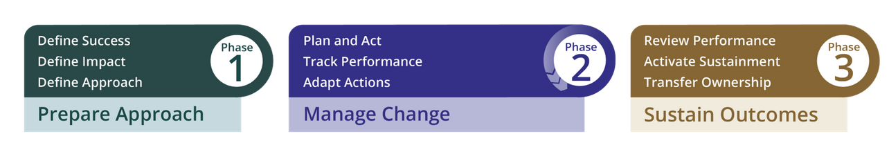
			- Designed for use with organizational change, the Prosci 3-Phase Process is a structured, repeatable and adaptable approach for managing the people side of change. This easy-to-understand and practical framework serves as a critical link between individual change management and organizational change, enabling practitioners to leverage and scale the change management activities that help impacted individuals move through their transitions.
			- The Prosci 3-Phase Process
			  collapsed:: true
				- A key component of the overall Prosci Methodology, the Prosci 3-Phase Process guides practitioners through the high-value steps to take and activities to perform during projects and initiatives in order to achieve change success.
				- 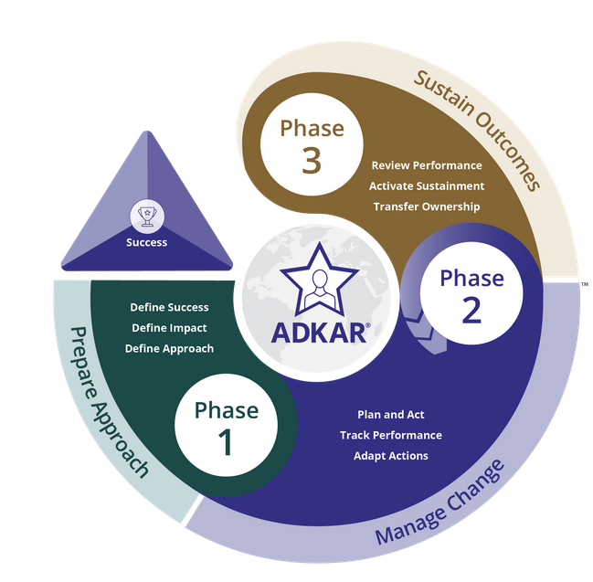
				- Each phase ends with a key deliverable, enabling you to package all the work from a particular phase and communicate it to others. Doing so increases understanding and commitment to the change management process while ensuring alignment among your stakeholders. Each deliverable is flexible, customizable and scalable to fit your unique project and organization.
				- An overview of each phase in the Prosci 3-Phase Process follows below.
				- Phase 1 – Prepare Approach
				  collapsed:: true
					- 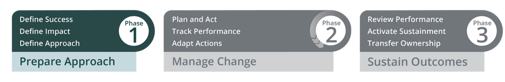
					- During this initial phase, practitioners prepare the change management approach to be applied across three stages:
						- Define Success – What are we trying to achieve?
						- Define Impact – Who has to do their jobs differently and how?
						- Define Approach – What will it take to achieve success?
					- The overall purpose of this initial phase is to position the change for success by developing a customized, scaled change management strategy along with the sponsorship and commitment you need. It is critical to gain support from the primary sponsor and key stakeholders in this phase. Without early commitment, the support you need may never materialize, which significantly jeopardizes success.
					- The deliverable for Phase 1 – Prepare Approach is the Change Management Strategy, and it informs the activities in Phase 2 – Manage Change.
				- Phase 2 – Manage Change
				  collapsed:: true
					- During this phase, practitioners develop specific plans to move impacted individuals and the organization through their ADKAR® transitions, and learn how to measure, track and adapt performance. This is the longest phase timewise and the most visible to organization and impacted individuals.
					- The bulk of the change management team’s work gets done in the stages of this central phase:
						- Plan and Act – What will we do to prepare, equip and support people?
						- Track Performance – How are we doing?
						- Adapt Actions – What adjustments do we need to make?
					- The purpose here is to enable impacted individuals and groups to adopt the initiative or project solutions. To achieve the desired adoption and usage, the change practitioner develops a set of plans that will move individuals and the organization through their ADKAR transitions.
					- The change management plans required depend on your unique organization, project or initiative. Phase 2 – Manage Change culminates with the Master Change Management Plan deliverable.
				- Phase 3 – Sustain Outcomes
				  collapsed:: true
					- 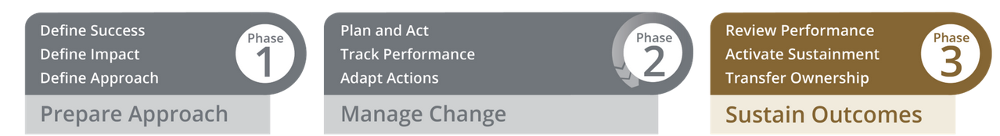
					- In this final phase of the Prosci 3-Phase Process, the organization achieves the project’s benefits and focuses on sustaining the outcomes. Key activities take place in three phases:
						- Review Performance – Now, where are we? Are we done yet?
						- Activate Sustainment – What is needed to ensure the change sticks?
						- Transfer Ownership – Who will assume ownership and sustain the outcomes?
					- The purpose of this phase is to reach the desired outcomes from the project or initiative by ensuring adoption, and then equipping the organization to sustain the adopted changes over time.
					- After assessing delivery in each performance level, Phase 3 – Sustain Outcomes culminates with celebrating successes and then transferring ownership of long-term sustainment activities to the appropriate operational team members.
					- The deliverable for Phase 3 – Sustain Outcomes is the Change Management Closeout, which ends the formal change management effort for the initiative.
			- Structured, Repeatable and Adaptable
				- As a key part of the Prosci Methodology, the Prosci 3-Phase Process enables practitioners to formulate and customize an approach to their change management projects and initiatives. It’s adaptable by design, easily scalable, and flows logically. By progressing through each of the phases and applying the right processes and tools, the Prosci 3-Phase Process establishes the process for activities and actions that will help you succeed at change in your organization.
		- Phase 1 – Prepare Approach Overview
		  id:: 64a5d80a-0634-4b3c-bbd8-68147a635b46
		  collapsed:: true
			- 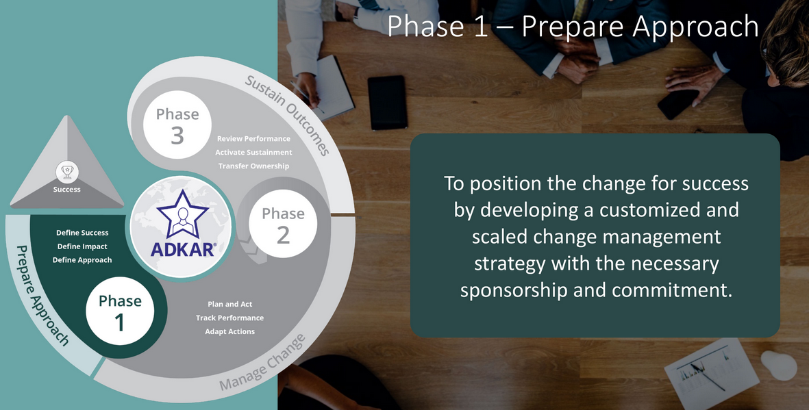{:height 489, :width 948}
			- Purpose
				- Phase 1 – Prepare Approach is the first phase of the Prosci 3-Phase Process.  The purpose of Phase 1 – Prepare Approach is to position the change for success by developing a customized and scaled change management strategy with the necessary sponsorship and commitment. This phase has three stages:
					- Define Success: This stage answers the question, “What are we trying to achieve?”
					- Define Impact: This stage answers the question, “Who has to do their jobs differently and how?"
					- Define Approach: This stage answers the question, “What will it take to achieve success?"
				- Deliverable
				  collapsed:: true
					- The final deliverable for Phase 1 – Prepare Approach is a Change Management Strategy.  The Change Management Strategy describes the approach to deliver change success. A Change Management Strategy can be shared with the Sponsors and Project Leaders to:
					- Confirm understanding of the change and document a clear and aligned definition of success
					- Make a compelling case for why change management is important and outline what it will take to achieve success
					- Provide an artifact for sign off by the Sponsor
				- Roles and Responsibilities
				  collapsed:: true
					- 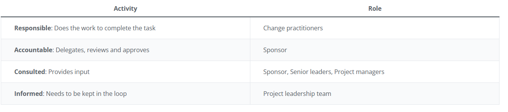
				- Phase 1 – Prepare Approach at a Glance
				  collapsed:: true
					- 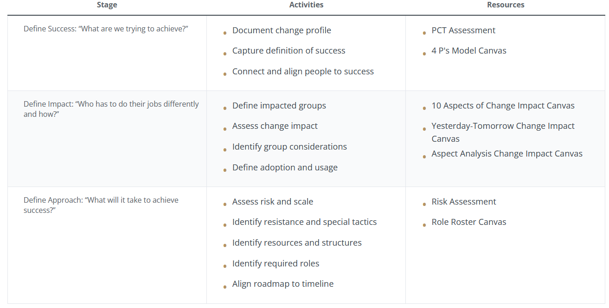
			- Define Success
			  collapsed:: true
				- 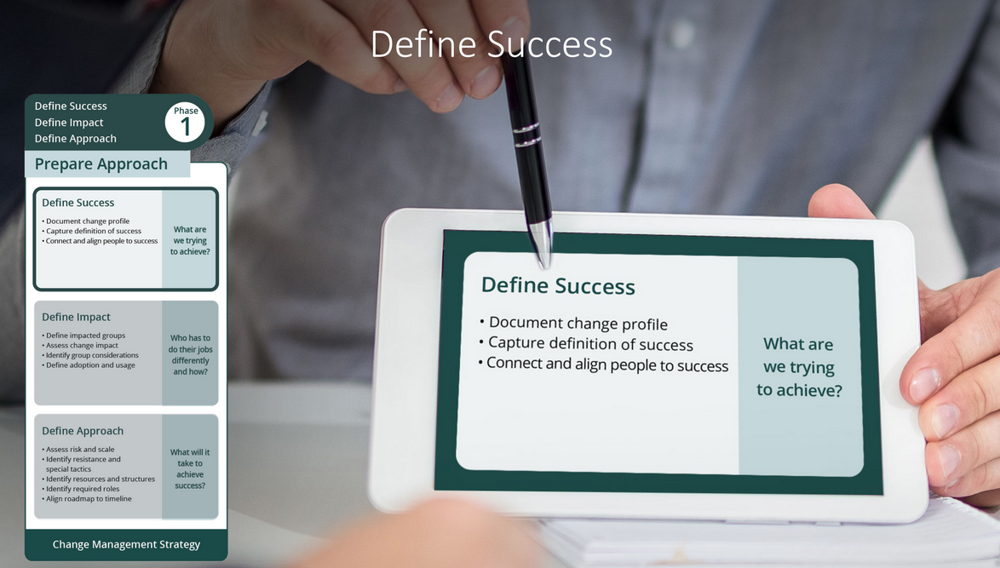
				  collapsed:: true
					- > “If you don't know where you are going, you might wind up someplace else.”
						- Yogi Berra, Hall of Fame American Baseball Player, 1946-1965
				- Why
				  collapsed:: true
					- The Prosci 3-Phase Process begins by defining success to achieve clarity and alignment on what the change is aiming to deliver so you can more effectively manage to outcomes. The value of change management is improving change results and outcomes by increasing adoption and usage, so a clear definition of the outcomes of the change itself is important. The definition grounds the work of change management by focusing on outcomes. It is also important in effectively positioning change management with sponsors and project managers. Finally, the definition of success is central to building Awareness of the need for change and Desire to support and participate in a change.
				- What
				  collapsed:: true
					- The Define Success activities are:
						- Document a change profile by capturing critical details about the change using the 4 P’s Model including the project (name of the initiative), purpose (why we are changing), particulars (what we are changing) and people (who will be changing).
						- Capture definition of success which includes the purpose, project objectives and organizational benefits. Project objectives describe what the project is expected to achieve. Organizational benefits describe what the organization gains from the achievement of the project objectives.
						- Connect and align people to success by making a compelling case for the value to the project that can be gained through adoption and usage and the risks and consequences of failing to address the people side of change.
				- Who
				  collapsed:: true
					- There are two distinct roles in defining success; leaders are accountable to define success and practitioners need to work with leaders to document and communicate the project objectives and organizational benefits they are hoping to achieve.
					- 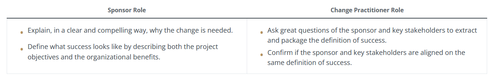{:height 153, :width 948}
				- When
				  collapsed:: true
					- Define Success is the first stage in Phase 1 – Prepare Approach. The definition of success provides an anchor for many upcoming activities and should be completed as soon as possible. Gaining a clear and common definition of success can be a process that takes persistence and work from the change practitioner. Engaging sponsors, key stakeholders and project managers to Define Success will increase their understanding of the value and focus of change management which, in turn, will increase their commitment to the required change management activities.
				- Tips and Problem Solving
					- If the organizational benefits and project objectives are not defined or are not clear, ask questions of the sponsor and other senior leaders to clarify the project’s purpose and the desired outcomes. The answers to the following questions will help determine the definition of success:
						- Why is this change needed? What are the drivers behind it?
						- What problem are we trying to solve or opportunity are we trying to seize?
						- Assuming the change effort was successful, how would you know?  What do people know?  What can they do?  What is the result?
						- Who will judge the effectiveness of the change? What will they look for?
						- "To what end?" - What are we ultimately trying to achieve with this change?
						- When and under what circumstances will we be able to declare success for this change?
					- If key stakeholders have different definitions of success, help them to align on a common definition. Engage key stakeholders to surface different definitions of success and identify common perspectives. Emphasize similarities and resolve the differences. Ensure the definition of success aligns with organizational strategy.
					- If you aren’t sure how to define measurable project objectives and organizational benefits, seek out subject matter experts in the organization to assist in defining the appropriate metrics. At a minimum, it is important to describe what success looks like. It is even better to identify a quantitative measure or indicator to track performance against an objective. Where possible, use existing performance metrics. Common categories of metrics include:
						- Output (e.g., units processed, productivity, frequency, sales)
						- Time (cycle time, delay or wait time, speed to market)
						- Satisfaction (customer or client satisfaction)
						- Quality (accuracy, error rate, complaints)
						- Cost (expenses, savings)
						- Safety (accidents)
						- Employee information (turnover, absenteeism)
					- If you are in a situation where you believe more strongly in the need for a change and the benefits than your sponsor, remember that your role is not to build the sponsor's Awareness and Desire for the change. Your role is to support the sponsor to develop the Knowledge and Ability they need to effectively lead the change and deliver the desired results for their organization.
			- Define Impact
			  collapsed:: true
				- 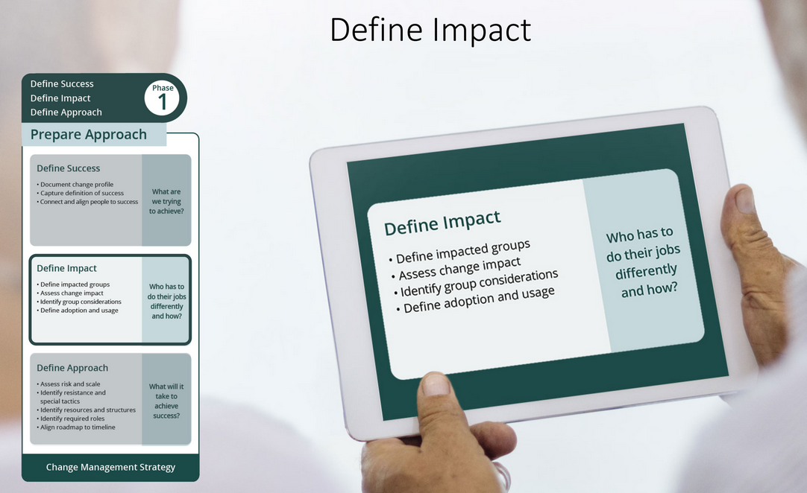
				- > We typically think about change at the organizational level – a new ERP, an M&A, a new productivity suite – but change ultimately happens at the individual level – how it impacts Andy, Becky, Charlie, and Debbie. Supporting people through their own change journey and measuring individual outcomes requires defining change impact for each person.
					- Tim Creasey, Prosci Chief Innovation Officer
				- Why
				  collapsed:: true
					- Define Impact helps bring the change into focus at the individual level and provide clarity on what adoption and usage looks like so you can drive improved results and outcomes. By defining impacts, you can understand the beliefs and feelings that people have about the change, enabling you to identify areas of support and resistance. Engaging directly with the impacted people and groups can be very helpful in gaining deeper insight into impact and can also be a powerful way to encourage people to participate fully in the change process.
				- What
				  collapsed:: true
					- The Define Impact activities are:
						- Define impacted groups by identifying and creating an inventory of people/groups impacted by the change.
						- Assess change impact by using the 10 Aspects of Change Impact to identify the type and degree of change impact for each group.
						- Identify group considerations by documenting relevant information that informs the strategy and plans required to support individuals in achieving ADKAR outcomes.
						- Define adoption and usage to describe how each group will apply the change to enable tracking of performance.
				- Who
				  collapsed:: true
					- It is important to build an understanding of impact by hearing from those who best understand the impact, such as members of groups directly affected by the change. The project manager and project team are also a valuable source of information about the impacts. Additionally, the change practitioner can improve the definition of impact by consulting with others, such as subject matter experts, change agent networks and people managers. The change practitioner is ultimately responsible for defining the change impact and using that insight to inform the approach and plans.
				- When
				  collapsed:: true
					- As soon as adequate information about the future state is known. Change impact may need to be reviewed and refined as you learn more information about the solution design. In an iterative solution design process, you may need to assess change impact for each sprint or cycle.
				- More Information on the 10 Aspects of Change Impact
				  collapsed:: true
					- We use the 10 Aspects of Change Impact framework to assess change impact. The 10 Aspects of Change Impact describe the way a person or group may be impacted by change.
						- 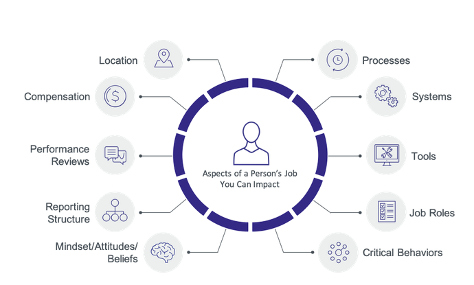
						- Processes - the actions or steps taken to achieve a defined end or outcome; e.g. registration process for a training program
						- Systems - a combination of people and automated applications organized to meet a set of objectives; e.g. Customer Relations Management (CRM) system
						- Tools - an item or implement(n) used for a specific purpose; e.g. can be a physical object/tool (drill) or a technical object (web authoring tool)
						- Job roles - a description of what a person does, including competencies essential to performing well in that job capacity; e.g. client services role responsible for engaging directly with clients
						- Critical behaviors - vital or essential response of an individual or group to an action, environment, person or stimulus; e.g. the actions of a client services associate to identify client needs and engage with other team members to collaborate on solutions
						- Mindset/attitudes/beliefs - a mental inclination, disposition or frame of mind reflected in behaviors; e.g. changing from a transactional mode of serving customers to a relational mode to improve client loyalty and retention
						- Reporting structure - the authority relationships in a company or organization, i.e. who reports to whom; e.g. moving from regional sales teams to a global services team with a different executive leader
						- Performance reviews - the process and indicators of how performance is measured and assessed relative to objectives; e.g. introducing specific client retention and advocacy objectives for client services associates
						- Compensation - the amount of the monetary and non-monetary pay provided in return for work performed; e.g. commission structure and bonus plan for client services associates
						- Location - a physical geographical place that provides facilities for a stated purpose; e.g. consolidation of all client services associates from three regional locations to one floor of the corporate office
					- An initiative may or may not impact all these aspects but by systematically working through the list you will be able to define both what is and what is not changing as well as surface important aspects of the change you need to consider.
					- Note: Any aspect that is not impacted by the change (rated 0) will be removed from your degree of impact calculation. Impacted individuals don't think about the job aspects that aren't affected, only those that are. Removing them from the impact score more accurately reflects what the impacted individuals would perceive the impact to be.
				- Tips and Problem Solving
				  collapsed:: true
					- Be sure to identify your highest impacted groups. These groups will likely need a greater level of support. You may need to dedicate more time or resources to supporting them.
					- There is no one right way to define impacted groups. Ways to define impacted groups include by:
						- Organization (subsidiary, line of business, division, department or team)
						- Role
						- Geography
						- Affiliation (union, non-union, professionals, management)
					- It can be helpful to consolidate groups that are impacted in similar ways and may require similar change management activities.
					- ---
					- If you are engaged early in the change process, where there is incomplete information about the change or solution design, don’t let that stop your progress. Refer to the Best Practices in Change Management section on 'Initiating Change Management - Initiative with Incomplete Information.'
					- ---
					- If your change is confidential, you may not be able to consult directly with impacted groups. In this case, you may need to consult with leaders who are aware of the details of the change or rely on project or operational documentation to define impact. This may result in an incomplete definition of impact. Be prepared for impacts that you did not anticipate to emerge during or after implementation.
					- ---
					- When gathering data from employees to assess impact, do so thoughtfully with sensitivity. In many cases, simply asking questions related to impact can create fear and uncertainty for employees. Time the data gathering with the readiness of the project team to share details about the change, and after people managers have answered the question from employees, "what's in it for me?" (WIIFM).
				-
			- Define Approach
				- Define Approach: What will it take to achieve success?
				- 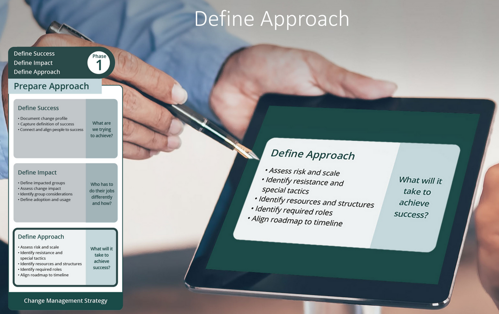
				- Why
				  collapsed:: true
					- No two changes will require exactly the same process or level of change management. An effective change management approach is customized and scaled to meet the unique circumstances of a change initiative. An effective approach strikes a balance and integrates the people side of the change into the execution of the initiative. Define Approach combines an understanding of the circumstances of the change with recommendations and adaptations to increase the likelihood of success.
				- What
				  collapsed:: true
					- The Define Approach activities are:
						- Assess risk and scale by completing a Risk Assessment and interpreting the resulting profile to make informed decisions to customize the change management approach.
						- Identify resistance and special tactics by reviewing the group impact assessment and unique group considerations to anticipate and prevent resistance.
						- Identify resources and structures by defining or documenting the Governance Model, leveraging the strengths and addressing the limitations of the model.
						- Identify required roles by creating a role roster that includes core employee-facing roles, core enabling roles and any other extend roles required for the project.
						- Align roadmap to timeline by first aligning ADKAR milestones to project milestones and then change management activities to the project lifecycle.
					- We describe these activities using the term The 5 R's. They comprise the key components of a change management strategy.
					  collapsed:: true
						- 
				- Who
				  collapsed:: true
					- The change approach is defined by the change practitioner based on their assessment and analysis of The 5R's: Risk, Resistance, Resources, Roles, Roadmap. The approach should be customized and scaled based on the unique characteristics of the project. The effectiveness of the approach is enhanced by engaging key stakeholders including the primary sponsor, members of the sponsor coalition, people managers, impacted groups, and the project team.
				- When
				  collapsed:: true
					- Define Approach occurs when there is a clear understanding of what the project is intended to achieve and who will be impacted and how. Defining the approach is a prerequisite to developing plans and taking actions.
				- More Information on Risk Grid Customization Guidelines - Overview
				  collapsed:: true
					- The Risk Assessment is comprised of the Change Characteristics Assessment and the Organizational Attributes Assessment. The change characteristics assess the nature, scope, amount and impact of a change on a spectrum of small, incremental change to large, disruptive change. The organizational attributes assess the organization’s values, culture, capacity for change, leadership style, and history of past changes on a spectrum of change-ready to change-resistant. The results from the two assessments are used to define the risk profile for a change, which is determined by plotting the assessment scores on a risk grid. The risk profile defines the people risk of a change.
					- The Risk Grid Customization Guidelines are based on the risk profile for a change and are intended to help change practitioners make informed decisions that will mitigate people risk when selecting activities to include in ADKAR Blueprint and core and extend change management plans. The Guidelines are comprised of:
						- Risk Assessment Analysis – general guidance for customization, including implications for ADKAR, the Role Roster and change management plans based on the risk profile for a change.
						- Risk Factor Analysis and Activities – specific guidance for customization, including potential activities to mitigate risk based on a detailed review of the change characteristics and organizational attributes risk factors that represent the greatest threat to the successful implementation of a change. See the sections Risk Factor Analysis for Change Characteristics and Risk Factor Analysis for Organizational Attributes in Phase 2 – Manage Change, Plan and Act.
					- Prosci has long taught that the risk profile informs the size and scale of the change approach. In reality, practitioner capacity and competency may be the limiting factors in the change approach. The Prosci Methodology encourages change practitioners to also reflect on the risk profile against their individual competency and capacity. This helps change practitioners to acknowledge their real-world conditions early in the change process and take appropriate actions to address any issues.
					- For example, if you are a novice practitioner working on a high risk change initiative, then consider asking for help, including:
						- Find a more experienced practitioner in your own organization to mentor or coach you.
						- Engage an external advisor or coach to work alongside you.
						- You can also influence the expectations of your primary sponsor.
					- And remember, you are still making a contribution. Some change management is better than no change management.
				- More Information on Risk Assessment Analysis - Risk Profiles
				  collapsed:: true
					- High Risk: Large, disruptive change in a change resistant organization
					  collapsed:: true
						- 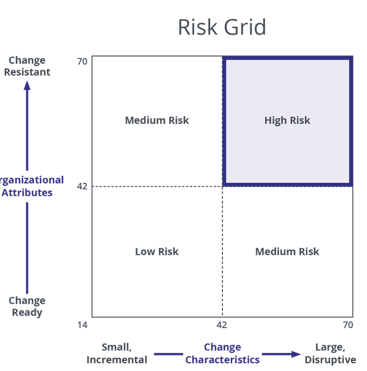
						  collapsed:: true
							- A 2X2 risk grid with the High Risk (a large disruptive change to a change resistant group) quadrant highlighted. The X axis is labeled Change Characteristics. The Y axis is labeled Organizational Attributes. The grid is divided into four quadrants. The bottom left quadrant is low risk (small incremental change for a change ready group). The bottom right quadrant is medium risk (large, disruptive change for a change ready group). The top left quadrant is medium risk (small incremental change for a change resistant group). The top right is high risk (a large disruptive change to a change resistant group). The origin of the graph is 14, the midpoint is 42 and the endpoint is 70.
						- The upper right quadrant represents high people risk. The change is assessed as large and disruptive, based on a change characteristics score above 42. The organization is also change resistant, as indicated by the organizational attributes score above 42. Changes that fall into this quadrant typically require the highest level of change management effort and resources to mitigate the people risk. Identifying and preventing resistance is a significant opportunity area to address for large changes occurring in change resistant organizations.
						- ADKAR Implications:
							- Large gaps for all five elements of ADKAR should be expected among members of impacted groups, due to the combination of a large, disruptive change and a change resistant organization.
						- Role Roster Implications:
							- High risk changes require a robust role roster, starting with an executive level sponsor, supported by a strong and aligned sponsor coalition representing the impacted groups. People managers will need to fulfill all five CLARC roles, Communicator, Liaison, Advocate, Resistance Manager and Coach to effectively lead the change with their teams. Having one individual fulfill both the CM and PM roles limits their capacity to mitigate the risk.
							- A dedicated, experienced change practitioner should lead the change management effort for a high risk initiative. A novice practitioner should be partnered with an experienced practitioner on their first high risk project.
						- Change Management Plan Implications:
							- High risk changes typically require all four core plans (sponsor, people manager, communications and training) plus additional extend plans to address the specific high risk factors from both the Change Characteristics and Organizational Attributes assessments. A sustainment plan, which is an extend plan, is recommended.
					- Medium Risk: Large, disruptive change in a change ready organization
					  collapsed:: true
						- 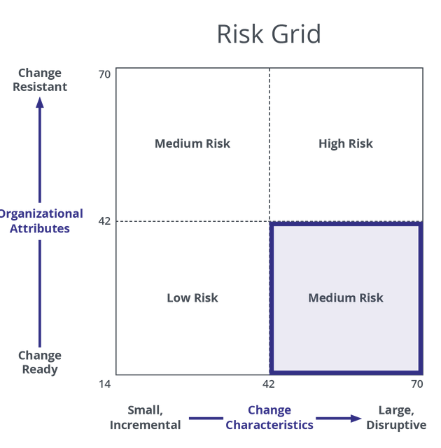
						- The lower right quadrant represents medium people risk. While the organization may be change ready based on an organizational attributes score below 42, the change is assessed as large and disruptive, based on a change characteristics score above 42. The change characteristics score reflects the nature and size of the change that an organization has determined is required to address an opportunity or solve a problem.
						- Change practitioners have limited ability to influence the scores for many of the risk factors that comprise the change characteristics assessment. In some situations, it may be possible to reduce the risk associated with the size of the change by breaking a large change into smaller changes. For example, it might be possible to implement an enterprise-wide change one business group at a time, to reduce the level of disruption to the organization.
						- ADKAR Implications:
							- The lower score for the organizational attributes assessment suggests that Awareness and Desire gaps may be smaller and require less effort to address compared to the Knowledge and Ability gaps resulting from a large, disruptive change.
						- Role Roster Implications:
							- The sponsor should be a senior or middle manager and supported by a sponsor coalition representing the impacted groups. People managers will need to focus on the Communicator, Liaison, Advocate and Coach roles to effectively lead the change with their teams.
						- Change Management Plan Implications:
							- Typically, all four core plans will be required. The change characteristics risk factors that represent the greatest threat to the successful implementation of the change should be mitigated by including appropriate activities in the core plans. A sustainment plan is also recommended. In some situations, additional extend plans may be required. For example, if a change has significant impact on external stakeholders, a stakeholder engagement plan would be required to mitigate the risk.
					- Low Risk: Small, incremental change in a change ready organization
					  collapsed:: true
						- 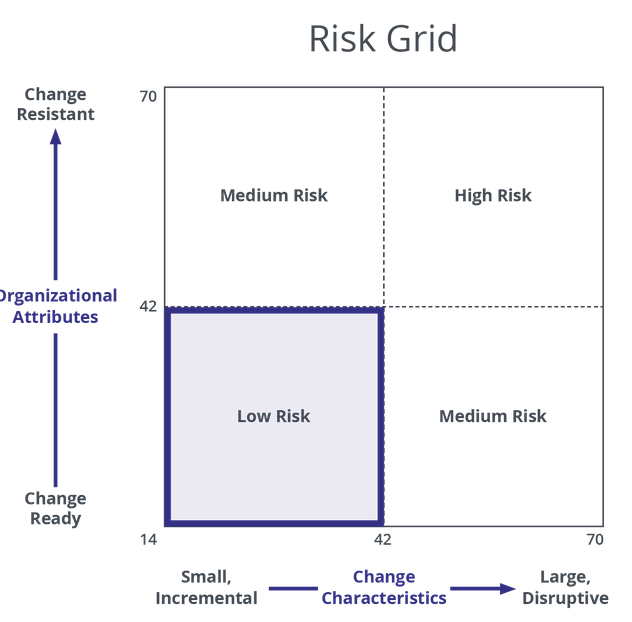
						- The lower left quadrant represents low people risk. The change is assessed as small and incremental and the organization is change ready, as indicated by scores below 42 for both the change characteristics and organizational attributes.
						- ADKAR Implications: Small to medium gaps for Awareness, Desire, Knowledge and Ability should be expected among members of impacted groups, due to the combination of a small, incremental change and a change ready organization.
						- Role Roster Implications: The sponsor would typically be a mid-level manager and a sponsor coalition would be required if the change impacted multiple business groups with different leaders. People managers will need to focus on the Communicator, Advocate and Coach roles to effectively lead the change with their teams.
						- Change Management Plan Implications: In most situations, an ADKAR Blueprint or ADKAR Blueprint by Group would be sufficient given the low risk profile. Sustainment of the change can be achieved by having people managers reinforce the change with impacted individuals.
					- Medium Risk: Small, incremental change in a change resistant organization
					  collapsed:: true
						- 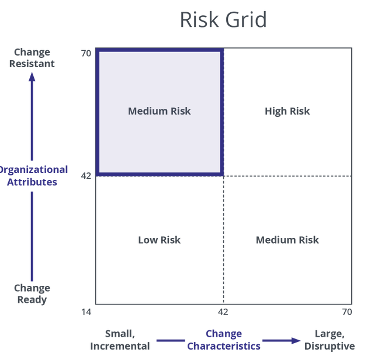
						- The upper left quadrant represents medium risk. While the change may be small and incremental based on a change characteristics score below 42, it is occurring within a change resistant organization as indicated by the organizational attributes score above 42.
						- By selecting appropriate activities, change practitioners can mitigate a number of the risk factors that comprise the organizational attributes assessment, including the perceived need for the change among impacted people (factor 1), executive / senior manager change competency (factor 10) and people manager change competency (factor 11). Identifying and preventing resistance is a significant opportunity area for changes occurring in change resistant organizations.
						- ADKAR Implications:
							- Larger gaps for Awareness, Desire and Reinforcement should be expected among members of impacted groups due to change resistance.
						- Role Roster Implications:
							- The sponsor should be a senior manager or higher level in the organization. A sponsor coalition would be required if the change impacted multiple business groups with different leaders. The people managers leading the impacted groups would initially be focused on the Communicator and Advocate roles to build Awareness and influence Desire.
						- Change Management Plan Implications:
							- Typically, expect to include all four core plans. The organizational attributes risk factors that represent the greatest threat to the successful implementation of the change should be specifically addressed in the core plans. A sustainment plan is also recommended. For example, if an organization typically declares success at go live, a sustainment plan that defines the activities, roles and timeline to achieve sustained outcomes would help mitigate the risk of declaring success before the organizational benefits have been realized.
						- Tips and Problem Solving
						  collapsed:: true
							- Risk
							  collapsed:: true
								- Devote just enough time to assessments to inform good planning decisions. Completing assessments is only one part of a structured approach to change management and should not dominate your work.
								- Generally, you complete a Risk Assessment for the overall project. There are circumstances when you may want to complete a Risk Assessment at a group level. If the Change Characteristics and/or Organizational Attributes vary significantly by group, consider assessing risk at the impacted group level.
								- If you are a novice practitioner working on a high risk change initiative, then consider asking for help, including:
									- Find a more experienced practitioner in your own organization to mentor or coach you.
									- Engage an external coach or consultant to work alongside you.
								- You can also manage the expectations of your primary sponsor. And finally, remember you are still making a contribution. Some change management is better than no change management.
								- If you are working on a high risk change and you are limited in the amount of time you can dedicate to the project, then:
									- Make a case to the primary sponsor and/or project manager to increase your time allocation.
									- Consider engaging people managers or build a change network to extend your capacity.
								- You may be able to lower the risk level of your change by recommending actions to your primary sponsor and project manager, including:
									- Breaking a large disruptive change into smaller, phased changes.
									- Increasing the perceived need for the change through targeted communication.
									- Acknowledgement of poorly managed, failed changes and the corrective actions that are being taken to prevent further failures.
									- Prioritizing and sequencing change initiatives to reduce change saturation.
									- Increasing executive/senior manager and people manager change management competency.
						- Resistance
						  collapsed:: true
							- Context matters. To better anticipate resistance, it can be helpful to understand the personal and organizational factors that influence resistance responses. On a personal level, an individual’s desire for change may be influenced by:
								- personal impact of the change
								- personal and family situation including health, financial position, stability, mobility and relationships
								- professional career history and aspirations including successes, failures, promotions, plans, tenure and time horizon to retirement
							- On an organizational level, an individual’s desire for change may be influenced by:
								- an organization's history with change including past changes, the likelihood that the change will really happen
								- consequences for employees that have resisted change in the past
								- organization's values and culture including how the organization treats people and how people treat each other
							- Remember, you cannot dictate or control a person’s desire to change. Ultimately, people choose to participate in a change. However, there is a lot we can do to support people to engage fully in the change. Refer to the Related Research section below to find valuable insights from our Best Practices in Change Management research.
							- How you talk about resistance will shape the perception of key stakeholders. Label the behavior, not the person. An individual is not a ‘resister’ but rather an individual experiencing a resistance response. Using negative labels can undermine an individual and also influence the perception that others have of that individual.
						- Roles
							- If your primary sponsor isn’t willing or able to make the necessary commitment to the change approach, you may need to educate them further on the risks or consequences of poorly managed change or manage their expectations about what can be realistically accomplished given the level of commitment they are prepared to make.
							- Prosci has extensive research on roles, see the Related Research section below for more references from the Best Practices in Change Management.
						- Roadmap
							- If you do not have time to do a robust Phase 1 – Prepare Approach before you are expected to take action, advise your primary sponsor that proceeding without adequately defining success, impact or approach will give the illusion of speed only. Lack of clarity and alignment on the change management approach will result in confusion, chaos and conflict and critical delays down the road.
							- In times of urgency, at a minimum, ensure your primary sponsor and other key stakeholders are aligned on three key questions:
								- What are we trying to achieve?
								- Who has to do their jobs differently and how?
								- What will it take to achieve success?
		- Phase 2 - Manage Change Overview
		  collapsed:: true
			- Plan and Act
			  collapsed:: true
				- 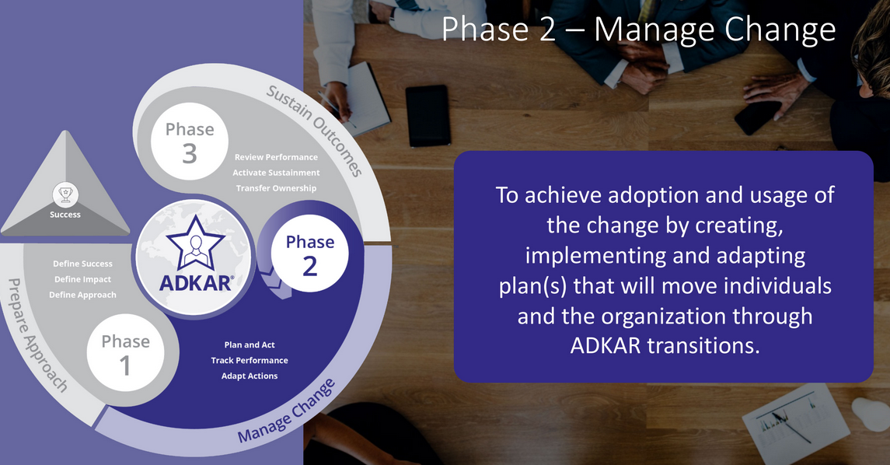
				- Purpose
				  collapsed:: true
					- Phase 2 – Manage Change is the second phase of the Prosci 3-Phase Process extending along most of the lifecycle of the project. The purpose of Phase 2 – Manage Change is to achieve adoption and usage of the change by creating, implementing and adapting plan(s) that will move individuals and the organization through ADKAR transitions. This phase has three stages:
						- Plan and Act: This stage answers the question, “What will we do to prepare, equip and support people?”
						- Track Performance: This stage answers the question, “How are we doing?”
						- Adapt Actions: This stage answers the question, “What adjustments do we need to make?”
				- Deliverable
				  collapsed:: true
					- The deliverable for Phase 2 – Manage Change is a Master Change Management Plan. The Master Change Management Plan, with ADKAR Blueprint as a foundation, bundles the activity and role plans to achieve adoption and usage. It acts as a guiding document for the change management team and can be shared with the sponsors and project leaders to:
						- Communicate accountabilities and timelines
						- Communicate performance goals
						- Support integration of plans with the technical side
				- Roles and Responsibilities
				  collapsed:: true
					- 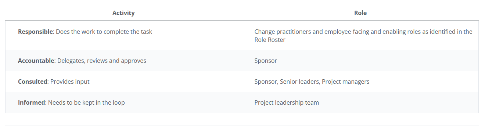
			- Phase 2 – Manage Change at a Glance
			  collapsed:: true
				- 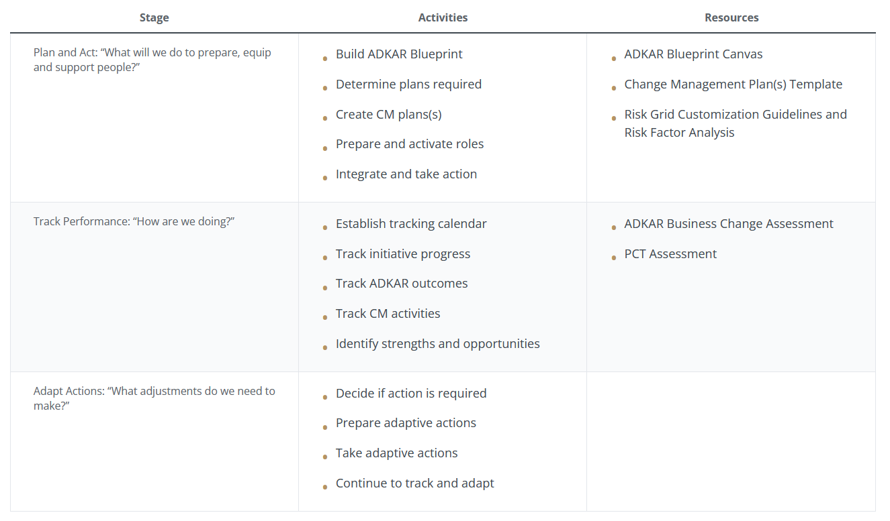
				- ### Plan and Act: What will we do to prepare, equip and support people?
				  collapsed:: true
					- 
					- Why
						- In Plan and Act specific tactics are identified and plans developed to move individuals impacted by a change and the organization through ADKAR transitions.
					- What
					  collapsed:: true
						- The Plan and Act activities are:
						- Build ADKAR Blueprint by defining ADKAR milestone target dates, anticipated gaps, activities, roles and timelines for achieving each ADKAR element.
						- Determine plans required by considering a number of criteria, including change practitioner competency and capacity, the amount of time available to develop and implement plans and the risk profile of the change.
						- Create CM plan(s) by using the activities defined in the ADKAR Blueprint to inform the development of two core role plans (Sponsor and People Manager) and two core activity plans (Communications and Training) using the common change management plan template.
						- Prepare and activate roles by completing an ADKAR Assessment for each individual on the Role Roster to identify their barrier point for fulfilling their role and then developing tactics to prepare, equip and support them to effectively carry out their role.
						- Integrate and take action by creating a Master Change Management Plan that documents the ADKAR Blueprint and specific plan(s) that are required. Effective integration requires an agreed entry or starting point for applying change management and a common understanding of the integration points.
					- Who
					  collapsed:: true
						- Plan and Act includes two specific “who” answers:
						- 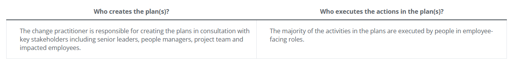
					- When
					  collapsed:: true
						- Plan and Act begins following completion of Phase 1 – Prepare Approach and approval of the Change Management Strategy by the primary sponsor of the change.
				- ### More Information on Change Management Plans
				  collapsed:: true
					- Change management comes to life through change management plans. The objective of the plans is to support impacted individuals and groups to move through their ADKAR® journeys effectively and enable them to adopt and use a change. Practitioners develop change management plans during Phase 2 of the Prosci 3-Phase Process.
					- 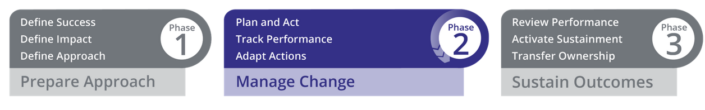
					- Master Change Management Plan
						- The Master Change Management Plan is the deliverable from Phase 2 – Manage Change. It describes the high-level blueprint and specific plan or plans to be developed for the change project, including the actions, roles and timelines to prepare, equip and support people to achieve their ADKAR transitions.
						- Before developing any specific change management plans, change practitioners create an ADKAR Blueprint to set the direction for a change initiative. The ADKAR Blueprint is a simple and scalable guide, oriented toward people, which enables the practitioner to identify at a high level the milestone dates, expected gaps and initial ideas for each ADKAR element. Under some circumstances, such as small, low-risk changes, the ADKAR Blueprint may be all that is needed. Or, if you’re a novice practitioner, the ADKAR Blueprint may be all you feel confident developing for your change. For more complex, higher-risk projects, however, the ADKAR Blueprint serves as a starting point to help you identify, scale and develop a set of robust change management plans to meet the needs of your specific project.
					- Core Plans
						- The core plans are the specific, high-value plans recommended for most change initiatives. Designed to be scalable and flexible to your situation, they can be role-based or activity based:
						  Role Plans
							- Sponsor Plan
							- People Manager Plan
						- Activity Plans
							- Communications Plan
							- Training Plan
						- While the ADKAR Blueprint addresses all elements of ADKAR, each core plan includes tactics to address certain ADKAR elements. Again, you may or may not need all four core plans. The number, type and depth of plans required depend on the project as well as the organization’s unique needs.
					- ---
					- Sponsor Plan
						- Effective sponsorship is consistently cited as the top contributor to project success in every Prosci Best Practices in Change Management benchmarking study. Unfortunately, even the best senior leaders sometimes do not demonstrate effective sponsorship. They may misunderstand the importance of their role, struggle with competing priorities, or simply not know what to do. To ensure successful sponsorship, the change practitioner must provide the needed support and structure, and enable sponsors to execute their employee-facing responsibilities.
						- The Sponsor Plan is a recommended core role plan to target the Awareness, Desire and Reinforcement elements of the ADKAR Model. This plan, implemented by the primary sponsor and other members of the sponsor coalition, enables them to effectively carry out their roles—to be active and visible, build a coalition of support, and communicate directly with employees.
					- ---
						- People Manager Plan
							- As “people managers,” middle managers and supervisors directly impact front-line employees because these employees will typically emulate their manager’s attitudes about the change, whether those attitudes are supportive or not.
							- A recommended core role plan, the People Manager Plan targets all elements of the ADKAR Model. This plan, carried out by people managers, enables them to effectively perform their CLARC roles:
								- Communicator – Build Awareness by addressing “Why?” “Why now?” and “What’s in it for me?”
								- Liaison – Solicit and relay feedback between employees and change teams about implementation progress
								- Advocate – Promote support for change with words and deeds
								- Resistance Manager – Identify root causes and address individual resistance to change
								- Coach – Help teams gain Knowledge and Ability through one-on-one and one-to-many opportunities
							- The People Manager Plan outlines the steps for involving managers in these change management activities. The plan starts by laying out how the project team and change management resources will build commitment, and train and prepare managers and supervisors for their role in a change. Once on board, managers and supervisors work with front-line employees to understand their needs and help them adopt and use changes.
					- ---
					- Communications Plan
						- People often mistakenly equate change management with communication. While many organizations have communications departments and many project teams create communications plans, they often fail to recognize how communication fits into the broader change process. Communication is a critical component of implementing change but is by no means the only requirement for success.
						- A recommended core activity plan, the Communications Plan targets the Awareness and Reinforcement elements of the ADKAR Model. The Communications Plan identifies audiences, develops key messages, and determines the frequency of communications, delivery mechanisms, and senders.
						- Note that effective communication does not mean an attractive newsletter, the use of a standard template, or even a high frequency of messages. Effective communication is targeted for each of the different audiences impacted by the change and focuses on what they care about and what they need to know. A structured communication plan presents the right messages at the right time, in the right format or via the right channel, and from the right sender.
					- ---
					- Training Plan
					  collapsed:: true
						- Absent a holistic approach to change management, organizations sometimes use training alone to manage changes without critical activities like sponsorship and coaching. This is one of the biggest errors a team can make when introducing a change and a prime example of poor change management.
						- A recommended core activity plan and one of the most used change management plans, the Training Plan targets the Knowledge and Ability elements of the ADKAR Model. The plan is created by identifying the different audiences that need training, conducting a needs assessment and gap analysis, and documenting requirements for the training organization.
						- In addition to project-specific training, it is important to include training about change management in this plan. Sponsors and people managers need training to understand their important roles and responsibilities in managing change.
						- When change management is applied effectively, a partnership forms between the change management team (which documents knowledge needs) and the training group (which develops and delivers the needed training).
						- How Each Plan Primarily Influences the ADKAR Model
							- 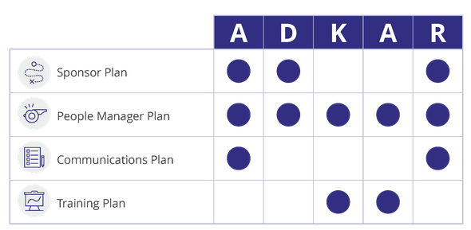
							- The Sponsor Plan has the highest impact on Awareness, Desire and Reinforcement while the People Manager Plan influences all five ADKAR elements. The Communications Plan primarily impacts Awareness and Reinforcement. The Training Plan serves primarily to enable Knowledge and Ability.
					- ---
					- Extend Plans
					  collapsed:: true
						- “Extend” Plans are the potential additional plans you may decide to include in your Master Change Management Plan to address issues that are unique to your change.
						- Resistance Management Plan
							- Resistance to is a natural reaction to change and is consistently cited as a top obstacle to success in Prosci research. Sponsors and people managers can take meaningful steps early in a project to mitigate potential impacts through resistance prevention.
							- An extend activity plan that may be created during Phase 2 – Manage Change, the Resistance Management Plan targets the Desire element of the ADKAR Model by preventing, addressing and responding to resistance. The plan identifies potential sources and forms of resistance, steps to answer objections before they manifest, who will be involved in managing resistance, and how you will prepare them to effectively address the resistance.
						- A complete resistance management plan will also include steps for monitoring and responding to resistance, including identifying triggers and taking appropriate actions.
					- Additional Extend Plans
					  collapsed:: true
						- You may decide you need additional plans to meet the specific requirements of your change. Such plans can be completely unique to your change and organization, or they may resemble the typical extend plans below.
							- Change Agent Network Plan – This plan directs the activities of an engaged group of change advocates who represent the interests of their respective impacted groups. The specific role and contribution of change agents is defined by the organization and may be unique to the initiative.
							- Sponsor Coalition Plan – This plan is intended to ensure that all members of the coalition support the change and are aligned with respect to the desired outcomes. The change practitioner develops this plan for the primary sponsor, who executes the plan with members of the sponsor coalition.
							- Sustainment Plan – This plan helps ensure that individuals will continue to use adopted changes over time, sustaining the change so that the organization realizes intended benefits. The Sustainment Plan also identifies activities necessary to ensure the transfer of ownership of the change from the change management team to the appropriate business owners.
					- ---
					- Putting Together Your Change Management Plans
					  collapsed:: true
						- Every change initiative needs a combination of plans, and the right combination depends on your needs. The Prosci Methodology encourages change practitioners to take a flexible approach to developing change management plans based on numerous factors including the risk level of the change, culture of the organization, and the practitioner’s change management competency level. These factors influence which plans to choose—whether the ADKAR Blueprint alone or some other combination of core and extend plans—to support your work and success with change.
				- ### More Information on Risk Grid Customization Guidelines - Overview
				  collapsed:: true
					- The Risk Assessment is comprised of the Change Characteristics Assessment and the Organizational Attributes Assessment. The change characteristics assess the nature, scope, amount and impact of a change on a spectrum of small, incremental change to large, disruptive change. The organizational attributes assess the organization’s values, culture, capacity for change, leadership style, and history of past changes on a spectrum of change-ready to change-resistant. The results from the two assessments are used to define the risk profile for a change, which is determined by plotting the assessment scores on a risk grid. The risk profile defines the people risk of a change.
					- The Risk Grid Customization Guidelines are based on the risk profile for a change and are intended to help change practitioners make informed decisions that will mitigate people risk when selecting activities to include in ADKAR Blueprint and core and extend change management plans. The Guidelines are comprised of:
						- Risk Assessment Analysis – general guidance for customization, including implications for ADKAR, the Role Roster and change management plans based on the risk profile for a change. See the Risk Assessment Analysis - Risk Profiles section under Phase 1 – Prepare Approach, Define Approach for more details.
						- Risk Factor Analysis and Activities – specific guidance for customization, including potential activities to mitigate risk based on a detailed review of the change characteristics and organizational attributes risk factors that represent the greatest threat to the successful implementation of a change. See the sections Risk Factor Analysis for Change Characteristics and Risk Factor Analysis for Organizational Attributes below for more details.
					- Prosci has long taught that the risk profile informs the size and scale of the change approach. In reality, practitioner capacity and competency may be the limiting factors in the change approach. The Prosci Methodology encourages change practitioners to also reflect on the risk profile against their individual competency and capacity. This helps change practitioners to acknowledge their real-world conditions early in the change process and take appropriate actions to address any issues.
						- For example, if you are a novice practitioner working on a high risk change initiative, then consider asking for help, including:
						- Find a more experienced practitioner in your own organization to mentor or coach you.
						- Engage an external advisor or coach to work alongside you.
						- You can also influence the expectations of your primary sponsor.
					- And remember, you are still making a contribution. Some change management is better than no change management.
					-
				- ### Risk Factor Analysis for Change Characteristics
				  collapsed:: true
					- Change Characteristics
					  collapsed:: true
						- Review the results of the Risk Assessment you completed for your project, focusing first on the change characteristics. Complete the following steps:
							- Highlight any risk factors in the table below that scored a 5, which indicates high risk.
							- Reduce the size of your list by choosing the high risk factors that currently pose the greatest risk to the successful implementation of your project.
							- For each of the remaining high risk factors, assess your ability (rated as high, medium or low) to directly or indirectly influence the specific risk.
							- Rank order the list, based on your ability to influence each risk. Focus on the top 3 to 5 high risk factors.
					- For each of your top 3 to 5 high risk factors, review the associated information in the table to understand the implications and potential activities to mitigate the risk. Under the Related Research column, the chapter references refer to the most recent Best Practices in Change Management report which you can access in Research Hub. Finally, choose what you believe will be the most effective activities to include in your change management plans.
					- ---
					- Risk Factor 1 - Scope of Change
					  collapsed:: true
						- Assessment Score and Result: 5 = Enterprise
						- 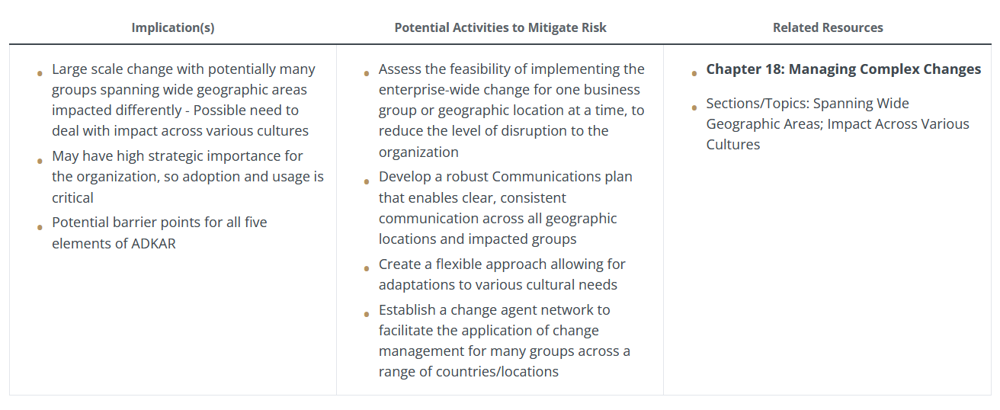{:height 390, :width 929}
					- Risk Factor 2 - Number of People Impacted
						- Assessment Score and Result: 5 = Over 1,000
						- 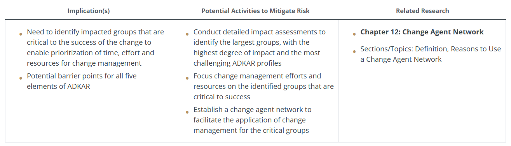
					- Risk Factor 3 - Entry Point for Change Management
						- Assessment Score and Result: 5 = Late, at implementation
						- 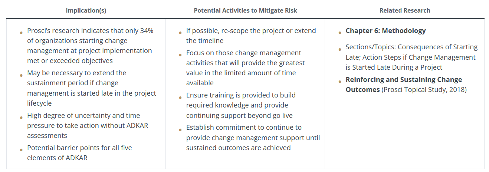
					- ---
					- Risk Factor 4 - Variation in Groups that are Impacted\
					  collapsed:: true
						- Assessment Score and Result: 5 = All groups experience the change differently
						- 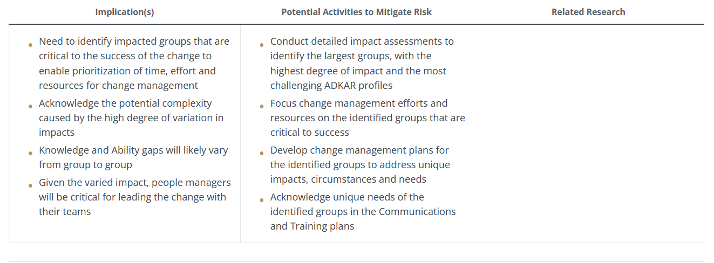
					- Risk Factor 5 - Clarity of Future State
					  collapsed:: true
						- Assessment Score and Result: 5 = Unknown and emergent
						- 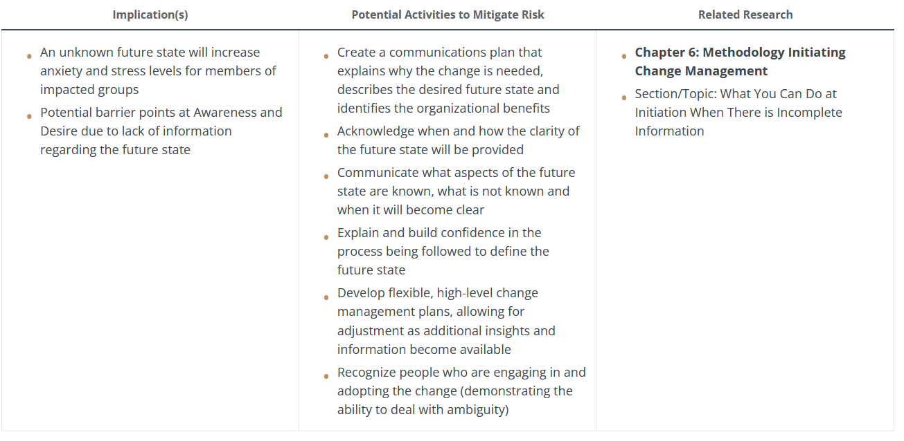
					- Risk Factor 6 - Type of Change
					  collapsed:: true
						- Assessment Score and Result: 5 = Many aspects, complex change
						- 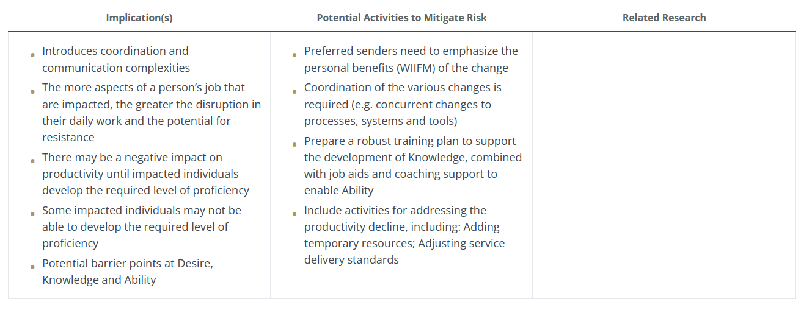
					- Risk Factor 7 - Degree of Impact on Individual
					  collapsed:: true
						- Assessment Score and Result: 5 = 100% impact
						- 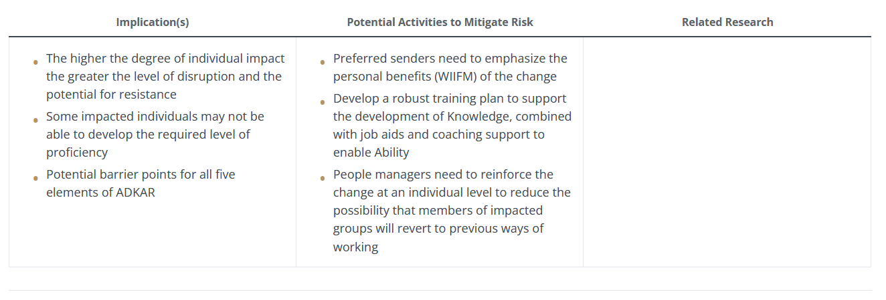
					- Risk Factor 8 - Amount of Change Overall
					  collapsed:: true
						- Assessment Score and Result: 5 = Radical
						- 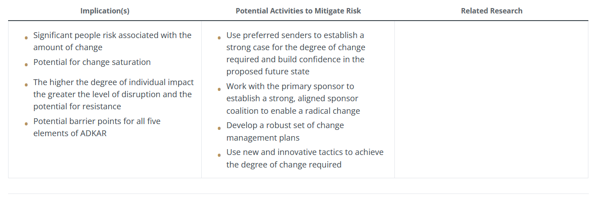
					- Risk Factor 9 - Impact on Compensation
					  collapsed:: true
						- Assessment Score and Result: 5 = Large impact to pay and benefits
						- 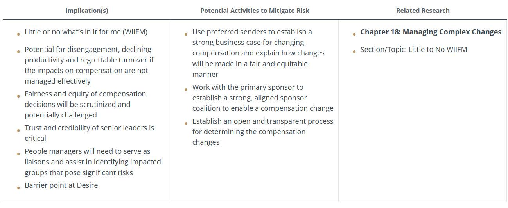
					- Risk Factor 10 - Degree of Organizational Restructuring
					  collapsed:: true
						- Assessment Score and Result: 5 = Complete restructuring
						- 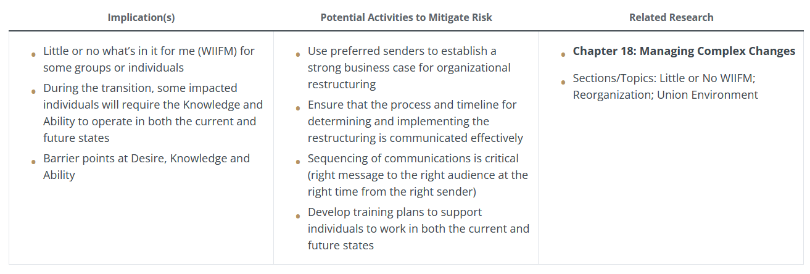
					- Risk Factor 11 - Reduction in Staffing Levels
					  collapsed:: true
						- Assessment Score and Result: 5 = Significant reduction
						- 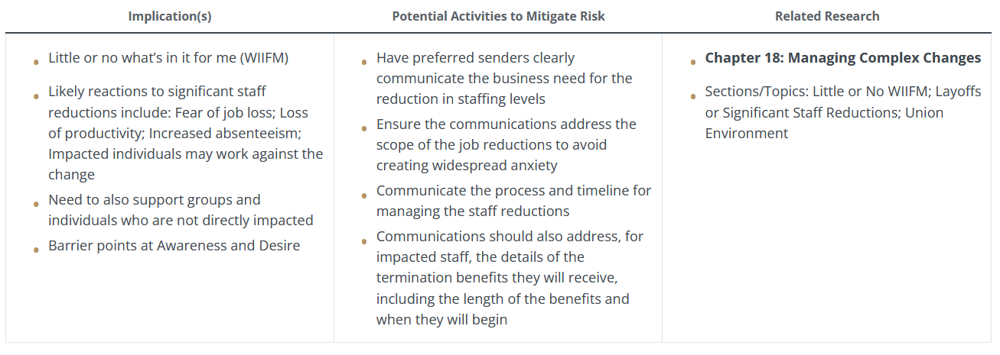
					- Risk Factor 12 - Degree of Confidentiality Required
					  collapsed:: true
						- Assessment Score and Result: 5 = Closed and confidential
						- 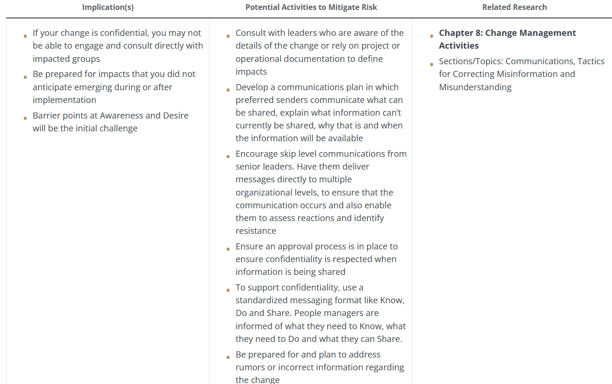
					- Risk Factor 13 - Timeframe for Change
					  collapsed:: true
						- Assessment Score and Result: 5 = Insufficient time to prepare, equip and support people
							- Implication(s)
								- Impacted individuals will likely not be at Ability when the change goes live
								- Need to manage expectations of what can be accomplished in the time available
								- Barrier points at Knowledge and Ability
							- Potential Activities to Mitigate Risk
								- Support preferred senders to create a sense of urgency regarding the limited timeframe for change
								- Encourage skip level communications from senior leaders. Have them deliver messages directly to multiple organizational levels, to ensure that the communication occurs and also enable them to assess reactions and identify resistance.
								- Identify the essential elements of the change that need to be implemented within the existing timeframe
								- Leverage your primary sponsor, members of the sponsor coalition and people mangers to take a high degree of ownership of the change management activities given the limited time frame
								- If possible, extend the timeline for the change or revise the expectations for what is possible, with respect to adoption and usage of the change, within the existing timeline
								- Focus on the change management activities that will provide the greatest value in the limited amount of time available
								- Ensure training is provided to build required knowledge and provide continuing support beyond go live
								- Confirm commitment to continue to provide change management support until sustained outcomes are achieved
							- Related Research
								- Chapter 6: Methodology
								- Section/Topic: Initiating Change Management
						- Risk Factor 14 - Degree of External Stakeholder Impact
						  collapsed:: true
							- Assessment Score and Result: 5 = Significant external impact
							- 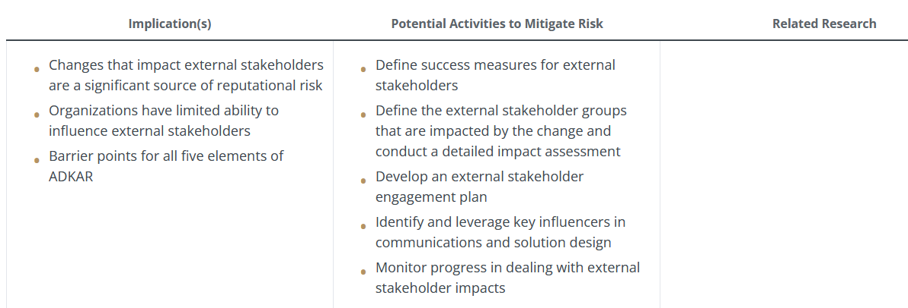
				- ### Risk Factor Analysis for Organizational Attributes
				  collapsed:: true
					- Organizational Attributes
						- Next, focus on the organizational attributes. Complete the following steps:
							- Highlight any risk factors in the table below that scored a 5, which indicates high risk.
							- Reduce the size of your list by choosing the high risk factors that currently pose the greatest risk to the successful implementation of your project.
							- For each of the remaining high risk factors, assess your ability (rated as high, medium or low) to directly or indirectly influence the specific risk.
							- Rank order the list, based on your ability to influence each risk. Focus on the top 3 to 5 high risk factors.
						- For each of your top 3 to 5 high risk factors, review the associated information in the table to understand the implications and potential activities to mitigate the risk. Under the Related Research column, the chapter references refer to the most recent Best Practices in Change Management report which you can access in Research Hub. Finally, choose what you believe will be the most effective activities to include in your change management plans
					- Risk Factor 1 - Perceived Need for Change Among Impacted People
						- Assessment Score and Result: 5 = People are satisfied with current state
						- 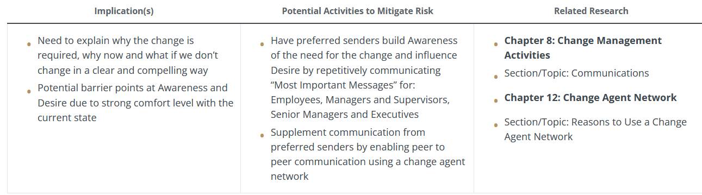
					- Risk Factor 2 - Management of Past Changes
						- Assessment Score and Result: 5 = Poorly managed, failed changes
						- 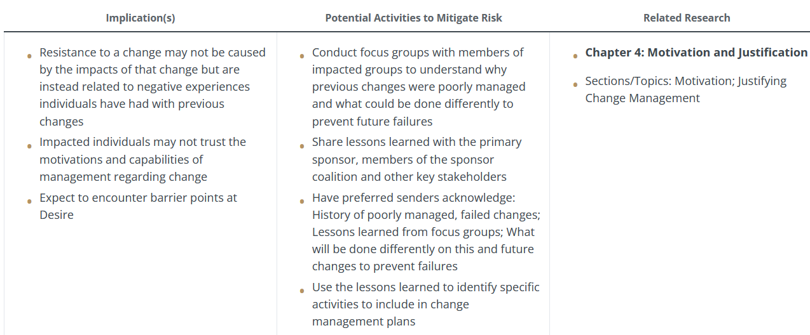
					- Risk Factor 3 - Change Saturation
						- Assessment Score and Result: 5 = Everything is changing, over capacity
						- 
					- Risk Factor 4 - Shared Vision and Strategic Direction for the Organization
						- Assessment Score and Result: 5 = Many different directions and shifting priorities
						- 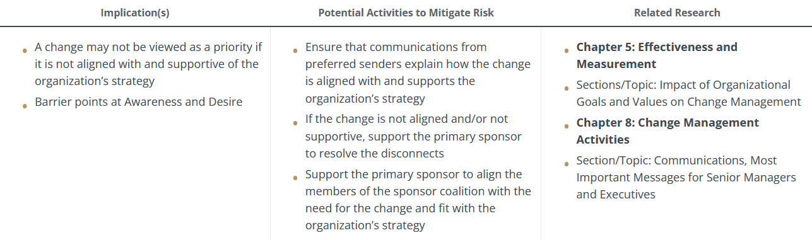
					- Risk Factor 5 - Resources and Funding Availability to Implement Change
						- Assessment Score and Result: 5 = Inadequate resources and funds
						- 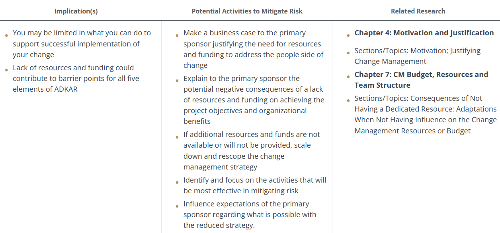
					- Risk Factor 6 - Organization's Culture and Responsiveness to Change
						- Assessment Score and Result: 5 = Closed and resistant to change
						- 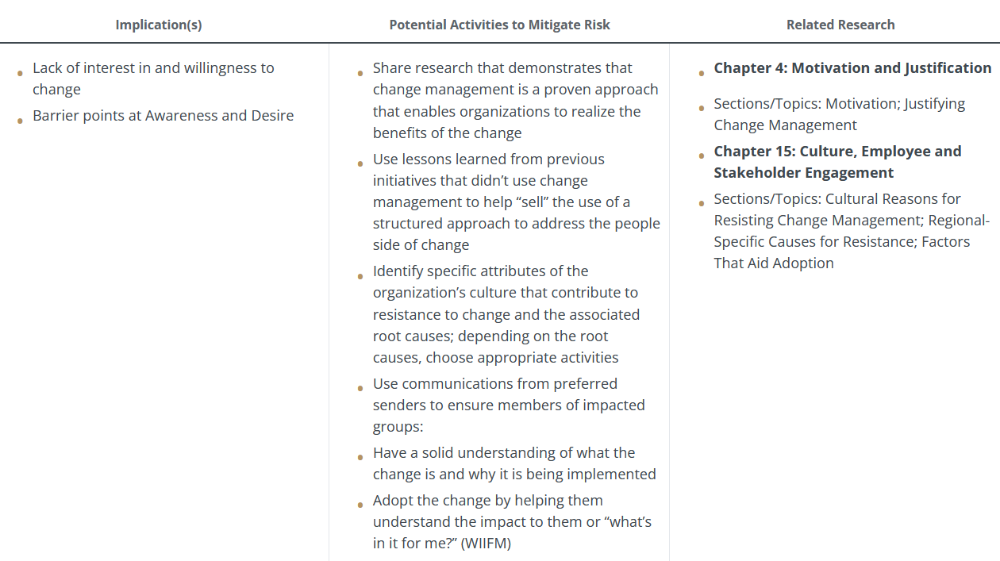
					- Risk Factor 7 - Organizational Reinforcement of Change
						- Assessment Score and Result: 5 = People are rewarded for consistency and predictability
						- 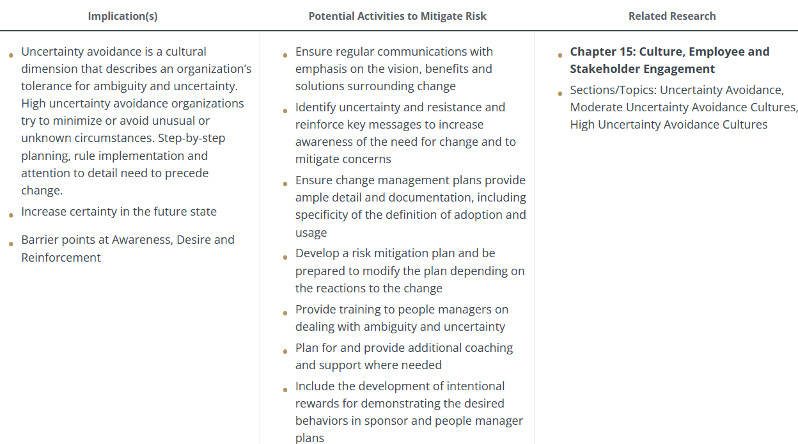
					- Risk Factor 8 - Leadership Mindset
						- Assessment Score and Result: 5 = Success declared at go live
						- 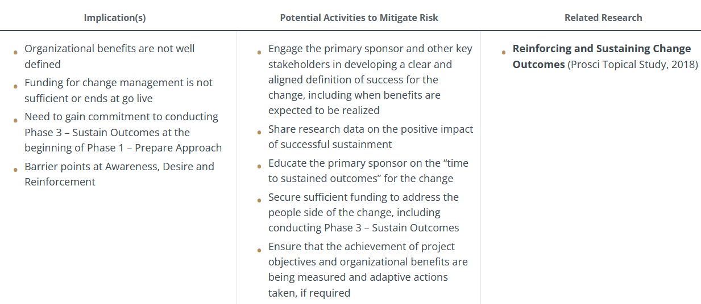
					- Risk Factor 9 - Leadership Style and Power Distribution
						- Assessment Score and Result: 5 = Distributed
						- 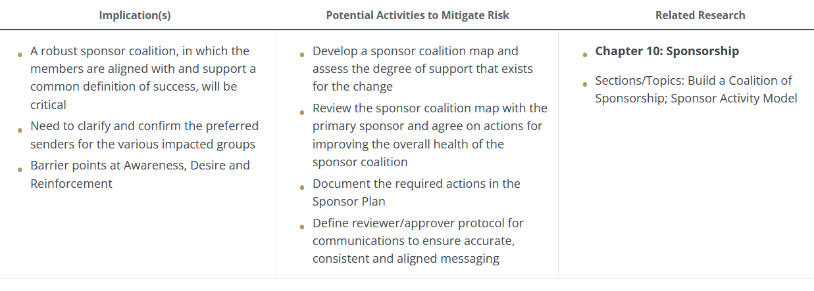
					- Risk Factor 10 - Executive/Senior Manager Change Competency
						- Assessment Score and Result: 5 = Lack skills and knowledge
						- 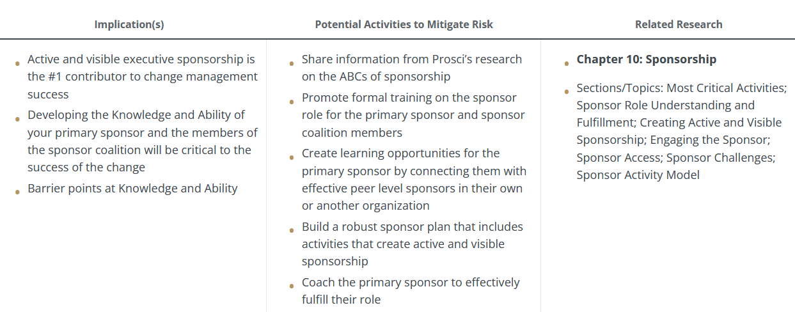
					- Risk Factor 11 - People Manager Change Competency
						- Assessment Score and Result: 5 = Lack skills and knowledge
						- 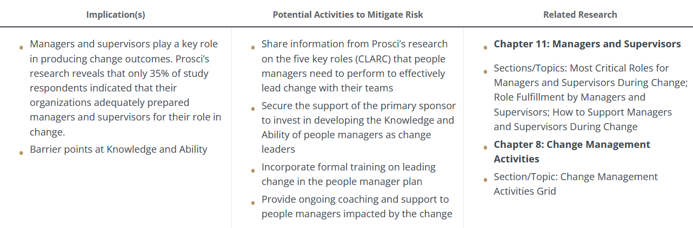
					- Risk Factor 12 - Impacted Employee Change Competency
						- Assessment Score and Result: 5 = Lack skills and knowledge
						- 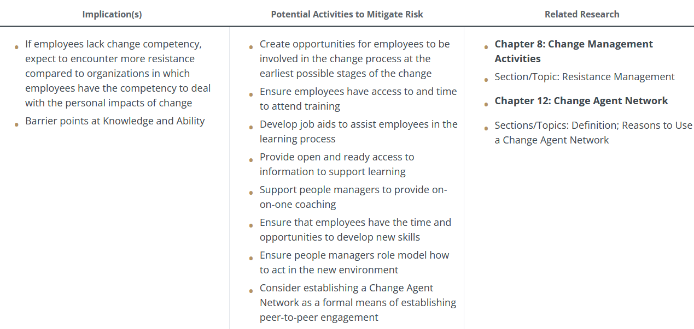
					- Risk Factor 13 - Change Management Maturity
						- Assessment Score and Result: 5 = Ad hoc or absent
						- 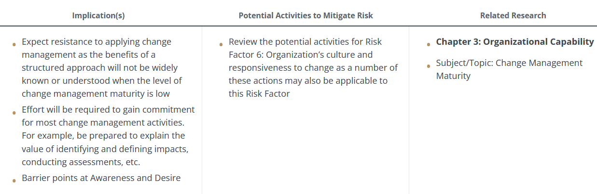
					- Risk Factor 14 - Project Management Maturity
						- Assessment Score and Result: 5 = Ad hoc or absent
						- 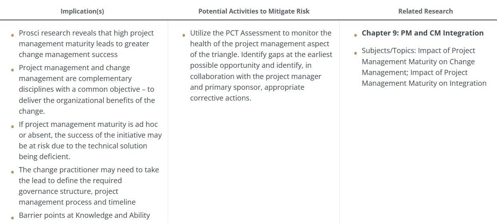
				- ### Tips and Problem Solving
				  collapsed:: true
					- If you are in a crisis situation and need to take action quickly, don’t be tempted to skip planning. At a minimum, engage key stakeholders in developing an ADKAR Blueprint to create clarity, alignment, and commitment to the activities required to achieve change success.
					- If you experience resistance from sponsors or people managers to fulfilling their roles in the change process, use the ADKAR assessment to identify their barrier point for role fulfillment. Use relevant research findings from the Best Practices in Change Management to identify and execute specific tactics to support them in addressing the barrier points.
					- If you aren’t sure if you need to create an ADKAR Blueprint or change management plans by group, consider the degree to which the change impacts vary across all the impacted groups. If there is a high degree of variation, you will likely need to use different tactics to support individuals through their ADKAR transitions. Developing an ADKAR Blueprint or change management plan(s) by group will help you address the unique impacts of each group.
					- If your primary sponsor and/or project manager resist the number, depth and type of plan(s) required for your change, don’t get into debates or conflicts. Create plan(s) that satisfy their expectations, while also developing more detailed plan(s) that you believe will be required. As the organization comes to the realization that more detailed plans are needed, you can bring them forward.
					- If you aren’t sure what activities or tactics you need to include in your change management plan(s), refer to the Best Practice in Change Management report to gain additional insights and ideas. See the Related Research section below for more guidance.
			- Track Performance
			  collapsed:: true
				- How are we doing?
				  collapsed:: true
					- 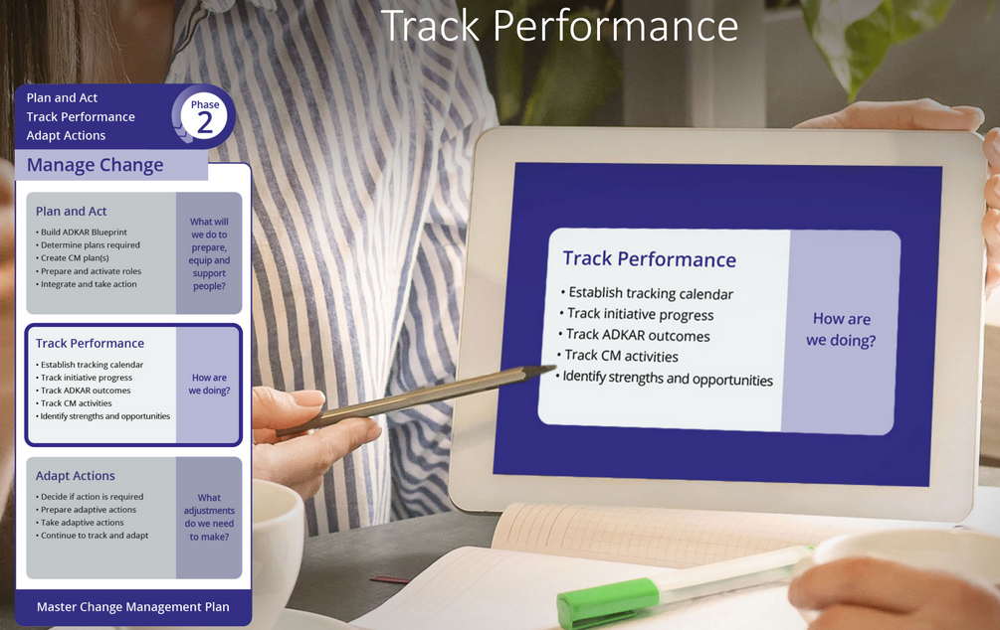{:height 626, :width 979}
					- > “However beautiful the strategy, you should occasionally look at the results.” Winston Churchill, Prime Minister of the United Kingdom, 1940 to 1945 and 1951 to 1955.
					- Why
					  collapsed:: true
						- By tracking performance, practitioners can closely monitor how people are moving through their ADKAR transitions and identify when it might be necessary to adapt actions. While the building blocks of ADKAR are sequential, people do not always progress through the transition in a linear manner. For example, Desire can be high, and then begin to decrease as impacted groups receive detailed information regarding how the change will affect them.
						- Tracking performance enables the change management process to be responsive to the needs of people. Research shows that measuring progress also contributes to sustaining outcomes. In Phase 2 – Manage Change, tracking performance to identify the need for adaptive actions makes the process adaptive by design.
					- What
					  collapsed:: true
						- The Track Performance activities are:
							- Establish tracking calendar by defining appropriate performance measures and mapping the associated tracking dates to the project timeline.
							- Track initiative progress by conducting PCT Assessments on the date(s) specified in the tracking calendar to evaluate project health and provide a leading indication of the potential for achieving project objectives and organizational benefits.
							- Track ADKAR outcomes by conducting ADKAR Assessments on the date(s) specified in the tracking calendar to evaluate ADKAR transitions and provide a leading indication of the potential for achieving adoption and usage.
							- Track CM activities by evaluating progress to plan in completing the activities in the ADKAR Blueprint(s) and Change Management Plan(s).
							- Identify strengths and opportunities by reviewing and analyzing the tracking results.
					- Who
						- The change practitioner is responsible for tracking performance. Typically, this requires collecting data from and reviewing results with key stakeholders.
						- 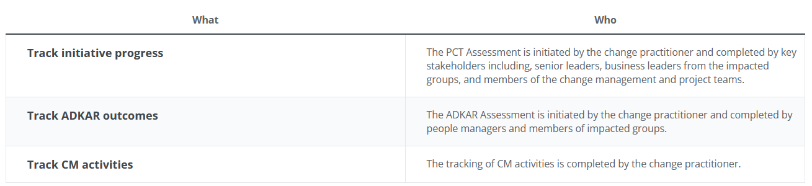
					- When
						- The timing and frequency of Track Performance is established by the tracking calendar. Periodic reviews of initiative progress, ADKAR outcomes and CM activities inform the next stage, Adapt Actions.
				- Tips and Problem Solving
					- If your organization has survey fatigue, then simplify the assessment by only asking questions focused on the specific element you are testing for. For example, if you are early in the project lifecycle and are testing for Awareness of the need for the change, you could assess only for that element, not the other four. You can also use creative alternatives to an online survey, including:
					  collapsed:: true
						- Interviews
						- Focus groups
						- Face-to-face engagements
						- Knowledge tests
						- Business results
						- Posters
						- Online polls
						- Skill demonstrations
						- Performance audits
						- System data extracts
					- If you don't have capacity to assess all the impacted groups, focus on assessing ADKAR levels for the groups that represent the highest risk to the success of the change. Typically, the characteristics of such groups include negative history with change, multiple job aspects impacted to a high degree, limited personal benefits, etc.
					- If the change is off track, use performance data to explain why the change is not progressing. Sponsors and project leaders are more likely to make decisions based on data than rely on anecdotal information.
				-
			- Adapt
			  collapsed:: true
				- Adapt Actions: What adjustments do we need to make?
				  collapsed:: true
					- 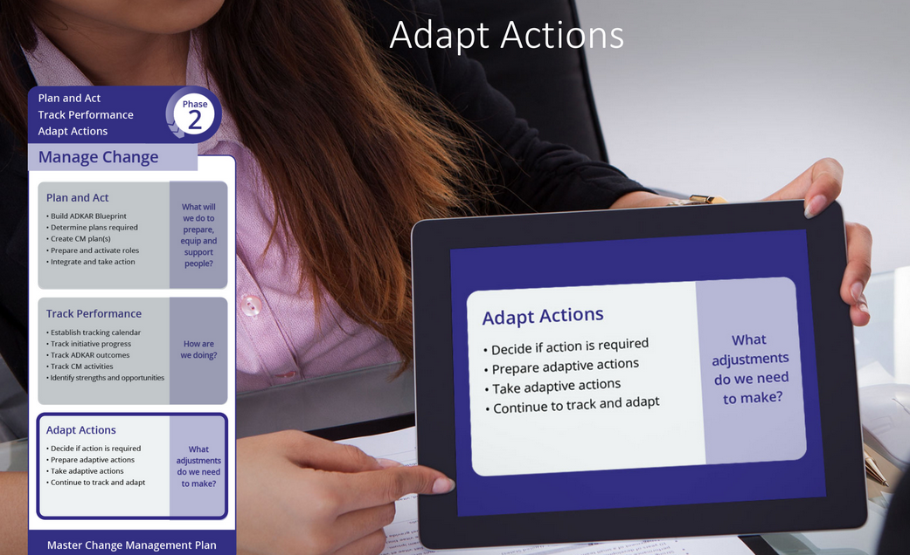
					- Why
						- Adapt Actions allows for course correction if Track Performance reveals that initiative progress and/or ADKAR outcomes are not being achieved as expected.
					- What
						- The Adapt Actions activities are:
							- Decide if action is required by engaging key stakeholders to review strengths and opportunities identified by tracking performance.
							- Prepare adaptive actions by determining tactics to maintain strengths and address and significant opportunities.
							- Take adaptive actions to close the gaps in performance.
							- Continue to track and adapt as necessary to achieve the desired levels of performance.
					- Who
						- The change practitioner takes the lead in determining and ensuring that the appropriate adaptive actions are taken. Sponsors and people managers in employee-facing roles are typically responsible for taking the required adaptive actions.
					- When
						- Adapt Actions occurs throughout Phase 2 – Manage Change. For some changes, adaptations may be required continuously, and for other changes, adaptations may be required at specific project milestones.
				- Tips and Problem Solving
					- If you don't know what adaptive actions to take, the framework of asking What, So What, Now What can be used to reflect on a situation, build understanding and decide what actions need to be taken. This framework was developed by Liberating Structures.
					- What?
						- Asking ‘what?’ helps you to be clear on the facts. Based on tracking performance, what do you observe? What are the facts?
						- If there is a declining trend in the PCT Assessment scores, which aspect (S, L/S, PM, CM) is affected and what specific factors are decreasing?
						- If the ADKAR Assessments reveal a lack of progress in ADKAR transitions, what are the barrier points and potential root causes?
						- What change management activities are behind schedule and what might be causing the delay(s)?
					- So what?
						- Asking 'so what?' helps you to understand the need for action, the potential options for action and the associated implications.
						- So what is the impact on people? What is the impact on change progress?
						- So what adaptive actions might be required? What options exist?
						- So what are the implications of those adaptive actions?
						- Refer to the Best Practices in Change Management to identify potential adaptive actions.
					- Now what?
						- Asking 'now what?' helps you decide and act. If the actions do not produce the desired result, repeat the process starting with 'what?' until the desired outcome is achieved.
		- Phase 3 - Sustain Change
		  collapsed:: true
			- Phase 3 – Sustain Outcomes Overview
				- 
				- Purpose
				  collapsed:: true
					- Phase 3 – Sustain Outcomes is the third phase of the Prosci 3-Phase Process. The purpose of Phase 3 – Sustain Outcomes is to realize the value of the change by ensuring the change is adopted and the organization is committed and prepared to sustain the change. This phase has three stages:
						- Review Performance: This stage answers the question, “Now, where are we? Are we done yet?”
						- Activate Sustainment: This stage answers the question, “What is needed to ensure the change sticks?”
						- Transfer Ownership: This stage answers the question, “Who will assume ownership and sustain outcomes?”
				- Deliverable
				  collapsed:: true
					- The deliverable for Phase 3 – Sustain Outcomes is a Change Management Closeout. The Change Management Closeout prepares the organization to own the change and sustain outcomes. It can be shared with the sponsors and project leaders to:
					- Document the performance status of the change
					- Confirm sustainment gaps, goals and priorities and outline what it will take to sustain outcomes
					- Identify and document knowledge and assets transfer
				- Roles and Responsibilities
				  collapsed:: true
					- 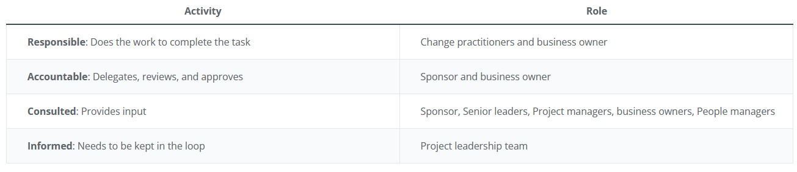
				- Phase 3 – Sustain Outcomes at a Glance
				  collapsed:: true
					- 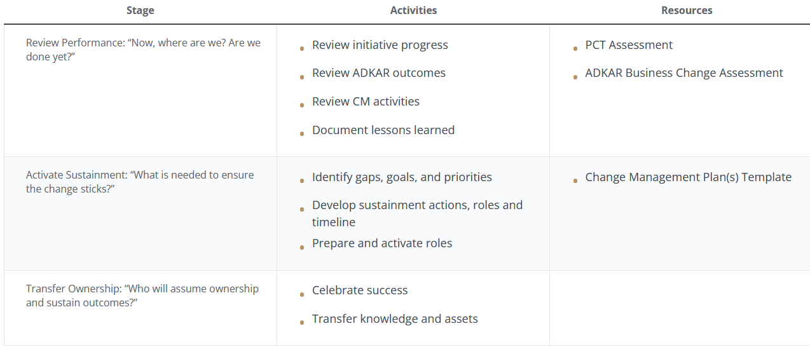
					-
			- Review Performance
			  collapsed:: true
				- Review Performance: Now, where are we? Are we done yet?
				  collapsed:: true
					- 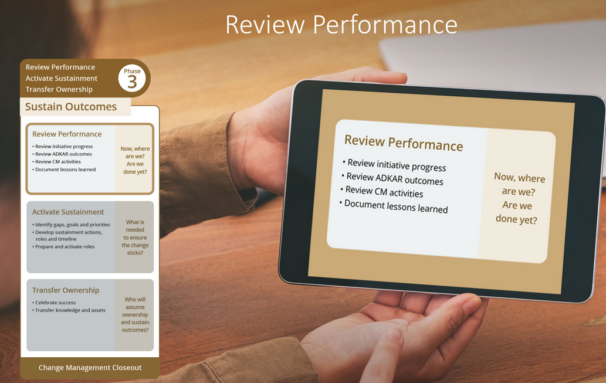
					- > “However beautiful the strategy, you should occasionally look at the results. *Winston Churchill , British Prime Minister from 1940-1945 and again between 1951 and 1955*
					- Why
						- Review Performance is similar to Track Performance in Phase 2 – Manage Change, and this stage enables practitioners to document and demonstrate change progress and identify remaining performance gaps that need to be addressed to sustain the change.
						- Conducting lessons learned enables practitioners to document internal best practices in change management which has the potential to improve organizational capability by learning from each application of change management.
					- What
						- The Review Performance activities are:
							- Review initiative progress by conducting a final PCT Assessment to assess project health and evaluate actual against expected achievement for the project objectives and organizational benefits. Identify any remaining performance gaps that need to be addressed.
							- Review ADKAR outcomes by conducting a final ADKAR Assessment and evaluate the actual against the expected achievement for adoption and usage. Identify any remaining performance gaps that need to be addressed.
							- Review CM activities by evaluating completion of the activities in the Master Change Management Plan. Identify any remaining performance gaps that need to be addressed.
							- Document lessons learned by identifying greatest successes and areas for potential improvement.
					- Who
						- The change practitioner is responsible for reviewing performance. Typically, this requires collecting data from and reviewing results with key stakeholders.
						- 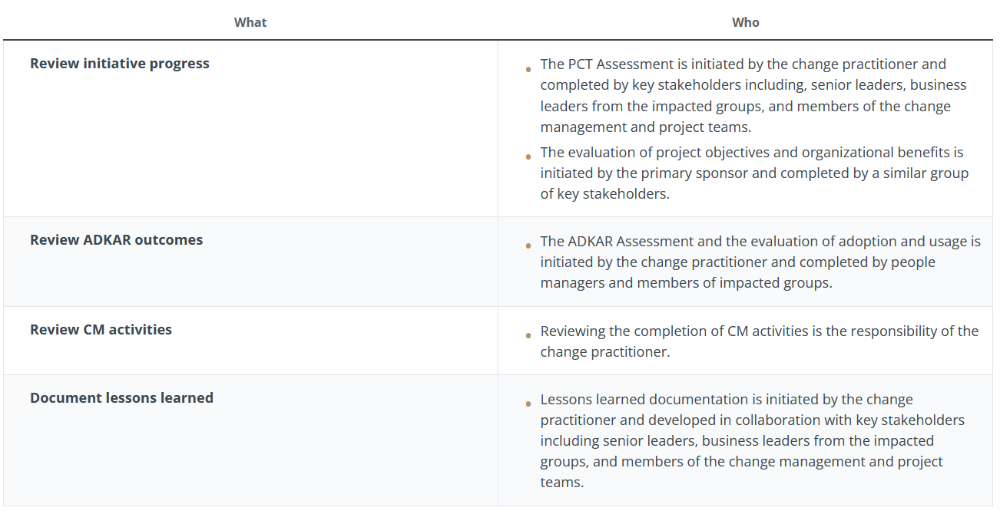
					- When
						- We define success from the start of the change initiative and establish a clear and shared definition of what “done” looks like. This definition of success enables early conversations to determine when the sustaining organization is ready to assume responsibility for the change from the project management and change management teams. Reviewing performance is done after go live, when there has been sufficient time for the change to reach steady state and project objectives and organizational benefits begin to be sustained. The time to sustained outcomes will vary depending on the nature and circumstances of your change.
				- Tips and Problem Solving
					- If performance metrics were not established at the start of the change initiative, then they will need to defined in order to review performance. While it is better to define success metrics upfront, there may be situations where this can not be done until the future state is more clearly understood and communicated. When the necessary clarity exists, engage key stakeholders including the primary sponsor, project manager and business leaders to define how to measure the performance of the change and determine if the desired results have been achieved.
					- If success was not defined at the start of the change initiative, then there will not be a clear and shared definition of what ‘done’ looks like or agreement on when to transfer ownership for the change to the sustaining organization. Initiate a conversation with the primary sponsor, project manager and business owner(s) and identify and document the conditions that need to be met for the organization to be ready to assume the change. Agree on a timeframe to review the conditions and set a target date for transfer of ownership.
					- If time to sustained outcomes is long, then identify incremental targets for project objectives and organizational benefits to be able to assess how the change is progressing over time. Establish an agreement with the primary sponsor and business owner(s) that defines the date to transfer ownership and who will monitor the ongoing achievement of project objectives and organizational benefits.
				-
			- Activate Sustainment
			  collapsed:: true
				- Activate Sustainment: What is needed to ensure the change sticks?
				  collapsed:: true
					- 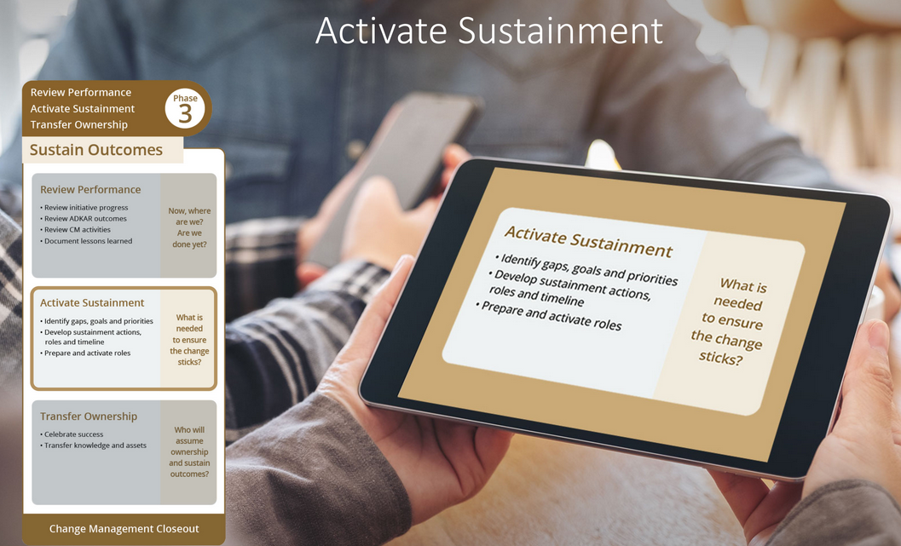
					- > "We are intentional with our choice of words; we don’t start planning sustainment, we activate it. The seeds for success are sown early in the change process. Change practitioners need to begin with the end in mind. When we define success at start of the change management process, we have a clear and shared definition of ‘done’." Tim Creasey, Chief Innovative Officer Prosci
					- Why
						- Activate Sustainment prepares the organization to own the change and sustain outcomes based on the specific gaps, goals and priorities identified in Review Performance. Activating sustainment increases the likelihood that organizational benefits will be realized.
					- What
						- The Activate Sustainment activities are:
						- Identify gaps, goals and priorities for closing the performance gaps identified in Review Performance.
						- Develop sustainment actions, roles and timelines to address the performance gaps by using the common change management plan template to develop a Sustainment Plan.
						- Prepare and activate roles by developing tactics to prepare, equip and support each individual identified in the Sustainment Plan to effectively carry out their role.
					- Who
						- The change practitioner is responsible for engaging the primary sponsor and business owner(s) to define the specific sustainment activities and accountability after project closeout to ensure organizational benefits are realized. The change practitioner guides and develops the sustainment plans and business owner(s) in the sustaining organization implement them. The role of the change practitioner shifts from supporting impacted individuals to supporting the people who will take ownership of sustainment.
					- When
						- Activate Sustainment begins after performance is reviewed and gaps are identified. Effective sustainment requires a clear and shared understanding of what has been accomplished and what the sustaining organization still needs to do to ensure organizational benefits are realized.
				- Tips and Problem Solving
				  collapsed:: true
					- If the leaders of the organization define success as implementing a change on time (i.e. declares success as meeting the go live date), then they may have a very limited awareness of the importance of sustaining change so that organizational benefits are realized. Use Prosci’s topical study Reinforcing and Sustaining Change Outcomes to begin to build the case for why sustainment matters.
					- In complex changes that impact productivity for long periods of time, a change may appear successful shortly after go live but begin to fail months after implementation when fatigue sets in. Be cautious about declaring success too soon after go live. Sustainment needs to support people in the change until a steady state is achieved.
					- If you aren’t sure when sustainment activities are no longer needed, refer to the topical study referenced above to understand how respondents determined when sustainment activities were no longer needed.
					- If you need to depart your initiative quickly, don’t leave without communicating critical sustainment actions to ensure organizational benefits are realized. At a minimum, develop a one-page plan that defines the highest value sustainment actions, required roles and timeline to sustain outcomes and share it with your primary sponsor and business owner(s).
			- Transfer of Ownership
			  collapsed:: true
				- Transfer Ownership: Who will assume ownership and sustain outcomes?
				  collapsed:: true
					- 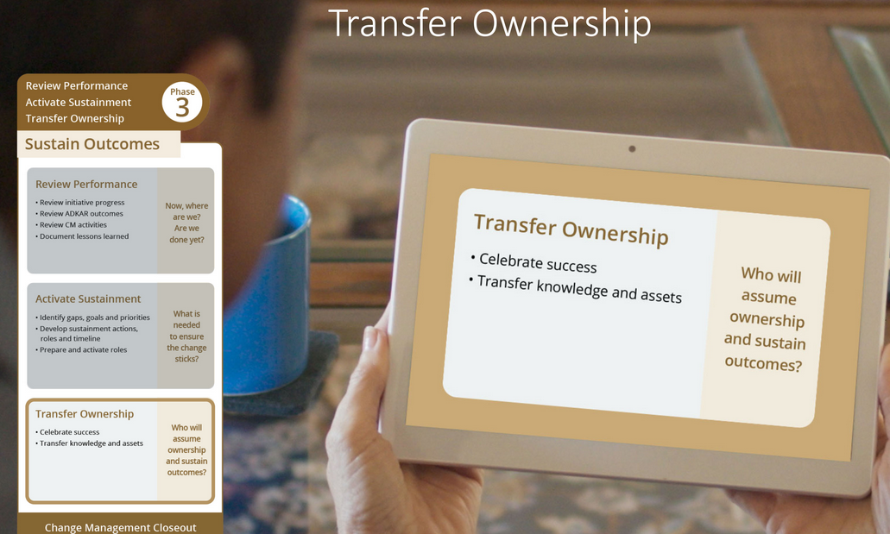
					- Why
						- Transfer Ownership defines a clear endpoint to the change management process. The Change Management Closeout deliverable ensures accountabilities are clearly defined and that the sustaining organization is set up for success.
					- What
						- The Transfer Ownership activities are:
							- Celebrate success by acknowledging, rewarding and reinforcing the change management behaviors and mindsets of key stakeholders that contributed to success.
							- Transfer knowledge and assets to sustaining business owner(s) by identifying the knowledge requirements, assets, activities and associated dates.
					- Who
						- The change practitioner develops a final deliverable, the Change Management Closeout, to document the performance status, sustainment plan, and knowledge transfer and assets for the business owner(s) who will assume ownership and sustain outcomes.
					- When
						- Transfer Ownership is the final stage to closeout change management activities and occurs when the primary sponsor, change practitioner and business owner(s) agree that the sustaining organization is ready to assume ownership.
					-
				- Tips and Problem Solving
					- If you need to depart your initiative before a business owner is identified, prepare the Change Management Closeout deliverable and provide it to your primary sponsor.
					- When celebrating success, be sure to explain how change management contributed to benefits realization to promote increased adoption of change management. Use lessons learned to build organizational change capability.
				-
		- Glossary
			- Prosci ADKAR Model
			  collapsed:: true
				- ADKAR Model
					- Describes the five ‘building blocks’ or elements an individual needs to achieve for a change to be successful. The building blocks are: Awareness of the need for change, Desire to support and participate in the change, Knowledge on how to change, Ability to implement required skills and behaviors, and Reinforcement to sustain the change.
				- ADKAR Assessment
					- A tool you can use to get a snapshot of ADKAR scores for individuals or groups to guide your change management planning efforts.
				- ADKAR barrier point
					- The first ADKAR element that scores a ‘3’ (neutral) or below in an ADKAR Assessment. The barrier point must be addressed before an individual can proceed through to the next ADKAR element.
				- ADKAR Blueprint
					- A simple and scalable guide, oriented toward people, that enables the practitioner to identify, at a high level, the milestone dates, expected gaps, and initial ideas for each of the ADKAR elements.
				- Gauge Gap
					- An evaluation of the expected effort required to achieve each of the ADKAR element milestones.
			- Prosci Change Triangle Model (PCT Model)
			  collapsed:: true
				- PCT Model
				  collapsed:: true
					- A framework that shows the four critical aspects of any successful change effort and how they are interrelated: a shared definition of success with leadership/sponsorship, project management and change management.
				- PCT Assessment
					- Used to assess project health across the four aspects of the PCT Model: success, leadership/sponsorship, project management and change management.
				- success
					- The aim or purpose of the change initiative, and ultimately meeting or exceeding project objectives and realizing organizational benefits. Success is defined by the organization and is specific to the initiative. A healthy initiative has clarity and alignment on what the change is aiming to deliver so they can more effectively manage to outcomes.
				- leadership/sponsorship
					- Provides the direction and guidance for a project or initiative. Leadership/sponsorship is accountable for defining why a change is happening, how it aligns with the direction of the organization, and why it is a priority.
				- project management
					- Project management is the discipline that addresses the technical side of a change, by designing, developing and delivering the solution.
				- change management
					- Change management is the discipline that addresses the people side of the change, enabling people to engage, adopt and use the solution to achieve a successful change outcome.
				- leadership decisions
					- Describes the relationship between leadership/sponsorship and project management in the PCT Model, including the decisions sponsors make related to project, scope, schedule and resources.
				- leadership actions
					- Describes the relationship between leadership/sponsorship and change management in the PCT Model, including the three critical roles sponsors need to perform for project success, also referred to as the ABCs: Actively and visibly participate throughout the project, Build a coalition of support, and Communicate directly with employees.
				- integrated approach
					- Describes the relationship between project management and change management in the PCT Model, including three key dimensions of integration: people, process and tools.
			- Change Management Plans
			  collapsed:: true
				- Change Management Plan
					- A sequence of activities, oriented toward task, required to help move individuals through the ADKAR Model to achieve change success. Change Management Plans are created by the practitioner in Phase 2 – Manage Change and may include, but are not limited to, Communications Plan, Training Plan, Sponsor Plan, and People Manager Plan.
				- Communications Plan
					- A recommended core activity plan created during Phase 2 – Manage Change, to target the Awareness and Reinforcement elements of the ADKAR Model. The Communications Plan identifies audiences, develops key messages, and determines the frequency of communications, the delivery mechanisms, and the senders.
				- Sponsor Plan
					- A recommended core role plan created during Phase 2 – Manage Change, to target the Awareness, Desire and Reinforcement elements of the ADKAR Model. This plan, implemented by the primary sponsor and other members of the sponsor coalition, enables them to effectively carry out their roles and be active and visible, build a coalition of support, and communicate directly with employees.
				- Training Plan
					- A recommended core activity plan created during Phase 2 – Manage Change, to target the Knowledge and Ability elements of the ADKAR Model. A Training Plan is created by identifying the different audiences that need training, conducting a needs assessment and gap analysis, and documenting requirements for the training organization.
				- People Manager Plan
					- A recommended core role plan created during Phase 2 – Manage Change, to target all elements of the ADKAR Model. This plan, carried out by people managers, enables them to effectively carry out their CLARC roles: Communicator, Liaison, Advocate, Resistance, Manager, and Coach.
				- Resistance Management Plan
					- An extend activity plan that may be created during Phase 2 – Manage Change, to target the Desire element of the ADKAR Model by preventing, addressing and responding to resistance.
			- Change Practitioner Journey Model
			  collapsed:: true
				- Change Practitioner Journey Model
					- A visual model, from the point of view of the practitioner, that illustrates how to practically and actively engage in the change management discipline with Prosci.
				- models
					- The foundational knowledge and frameworks that underpin Prosci’s unique approach to the people side of change.
				- methodology
					- The Prosci Methodology is a structured, adaptable and repeatable approach to enable the people side of change to deliver results. Based on over two decades of research, the Prosci Methodology organizes what we know about people, change and results in a robust process that practitioners can apply to create change management strategies and plans that increase adoption and usage on their initiatives.
				- practice
					- A commitment to regular use or application of the methodology that will grow change management skills and competency over time.
				- path
					- A way forward for individual or organizational progression in change management capability.
			- Governance
			  collapsed:: true
				- Governance Model
					- A model that describes the reporting relationships among the sponsor, project team and change management team. The Governance Model also defines the way the project will be organized and managed to achieve change success.
				- change management team
					- The change management team is the group that develops and implements the change management plan. The change management team is often made up of members of the project team (or the entire team itself). Best practices research indicates that teams with dedicated change management resources are more likely to deliver good or excellent change management.
				- project management team
					- The project management team is the group that designs, develops and implements the change – whether it is process, technology, organizational, strategy, etc. The members of the change management team are often part of the project team.
				- Sponsor Coalition Map
					- A diagram to identify and analyze the degree of commitment and alignment amongst the sponsors that is needed to drive the Awareness, Desire and Reinforcement elements of the ADKAR Model. The diagram can be used to evaluate the level of support for the change, analyze the overall health of the coalition, and identify risks.
			- Human Factors of ROI
				- Human Factors of ROI
					- Describes the three factors that directly contribute to or constrain a project’s return on investment (ROI): speed of adoption, ultimate utilization and proficiency.
				- speed of adoption
					- A human factor that impacts return on investment. Speed of adoption defines how quickly employees are up and running on the new systems, processes or job roles.
				- ultimate utilization
					- A human factor that impacts return on investment. Ultimate utilization defines how many employees (of the total population) are adopting and using the new solution.
				- proficiency
					- A human factor that impacts return on investment. Proficiency defines how well individuals are performing compared to the level expected in the design of the change.
			- Prosci 3-Phase Process
				-