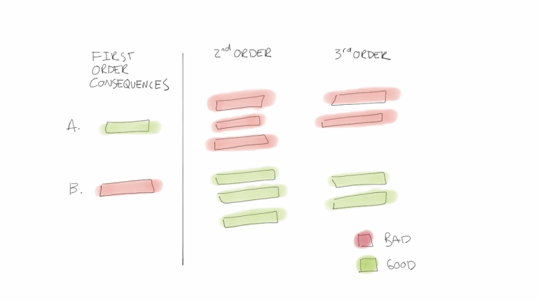

title:: Second-Order Thinking: What Smart People Use to Outperform - Farnam Street
link:: https://www.instapaper.com/read/1517904845
tags:: #first-order #[[Second-Order Thinking]]

- Literature Notes
	- First order-thinking is relatively fast and easy compared to solving the same problem with considerations for second-order thinking. Even though a problem may be complex and takes time to solve we may still be employing first-order thinking and as a result not achieve the optimal solution.
	- Second-order thinking forces us to consider not only the immediate problem at hand but also considers what the problem may look like in terms of the future and other dimensions such as scale, which results in uncovering multifaceted consequences.
	- A first-order solution may look good, but when seen through a lens of second-order thinking, may end up looking like the worst option. The reverse may also be true, where an option may result terribly using first-order thinking but actually be the best option when viewed through second-order thinking.
- Reference Notes
	- >     “Failing to consider second- and third-order consequences is the cause of a lot of painfully bad decisions, and it is especially deadly when the first inferior option confirms your own biases. Never seize on the first available option, no matter how good it seems, before you’ve asked questions and explored.”
	      —Ray Dalio
	- The ability to think through problems to the second, third, and nth order—or what we will call second-order thinking for short—is a powerful tool that supercharges your thinking.
	- 
	- First-order thinking is fast and easy. It happens when we look for something that only solves the immediate problem without considering the consequences. For example, you can think of this as I’m hungry so let’s eat a chocolate bar.
	- Second-order thinking is more deliberate. It is thinking in terms of interactions and time, understanding that despite our intentions our interventions often cause harm. Second order thinkers ask themselves the question “And then what?” This means thinking about the consequences of repeatedly eating a chocolate bar when you are hungry and using that to inform your decision. If you do this you’re more likely to eat something healthy.
	- First-level thinking looks similar. Everyone reaches the same conclusions. This is where things get interesting. The road to out-thinking people can’t come from first-order thinking. It must come from second-order thinking. Extraordinary performance comes from seeing things that other people can’t see.
	- Improving Your Ability To Think
		- Here are three ways you can use to put second order thinking into practice today.
			- Always ask yourself “And then what?”
			- Think through time — What do the consequences look like in 10 minutes? 10 months? 10 Years?
			- Create templates like the second image above with 1st, 2nd, and 3rd order consequences. Identify your decision and think through and write down the consequences. If you review these regularly you’ll be able to help calibrate your thinking. You can also use [[Decision Trees]]
			- If you’re using this to think about business decisions, ask yourself how important parts of the ecosystem are likely to respond. How will employees deal with this? What will my competitors likely do? What about my suppliers? What about the regulators? Often the answer will be little to no impact, but you want to understand the immediate and second-order consequences before you make the decision.
	-
-