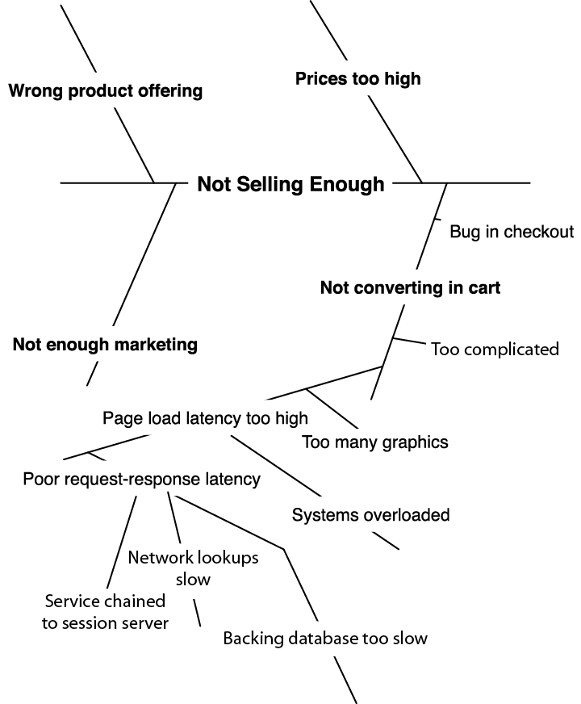
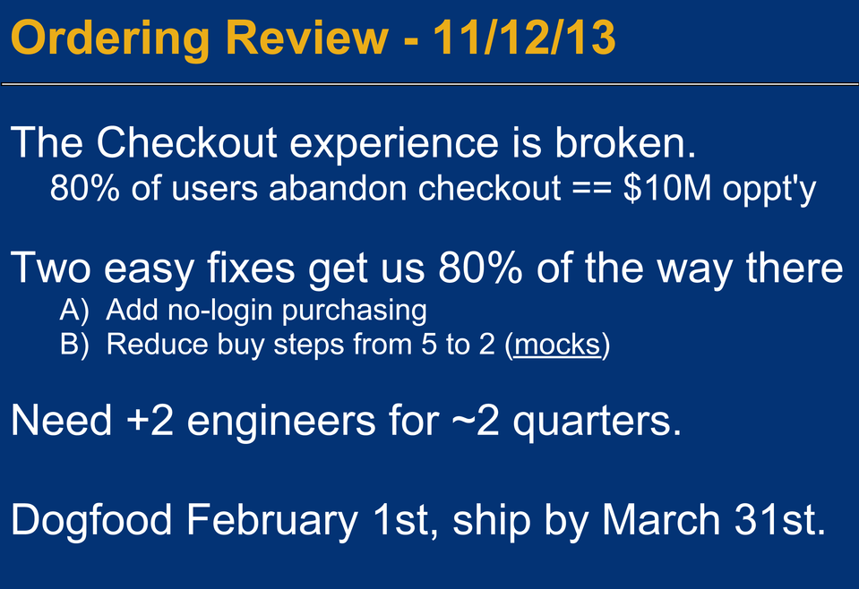

tags:: books, project management, product management

- #[[Literature Notes]]
- #[[Reference Notes]]
	- Chapter 1 [[customer service]]
	  collapsed:: true
		- The shipping process is about meeting the customer's need and therefore we need to understand the customer's problem that creates the customer's need.
		- Focus on the customer and not the competition
		- Start with the customer and work outward
		- Solve a real customer problem that many people share => find the critical problem [[80/20]]
	- Chapter 2 - How to Define a Great Product
	  collapsed:: true
		- Try to make your product understandable and specific
		- What are the distilled high level wants that is driving the customers
		- Uncover assumptions you made about the customer's problems and needs
		- Distill requirements and map to them to high level problems
		- 10 Steps to Articulating Your Product #[[PR FAQ]]
			- Write a good press release to communicate critical information that succinctly describes the product
				- A good press release contains:
					- What your product is named
					- When it will ship
					- Who's it for
					- What problem it solves (briefly!)
					- what makes this product so great
				- The PR does not go into great detail about the product nor does it include graphics or financials
				- When writing the PR, step into the customer's shoes.
			- Create a living FAQ document #[[PR FAQ]]
				- Immediately document questions you may encounter during development and answer them.
				- Collect questions you don't have answers to so you can answer them later.
			- Create Process Flow Diagrams
			- Write a One Pager or Build a 10 minute Pitch DEck
				- 5 Elements in a Pitch Deck
					- What's it called
					- Who's it for and how many users exist
					- What problem does it solve and how valuable is the solution to the users
					- How it solves the problem and what the problem looks like
						- Why your approach is durably different than the competition
					- When will it ship
				- When building the pitch deck start with the users then move outward
	- Chapter 10 - How to be a great communicator
	  collapsed:: true
		- How to run a good meeting #[[Q - How to run a meeting]]
		  collapsed:: true
			- Send headline notes immediately after the meeting ends to maximize the impact they have and so that the team will feel included.
				- *Don't worry excessively about the accuracy of your notes as people will correct you if you make any mistakes*
				- ^^Lead your notes with the conclusions and next steps^^
				- Include the details later in the notes so that readers who disagree with the conclusions can understand why the team reached them
			- Allow your meeting's objective to change
				- A meeting purpose can be
					- To solve a problem
					- To collect information
					- Disseminate information
				- A meeting may have to cycle through each phase, so be flexible.
			- Stamp out negativity in team meetings; embrace it in 1-1s
				- Negativity is poison to the team. When you encounter it point out the power or ability that person can enact to change the events they are complaining about
				- Offer to meet 1-1 to resolve the issues but not in a team environment
			- Use visual tools to help facilitate meetings
				- Use the fish bone diagram to help you think through a decision. After the initial skeletal structure is in place, employ the 5 whys to help you move the discovery along
				- 
				- Your role in these types of discussions is to facilitate at arriving at the solution, not solving the problem yourself.
		- How to give a create a presentation #[[q: how to present]]
			- Limit your presentation to 15 minutes
				- Your goal should be to limit a 10- to 15- minute presentation.
					- 00:00 - 00:05 (5 minutes)
						- Waiting. Every meeting seems to start five minutes late
					- 00:06 - 00:15 (10 minutes)
						- Deliver your presentation
					- 00:16 - 00:25 (10 minutes)
						- Discussion and questions about your presentation.
					- 00:25 - 00:30 (5 minutes)
						- Restate the conclusions and key feedback, and agree on next steps.
				- In totality we're aiming for the presentation to be around 10 minutes if possible
			- Always have one, and only one message
				- Deliver only one message if and if you have more than one, then consider scheduling a second meeting
					- Trying to deliver more than one message runs the risk of conflating the two messages
					- Two ideas or more will compete for primary importance in the discussion and therefore you are implicitly asking your audience to prioritize them instead of focusing on your content
				- Stay on topic and eliminate data or topics that don't speak to your message. Put supporting items like charts and customer quotes in the appendix.
			- Tell a story
				- If you're a bad storyteller analogies can also work.
				- Provide examples
			- Build the deck in one slide
				- {:height 521, :width 739}
				- The first slide of your presentation, after the title slide, must contain the essence of your presentation.
				- Use this slide when you have a skeptical management who are likely jump to conclusions
				- Distilling the message helps short-circuit any presumptions from forming
				- This approach goes counter to the tell the story approach
				- Four items required for the deck in one slide:
					- What you're there to discuss
					  collapsed:: true
						- Example: "The checkout experience is broken"
						- Avoid acronyms or new names
					- The opportunity
					  collapsed:: true
						- Why are you and the execs spending time discussing the topic?
							- Example: "80% of users abandon the purchase process, representing an opportunity cost of $10 M"
							- If you can try to distill the core data into one or two important data points and adding them to you "deck in one slide"  adds legitimacy to it and addresses doubt out of the gate
					- The proposed solution
					  collapsed:: true
						- State your solution crisply - "Add no-login purchasing. Reduce the buy steps from 5 to 2."
					- The cost and timeframe to implement
					  collapsed:: true
						- This can be the "Ask" such as need 2 engineers for 2 quarters, Dogfood February, ship in March.
				- For 10 - 15 minute talk about 5 slides in total
			- Lead with the user experience
			- Listen like crazy