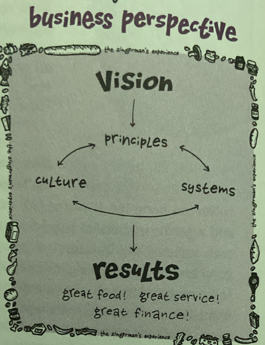

media:: books
tags:: [[customer service]]

- How can we apply to work
- #[[Literature Notes]]
- #[[Reference Notes]]
	- What is Zingerman's approach?
	  collapsed:: true
		- Teach it
			- Great Service Plans wouldn't happen without effective teaching. It remains an unapplied great idea.
		- Define it
			- We have to define what customer service means if we are to effectively teach it.
		- Apply and Live it
			- After teaching and defining what good customer service, apply and live giving great customer service in your business day to day.
			- Constantly review the process and look for where you can improve
		- Measure it
			- We have to measure the quality of our service to find the gaps and improve it. Measurement should be a common language of how to measure successes and deficiencies. Intertwine with business and product success through OKRs and KPIs
		- Reward It
			- It is important that those who provide great customer service are rewarded and recognized
	- Part 1 - Teach It
	  collapsed:: true
		- 
		- You have to know the organization in order to teach how you will deliver great customer service.
		- Guiding Principles
		  collapsed:: true
			- Mission Statements help the organization define
			  collapsed:: true
				- Who we are
				- What do we do
				- Why we do it
				- For whom you are doing it
				- Provides vision
					- Visions is what things will look like where you successfully arrive where you want go and things are working really well
					- Vision answers the questions like
						- What does success look like?
						- What would be happening at that time?
						- What would your organization be known for?
						- What does your community say about it?
						- Waht does the pres say about it?
						- What would service look like?
						- How would it be special?
				-
				- The mission should be both inspiring and strategically sound.
				  collapsed:: true
					- It must be written and communicated otherwise it is too nebulous, too easy to alter, and lax in commitment when the environment gets difficult.
					- We can communicate our mission by incorporating it as a measured outcome or involve as one of the company's bottom line.
					- The company derive the bottom line from delivering great customer service.
		- Systems Design
		  collapsed:: true
			- Our systems have to be designed to meet and then exceed customer's expectations.
			- Systems need to create a structure where attention to detail and accuracy are stressed over and over again.
		- Culture
		  collapsed:: true
			- Culture is the personality of the business and the reality of every day life at the organization.
			- It is normal that culture, systems, and principles may clash.
			- It is infinitely far easier to rewrite a system than it is to change the culture of an organization. Rules can be quickly modified through an e-mail but culture change requires a coherent vision, effective communication, relentless follow-up, and probably a little luck.
			- The culture is ultimately the ultimate indicator of quality of service in any organization.
		- Why give great service?
		  collapsed:: true
			- > "Make a ritual of pausing frequently to appreciate and be thankful... Notice that the more you become a connoisseur of gratitude, the less you are the victim of resentment, depression and despair. Gratitude will act as an elixir that will gradually dissolve the hard shell of your ego-your need to possess and control-transforming you into a generous being. The sense of gratitude produces true spiritual alchemy, makes us magnanimous-large souled." -Sam Keen, Hymns to an Unknown God
			- According to Janelle Barlow and Dianna Maul's *Emotional Value: Creating Strong Bonds with Your Customers (San Francisco: Berrett-Koehler, 2000):* Only 14% of customers who switch providers do it because they were unhappy with the quality of the product--most all make the move because they were dissatisfied with the service they'd received. Nearly three-quarters of all customer purchases are made by repeat purchasers.
				- The cost of gaining a new customer is nearly five times that of keeping an existing client. The best service providers keep their customers nearly 50% longer than their competitors.
			- When a staff understands the why of giving great service they are more alert and become part of the process instead of just getting lectured to. They become more invested in making it happen
			- **Great service makes us something special**
			- **Great service is sound marketing**
				- Customers find it memorable when they receive great customer service in a world where poor service is too common.
			- **Good customer service brings back customers**
				- Customers who receive high-quality product but poor service are unlikely to give a shop a second shot. By contrast, surprisingly high numbers of clients who've gotten great service but received substandard product will return to give the business another opportunity to take care of them.
			- **It yields better bottom line results**
				- Service effectiveness can directly increase sales through repeat customers, reduction of errors and waste, building customer loyalty and reduces amount of time fixing problems.
			- **It makes for a better place to work.**
			- **It helps you attract better people to work with you**
			- **It's easier**
			- **It's the right thing to do**
	- Part 2 - Defining It
		- > Our vision is that we consistently give great service to all our customers in every element of our work; that we give great service to each other as peers; and that we provide great service to our community
		- Ingredients to great service
			- Inspiring, strategic, and clearly documented vision for great service
			- Strong service-oriented leadership
			- Clear and well-communicated expectations
			- Good training to share those expectations and to let people practice
			- Giving staff the authorization to take action to make great service a reality
		- Procedure for giving great service
			- Figure out, document and define what the customer wants
			- Get it for them accurately, politely, and enthusiastically
			- Go the extra mile for the customer
			-
		-