title:: Books - Succeeding as a Management Consultant: Learn the skills used by the leading management consulting firms, such as McKinsey, BCG, et al.
tags:: [[Problem Solving Algorithm]], [[Project Management]], [[customer engagement]], Books
author:: [[Kris Safarova]]

- Takeaways
	- Identify quick wins in problem solving to build early credibility and good will.
	- In every business action we take, are we doing what is in the best interest of the client
	- When designing options for solutions consider reusability, scalability and maintenance for the future.
	- When presenting options, present more than one as it will be easier to judge the options against each other. One single option is difficult to gauge without context.
- How can I apply this for:
  id:: 1ed771a5-5d4c-4d8f-b18b-878c4fcf3293
	- project management
	- communication
		- [[Influence culture and process improvements on how we communicate.]]
	- knowledge management
	- value creation
		- for supervisors
		- for senior leadership
		- for colleagues
	- Other
- #[[Literature Notes]]
  collapsed:: true
  id:: 630adaa4-8319-4012-b424-225471d2e0ad
	- Possible Engagement Approach
	  collapsed:: true
		- Timeline and effort
			- Half the time will be focused on collecting all the input for analyses and building the high-level framework
			- A bottom up model will be created to simulate and test opportunities
		- Complete top-down analysis
		- Complete the stream charter
		- Complete the model architecture
		- Complete the model description
		- Complete the decision tree and data requirements
		- Complete the work plan
		- Complete the story board
	- Monitor that everyone part of the engagement have shared understanding of the work and vocabulary used.
- #[[Reference Notes]]
	- Introduction
		- Ethics as a Competitive Advantage
			- Exhibiting values and ethics in your professional career is a competitive advantage that is difficult to replicate.
				- Ethics is the ultimate competitive advantage since it requires one to adjust and apply it to all aspects of their life, thinking, and activities to achieve this advantage. Doing this is difficult which means many will not do it—making you unique.
				- It is worth understanding the importance of this concept and building your career life around this.
			- As we mature in our career our ethical position is increasingly determined by our actions and track record and less by accolades such as high test scores and credentials. If we lack character and integrity we will always need more hard skills and career enhancing data points to compensate for your lack of ethics/weak reputation.
			- If you are a person who is known to be trust worthy and credible people will hire you because you signal you will do the right thing.
			- It takes years to build true credibility. Credibility and trustworthiness can make up for our lack of hard skills and expertise and allows us to escape the PR game of always trying to look perfect in front of the customers.
			- People and businesses who lack credibility have to pay the steep costs of earning business through skills, technology and expertise.
				- At a certain point in your career when you have built up credibility around your name, there is diminishing returns to acquiring technical skills and career enhancing degrees/designations. These things tend to have the most returns when you are early in your career.
			- Warren Buffet was able to grow his investment business through transparency and credibility. He first only worked with people who trusted him and when he was successful enough, expanded to work with strangers. Warren developed his reputation by being consistently transparent and honest with his partners—which became his competitive advantage.
			- At a certain point in your career you will have to step into a leadership and management position. And when it comes to managing and leadership, the trust element becomes crucial. This is where your reputation as an ethical person is a formidable and sustainable competitive advantage. Your ethics is created through a prolonged period of consistency and therefore cannot be faked. Far too many people do not understand the value and importance of ethics.
			- Ethics usually applies to three categories:
				- Actions not covered by law
					- i.e., Recording someone without their permission because it is legally permitted in where they live
				- Actions for which the law is not enforced
				- Actions for the law is clearly wrong
			- We often judge people for ethical breaches and assume context homogeneity. However, you cannot measure people this was because their actions are shaped by social networks and their environment. Someone who grew up in a developed country with loving parents is mostly likely will have different morals to someone who grew up in poverty and in an abusive family. We must compensate for this context.
				- Many times, when people do things that are ethical, they are not doing it because it is ethical, rather they are trying to avoid being labeled evil or unethical. Conversely, a lot of actions that we see are unethical, we see without context. And of course, a lot of seemingly kind decisions are not intended to be kind. They are done to manage one's image in the present even if the future consequences are dire.
			- Just because something looks unethical does not mean it is. We can only make that judgement call when we know the trade-off. People often struggle to compare and contrast the short and long-term consequences of a decision. They often only look at the short-term consequences.
			- Being ethical does not mean you have to be nice to people. Personality and you value system are completely different concepts.
			- The social contracts to which you belong determines what you consider to be a clear conscience. By condoning the unethical behaviors of your friends you are desensitizing yourself to those elements you know to be wrong, even though you may not be the one committing them.
				- Your decisions are heavily driven by what your significant others considers right (close friends and lovers)
			- Ethics is not about the law but based on our personal judgment
				- Sometimes the law of the world is not perfect and is wrong. Our ethics therefore is separate and apart from the constraints of laws-
		- Judgment
			- Judgement influences how we interpret data. Two people can be viewing the same data but arrive at different conclusions and therefore craft two very different set of actions.
			- All experiences matters when it comes to judgment. The mistake we often make is to ignore everything we have ever done in the past, and only think about things we read about in the WSJ, HBR, etc. To have good judgment, one must be willing to marshal everything they know to apply it.
			- To improve our judgment we need to think about the source of our knowledge:
				- Past experiences
				- Readings
				- Education
				- Social network
				- Media exposure
				- Travel
			- The big issue with solving problem only with first principles and leaving out judgment is that anyone can learn how to solve a problem from first principles. You are valuable because of the unique judgement you have. Analysis will only get you so far; how you interpret the findings is judgement and having the confidence to put forward a controversial interpretation based on your judgment is equally important.
		- Responsible vs Accountable
			- The responsible person does what they are told correctly while the accountable person thinks about why they are completing a task and determines if another task should be done to achieve the intended goal and makes those changes. They own the problem not the solution.
			  collapsed:: true
				- People who own the problem work harder, face tougher hurdles and are sometimes seen as arrogant, but they get the job done and ultimately are more successful.
	- Week 0 - Week Before the Engagement
		- The objective of this week is to ensure the team fully understands as much about the client and the problem as they possibly can and before they arrive on-site.
		- Reading and Research
			- The team will read competitor information and talk to other consultants to seek advice if they had a similar engagement. they are trying to gain a broad understanding of the issues without going into too much detail.
		- Issues
			- As the team conducts their research each member will write down any issues they think affect the client and not worried on the accuracy of the issues list at this point.
				- The aim is to generate a list of issues based on educated guesses and a careful reading of the material available.
				- The team will think divergently and broadly to identify as many issues across as many areas of the business as possible.
		- Themes
			- From the identified list of issues we start then start categorizing the issues and looking for patterns and themes. Generally there are rarely more than eight themes for any one client and any one problem to be solved.
		- Key Questions
			- **The team will use the themes and issues to guide debate to gain a better understanding of the engagement.  The discussion should be robust and probing with tough questions. The discussions serves to filter and weed out poorly formed ideas or weak thinking.**
			- The group then takes the key questions presented by the client and tests if this is indeed key question they need to answer in the engagement. Sometimes clients raise the wrong question, which the client thinks must be answered. The engagement team should test if this is the right question.
				- Don't tunnel vision and assume the question or problem posed by the client is the correct one to engage. You run the risk of providing a correct solution for the wrong question. Ask yourself if you solve the question by the client, would the problems at the client be resolved?
		- [[Question Decomposition]]
			- When handling questions try to simplify and break them down if necessary. For example the question "How can Goldy improve its production value?" be broken down and simplified into two questions of "Can Goldy increase its revenue?" and "Can Goldy reduce its cost?"
			- These level 2 questions can be further broken down into level 3s and level 4s by asking
				- Are these the complete list questions in this layer that can impact the previous questions?
				- Have the questions been sufficiently separated so that changing the variables that impact one question will have no impact on another question? (e.g., the price of gold will have an impact on revenue, but will rarely impact costs—assuming Goldy is mining the gold)
					- This is an example of [[mutual exclusivity]]
				- [[Collectively exhaustive]] is when we have explored all possible options that affect our original key question as we decomposed the question further into separate levels. By ensuring that we have a collective exhaustive set of options ensures that all avenues are explored and that we have mitigated any unknown variables affecting our recommendations and proposed options
			- When issues overlap and cannot be isolated, it is difficult to know why changes are occurring. It is also difficult to understand the issue. By isolating the question we can ensure that different variables are responsible for the changes. If we don't isolate and ensure [[mutual exclusivity]] our hypothesis testing will be flawed.
			- The team will continue building a level 4 and level 5 set of questions for each question, but rarely go past level 8.
			- The questions laid out from left to right creates the basis of the [[decision tree]]. From the key question to levels 1 through 4 questions.
				- 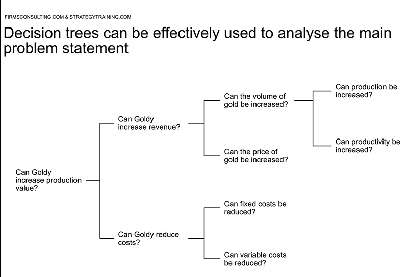
				- The team now refers back to the issues list and themes developed. Can they find a place on the tree where every issue and them can be tested? If not, is the tree missing some questions? Are some of the issues irrelevant? Mus the questions change?
					- 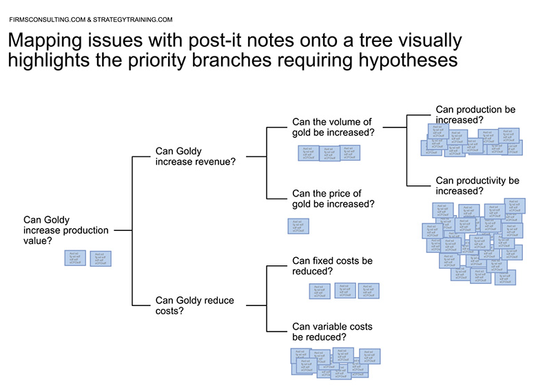
						- We can see where priority areas can arise from the number of issues and themes gathered. The [[Decision Tree]] helps break down the hypotheses into manageable components for analysis.
		- The Business Case Team
			- Will need to assess the opportunities for improvement developed by the rest of the team. Their job will be to determine the combined benefit to the client of implementing all recommendations.  They need to make sure that the opportunities recommended will actually deliver the benefits stated.
			- They need to ensure:
				- The opportunities are mutually exclusive and we aren't double counting our benefits
				- Does this opportunity make sense
				- Will it actually work as described
				- What is the impact of doing this?
				- Is this opportunity worth pursuing? What are the returns and cash flows patterns?
			- A smart business analyst knows one does not need to be an excel Wizard to produce business cases. One needs to be highly analytical, understand how to analyze the problem, and translate the analysis into a simple Excel model. The best business cases are well thought out so that the models are simple and intuitive.
			- The business team will develop the
				- Stream charter - a charter is a clear explanation of what the business case team will deliver. It is no more than a page in length and is shared and is shared with the rest of the team members to ensure there are no misunderstandings and gaps between the members' work.
				- Model architecture - the architecture is a simple modular representation show how the model will work, what it will do, and what it will produce. One slide in length.
				- Model description - a half-page description of the model. It forces the business case team to clear explain what they are doing in simple language and to exclude unnecessary capabilities. Requiring the team to create a short description forces them to only describe the most important functions of the model.
					- Consider using Amazon's PR and FAQ ((62dc5ca8-e105-4c75-84db-c3f8e49b93a0))
				- Decision Tree Tests and Data Requirements - the decision tree are a set of questions. To answer each question, an analysis must be constructed. To run the analysis data must be collected.
				- Storyboard - the storyboard consists of the headlines of the presentation that summarize the expected results from the business case stream
	- Week 1 - First week at the client
		- Day 1 and 2
			- Building the overall work plan early in the engagement requires the business case team to understand the overall problem, outline how they they will design the solution, list their data requirements, and understand all the questions that need to be answered.
			- **When there is overlap of activities, the teams need to agree on roles and responsibilities.**
			- **When meeting with the client the first time, it must be extremely managed, staged, and with clear defined outcomes. We don't want to risk looking unprepared.**
			- It's best to meet with clients alone the first time rather than putting everyone in the same room at once. This initial meeting your goal is to earn their trust. You cannot present any information that is erroneous.
			- Agenda (example taken from the Goldy exercise)
				- Expectations of the engagement
				- How would we define success for the business case work stream?
				- How should we share information and obtain approvals?
				- Decisions needed?
			- Try not to embarrass your clients and educate them of any "surprise" information ahead of time. This is especially true if their supervisor is in the same meeting.
				- Never go into a situation where the client has not been carefully prepared, and the outcome cannot be managed.
			- Make sure to respond to feedback and questions from key stakeholders.
		- Day 2
			- [[Top-Down Analyses]]
				- **The aim of a top-down analysis is to find areas where a problem could exit, determine the likely benefit of fixing the problem, and a very rough validation with employees.**
					- Top down analysis help you determine if everything is worth it. It is hard to dispute because it is not an interpretation rather a display and examination of the numbers and data gathered from research.
					- The results from the analyses helps you understand the high level problem space and determine if the direction you're going is correct or if you need to pivot to a discovered problem area during analysis.
				- Ensure you have the correct problem at hand before investing in resources to analyze the problem.
				- Also plan out your work. Only do analyses when you need the answer. Having the right answer isn't as important as having the answer
				- Overall Analysis Approach
					- 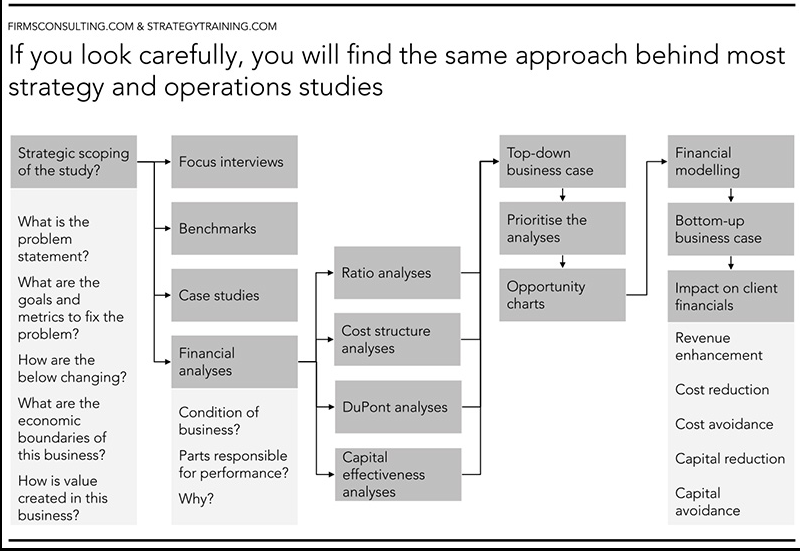
				- A poor engagement approach can lead to poor performance and this could be mitigated.
				- In longer and more complex engagements you concrete validation that your early hypotheses and focus are correct.
				- Top-down analyses helps ensure that you are pursuing the right issues and can focus on more detailed work.
				- Limitations of the hypotheses
					- Requires strong business judgment to interpret the initial brief, think about the initial client symptoms, and develop a realistic hypothesis.
					- We need to invest and allocate sufficient time to review the teams' hypothesis.
					- A fairly detailed analyses need to be completed before any validation is done. This costs time and money.
					- Working in isolation can severely limit the quality of your hypothesis.
				- Solving the limitations of hypotheses
					- Focus Interviews
						- Focus interviews should be deployed on every engagement.
						- Focus interview feedback can used to rudimentarily test your hypotheses. Make sure you design the focus interview questions to explicitly force a broader exploration past your original hypotheses to determine if other issues exist. Ensure you are not overlooking any other issues. Prevent yourself from perfecting your initial hypothesis to early in the engagement.
						- Without focus interviews you may be tempted to recommend best practices, gleaned, from desktop analyses, without thinking through the impact.
						- Focus interviews rarely identify the wrong theme to be analyzed. Although employees may not clearly articulate the implications of the problem they have seen, when issues are clustered, the theme at the heart of a cluster is fairly accurate.
							- Frontline employees are rarely blindsided by market events. They have an unfiltered and uncluttered view of what is happening. Frontline employees will give you a quick list of areas to explore. They can identify data sources, discuss past efforts to address the problem, and offer assistance.
			- [[Case Studies]] help the consultants understand how a problem evolved at another company. They help the clients visualize what did and could happen to them. They are both a vision and planning tool.
				- They are not a template of best practices to be copied since not two companies are the same and there is a high probability the case study may have been incorrectly interpreted.
				- Case studies are rife with abuse. Any case study can be designed to show anything the consultant wants to show.
				- Consultants cherry-pick both the case study to present but also the facts within the case study.
				- Case studies are a brief snap shot of the company at a specific time. True understanding of the problem presented by a case study wouldn't be gleaned from reading it, rather access real life experience and living through it, not second-hand or third hand information. Don't be tempted to overgeneralize and think you understand reality through reading a paper. Therefore case studies should have a very narrow scope of study or it is meaningless.
				- Recent case studies don't have the variable of time to test whether the assessments are true. The data is too new to really validated and isn't time tested.
				- Case studies that lack controversy will generally be taken as truth even if the information isn't true or tested. For example, Google is hailed as an innovative company even though this assessment may not be true.
			- Engagement Charter
				- The charter is the business case team's contract with the engagement manager. It exists because -
					- It helps to set expectations from both sides. The engagement manager uses the charter to understand the work the team will do and the team can tell the manager what they intend to do. The charter ensures that no one can claim ignorance about the way forward. Both sides are on the same page and can proceed having a good idea what to expect.
				- The manager uses the charter to manage client expectations and the rest of the engagement team.
				- It is an important tool to manage the performance and performance review of consultants both during and after the engagement. If expectations are written down, it is much easier to measure performance.
				- The charter serves as a necessary reminder of the objectives, ensure they understand why they are on the engagement and what they need to accomplish. The charter should never change unless the scope of the engagement officially changes. The charter should be only be one page.
					- 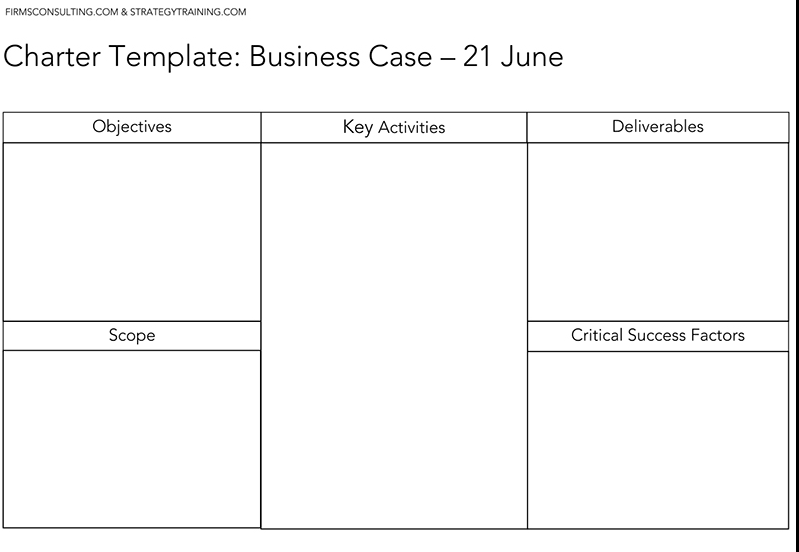
					- The consultant needs to write clearly and focus on the outcomes. The charter must communicate clearly the purpose and boundaries of the work.
					- Objectives
						- The objectives are the reasons why the business team exists in the engagement
					- Scope
						- Determining the scope is important. It creates the boundaries. Engagement can become difficult to manage because the scope is not clear. Focus on the [[80/20]] rule.
					- Key Activities
					  collapsed:: true
						- This section lists clusters of activities that are critical to reaching the objectives above. Example -
							- Expectations exchange with the CFO to agree on the approach and deliverables.
							- Develop framework (architecture) for the business case model and obtain buy-in.
							- Identify key information requirements to build the model.
							- Understand the existing financial baseline performance of the business and performance drivers and levers. Complete benchmarking.
							- Source/facilitate the finding of information.
							- Guide other work streams.
								- Assist in identifying key stakeholder groups:
								- Assist in the development of focus interviews
							- Help to conduct interviews, if required
							- Guide the strategic decision-making process
								- Help to develop key decision criteria for option selection
							- Build a model with key inputs and assumptions highlighted.
							- Develop recommendations on the best way to improve production value
						- Deliverables
							- The work and insights to be provided to the client at the end of the engagement. Consulting firms never present solutions/answers. They always present the implications of various options, and it is up to the board to decide the way forward.
							- A consulting firm cannot and should not try to make decisions for the board of directions. This is a critical and subtle choice of language.
						- Critical Success Factors
			- Work Plan
				- 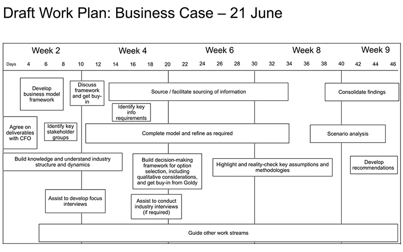
		- Day 3 - Value Tree
			- Value must be defined and agreed with the customers.
			- Operations and Strategy
				- Productivity is a well-used term but poorly defined.
				- Productivity is measured as the output value / input. There is no other definition of productivity. It is erroneous to to assume productivity is how fast one completes a task, or the number of tasks completed in a year. Completing a task quickly is of little value or completing many tasks that add little value will actually lower productivity.
					- Completing just one task over an entire year that is very valuable means one is actually productive. Understanding productivity is important.
				- Why productivity matters?
					- A more productive enterprise versus its competitors generates incrementally more value which can be reinvested in the business to keep growing. An unproductive enterprise, relative to its peers, cannot make the necessary investments to grow, fight in the market, introduce new products, block competitors, attract talented employees, etc.
				- Productivity is always a relative measure. There is no such thing as productive or unproductive business or person. A business can only be less or more productive relative to some comparison business.
					- ^^So when someone says "I am very productive," the response should always be, "Relative to whom?" This is because competition is always between two or more companies or people and if productivity is essential to competing, it can only be measure relative to competitors. The next question should be, "Why are you comparing yourself to this person or company?"^^
				- It does not matter where you start. Even if you start at the lowest possible career path, as long you as you keep earning some excess value and continue wisely reinvesting this excess in your development, you will benefit significantly in the long term. It adds up like compounding interest. This is compounding productivity. It's a term invented for this book.
				- ^^A person, company, and country must be productive. The point of being competitive is to drive up productivity. Without greater productivity, you cannot hope to win. And one cannot be competitive unless one is productive. They reinforce each other.^^
					- A person, company, or country must be productive to succeed in the long t erm. Competitive advantage is knowing whether the company will mostly differentiate itself on the numerator or denominator and how it will differentiate itself to be productive.
					- 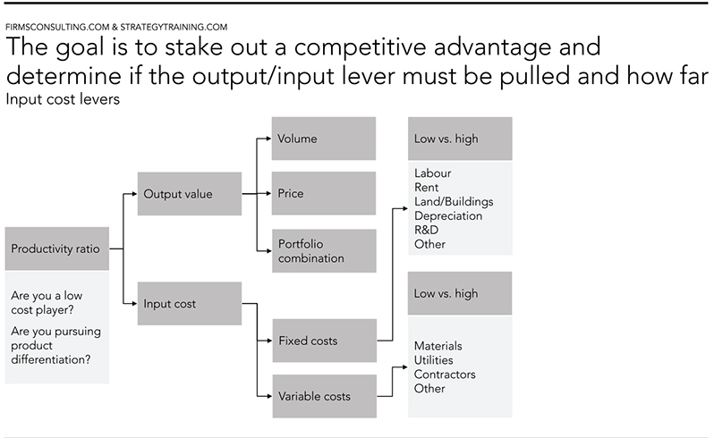
				- At the highest level, and in aggregate, a person, organization, or country is either trying to raise productivity by competing primarily by raising output value or lowering input costs. While they will pursue a combination of both, only one lever is the goal that cannot be compromised.
				- It is not sufficient to just raise productivity. One has to also pursue the right competitive strategy.
					- 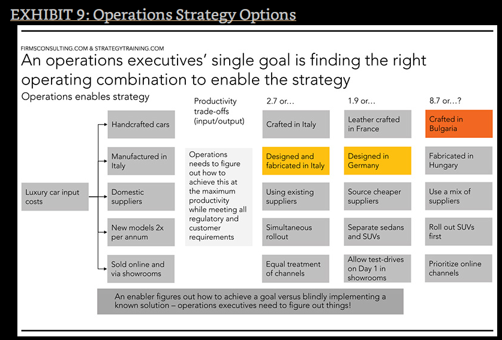
					- It is possible to raise productivity significantly but also end up hurting the organization by pursuing the wrong strategy.
					- It is not enough to increase productivity in the short term, one has to do it by focusing on the competitive advantage that is appropriate to the company's strategy and think how actions taken now will impact productivity in the long term.
					- 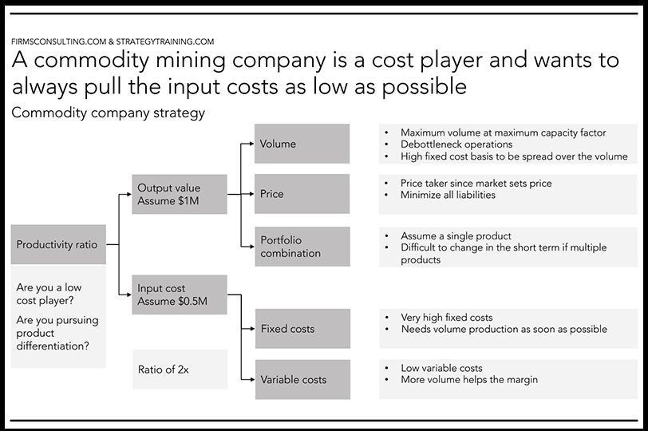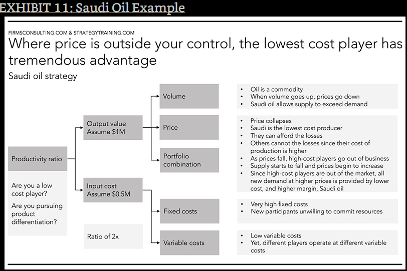
					- As an example, if you are COO in a resources company, we know that both the total output value lever and total input cost lever must be managed by further breaking down those levers and identify tools like strategic sourcing, service operations management, just-in-time delivery, etc., that can be used to lower the costs. These tasks are assigned to various operating teams to execute. This is in effect how priorities should be pushed down to teams.
		- Day 3 - Developing the Value Tree
			- Value Tree #[[value tree]]
				- A central part of building business cases and economic models is the value tree. A value tree takes the value creation metric and breaks it down into its constituent parts.
				  collapsed:: true
					- For example a profit value tree would be broken down into revenue and costs. Costs can be further broken down into fixed and variable. This process continues until the team can understand the different parts of the operation that drives profit.
				- Building an economic model
					- 1.Every economic model has a core calculation engine that produces data around which all calculations will be performed
					- 2. The core engine, sometimes called an activity model, itself must be driven by a set of primary data. The model determines how key metrics (such as ROCE) change as the primary data is altered
						- It is up to the business case team to design the model and ensure it performs the task required.
					- 3. Built around the core engine, the model will have several options that must be tested. An option is a different route for management to fix the business.
						- Different options usually lead to different results. The ability to test options must be built into the engine or around the engine.
					- 4. The model should be able to test all the options that have significant impact on production value. You may be at a phase where not all the options have been determined, but at least determined the main options. No more than two to four options should be modelled.
					- 5. The model must be explicit about what will be assumed, what will be measured, and included, and what is simply taken from industry benchmarks. Benchmarks are critical as they will help you gauge performance.
					- 6. Not everything in the model is variable or flexible. The amount of variability is determined by
						- Options to be tested
						- The economic environment to be simulated
						- Insights the team wants to extract from the model
					- 7. The output of the models is just as important as the input. What metrics and measures do they want the model to generate?
					- 8. The economic model must be simple and specially answer the questions to be answered.
			- ROCE
				- Return on capital employed
				- Breaking down ROCE for an organization is difficult without true understanding and detailed knowledge of the business and its workflow
				-
			- Building a Value Tree
			  collapsed:: true
				- EBIT - Earnings before interest and taxes
				- 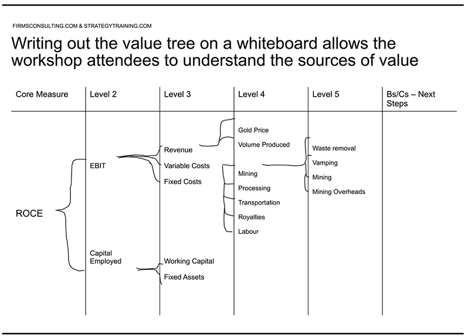
		- Day 3 - Developing the Model Architecture
		  collapsed:: true
			- Before we can build the model architecture we need to have a good understanding of the value tree, it will form the basis for the model architecture.
			- The model architecture is a one-page diagram. It explains the conceptual logic behind how the model will work. It visually indicates how the different blocks of analyses will ink together to produce the final results.
				- The model architecture is similar to the early design mock-ups produced by architectural firms to demonstrate early concepts to a client.
			- First write down the purpose of the model. Example
			  collapsed:: true
				- Calculate ROCE
				- Analyze the existing operations to generate the base case. This is the operation's current performance. The base performance is required for the team to measure the impact of the recommendations. The baseline analyses are both an assessment of the current performance and a benchmarking exercise.
				- Produce the business case for each option. Although the options are not yet known we can make educated guesses
				  collapsed:: true
					- Improving productivity
					- Improving production
						- Reducing bottlenecks
						- Removing gaps in production
						- Reducing costs
							- Procurement costs
							- Supply chain costs
				- The business case must answer the following:
				  collapsed:: true
					- The expected dollar size of the opportunities from the recommendations
					- The expected return generated from the opportunities
					- The expected cost to achieve the returns
					- The expected payback period and cash flow.
					- Determine if the funding for the recommendations would e operating expenditure or capital expenditure or both
					- Determine if the improvement can be implemented given the company constraints, legislation, and similar barriers.
					- Will it be easy to implement?
					- Who can do the implementation (consultants or employees or both, since this drives labor costs and the implementation timelines)
			- Write out the model description in narrative. Example
			  collapsed:: true
				- “A flexible model, with a 10-year projection was built, to better understand the mining operations at a global average basis with a focus on different mining types and geographic regions. We subsequently tested the feasibility of operating with a geographic focus.
				- The model can be adapted to test three types of options: changes in production (debottlenecking and removing production gaps), productivity, and cost reduction by changing the key inputs and assumptions accordingly. These three types of options are related since production value (output) divided by cost (input) equals productivity. Key outputs from the model include ROCE, costs, and asset base size and evolution.”
			- Criticize the model description narrative. Example
			  collapsed:: true
				- Given the changing nature of the industry, is a 10-year projection
				  feasible?
					- A 10-year projection is not possible. It will take about two to three years to fully implement the recommendations and embed
					  them in the operations. Moreover, much has happened in the sector in the last six to seven years. There is no reason to expect
					  the next 10 years will produce any less change. Therefore, a five-year projection is as far as the model can go while generating
					  realistic output.
				- Goldy has at least 18 operations using over six different mining
				  techniques and at least seven different operating and cost structures.
				  Should one model have the capability to be applicable to all the
				  operations? Should he not simply build a model specific to Mino 1?
					- Modelling such complexity into one model means that too many assumptions will have to be made. The one model will need to be able to incorporate different mining techniques, operating environments, cost structures, operating models, and mine structures. The model becomes too generic. Max will recommend to Luther that the model should only simulate one mining site. Thereafter, the recommendations should be rolled out in this site, and then the model can be refined for use in other sites based on what they have learned. Building one global model now is not wise since they have no idea what to expect on the other sites.
				- Are these all the possible options for analyses that should be included in
				  the model?
					- Max seems comfortable with the scenarios, but he makes a note to ask the rest of the engagement team to share their hypotheses in the team meeting on Friday evening. This will give Max and Alana an indication of whether or not they are on
					  the right track.
				- Are these the right outputs?
					- The outputs are consistent and make sense.
				-
			- Revise the model description from your criticisms to increase clarity, precision and remove room for any misinterpretations
			  id:: 63449d6a-eeda-42b3-b00a-d57d5d8f0b35
			  collapsed:: true
				- A flexible model with a five-year projection was built to better understand the mining operations at a site average basis with a focus on the operating structure. Production volume will be modelled. We subsequently tested the feasibility of operating under different macroeconomic environments (scenarios) by changing the following variables: currency exchange rate, inflation rate, and the gold price.
				- The model can be adapted to test three broad types of options available to Goldy management: changes in production (debottlenecking and removing production gaps), productivity changes, and cost reduction changes by changing the key inputs and assumptions accordingly. Key outputs from the model include ROCE, costs, cash flows, and financial and operating trade-offs between all options and the recommended option.
			- Example Model:
				- 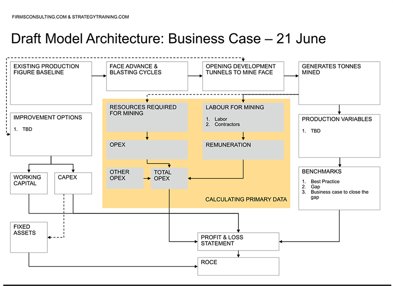
				  id:: 63449e5d-6634-4330-b016-1d24e1597590
			- Ensure that all the teams understand the logic of the model. Ensure that everyone is clear about the outputs of the business and recommendation and feedback from other teams have been reviewed for possible inclusion.
		- Day 4 - Drafts of Week 1 Planning Documents
			- The documents are not final and should adapt and change as the engagement is executed.
			- Stream Charter
				- This is an overview of the business case scope of work
				- If it is not in the charter, it will not be done
				- The client must approve the charter
				- 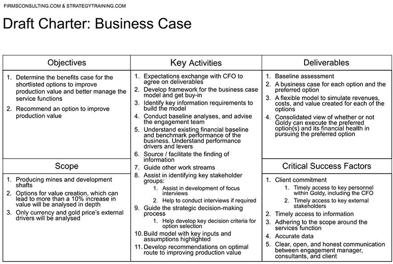
			- Model Description
				- ((63449d6a-eeda-42b3-b00a-d57d5d8f0b35))
			- Work Plan
				- The work plan is a high-level guide to key targets and activities
				- It is meant to guide everyone's expectations regarding data requirements and deliverables
				- 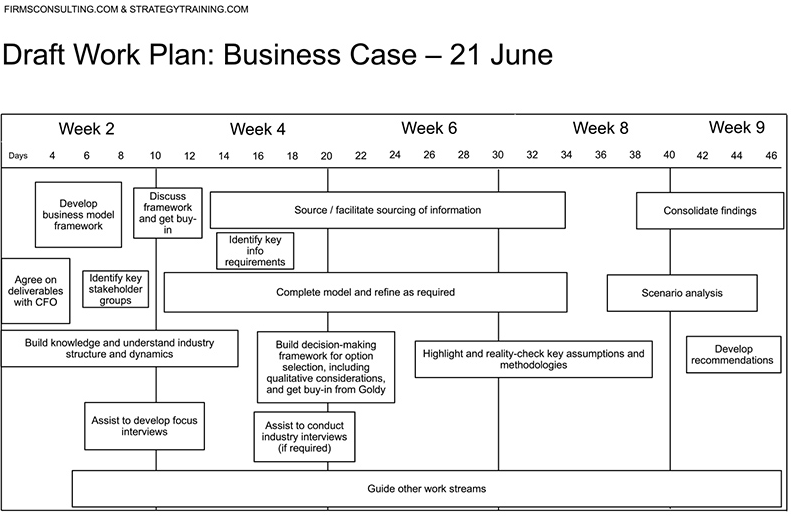
			- Value Tree and data requirements
				- This document explains the key metrics to be measured
				- It breaks down the metric into drivers
				- The value tree will form the bases for how the relationships between outputs, such as costs and revenue, will be modeled.
				- 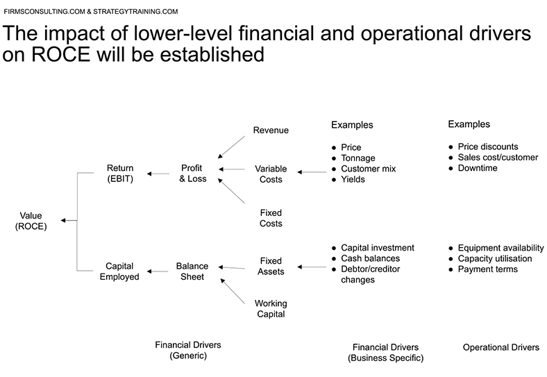
				- 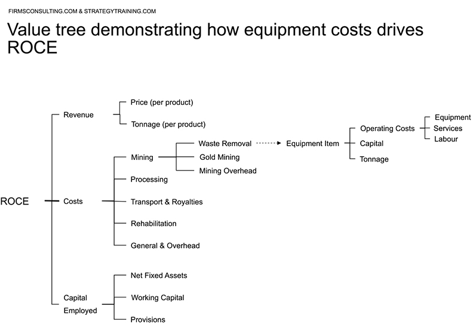
				-
			- Model architecture
				- The conceptual overview of the overall economic model
				- If it is not in the architecture, there must be a compelling reason to include it
				- The architecture must be decided before the details can be developed
				- Draft Financial Model Architecture
					- ((63449e5d-6634-4330-b016-1d24e1597590))
			- Model description
				- The description summarizes the model architecture in words using no more than half a page
			- Function Teams
				- Engagement Manager - The engagement manager must guide the team and bring together findings from the operations improvement, services, and business case teams. The engagement manager must also ensure that approach is robust enough to deal with any changes the business processes. They are responsible for the overall study.
				- Operations Improvement - The objective of this team is to find ways to raise production value for the business operations. They will likely generate many small opportunities, several medium-sized opportunities, and a few large opportunities
				- Service Functions - The services team will analyze all the service functions of the business. They will need to determine what impact this is having on the performances of the business and recommended a set of actions to manage services. The services team will analyze all service functions, including hospitals, hotels, sports facilities, and internal support services, such as maintenance engineering.
		- Day 4 & 5 - Wrapping Up Week 1
			- Relationship building and meeting management #[[Problem Solving]], #[[customer engagement]]
				- Consistently present an image of an engagement that is organized, understands the business, and meets deadlines. To be successful, only present work that has been checked and is logical. (If the work is in progress, don't be afraid to share to elicit feedback and allow you to course correct if you're thinking is heading down the wrong direction.)
					- When we hold back only when we have a plan or a solution in place, we assume that we understand the problem correctly and that our clients don't have anything to contribute.
				- Build both a professional and personal relationship.
				- Elevate the person's profile you are working with (if possible) within the environment.
				- Give your business partner a defined and agreed upon role, tasks, and expectations to meet
	- Week 2 - Site Visit (Understanding the Problem Space—its people and processes)
		- Day 1
			- The best management consultants understand that it is impossible to properly advise a client without understanding the environment, culture, history, and challenges within the location where the implementation will be implemented.
			- Conduct an experiment first on a section of the business before rolling out solutions to the entirety of the customer organization.
		- Day 2 - Understanding the context
			- Research the surrounding space and environment of the problem space. For example, look at how other companies are innovating and what kind of solutions and features they are creating similar to yours. How are related industries solving their problems?
			- **A hallmark of a great management consultant is one who can see an argument from both points of view and do what is best for the team and the client.**
			- When given a list of concerns ensure that you are addressing the real root causes of their pains and not merely symptoms or miscommunicated inconveniences. Ensure that your client has clearly understood the problem space and communicated their pain. #[[customer service]] #[[q: how to present]]
				- Repeat back questions and concerns back to the users, rephrased in how you understood the question.
				- Paraphrasing is important as to clear up any misunderstanding and distills the discussion into the key elements and forces the client to think about the most important elements.
				- Try to anticipate the concerns and questions of your client. Clients almost always question the approach used. Ensure more time that clients understand what is happening.
			- If choosing a certain option, ensure that everyone understands the option and what it means. Make sure you explained why you are choosing that option and why it's better than any of the other options passed over.
		- Day 4 - All the planning is done
			- For an engagement to be successful the business analyst or associate responsible for the work takes full ownership and understands the problem in its entirety, it will never be a successful engagement for that consultant.
				- Ownership of the problem and solution is a prerequisite to success.
			- Address the root concerns directly and swiftly.
			- Draft Value Chain
				- 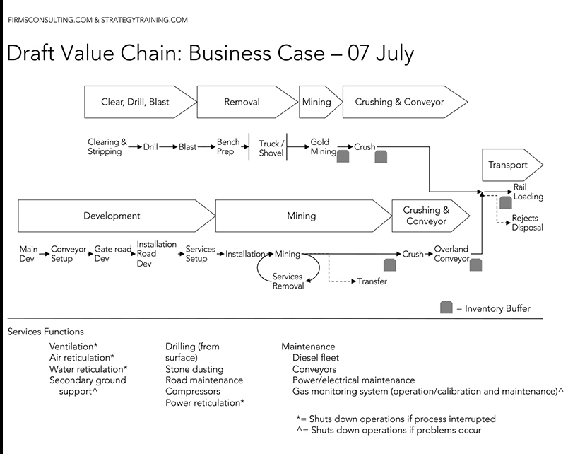
		- Day 4 & 5 - Designing and conducting focus interviews
			- Find ways to verify your initial hypotheses.
				- The focus interview is a critical tool to collect data and test your hypotheses.
				- The client can outline what has been tried, what has failed, and what has worked.
			- Build key relationships with employees who can supply data and those who can test the team's assumptions and outputs
			- Understand the supported business office's context in the problem space
			- Isolate and describe potential opportunities
				- Apply the 80/20 rule when evaluating opportunities
				- Opportunity chart template
				  id:: 648b7a13-f0be-4fb2-b82d-e9a1682548d4
					- 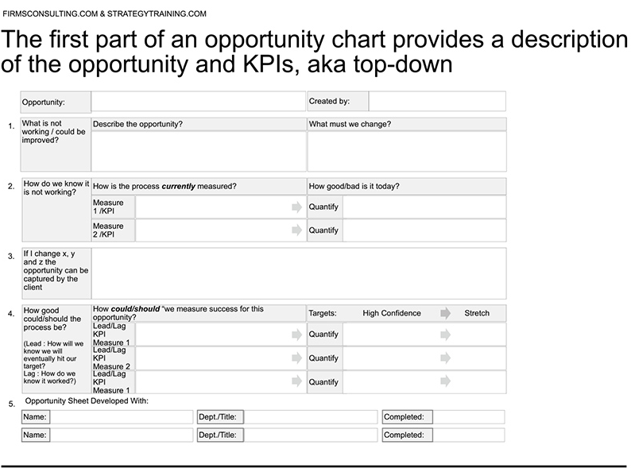
				- Opportunity Chart calculator
				  id:: 648b7a13-1ba4-4a5b-a99a-98ef1ff244a4
					- 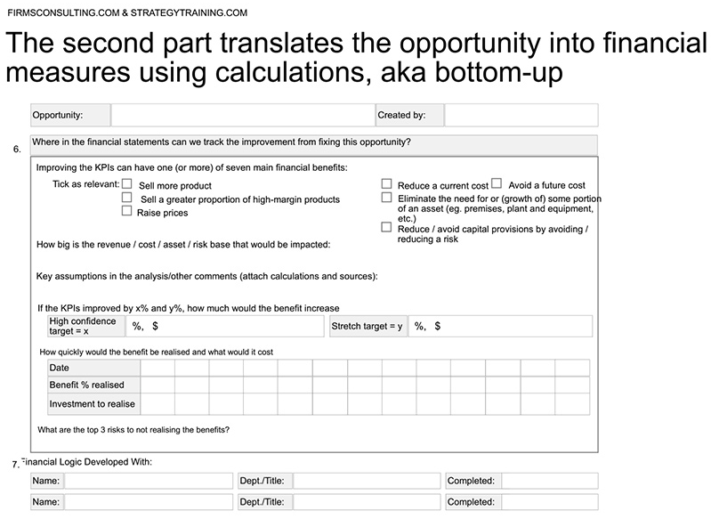
			- Focus interviews must always begin with the interviewer providing background and details. It is best to have two people conducting the interviews: one person to manage the discussion and the other to take detailed notes.
	- Week 3 - Preparing the draft storyboard
		- Day 1 - Preparing the draft storyboard
			- Make your planning documents and roadmap visible to the rest of your team. This gives everyone a clear view of what needs to be done and progress made to date.
				- Allow for comments to be made in these documents.
			- [[Principles of Storyboarding]] #storyboarding
				- Examples
					- 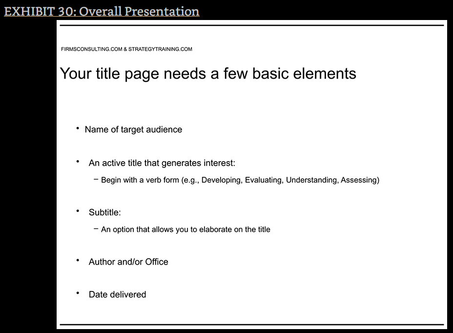
					- 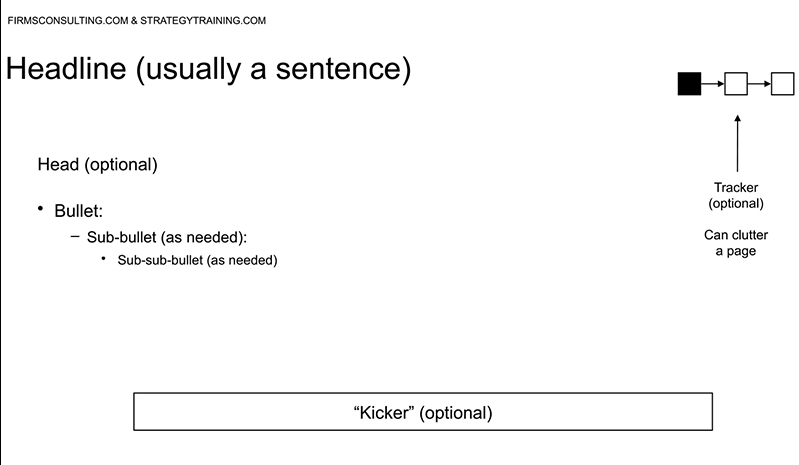
					- 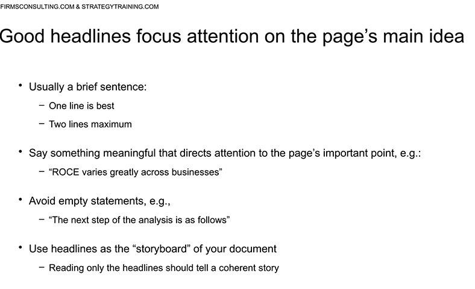
					- 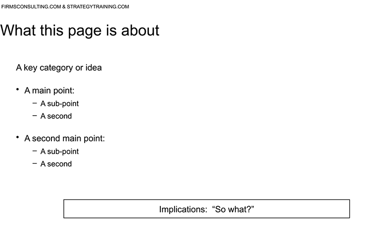
				- The storyboard allows the team to prepare a story of their message so that everyone can understanding their thinking and provide feedback without incurring costs, time, and resources of building an expensive model or even the real thing.
				- The storyboard should never ever be a diary of the work done or analyses completed. Only the most important insight should appear, and the best storyboards are simple and logical to follow. They are also short.
				- The story should stand by itself. If it needs verbal explanation for the reader to understand the meaning it is incorrectly designed.
				- The storyboard must be created before the data is ready.
					- The hypotheses and value trees outline the data needed to prove them. Accordingly, the storyboard should be constructed before the data is ready, by the results of testing the data and not conveniently developed based on the data the consultant can find.
				- A motivation for change can be induced using the deficit model. It is one where we should the client that the situation is very bad and likely to get worse before things improve.
					- The client must see how bad things are before they will change. Change must start immediately or the business situation could get much worse or even lead to a closure of the business.
					- 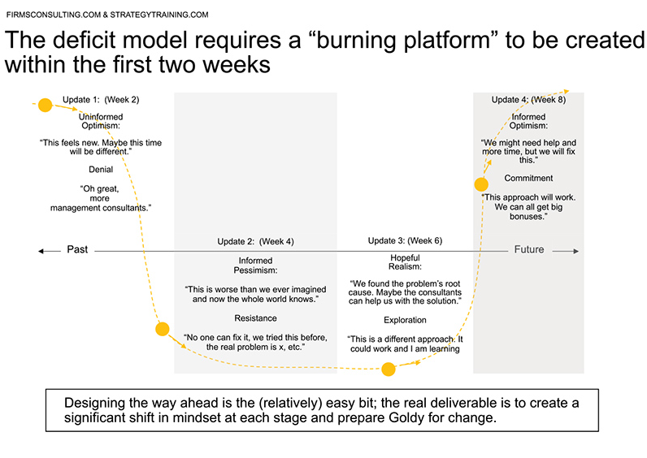
				- The alternative to the burning platform for change motivation is the aspirational model where the clients are shown how good things could be.
				  collapsed:: true
					- 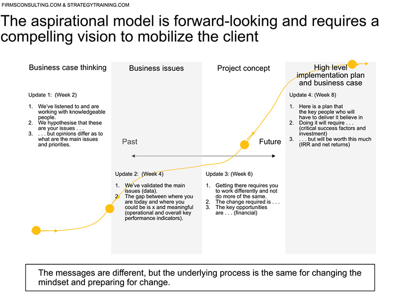
				- A good storyboard is the outcome from the quality work done from the initial research and value tree analysis. These activities enable the team to gain a very good understanding of the business. It is your responsibility to find the data to support the headlines. If the data supports a different message, the headline and story may change.
				- Example Storyboard Headlines
					- 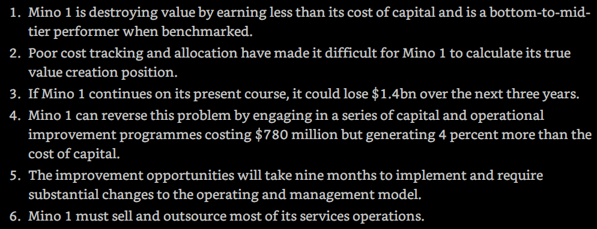
					- 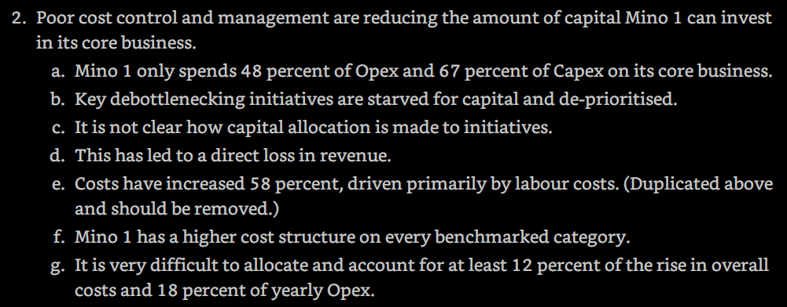
					- 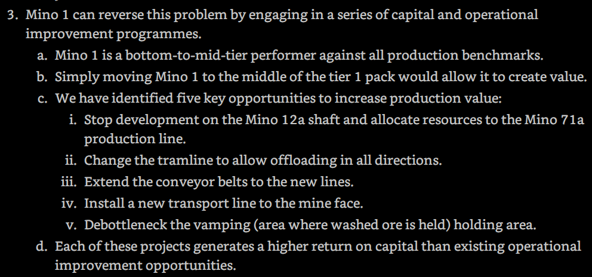
		- Day 2 - Building the Model
			- 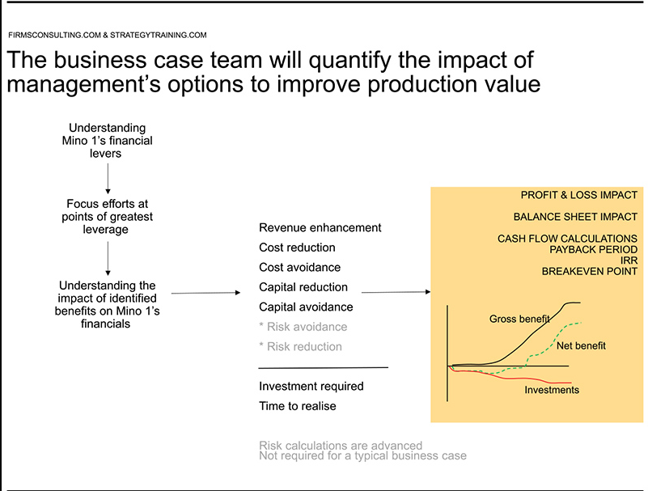
			- 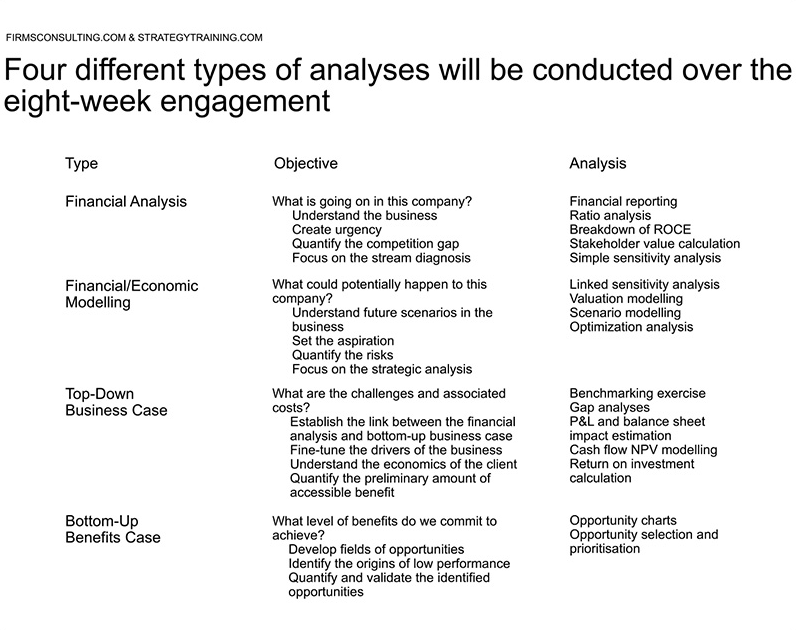
			- Financial analyses and top-down business cases are linked. They are done in the first two to three weeks of the engagement. They are done to determine the current and historical performance of the business.
				- Benchmarks (top-down analyses) against peers are done using the financial analyses results to determine the magnitude of possible improvement opportunities. It is a gap analysis.
					- For example if Mining company ABC is found to have variable costs 25 percent higher than the highest cost producer, then Mining Company aBC needs to close the gap.
			- Business modeling and bottom-up business cases are linked. They are done after the analyses above allow the business case team to understand the financial situation of the client and magnitude of potential improvements. They are used to drill into the gaps and results of the financial analyses. An economic model is developed to simulate the business and assess the effect of different initiatives, scenarios, or opportunities on the business.
			- A well-designed engagement should always begin with focus interviews, financial analyses, case studies, and some basic benchmarking to identify problems. This should be followed by the busines modelling to estimate the impact of changes to fix the problems.
			- 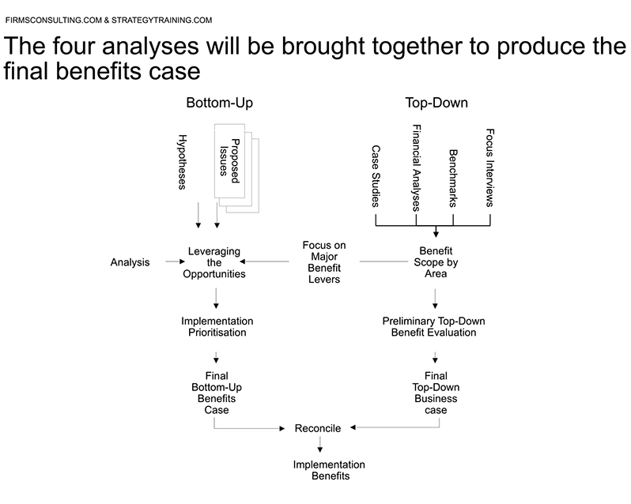
			  collapsed:: true
				- The top-down work is done first and sets the general direction and outlines the scope of the problem, and if it worth solving. The bottom-up work then determines if this is true.
				- Bringing the bottom-up and top-down analyses together is difficult. Top-down analyses are based on bench-marked data, financial analyses and case studies developed at a higher level with little detailed analyses. These indicate "what is possible" but do not explain how it can be achieved.
					- Many of the bottom-up analyses will need to be verified during the implementation.
			- Business Case Storyboard
				- 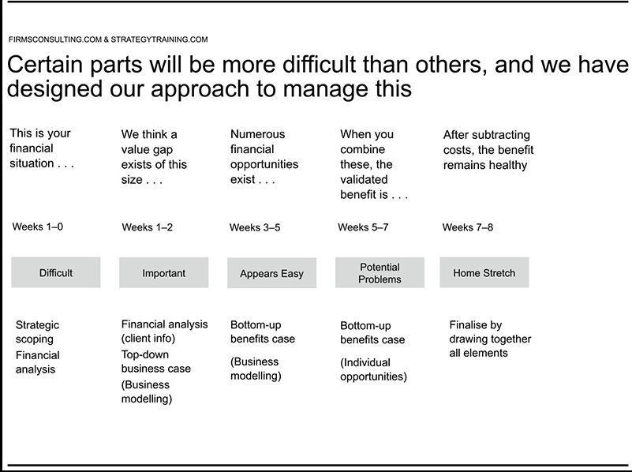
				- Using the story-board, engagement timetable, and their own experience, the team can generate a general understanding of the challenges they will face analyzing the numbers.
					- There can be no surprises. The client must know well in advance that some parts of the engagement will be more difficult that others, this is normal and must be expected. Surprising the client is never ever an option.
			- Model Structure
			  collapsed:: true
				- 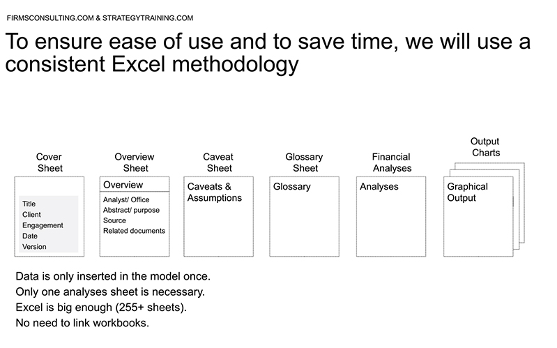
			- Worksheet Structure
				- 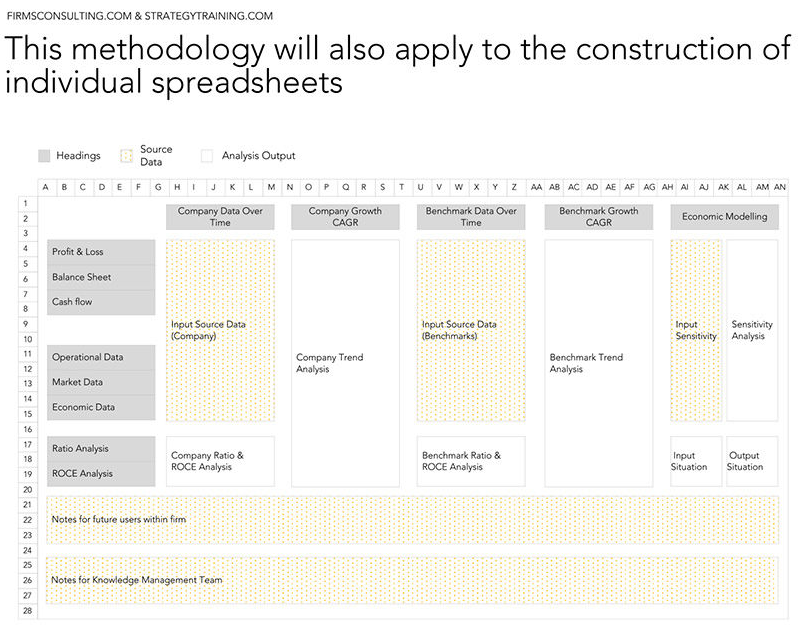
				- The same discipline and design ease goes into constructing every worksheet. They are all designed to be easily understood, printed, used, and validated.
		- Day 5 - Output from the financial analyses
			- Update Charts
			- 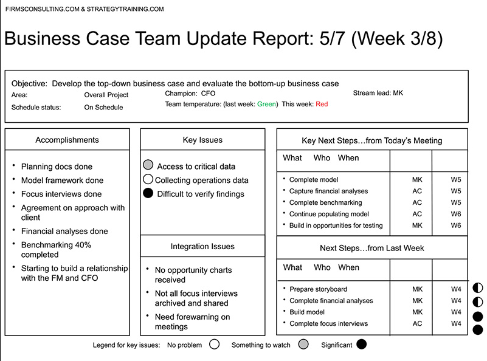
				- Weekly 30 minute meetings are held to provide updates through the update charts. They are the primary formal means to communicate with the team. The update chart is designed to present a compact view of progress and force decisions.
				  collapsed:: true
					- Details are only provided at the level where decisions can be made between team leaders.
				- When presenting progress updates only discuss items that need explanation, are crucial to the progress of the overall engagement team, or where the business case team needs help. This avoids detailed discussions that do not contribute to the engagement.
				  collapsed:: true
					-
			- Financial Analyses
				- The findings from the financial analyses and partial benchmarking will set the direction for the engagement team. They disprove some initial hypotheses and could have dramatic effect on the final message to the client.
				- #[[q: how to present]] Present the summary of the findings or your conclusions first. This way, the team knows what to expect and case how each slide fits into the overall messages.
				- Always engage the frontline staff to test ideas and hypothesis.
					- No amount of data crunching and spreadsheet analysis can replace the quality and usefulness of information found when testing findings with employees at the frontline who face the problems on a daily basis.
		-
	- Week 4
		- Day 1 - Presenting feedback from focus interviews
		  collapsed:: true
			- Findings and feedback from focus interviews are a significant part of the business case. They can rarely be used as the sole proof of a problem, but they should be used to convey urgency and indicate areas that require further examination. Anecdotal evidence presented with hard data can build a compelling argument.
			- Presenting feedback from focus interviews by themselves is dangerous since they can be dismissed as opinion. Link statements of employees to problems or opportunities that can be supported with data is much more powerful.
			- Never present data without the key insight. Leaving it up to the reader to deduce the insight may lead him or her to draw incorrect conclusions, which is why headlines and storyboards are needed. #[[q: how to present]]
			- Guidelines of creating the focus interview slides
				- The storyboard (message) and not the amount of data will determine the number of slides
				- The slides must be simple:
					- Simple headline
					- Clear and simple data to support the headline
					- Clutter-free slides
			- Example slides:
			  collapsed:: true
				- 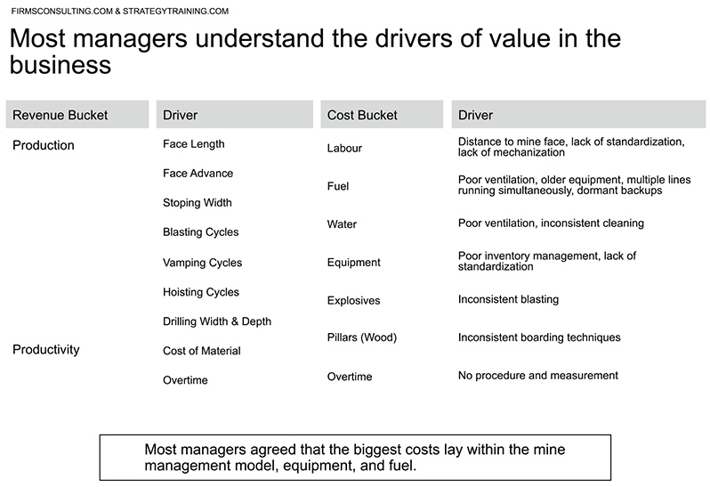
				- 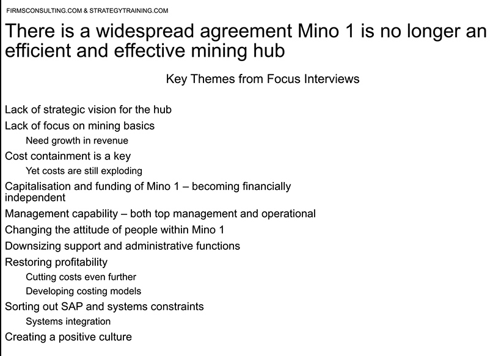
				- 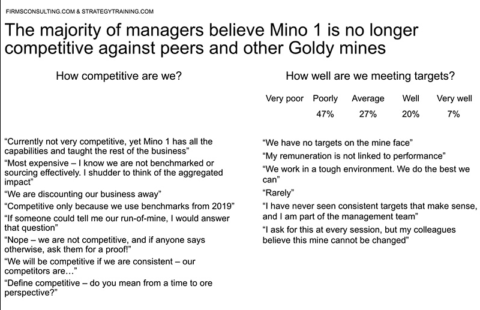
				- 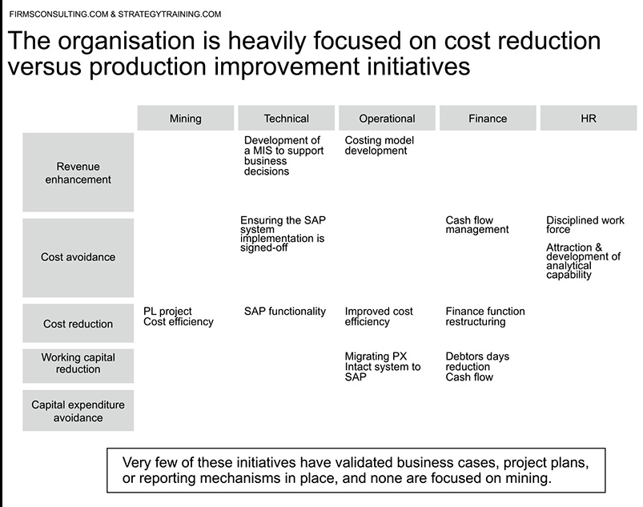
				- 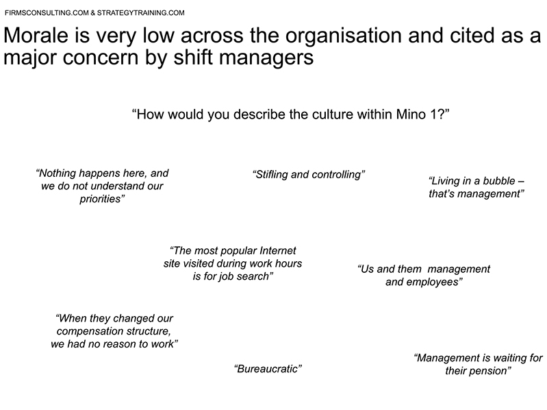
				- 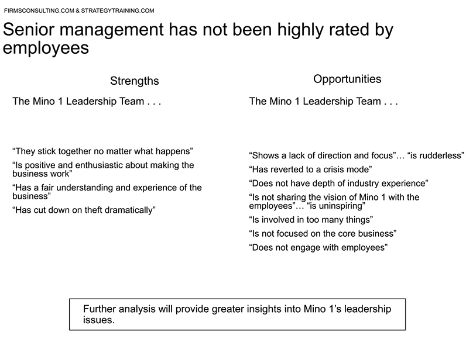
				- 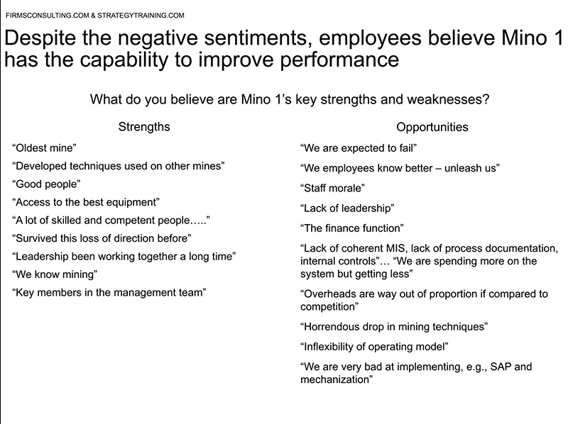{:height 457, :width 600}
				- 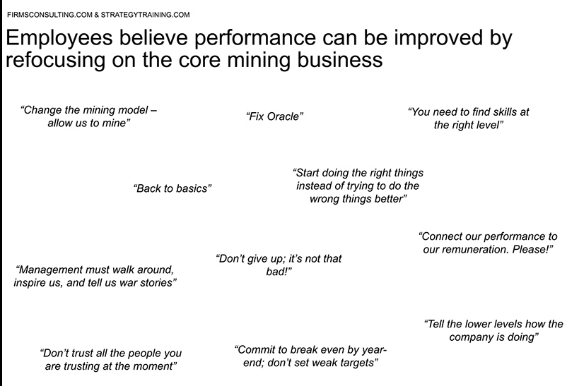
			- Panel Bashing allow for honest and open feedback on your work. It is a safe place for your presentations to be critiqued without any holding back from the reviewers.
		- Day 1 - Pre-presenting
		  collapsed:: true
			- Pre-presenting is the process of taking the audience through the complete presentation before the day of the actual presentation.
				- This helps make decision makers understand the presentation well before hand and not make decisions on the spot.
			- Clients do not like to be surprised. Clients especially senior clients, want to avoid the impression they are learning something about their business for the first time, especially when they are around their peers or superiors
			- Pre-presentations provide an opportunity to explain the analysis and convince the executive of the validity of the findings.
			- Pre-presentations allow the engagement team to build trust and a relationship with the steering committee members. The audience is unlikely to attack a presentation fi they understand the validity of the findings and the care taken to find evidence to support the recommendations.
			- Identify the sources of resistance for your recommendations and findings.
			- Find feedback and guidance. Find allies who will guide you in understanding the internal politics politics, turf wards, preferences, and dislikes of the audience.
		- Day 5 - Steering Committee Meeting
		  collapsed:: true
			- We need to value the importance of honest and constructive feedback. We cannot grow and our clients do no benefit without them.
			- We need to recognized  the blockers that may prevent effective feedback from our partners including pressures of delivery and strained timelines. On the other end, we may not spend sufficient time thinking through constructive feedback.
			- Most people try to avoid conflict midway through an engagement and avoid outlining clear problems that need to be addressed. There is a tendency to "sugarcoat" problems and a tendency to hold negative feedback in the hope that a consultant's performance would improve over time.
	- Week 5
		- Day 1 - Mid-engagement reviews
			- Don't hoard information
		- Day 4 - Services function Workshop
			- Attendees have to arrive at the same desired outcome and not told the accept the desired outcome. They can do this through a  walkthrough of the evidence and information.
			- Identify your core competencies.
				- 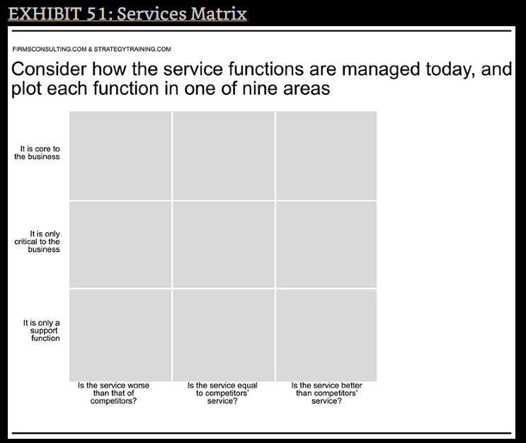
				- 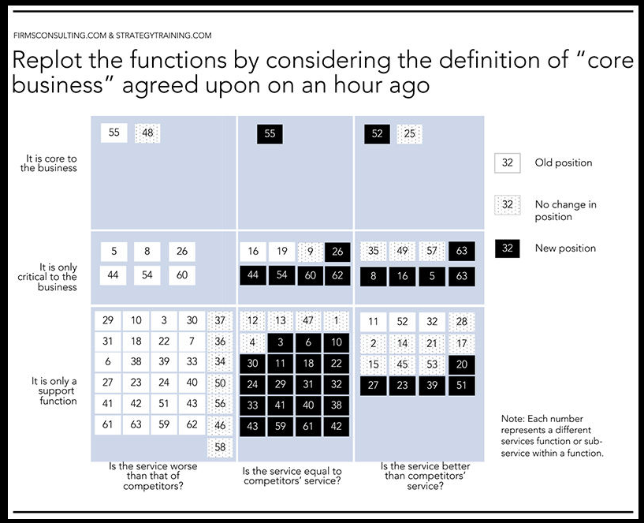
				- 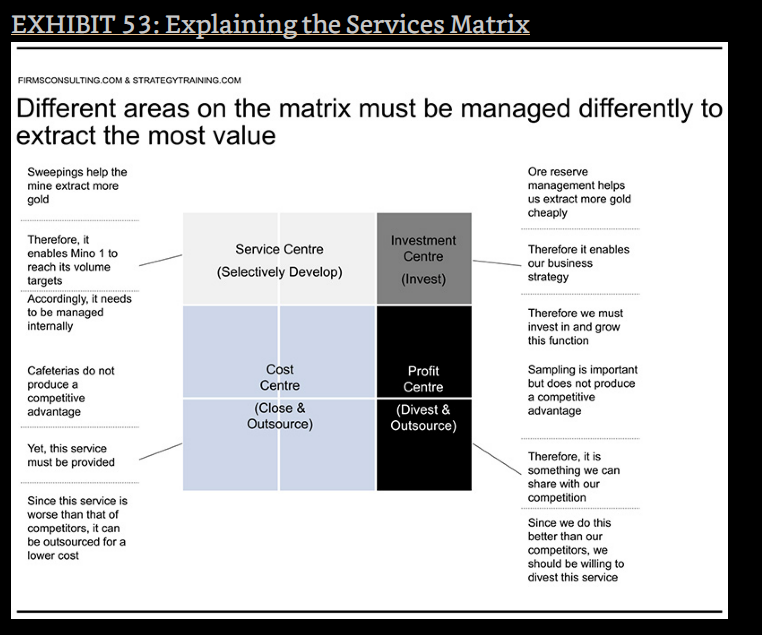
				-
	- Week 6
		- What is big-picture thinking?
			- The organization needs to define the overall big picture and we should regularly remind ourselves how our work fits into the bigger picture.
			- Ensure the client understands the level of effort the work entails. The objective should always be to provide a complete review at a high level, but with sufficient information for the reader to understand. If required the reader can then ask for more information.
			- When presenting information that is complex start at the big picture level and ensure your audience understands the fundamental high level view so they are able to assess the impacts the smaller details have on the big picture.
			- When problem solving offer options and clearly communicate your risks and assumptions.
		- Day 5 - Operations Improvement and Services Feedback
			- Write a story for the problem
				- 1. Over 20 years, Mino 1 has accumulated 67 different service functions.
				- 2. Services employs 10,000 employees, uses 18 percent of operating expenses, and 15 percent of capital expenditure. 
				  3.  On 27 occasions in 2009, services capital needs have siphoned $57 million from essential operations projects. 
				  4. Despite the investments, the functions perform much worse than benchmarked peers. 
				  5. Ninety-four percent of all functions create no competitive value. 
				  6.  Building services to the levels required to support the core business will cost $288 million over three years and not create value. 
				  7.  Most service functions are not core to Mino 1 and should be divested. 
				  8. Divesting ancillary support services could save Mino 1 $45 million over three years and create a once-off gain of $223 million. 
				  9. Redesigning the metrics in the retained services could save another $22 million/annum over three years. 
				  10. These savings could be redirected to needed operational improvement programmes. 
				  11. We recommend continued analyses to design the restructuring of the service functions.
			- 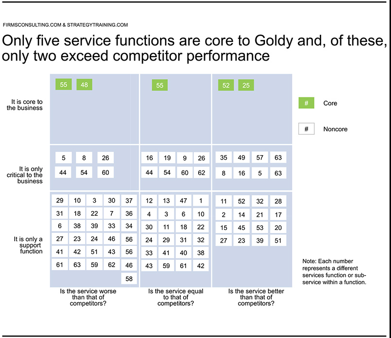
			- 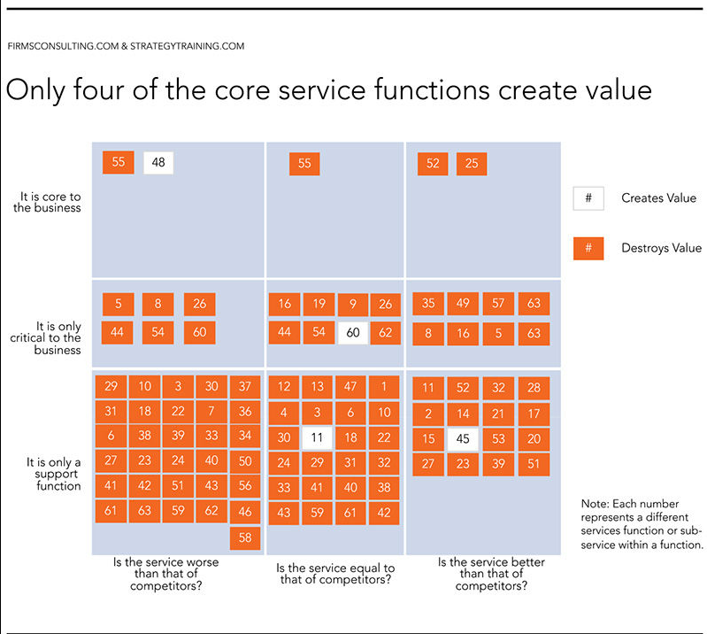
			- 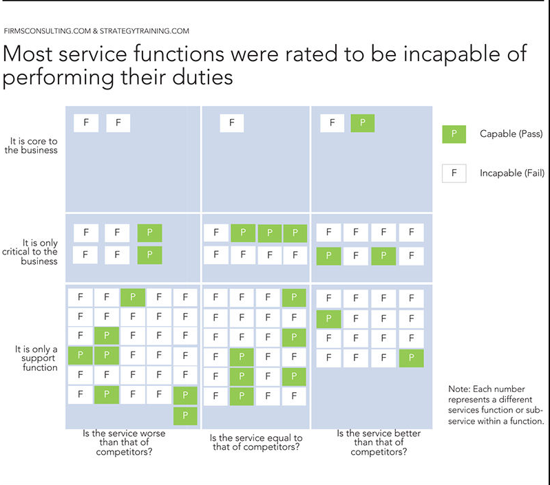
			- 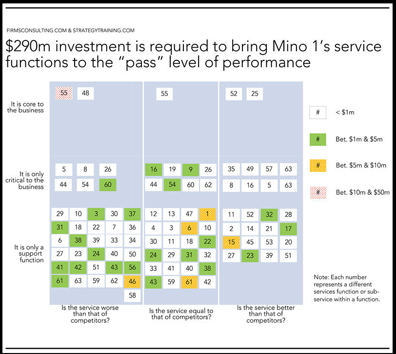
				- The shade indicates the amount of investment required to bring the function to benchmarked parity. This indicates the enormous investment needed just to make the function competitive. It raises a question: Why should Goldy make this investment in an area that is not their core business? Nadia has done a significant amount of work in a very short period of time. The engagement team is intrigued by the methods used to arrive at some conclusions in a very short space of time. The questions reflect this interest.
	- Week 7
		- A successful management consulting engagement ultimately comes down to the ability of the team to develop a set of recommendations that add value to the client. We must be able to understand the business, break it down into the components that generate value, and map this into fully testable considered hypotheses.
		- The signoff process of the busines case must start right at the beginning.
		- Avoid the following problems when solutioning:
			- Team works in isolation
				- The team is more concerned about looking good rather than having an honest debate on what about the project objectives.
			- Solutions ignore the broader picture
				- A team must present a recommendation that solves the problem they are studying and does not create an entirely new problem in another part of the organization. The team must think about the overall best interests of the client. The correct solution will allow the entire organization to improve.
			- Forgetting the value tree
				- The primary question answered by the team sits at the top of the value tree. Ensure your activities lead back and support the primary objective.
			- Writing for the consultant versus the client
				- A client is not concerned about the type of analysis done, the amount of data collected, or the pages and pages of analyses required to arrive at a conclusion.  Your clients are paying you for the answer and sometimes, an explanation of how the answer was derived. Too many teams are obsessed with showing clients the amount of work completed to arrive at the answer.
			- Too much data, too few insights
				- Poorly constructed headlines and presentations lack a "so what" statement, which should be the question a consultant asks of every slide and presentation they prepare. If they can't answer the so what question, then they are sharing incorrect information. It is the so what information that should make up the slide information
			- Clutter does not equal quality
				- Do not overfill your slide deck. Ensure you are communicating precisely, concisely, and clearly. If you aren't you may not have a good grasp of the information you are sharing. Too much information will confuse the client and forces them to interpret the meaning of the slide. If the client extracts the incorrect message, the entire engagement could be worthless.
			- Poor formatting
				- Use consistent templates and presentations for consistent brand building.
	- Week 8 #[[q: How to be a leader without authority]] #[[leadership principles]]
		- Consulting Values
			- Never forget that it is a great honor to partner with a client and assist with their issues. It is not our right to have this access. It is a privileged access that we nurture and respect. It is access that can be lost with a stray word.
			- As a professional expect to hold yourself to the highest possible standards. You can receive guidance from others. The greatest guidance should come from within you.
			- Honor and respect your clients. Place your client needs first and they will come to you. Success is an outcome of having strong principles.
			- Don't confuse doing what's in the client's best interests with making a client happy. They are totally different. Sometimes you have no choice but to make clients unhappy when you place their best interests first. If you believe a client's course of action is incorrect, you should say so.
			- You have the right to dissent at all times. You do not need to agree to everything but you must state your position. Vibrant debate only makes the firm stronger.
			- Generously invest in others. Give your time and expertise to colleagues. This makes the firm stronger and you stronger.
		- The the team succeed?
			- You need to be excellent at analyzing problems and understanding their impact on the business. Without this core skill you will not be able to understand the impact of your recommendations. Without this skill you will rely on your experience.
				- Experience is a competitive advantage when it helps you understand the context. It is an Achilles heel when it clouds the ability to look at hard data and draw conclusions based on the facts.
			- Understanding the question you are answering is the hardest part of analysis. That takes both time and experience. Once this is done, the question needs to be broken down into manageable sub-questions. For each sub-question, data needs to be collected and analysis completed to answer the question.
			- Analytical brilliance and emotional intelligence are core for leading successful projects. The ability to engage and work with clients who may not appreciate your presence or like working with consultants is critical. Another core building block is political awareness.